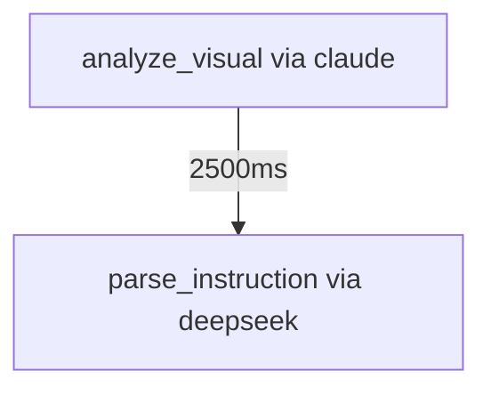

# Trace Visualization Skill

Visualize trace data as hierarchical trees and state machine friendly views.

## When to Use

Use this skill when you need to:
- Visualize trace call hierarchies
- Create tree diagrams for debugging
- Generate state machine transition views
- Export Mermaid diagrams for documentation
- Analyze trace patterns and relationships

## What It Does

1. **Tree Visualization**: Creates ASCII tree diagrams showing:
   - Parent-child span relationships
   - Hierarchical call structure
   - Performance metrics per node
   - Depth and timing information

2. **State Machine View**: Organizes traces as:
   - State transitions with triggers
   - Error events and handling
   - Performance metrics per state
   - Custom context propagation

3. **Mermaid Export**: Generates:
   - Flowchart diagrams
   - Sequence diagrams
   - State transition diagrams

## How It Works

1. **Load Assets**: Reads JSON trace files from `tests/ai/assets/traces/`
2. **Build Hierarchy**: Constructs parent-child relationships from span IDs
3. **Tree Rendering**: Renders ASCII art tree structure
4. **State Formatting**: Formats data for state machine consumption
5. **Diagram Export**: Creates Mermaid diagram files

## Usage

```bash
# Visualize collected traces with tree display
python tests/ai/trace_tree_visualizer.py
```

## Output Examples

### ASCII Tree Structure
```
[TREE STRUCTURE]
├── [analyze_visual] via claude (vision)
│   Performance: 2500ms, 1450 tokens
│   Span ID: analyze_visual_0_178...
│   Depth: 0, Timestamp: 2026-06-02T20:31:33
└── [parse_instruction] via deepseek (text)
    Performance: 800ms, 205 tokens
    Span ID: parse_instruction_0_...
    Depth: 0, Timestamp: 2026-06-02T20:31:37
```

### State Machine View
```
[STATE TRANSITIONS]

  Scenario: vision_analysis_standard
  States: 2
    [1] analyze_visual
    via claude -> menu_list
    Context: {'traversal_session': 'session_001', 'current_depth': 2}
    [2] analyze_visual  
    via claude -> settings_group
    Context: {'traversal_session': 'session_001', 'current_depth': 3}
```

### Mermaid Diagram


## State Machine Integration

The visualization is optimized for state machine usage:

1. **Transition Logging**: Each trace becomes a state transition event
2. **Error Handling**: Separate error events for failure states
3. **Context Propagation**: Custom context flows through state changes
4. **Performance Tracking**: Metrics attached to each transition

## Generated Files

- `trace_diagram.mmd` - Mermaid diagram file
- Console output with ASCII trees
- JSON state machine data

## Benefits

- **Hierarchical Clarity**: See parent-child relationships clearly
- **Debugging Aid**: Identify trace patterns and issues
- **Documentation Ready**: Export professional diagrams
- **State Machine Friendly**: Format matches state machine requirements
- **Zero Dependencies**: No external tools required

## See Also

- `trace-collection` skill - Generate trace data
- `state-machine-integration` skill - Integrate with state machines
- `workflow-trace-collection` skill - Workflow integration