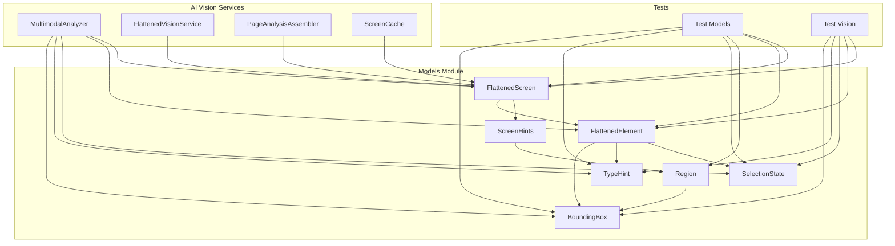
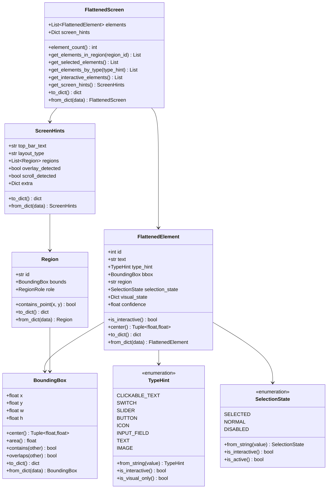

# Models 模块设计文档

> **模块**: `src/models/`
> **版本**: 1.0.0
> **更新日期**: 2026-06-03
> **关联 PRD**: PRD V5.2 (两步视觉管道)

---

## 1. 模块概述

### 1.1 职责

`src/models/` 模块是 Uni-Claw 框架的核心数据模型层，提供：

- **数据结构定义**: 定义框架中使用的所有数据模型
- **类型安全**: 使用 Python 类型注解和枚举确保类型安全
- **序列化支持**: 提供 `to_dict()` 和 `from_dict()` 方法用于 JSON 序列化
- **验证逻辑**: 内置数据验证和约束检查
- **视觉模型**: PRD V5.2 两步视觉管道的扁平化屏幕表示

### 1.2 模块结构

```
src/models/
├── __init__.py              # 模块入口
└── vision/                  # 视觉数据模型子模块
    ├── __init__.py
    ├── bounding_box.py      # 归一化边界框
    ├── type_hint.py         # 元素类型枚举
    ├── selection_state.py   # 选择状态枚举
    ├── region.py            # 屏幕区域
    ├── flattened_element.py # 扁平化元素
    ├── flattened_screen.py  # 扁平化屏幕
    └── screen_hints.py     # 屏幕级提示
```

---

## 2. 核心数据模型

### 2.1 BoundingBox (边界框)

**文件**: `src/models/vision/bounding_box.py`

**描述**: 不可变 (frozen) 的归一化边界框，所有坐标在 [0, 1] 范围内。

**属性**:
| 属性 | 类型 | 说明 |
|------|------|------|
| `x` | `float` | 左上角 X 坐标 (0-1) |
| `y` | `float` | 左上角 Y 坐标 (0-1) |
| `w` | `float` | 宽度 (0-1) |
| `h` | `float` | 高度 (0-1) |

**方法**:
- `center() -> Tuple[float, float]`: 返回中心点坐标
- `area() -> float`: 返回面积
- `contains(other) -> bool`: 检查是否包含另一个边界框
- `overlaps(other) -> bool`: 检查是否与另一个边界框重叠
- `to_dict() / from_dict()`: 序列化/反序列化

**设计决策**:
- **不可变性**: 使用 `@dataclass(frozen=True)` 防止意外修改
- **严格验证**: `__post_init__` 中验证所有坐标在有效范围内，且宽高为正
- **归一化坐标**: 支持不同屏幕分辨率的通用表示

### 2.2 TypeHint (类型提示)

**文件**: `src/models/vision/type_hint.py`

**描述**: 粗粒度的视觉元素分类枚举。

**枚举值**:
| 值 | 说明 | 是否交互 |
|------|------|----------|
| `CLICKABLE_TEXT` | 可点击文本区域 (如菜单项) | 是 |
| `SWITCH` | 开关/切换控件 | 是 |
| `SLIDER` | 滑块控件 | 是 |
| `BUTTON` | 按钮控件 | 是 |
| `ICON` | 图标元素 (无文本) | 否 |
| `INPUT_FIELD` | 文本输入框 | 是 |
| `TEXT` | 纯文本 (非交互) | 否 |
| `IMAGE` | 图片元素 | 否 |

**方法**:
- `from_string(value) -> TypeHint`: 支持模糊匹配的字符串转换
- `is_interactive() -> bool`: 判断类型是否可交互
- `is_visual_only() -> bool`: 判断类型是否仅为视觉元素

**设计决策**:
- **视觉优先**: 类型基于视觉特征而非行为推断
- **模糊匹配**: 支持常见别名 (如 "toggle" → `SWITCH`)
- **分层设计**: 视觉类型 (TypeHint) 与行为类型 (MenuItemType) 分离

### 2.3 SelectionState (选择状态)

**文件**: `src/models/vision/selection_state.py`

**描述**: 视觉元素的激活/选择状态。

**枚举值**:
| 值 | 说明 |
|------|------|
| `SELECTED` | 当前选中/高亮 |
| `NORMAL` | 普通未选中状态 |
| `DISABLED` | 禁用状态 (灰色，不可交互) |

**方法**:
- `from_string(value) -> SelectionState`: 支持模糊匹配
- `is_interactive() -> bool`: 判断是否可交互 (非 DISABLED)
- `is_active() -> bool`: 判断是否为选中状态

**设计决策**:
- **视觉状态**: 表示视觉观察而非逻辑状态
- **别名支持**: "active"/"highlighted" → `SELECTED`，"gray"/"dimmed" → `DISABLED`

### 2.4 Region (屏幕区域)

**文件**: `src/models/vision/region.py`

**描述**: 屏幕的功能区域，包含空间边界和功能角色。

**属性**:
| 属性 | 类型 | 说明 |
|------|------|------|
| `id` | `str` | 区域唯一标识 (如 "left_panel") |
| `bounds` | `BoundingBox` | 空间边界 |
| `role` | `RegionRole` | 功能角色 |

**RegionRole 类型**:
- `"menu"`: 菜单区域
- `"content"`: 内容区域
- `"tabs"`: 标签栏区域
- `"overlay"`: 弹窗/遮罩层
- `"unknown"`: 未知

**方法**:
- `contains_point(x, y) -> bool`: 检查点是否在区域内
- `to_dict() / from_dict()`: 序列化/反序列化

### 2.5 FlattenedElement (扁平化元素)

**文件**: `src/models/vision/flattened_element.py`

**描述**: 从多模态模型识别的单个 UI 元素。

**属性**:
| 属性 | 类型 | 说明 |
|------|------|------|
| `id` | `int` | 元素唯一标识 |
| `text` | `str` | 可见文本内容 |
| `type_hint` | `TypeHint` | 视觉类型分类 |
| `bbox` | `BoundingBox` | 归一化边界框 |
| `region` | `str \| None` | 所属区域 ID |
| `selection_state` | `SelectionState` | 选择状态 |
| `visual_state` | `Dict[str, Any]` | 额外视觉状态描述 |
| `confidence` | `float` | 识别置信度 (0-1) |

**方法**:
- `is_interactive() -> bool`: 综合类型和状态判断是否可交互
- `center() -> Tuple[float, float]`: 返回元素中心点
- `to_dict() / from_dict()`: 序列化/反序列化

**设计决策**:
- **视觉特征**: 仅包含视觉分析可识别的信息
- **默认值处理**: bbox 为 None 时使用微小正值避免零宽高
- **置信度追踪**: 支持 AI 识别结果的质量评估

### 2.6 FlattenedScreen (扁平化屏幕)

**文件**: `src/models/vision/flattened_screen.py`

**描述**: 完整的屏幕视觉分析输出，包含所有识别的元素。

**属性**:
| 属性 | 类型 | 说明 |
|------|------|------|
| `elements` | `List[FlattenedElement]` | 所有视觉元素列表 |
| `screen_hints` | `Dict[str, Any]` | 屏幕级元数据 |

**方法**:
- `element_count() -> int`: 返回元素总数
- `get_elements_in_region(region_id) -> List[FlattenedElement]`: 按区域筛选
- `get_selected_elements() -> List[FlattenedElement]`: 获取选中元素
- `get_elements_by_type(type_hint) -> List[FlattenedElement]`: 按类型筛选
- `get_interactive_elements() -> List[FlattenedElement]`: 获取可交互元素
- `get_screen_hints() / set_screen_hints()`: 类型化提示访问
- `to_dict() / from_dict()`: 序列化/反序列化

**设计决策**:
- **自动排序**: `__post_init__` 中按位置 (上到下，左到右) 自动排序
- **查询方法**: 提供多种筛选和查询方法支持业务逻辑
- **扁平结构**: 简化遍历和访问，无需递归处理

### 2.7 ScreenHints (屏幕提示)

**文件**: `src/models/vision/screen_hints.py`

**描述**: 屏幕级元数据和布局分析提示。

**属性**:
| 属性 | 类型 | 说明 |
|------|------|------|
| `top_bar_text` | `str` | 顶部标题栏文本 |
| `layout_type` | `str` | 整体布局类型 |
| `regions` | `List[Region]` | 识别的屏幕区域 |
| `overlay_detected` | `bool` | 是否检测到弹窗/遮罩 |
| `scroll_detected` | `bool` | 页面是否可滚动 |
| `extra` | `Dict[str, Any]` | 扩展元数据 |

**设计决策**:
- **可扩展性**: `extra` 字段支持未来扩展
- **高价值信息**: 聚合 AI 分析的高层洞察

---

## 3. 依赖关系

### 3.1 模块依赖图



### 3.2 被依赖模块

| 模块 | 使用模型 | 用途 |
|------|----------|------|
| `src/ai/vision/multimodal_analyzer.py` | 全部视觉模型 | 多模态 AI 分析输出 |
| `src/ai/vision/flattened_vision_service.py` | FlattenedScreen | 视觉服务接口 |
| `src/ai/vision/page_analysis_assembler.py` | FlattenedScreen | 页面分析组装 |
| `src/ai/vision/cache/screen_cache.py` | FlattenedScreen | 分析结果缓存 |

### 3.3 测试覆盖

| 测试文件 | 覆盖模型 |
|----------|----------|
| `tests/vision/models/test_bounding_box.py` | BoundingBox |
| `tests/vision/models/test_type_hint.py` | TypeHint |
| `tests/vision/models/test_selection_state.py` | SelectionState |
| `tests/vision/models/test_region.py` | Region |
| `tests/vision/models/test_flattened_element.py` | FlattenedElement |
| `tests/vision/models/test_flattened_screen.py` | FlattenedScreen |

---

## 4. 设计决策

### 4.1 归一化坐标

使用 [0, 1] 范围的归一化坐标而非像素坐标：

**优点**:
- 屏幕分辨率无关
- 简化坐标计算
- 便于在不同设备间共享数据

**代价**:
- 需要 ADB 获取屏幕尺寸进行转换

### 4.2 不可变数据结构

BoundingBox 和 Region 使用 `@dataclass(frozen=True)`：

**优点**:
- 防止意外修改
- 可作为字典键
- 线程安全

**代价**:
- 修改需要创建新实例

### 4.3 视觉与行为分离

TypeHint (视觉类型) 与 MenuItemType (行为类型) 分离：

**优点**:
- 清晰的关注点分离
- 多模态模型专注视觉特征
- 文本模型专注行为推断

**代价**:
- 需要额外的映射步骤

### 4.4 扁平化表示

使用扁平元素列表而非树状结构：

**优点**:
- 简化遍历和访问
- 便于 AI 模型输出
- 减少序列化复杂度

**代价**:
- 失去层次关系 (通过 region 字段部分补偿)

### 4.5 序列化优先

所有模型都提供 `to_dict()` 和 `from_dict()` 方法：

**优点**:
- 支持 JSON 序列化
- 便于缓存和持久化
- 简化 API 传输

**代价**:
- 维护序列化代码

---

## 5. 数据模型关系图



---

## 6. 使用示例

### 6.1 创建边界框

```python
from src.models.vision.bounding_box import BoundingBox

# 创建边界框
bbox = BoundingBox(x=0.1, y=0.2, w=0.3, h=0.05)

# 获取中心点
center = bbox.center()  # (0.25, 0.225)

# 检查重叠
other = BoundingBox(x=0.15, y=0.25, w=0.2, h=0.1)
bbox.overlaps(other)  # True
```

### 6.2 使用类型枚举

```python
from src.models.vision.type_hint import TypeHint

# 从字符串创建 (支持模糊匹配)
btn_type = TypeHint.from_string("btn")  # TypeHint.BUTTON
toggle_type = TypeHint.from_string("toggle")  # TypeHint.SWITCH

# 判断是否可交互
btn_type.is_interactive()  # True
```

### 6.3 构建扁平化屏幕

```python
from src.models.vision.flattened_element import FlattenedElement
from src.models.vision.flattened_screen import FlattenedScreen
from src.models.vision.type_hint import TypeHint
from src.models.vision.selection_state import SelectionState

# 创建元素
elements = [
    FlattenedElement(
        id=1,
        text="Settings",
        type_hint=TypeHint.CLICKABLE_TEXT,
        bbox=BoundingBox(x=0.1, y=0.2, w=0.2, h=0.05),
        selection_state=SelectionState.SELECTED
    ),
    FlattenedElement(
        id=2,
        text="Dark Mode",
        type_hint=TypeHint.SWITCH,
        bbox=BoundingBox(x=0.1, y=0.3, w=0.2, h=0.05),
        selection_state=SelectionState.NORMAL
    ),
]

# 创建屏幕 (自动按位置排序)
screen = FlattenedScreen(elements=elements)

# 查询可交互元素
interactive = screen.get_interactive_elements()
print(len(interactive))  # 2
```

---

## 7. 扩展指南

### 7.1 添加新类型

在 `TypeHint` 中添加新值：

```python
class TypeHint(str, Enum):
    # ... 现有值
    PROGRESS_BAR = "progress_bar"
```

### 7.2 添加新字段

在 `FlattenedElement` 中添加扩展字段：

```python
# 使用 visual_state 字典
element.visual_state['custom_field'] = 'value'
```

或在 `ScreenHints` 中使用 `extra` 字典。

---

**最后更新**: 2026-06-03
**维护者**: Uni-Claw 开发团队
