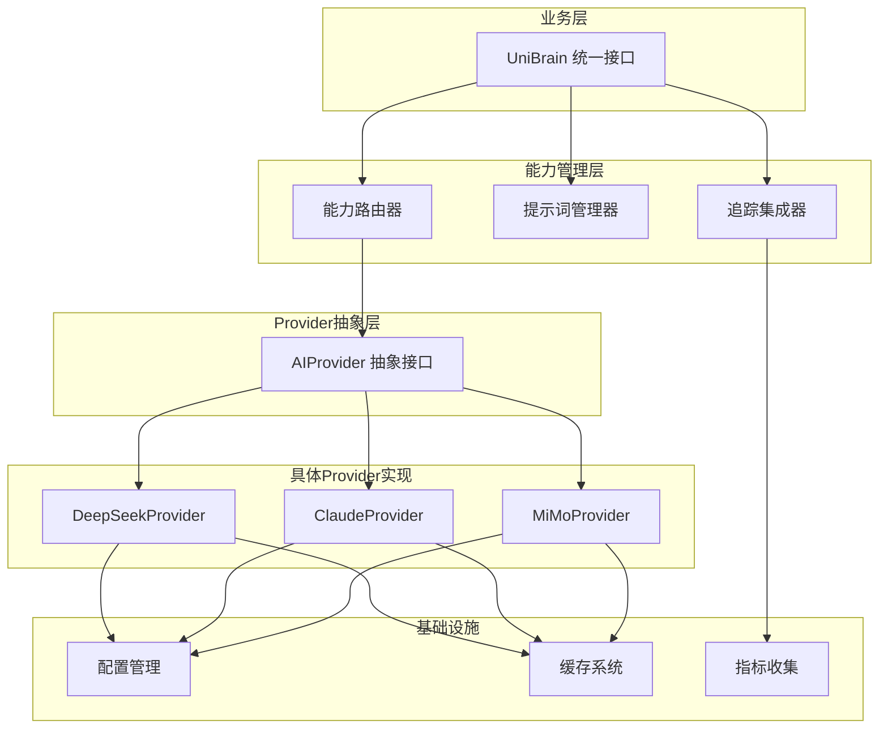

# PRD V5.3: UniBrain架构重构 - Provider抽象与提示词管理

> **文档版本**: 1.0  
> **创建日期**: 2026-06-02  
> **目标受众**: AI开发团队、架构师、测试工程师  
> **实施方式**: 一次性全面重构，包含测试迁移和性能验证  
> **设计模式**: 渐进式优化（保留接口，优化实现）

---

## 📋 执行摘要

### 目标
重构UniBrain AI能力层，实现：
1. **Provider抽象层** - 统一的AI提供者接口
2. **声明式路由** - 基于配置的能力→Provider映射
3. **提示词管理系统** - 集中式管理、版本控制、变量注入
4. **追踪集成** - 自动追踪 + 自定义追踪 (A+E)
5. **全面测试迁移** - 100%测试覆盖率 + 性能测试

### 关键约束
- ✅ **一次性重构** - 相关引用和测试同步迁移
- ✅ **测试通过** - 所有现有测试必须通过
- ✅ **性能验证** - 验证数据采集（延迟、token、质量）
- ✅ **声明式路由** - 配置文件管理Provider映射
- ✅ **基础提示词管理** - 避免过度设计

### 架构策略
**渐进式优化** - 保留现有接口，内部优化实现，逐步迁移验证

---

## 🎯 背景与动机

### 现有问题

#### 1. 层次复杂度过高
**现状**：5层架构
```
AIStrategyAdvisor → UniBrain → BaseCapability → MultimodalAnalyzer + PageAnalysisAssembler → UnifiedAIProvider
```

**问题**：
- 接口层次过多，概念理解成本高
- 跨层调用频繁，性能开销大
- 调试困难，问题定位复杂

#### 2. Provider管理混乱
**现状**：多个Provider实现分散在不同模块
- `DeepSeekProvider` 在 `core/llm_client.py`
- `ClaudeProvider` 在 `vision/claude_service.py`
- `MiMoProvider` 在 `core/multimodal_client.py`

**问题**：
- 缺乏统一抽象，难以添加新Provider
- 路由逻辑分散，难以维护
- 无法根据需求动态选择Provider

#### 3. 提示词管理分散
**现状**：提示词硬编码在各个能力模块中
- `ParseToPlanCapability` 提示词在 `core/prompts.py`
- `VisionAnalysisCapability` 提示词在 `vision/prompts/`
- 缺乏版本管理和A/B测试能力

**问题**：
- 提示词优化困难，无法快速迭代
- 无法复用提示词模板
- 缺乏失败分析和优化机制

#### 4. 追踪不完整
**现状**：基础追踪存在，但不完整
- 只有简单的span记录
- 缺少业务上下文信息
- 无法追踪Provider选择和token消耗

**问题**：
- 问题定位困难
- 无法分析token消耗和性能
- 缺少业务指标的关联分析

### 改进目标

#### 1. 简化架构层次
**目标**：从5层简化到3层
```
UniBrain (统一接口) → Provider抽象层 → 具体Provider实现
```

#### 2. 统一Provider管理
**目标**：
- 所有Provider实现统一接口
- 声明式路由配置
- 支持Provider性能评估

#### 3. 集中式提示词管理
**目标**：
- 所有提示词集中存储
- 支持版本控制和变量注入
- 便于A/B测试和优化

#### 4. 完整追踪系统
**目标**：
- 自动追踪所有AI调用
- 支持业务上下文注入
- Token消耗和性能可视化

---

## 🏗️ 架构设计

### 整体架构



### 模块设计

#### 1. UniBrain (统一接口)

**职责**：
- 提供5大核心能力的统一接口
- 管理能力路由逻辑
- 协调提示词管理和追踪

**接口定义**：
```python
class UniBrain:
    """统一AI能力接口"""
    
    async def analyze_visual(self, image_data: bytes, context: Optional[Dict] = None) -> PageAnalysis:
        """视觉分析能力"""
        pass
    
    async def parse_instruction(self, instruction: str) -> TraversalPlan:
        """指令解析能力"""
        pass
    
    async def verify_page_type(self, page_analysis: PageAnalysis, expected_type: str) -> PageTypeVerification:
        """页面类型验证能力"""
        pass
    
    async def decide_next_action(self, goal: str, page_analysis: PageAnalysis, context: TraversalContext) -> ContextDecisionResult:
        """决策能力"""
        pass
    
    async def screen_safety(self, page_analysis: PageAnalysis, instruction: str) -> SafetyScreeningResult:
        """安全筛选能力"""
        pass
    
    def get_metrics(self) -> Dict:
        """获取使用指标"""
        pass
```

#### 2. AIProvider (Provider抽象)

**职责**：
- 定义统一的Provider接口
- 支持文本、视觉、多模态三种模式
- 提供token估算和性能评级

**接口定义**：
```python
class AIProvider(ABC):
    """AI提供者抽象"""
    
    @property
    @abstractmethod
    def provider_id(self) -> str:
        """Provider唯一标识"""
        pass
    
    @property
    @abstractmethod
    def supported_modes(self) -> List[str]:
        """支持的模式：text, vision, multimodal"""
        pass
    
    @abstractmethod
    async def complete_text(self, prompt: str, schema: Optional[Dict] = None, **kwargs) -> AIResponse:
        """文本补全"""
        pass
    
    @abstractmethod
    async def complete_vision(self, prompt: str, image_data: bytes, schema: Optional[Dict] = None, **kwargs) -> AIResponse:
        """视觉补全"""
        pass
    
    @abstractmethod
    async def complete_multimodal(self, prompt: str, image_data: bytes, additional_context: Optional[Dict] = None, schema: Optional[Dict] = None, **kwargs) -> AIResponse:
        """多模态补全"""
        pass
    
    def get_cost_estimate(self, mode: str, input_tokens: int, output_tokens: int) -> float:
        """估算成本"""
        return 0.0
    
    def get_performance_rating(self, mode: str) -> Dict[str, float]:
        """获取性能评级"""
        return {"latency": 1.0, "quality": 1.0, "cost": 1.0}
```

#### 3. 提示词管理器

**职责**：
- 集中管理所有提示词
- 支持变量注入和版本控制
- 提供提示词模板化能力

**接口定义**：
```python
class PromptManager:
    """提示词管理系统"""
    
    def __init__(self, prompt_dir: str = "src/ai/prompts"):
        self.prompt_dir = Path(prompt_dir)
        self._prompts = {}
        self._load_prompts()
    
    def get_prompt(self, capability: str, version: str = "latest") -> PromptTemplate:
        """获取能力提示词"""
        pass
    
    def inject_variables(self, template: PromptTemplate, variables: Dict) -> str:
        """注入变量到提示词模板"""
        pass
    
    def list_capabilities(self) -> List[str]:
        """列出所有支持的能力"""
        pass
```

**提示词文件结构**：
```markdown
---
capability: analyze_visual
version: 1.0
variables:
  - image_description
  - context_info
system: You are a visual analysis expert for vehicle infotainment systems.
---

Analyze this {image_description} and extract the UI structure.

## Context Information
{context_info}

## Output Requirements
Return a JSON object with...
```

#### 4. 追踪集成器

**职责**：
- 自动追踪所有AI调用
- 支持业务上下文注入
- 收集token和性能指标

**接口定义**：
```python
class TraceIntegration:
    """追踪集成系统"""
    
    def __init__(self, trace_logger: TraceLogger):
        self.trace_logger = trace_logger
    
    def start_span(self, operation: str, tags: Dict = None, parent_context: Any = None) -> Any:
        """开始追踪span"""
        pass
    
    def inject_context(self, span_context: Any, custom_context: Dict) -> None:
        """注入自定义追踪上下文"""
        pass
    
    def finish_span(self, span_context: Any, result: Any = None, error: Exception = None) -> None:
        """结束追踪span"""
        pass
    
    def record_metrics(self, capability: str, provider_id: str, latency_ms: float, tokens: Dict, cost: float) -> None:
        """记录指标"""
        pass
```

### 配置管理

#### Provider路由配置

**文件位置**：`config/ai_providers.yaml`

```yaml
# Provider路由配置
version: 1.0

# Provider定义
providers:
  deepseek:
    class: "DeepSeekProvider"
    config:
      api_key: "${DEEPSEEK_API_KEY}"
      model: "deepseek-v4-flash"
      base_url: "https://api.deepseek.com/v1"
    capabilities:
      - parse_instruction
      - verify_page_type
      - screen_safety
      - decide_next_action
    performance:
      latency: 0.8      # 低延迟
      quality: 0.7      # 中等质量
      efficiency: 0.9   # 高token效率
  
  claude:
    class: "ClaudeProvider"
    config:
      api_key: "${ANTHROPIC_API_KEY}"
      model: "claude-3-5-sonnet-20241022"
      base_url: "https://api.anthropic.com/v1"
    capabilities:
      - analyze_visual
      - verify_page_with_vision
    performance:
      latency: 0.6      # 中等延迟
      quality: 0.95     # 高质量
      efficiency: 0.6   # 中等token效率
  
  mimo:
    class: "MiMoProvider"
    config:
      api_key: "${MIMO_API_KEY}"
      model: "mimo-v2.5"
      base_url: "https://token-plan-cn.xiaomimimo.com/anthropic"
    capabilities:
      - analyze_visual
    performance:
      latency: 0.7      # 中低延迟
      quality: 0.9      # 高质量
      efficiency: 0.8   # 较高token效率

# 能力路由映射
routing:
  analyze_visual: claude
  parse_instruction: deepseek
  verify_page_type: deepseek
  verify_page_with_vision: claude
  screen_safety: deepseek
  decide_next_action: deepseek

# 默认设置
defaults:
  fallback_enabled: true
  cache_enabled: true
  trace_enabled: true
```

---

## 📝 详细技术规范

### 1. Provider抽象层规范

#### 1.1 AIProvider接口

**文件位置**：`src/ai/providers/base.py`

```python
from abc import ABC, abstractmethod
from typing import Dict, List, Optional
from dataclasses import dataclass

@dataclass
class AIResponse:
    """AI响应统一格式"""
    content: str
    provider_id: str
    mode: str
    input_tokens: int
    output_tokens: int
    latency_ms: float
    model: str = ""
    
    @property
    def total_tokens(self) -> int:
        return self.input_tokens + self.output_tokens
    
    @property
    def estimated_cost(self) -> float:
        """估算token使用量"""
        return 0.0  # 子类实现具体计算

class AIProvider(ABC):
    """AI提供者抽象基类"""
    
    def __init__(self, config: AIProviderConfig):
        self.config = config
        self._client = None
    
    @property
    @abstractmethod
    def provider_id(self) -> str:
        """Provider唯一标识"""
        pass
    
    @property
    @abstractmethod
    def supported_modes(self) -> List[str]:
        """支持的模式：text, vision, multimodal"""
        pass
    
    @abstractmethod
    async def complete_text(
        self, 
        prompt: str, 
        schema: Optional[Dict] = None,
        max_tokens: int = 2048,
        **kwargs
    ) -> AIResponse:
        """文本补全能力
        
        Args:
            prompt: 文本提示词
            schema: JSON Schema约束输出格式
            max_tokens: 最大输出token数
            **kwargs: 其他参数
            
        Returns:
            AIResponse: 统一格式的响应
            
        Raises:
            RuntimeError: API调用失败
            ValueError: 参数错误
        """
        pass
    
    @abstractmethod
    async def complete_vision(
        self,
        prompt: str,
        image_data: bytes,
        schema: Optional[Dict] = None,
        max_tokens: int = 4096,
        **kwargs
    ) -> AIResponse:
        """视觉补全能力
        
        Args:
            prompt: 文本提示词
            image_data: PNG格式图片数据
            schema: JSON Schema约束输出格式
            max_tokens: 最大输出token数
            **kwargs: 其他参数
            
        Returns:
            AIResponse: 统一格式的响应
            
        Raises:
            RuntimeError: API调用失败
            ValueError: 参数错误或图片格式错误
        """
        pass
    
    @abstractmethod
    async def complete_multimodal(
        self,
        prompt: str,
        image_data: bytes,
        additional_context: Optional[Dict] = None,
        schema: Optional[Dict] = None,
        max_tokens: int = 4096,
        **kwargs
    ) -> AIResponse:
        """多模态补全能力
        
        Args:
            prompt: 文本提示词
            image_data: PNG格式图片数据
            additional_context: 额外的上下文信息
            schema: JSON Schema约束输出格式
            max_tokens: 最大输出token数
            **kwargs: 其他参数
            
        Returns:
            AIResponse: 统一格式的响应
            
        Raises:
            RuntimeError: API调用失败
            ValueError: 参数错误
        """
        pass
    
    def get_token_estimate(
        self, 
        mode: str, 
        avg_request_tokens: int = 500
    ) -> Dict[str, int]:
        """估算token使用量
        
        Args:
            mode: 调用模式 (text/vision/multimodal)
            avg_request_tokens: 平均请求token数
            
        Returns:
            Dict: token估算 {input: int, output: int, total: int}
        """
        # 默认实现，子类可以覆盖以提供更准确的估算
        return {
            "input": avg_request_tokens,
            "output": avg_request_tokens // 2,
            "total": avg_request_tokens + avg_request_tokens // 2
        }
    
    def get_performance_rating(self, mode: str) -> Dict[str, float]:
        """获取Provider性能评级
        
        Args:
            mode: 调用模式
            
        Returns:
            Dict: 性能评级 {latency: 0-1, quality: 0-1, efficiency: 0-1}
            latency: 1.0 = 最快, 0.0 = 最慢
            quality: 1.0 = 最高质量, 0.0 = 最低质量
            efficiency: 1.0 = 最高token效率, 0.0 = 最低效率
        """
        return {"latency": 0.5, "quality": 0.5, "efficiency": 0.5}
    
    async def health_check(self) -> bool:
        """健康检查
        
        Returns:
            bool: True表示健康，False表示不健康
        """
        try:
            # 简单的ping测试
            test_response = await self.complete_text("ping", max_tokens=10)
            return bool(test_response.content)
        except Exception:
            return False
```

#### 1.2 DeepSeekProvider实现

**文件位置**：`src/ai/providers/deepseek.py`

```python
import aiohttp
import logging
from typing import Dict, Optional
from .base import AIProvider, AIResponse
from ..core.config import AIProviderConfig

logger = logging.getLogger(__name__)

class DeepSeekProvider(AIProvider):
    """DeepSeek API提供者 - 专注文本处理"""
    
    @property
    def provider_id(self) -> str:
        return "deepseek"
    
    @property
    def supported_modes(self) -> List[str]:
        return ["text"]
    
    async def complete_text(
        self, 
        prompt: str, 
        schema: Optional[Dict] = None,
        max_tokens: int = 2048,
        **kwargs
    ) -> AIResponse:
        """DeepSeek文本补全实现"""
        
        import time
        start_time = time.time()
        
        # 构建请求
        payload = {
            "model": self.config.model,
            "messages": [{"role": "user", "content": prompt}],
            "max_tokens": max_tokens,
        }
        
        if schema:
            payload["response_format"] = {"type": "json_object"}
        
        headers = {
            "Authorization": f"Bearer {self.config.api_key}",
            "Content-Type": "application/json",
        }
        
        try:
            timeout = aiohttp.ClientTimeout(total=self.config.request_timeout)
            async with aiohttp.ClientSession(timeout=timeout) as session:
                async with session.post(
                    f"{self.config.base_url}/chat/completions",
                    headers=headers,
                    json=payload,
                ) as response:
                    if response.status >= 400:
                        error_text = await response.text()
                        raise RuntimeError(f"DeepSeek API error {response.status}: {error_text}")
                    
                    data = await response.json()
                    
                    if "error" in data:
                        raise RuntimeError(f"DeepSeek API error: {data['error']}")
                    
                    message = data["choices"][0]["message"]
                    content = message["content"]
                    
                    usage = data.get("usage", {})
                    input_tokens = usage.get("prompt_tokens", 0)
                    output_tokens = usage.get("completion_tokens", 0)
                    
                    latency_ms = (time.time() - start_time) * 1000
                    
                    logger.info(
                        f"[DeepSeek] Success. Tokens: {input_tokens} in, {output_tokens} out, "
                        f"latency: {latency_ms:.0f}ms"
                    )
                    
                    return AIResponse(
                        content=content,
                        provider_id=self.provider_id,
                        mode="text",
                        input_tokens=input_tokens,
                        output_tokens=output_tokens,
                        latency_ms=latency_ms,
                        model=self.config.model,
                    )
        
        except Exception as e:
            logger.error(f"[DeepSeek] Request failed: {e}")
            raise RuntimeError(f"DeepSeek request failed: {e}") from e
    
    async def complete_vision(self, prompt: str, image_data: bytes, schema: Optional[Dict] = None, **kwargs) -> AIResponse:
        """DeepSeek不支持视觉能力"""
        raise NotImplementedError(f"{self.provider_id} does not support vision mode")
    
    async def complete_multimodal(self, prompt: str, image_data: bytes, additional_context: Optional[Dict] = None, schema: Optional[Dict] = None, **kwargs) -> AIResponse:
        """DeepSeek不支持多模态能力"""
        raise NotImplementedError(f"{self.provider_id} does not support multimodal mode")
    
    def get_token_estimate(self, mode: str, avg_request_tokens: int = 500) -> Dict[str, int]:
        """DeepSeek token估算"""
        # DeepSeek通常比较高效，输出token约为输入的50%
        return {
            "input": avg_request_tokens,
            "output": avg_request_tokens // 2,
            "total": avg_request_tokens + avg_request_tokens // 2
        }
    
    def get_performance_rating(self, mode: str) -> Dict[str, float]:
        """DeepSeek性能评级"""
        if mode == "text":
            return {
                "latency": 0.8,    # 低延迟
                "quality": 0.7,    # 中等质量
                "efficiency": 0.9, # 高token效率
            }
        return {"latency": 0.5, "quality": 0.5, "efficiency": 0.5}
```

#### 1.3 ClaudeProvider实现

**文件位置**：`src/ai/providers/claude.py`

```python
import base64
import aiohttp
import logging
from typing import Dict, Optional
from .base import AIProvider, AIResponse
from ..core.config import AIProviderConfig

logger = logging.getLogger(__name__)

class ClaudeProvider(AIProvider):
    """Claude API提供者 - 优秀的多模态能力"""
    
    @property
    def provider_id(self) -> str:
        return "claude"
    
    @property
    def supported_modes(self) -> List[str]:
        return ["text", "vision", "multimodal"]
    
    async def complete_text(
        self, 
        prompt: str, 
        schema: Optional[Dict] = None,
        max_tokens: int = 4096,
        **kwargs
    ) -> AIResponse:
        """Claude文本补全实现"""
        
        import time
        start_time = time.time()
        
        # 构建请求
        payload = {
            "model": self.config.model,
            "max_tokens": max_tokens,
            "messages": [{"role": "user", "content": prompt}],
        }
        
        headers = {
            "x-api-key": self.config.api_key,
            "anthropic-version": "2023-06-01",
            "content-type": "application/json",
        }
        
        try:
            timeout = aiohttp.ClientTimeout(total=self.config.request_timeout)
            async with aiohttp.ClientSession(timeout=timeout) as session:
                async with session.post(
                    f"{self.config.base_url}/v1/messages",
                    headers=headers,
                    json=payload,
                ) as response:
                    if response.status >= 400:
                        error_text = await response.text()
                        raise RuntimeError(f"Claude API error {response.status}: {error_text}")
                    
                    data = await response.json()
                    
                    if "error" in data:
                        raise RuntimeError(f"Claude API error: {data['error']}")
                    
                    content_block = data.get("content", [{}])[0]
                    content = content_block.get("text", "")
                    
                    usage = data.get("usage", {})
                    input_tokens = usage.get("input_tokens", 0)
                    output_tokens = usage.get("output_tokens", 0)
                    
                    latency_ms = (time.time() - start_time) * 1000
                    
                    logger.info(
                        f"[Claude] Success. Tokens: {input_tokens} in, {output_tokens} out, "
                        f"latency: {latency_ms:.0f}ms"
                    )
                    
                    return AIResponse(
                        content=content,
                        provider_id=self.provider_id,
                        mode="text",
                        input_tokens=input_tokens,
                        output_tokens=output_tokens,
                        latency_ms=latency_ms,
                        model=self.config.model,
                    )
        
        except Exception as e:
            logger.error(f"[Claude] Request failed: {e}")
            raise RuntimeError(f"Claude request failed: {e}") from e
    
    async def complete_vision(
        self,
        prompt: str,
        image_data: bytes,
        schema: Optional[Dict] = None,
        max_tokens: int = 4096,
        **kwargs
    ) -> AIResponse:
        """Claude视觉补全实现"""
        
        import time
        start_time = time.time()
        
        # 编码图片
        image_base64 = base64.b64encode(image_data).decode('utf-8')
        
        # 构建请求
        content = [
            {"type": "text", "text": prompt},
            {
                "type": "image",
                "source": {
                    "type": "base64",
                    "media_type": "image/png",
                    "data": image_base64,
                }
            }
        ]
        
        payload = {
            "model": self.config.model,
            "max_tokens": max_tokens,
            "messages": [{"role": "user", "content": content}],
        }
        
        headers = {
            "x-api-key": self.config.api_key,
            "anthropic-version": "2023-06-01",
            "content-type": "application/json",
        }
        
        try:
            timeout = aiohttp.ClientTimeout(total=self.config.request_timeout)
            async with aiohttp.ClientSession(timeout=timeout) as session:
                async with session.post(
                    f"{self.config.base_url}/v1/messages",
                    headers=headers,
                    json=payload,
                ) as response:
                    if response.status >= 400:
                        error_text = await response.text()
                        raise RuntimeError(f"Claude Vision API error {response.status}: {error_text}")
                    
                    data = await response.json()
                    
                    if "error" in data:
                        raise RuntimeError(f"Claude Vision API error: {data['error']}")
                    
                    content_block = data.get("content", [{}])[0]
                    content = content_block.get("text", "")
                    
                    usage = data.get("usage", {})
                    input_tokens = usage.get("input_tokens", 0)
                    output_tokens = usage.get("output_tokens", 0)
                    
                    latency_ms = (time.time() - start_time) * 1000
                    
                    logger.info(
                        f"[Claude Vision] Success. Tokens: {input_tokens} in, {output_tokens} out, "
                        f"latency: {latency_ms:.0f}ms"
                    )
                    
                    return AIResponse(
                        content=content,
                        provider_id=self.provider_id,
                        mode="vision",
                        input_tokens=input_tokens,
                        output_tokens=output_tokens,
                        latency_ms=latency_ms,
                        model=self.config.model,
                    )
        
        except Exception as e:
            logger.error(f"[Claude Vision] Request failed: {e}")
            raise RuntimeError(f"Claude Vision request failed: {e}") from e
    
    async def complete_multimodal(
        self,
        prompt: str,
        image_data: bytes,
        additional_context: Optional[Dict] = None,
        schema: Optional[Dict] = None,
        max_tokens: int = 4096,
        **kwargs
    ) -> AIResponse:
        """Claude多模态补全（与vision相同）"""
        return await self.complete_vision(prompt, image_data, schema, max_tokens, **kwargs)
    
    def get_token_estimate(self, mode: str, avg_request_tokens: int = 500) -> Dict[str, int]:
        """Claude token估算"""
        # Claude在视觉任务上token消耗较多
        if mode in ["vision", "multimodal"]:
            return {
                "input": avg_request_tokens * 2,  # 视觉输入token较多
                "output": avg_request_tokens,
                "total": avg_request_tokens * 3
            }
        return {
            "input": avg_request_tokens,
            "output": avg_request_tokens // 2,
            "total": avg_request_tokens + avg_request_tokens // 2
        }
    
    def get_performance_rating(self, mode: str) -> Dict[str, float]:
        """Claude性能评级"""
        if mode in ["text", "vision", "multimodal"]:
            return {
                "latency": 0.6,    # 中等延迟
                "quality": 0.95,   # 高质量
                "efficiency": 0.6, # 中等token效率
            }
        return {"latency": 0.5, "quality": 0.5, "efficiency": 0.5}
```

#### 1.4 MiMoProvider实现

**文件位置**：`src/ai/providers/mimo.py`

```python
import base64
import aiohttp
import logging
from typing import Dict, Optional
from .base import AIProvider, AIResponse
from ..core.config import AIProviderConfig

logger = logging.getLogger(__name__)

class MiMoProvider(AIProvider):
    """MiMo API提供者 - 优化的多模态处理"""
    
    @property
    def provider_id(self) -> str:
        return "mimo"
    
    @property
    def supported_modes(self) -> List[str]:
        return ["vision", "multimodal"]
    
    async def complete_vision(
        self,
        prompt: str,
        image_data: bytes,
        schema: Optional[Dict] = None,
        max_tokens: int = 4096,
        **kwargs
    ) -> AIResponse:
        """MiMo视觉补全实现（使用Anthropic协议）"""
        
        import time
        start_time = time.time()
        
        # 编码图片
        image_base64 = base64.b64encode(image_data).decode('utf-8')
        
        # 构建请求（Anthropic协议）
        content = [
            {"type": "text", "text": prompt},
            {
                "type": "image",
                "source": {
                    "type": "base64",
                    "media_type": "image/png",
                    "data": image_base64,
                }
            }
        ]
        
        payload = {
            "model": self.config.model,
            "max_tokens": max_tokens,
            "messages": [{"role": "user", "content": content}],
        }
        
        if schema:
            payload["response_format"] = {"type": "json_object"}
        
        headers = {
            "x-api-key": self.config.api_key,
            "anthropic-version": "2023-06-01",
            "content-type": "application/json",
        }
        
        try:
            timeout = aiohttp.ClientTimeout(total=self.config.request_timeout)
            async with aiohttp.ClientSession(timeout=timeout) as session:
                async with session.post(
                    f"{self.config.base_url}/v1/messages",
                    headers=headers,
                    json=payload,
                ) as response:
                    if response.status >= 400:
                        error_text = await response.text()
                        raise RuntimeError(f"MiMo API error {response.status}: {error_text}")
                    
                    data = await response.json()
                    
                    if "error" in data:
                        raise RuntimeError(f"MiMo API error: {data['error']}")
                    
                    content_block = data.get("content", [{}])[0]
                    content = content_block.get("text", "")
                    
                    usage = data.get("usage", {})
                    input_tokens = usage.get("input_tokens", 0)
                    output_tokens = usage.get("output_tokens", 0)
                    
                    latency_ms = (time.time() - start_time) * 1000
                    
                    logger.info(
                        f"[MiMo] Success. Tokens: {input_tokens} in, {output_tokens} out, "
                        f"latency: {latency_ms:.0f}ms"
                    )
                    
                    return AIResponse(
                        content=content,
                        provider_id=self.provider_id,
                        mode="vision",
                        input_tokens=input_tokens,
                        output_tokens=output_tokens,
                        latency_ms=latency_ms,
                        model=self.config.model,
                    )
        
        except Exception as e:
            logger.error(f"[MiMo] Request failed: {e}")
            raise RuntimeError(f"MiMo request failed: {e}") from e
    
    async def complete_text(self, prompt: str, schema: Optional[Dict] = None, **kwargs) -> AIResponse:
        """MiMo不支持纯文本模式"""
        raise NotImplementedError(f"{self.provider_id} does not support text mode")
    
    async def complete_multimodal(
        self,
        prompt: str,
        image_data: bytes,
        additional_context: Optional[Dict] = None,
        schema: Optional[Dict] = None,
        max_tokens: int = 4096,
        **kwargs
    ) -> AIResponse:
        """MiMo多模态补全（与vision相同）"""
        return await self.complete_vision(prompt, image_data, schema, max_tokens, **kwargs)
    
    def get_token_estimate(self, mode: str, avg_request_tokens: int = 500) -> Dict[str, int]:
        """MiMo token估算"""
        # MiMo针对视觉任务优化，token效率较高
        return {
            "input": avg_request_tokens * 2,  # 视觉输入token较多
            "output": avg_request_tokens // 2,
            "total": avg_request_tokens * 2 + avg_request_tokens // 2
        }
    
    def get_performance_rating(self, mode: str) -> Dict[str, float]:
        """MiMo性能评级"""
        if mode in ["vision", "multimodal"]:
            return {
                "latency": 0.7,    # 中低延迟
                "quality": 0.9,    # 高质量
                "efficiency": 0.8, # 较高token效率
            }
        return {"latency": 0.5, "quality": 0.5, "efficiency": 0.5}
```

### 2. 提示词管理系统规范

#### 2.1 PromptManager实现

**文件位置**：`src/ai/prompts/manager.py`

```python
import yaml
import json
import logging
from pathlib import Path
from typing import Dict, List, Optional
from dataclasses import dataclass

logger = logging.getLogger(__name__)

@dataclass
class PromptTemplate:
    """提示词模板"""
    capability: str
    version: str
    system_prompt: str
    user_template: str
    variables: List[str]
    metadata: Dict
    
    def format(self, **kwargs) -> str:
        """格式化提示词"""
        # 验证必需变量
        missing_vars = set(self.variables) - set(kwargs.keys())
        if missing_vars:
            raise ValueError(f"Missing required variables: {missing_vars}")
        
        # 注入变量
        user_prompt = self.user_template
        for var_name in self.variables:
            if var_name in kwargs:
                user_prompt = user_prompt.replace(f"{{{var_name}}}", str(kwargs[var_name]))
        
        # 构建完整提示词
        if self.system_prompt:
            return f"{self.system_prompt}\n\n{user_prompt}"
        return user_prompt
    
    def validate_variables(self, variables: Dict) -> bool:
        """验证必需变量是否提供"""
        return all(var in variables for var in self.variables)

class PromptManager:
    """提示词管理系统"""
    
    def __init__(self, prompt_dir: str = "src/ai/prompts"):
        self.prompt_dir = Path(prompt_dir)
        self._prompts: Dict[str, Dict] = {}
        self._load_prompts()
        logger.info(f"PromptManager initialized with {len(self._prompts)} capabilities")
    
    def _load_prompts(self):
        """加载所有提示词"""
        if not self.prompt_dir.exists():
            logger.warning(f"Prompt directory not found: {self.prompt_dir}")
            return
        
        for prompt_file in self.prompt_dir.glob("*.md"):
            try:
                capability_name = prompt_file.stem
                self._prompts[capability_name] = self._parse_prompt_file(prompt_file)
                logger.debug(f"Loaded prompt for capability: {capability_name}")
            except Exception as e:
                logger.error(f"Failed to load prompt file {prompt_file}: {e}")
    
    def _parse_prompt_file(self, file_path: Path) -> Dict:
        """解析提示词文件"""
        content = file_path.read_text(encoding='utf-8')
        
        # 分离YAML front matter和markdown内容
        if content.startswith("---"):
            try:
                _, front_matter, prompt_body = content.split("---", 2)
                metadata = yaml.safe_load(front_matter)
            except yaml.YAMLError as e:
                logger.warning(f"Invalid YAML in {file_path}: {e}, using empty metadata")
                metadata = {}
                prompt_body = content
        else:
            metadata = {}
            prompt_body = content
        
        return {
            "metadata": metadata,
            "system": metadata.get("system", ""),
            "user": prompt_body.strip(),
            "variables": metadata.get("variables", []),
            "versions": metadata.get("versions", {}),
            "file_path": str(file_path),
        }
    
    def get_prompt(self, capability: str, version: str = "latest") -> PromptTemplate:
        """获取能力提示词
        
        Args:
            capability: 能力名称
            version: 版本号（"latest"或具体版本号）
            
        Returns:
            PromptTemplate: 提示词模板
            
        Raises:
            ValueError: 提示词不存在或版本不存在
        """
        if capability not in self._prompts:
            available = list(self._prompts.keys())
            raise ValueError(
                f"Prompt not found for capability: {capability}. "
                f"Available capabilities: {available}"
            )
        
        prompt_data = self._prompts[capability]
        
        # 版本管理
        if version != "latest":
            if "versions" not in prompt_data or version not in prompt_data["versions"]:
                raise ValueError(f"Version {version} not found for capability {capability}")
            prompt_data = prompt_data["versions"][version]
        
        metadata = prompt_data.get("metadata", {})
        
        return PromptTemplate(
            capability=capability,
            version=version,
            system_prompt=prompt_data.get("system", ""),
            user_template=prompt_data.get("user", ""),
            variables=prompt_data.get("variables", []),
            metadata=metadata,
        )
    
    def inject_variables(self, template: PromptTemplate, variables: Dict) -> str:
        """注入变量到提示词模板
        
        Args:
            template: 提示词模板
            variables: 变量字典
            
        Returns:
            str: 格式化后的提示词
        """
        return template.format(**variables)
    
    def list_capabilities(self) -> List[str]:
        """列出所有支持的能力"""
        return list(self._prompts.keys())
    
    def get_prompt_metadata(self, capability: str) -> Dict:
        """获取提示词元数据"""
        if capability not in self._prompts:
            raise ValueError(f"Prompt not found for capability: {capability}")
        return self._prompts[capability].get("metadata", {})
    
    def reload_prompts(self):
        """重新加载所有提示词"""
        self._prompts.clear()
        self._load_prompts()
        logger.info("Prompts reloaded")
```

#### 2.2 提示词文件示例

**文件位置**：`src/ai/prompts/analyze_visual.md`

```markdown
---
capability: analyze_visual
version: 1.0
variables:
  - image_description
  - context_info
system: You are a visual analysis expert for vehicle infotainment systems. Your task is to analyze screenshots and extract UI structure accurately.
---

Analyze this {image_description} and extract the UI structure.

## Context Information
{context_info}

## Analysis Requirements

### 1. Screen Structure
- Identify the current navigation path (e.g., ["Home", "Settings", "Connectivity"])
- Determine page type: menu_list, settings_group, dialog, home_desktop, or leaf_page
- Extract all interactive elements with their positions

### 2. Element Extraction
For each interactive element, provide:
- **name**: Display text or identifier
- **type**: Element type (menu_item, switch, button, slider, text_input, etc.)
- **position**: Normalized coordinates {x: 0-1, y: 0-1, w: 0-1, h: 0-1}
- **action**: Expected action type (navigate, toggle, input, action)
- **confidence**: Confidence score (0-1, default 1.0 if certain)

### 3. Output Format

Return a JSON object with this structure:
```json
{
  "current_path": ["Level1", "Level2"],
  "page_type": "settings_group",
  "elements": [
    {
      "id": 1,
      "name": "WiFi",
      "type": "settings_item",
      "bbox": {"x": 0.1, "y": 0.3, "w": 0.8, "h": 0.1},
      "region": "main_content",
      "expected_action": "navigate",
      "confidence": 0.95
    }
  ],
  "confidence": 0.9
}
```

## Important Guidelines

1. **Coordinates**: All coordinates must be normalized to 0-1 range relative to screen size
2. **Hierarchy**: Identify parent-child relationships in menu structures
3. **State**: Note selection states (selected, unselected, enabled, disabled)
4. **Confidence**: Assign lower confidence to uncertain elements
5. **Completeness**: Ensure all interactive elements are captured

## Error Handling

If the image is unclear or elements cannot be identified:
- Set overall confidence lower than 0.7
- Add uncertain elements with explicit confidence scores
- Provide reasoning in metadata if needed
```

**文件位置**：`src/ai/prompts/parse_instruction.md`

```markdown
---
capability: parse_instruction
version: 1.0
variables:
  - instruction
  - app_context
system: You are an expert in Android UI navigation and traversal planning. Convert natural language instructions into structured traversal plans.
---

Convert this instruction into a structured traversal plan: "{instruction}"

## Application Context
{app_context}

## Traversal Plan Structure

### 1. Entry Point
- **entry_app**: Target application name (e.g., "Settings", "WiFi")
- **entry_action**: How to enter the app (e.g., "click_on_icon", "navigate_from_home")

### 2. Root Node Definition
```json
{
  "node_id": "root",
  "name": "Root Task",
  "node_type": "container",
  "operation": {
    "action": "navigate",
    "target": {"by": "app_name", "value": "Settings"}
  },
  "children_strategy": {
    "type": "dynamic_match",
    "dynamic_rules": {
      "match_criteria": "page_type",
      "expected_types": ["menu_list", "settings_group"]
    }
  }
}
```

### 3. Static Nodes (Optional)
Pre-defined nodes for known paths:
```json
{
  "static_nodes": [
    {
      "node_id": "wifi_settings",
      "name": "WiFi Settings",
      "node_type": "leaf",
      "operation": {"action": "click", "target": {"by": "text", "value": "WiFi"}},
      "precondition": {"page_name": "Connectivity", "ui_condition": "wifi_item_visible"}
    }
  ]
}
```

## Output Format

```json
{
  "entry_app": "Settings",
  "root_node": {...},
  "static_nodes": [...],
  "mode": "hybrid",
  "reasoning": "Step-by-step explanation of the plan",
  "confidence": 0.9
}
```

## Planning Guidelines

1. **Be Specific**: Provide clear navigation targets (by text, by position, etc.)
2. **Handle Uncertainty**: Use confidence scores and conditional logic
3. **Error Recovery**: Include fallback strategies in reasoning
4. **Efficiency**: Minimize unnecessary navigation steps
5. **Validation**: Ensure preconditions are achievable

## Modes

- **hybrid**: Mix of static and dynamic exploration
- **concrete**: All nodes pre-defined
- **dynamic**: Fully exploration-based

Choose the appropriate mode based on instruction clarity and app knowledge.
```

### 3. 追踪集成规范

#### 3.1 TraceIntegration实现

**文件位置**：`src/ai/trace/integration.py`

```python
import logging
import time
from typing import Dict, Any, Optional
from dataclasses import dataclass, field
from datetime import datetime

logger = logging.getLogger(__name__)

@dataclass
class SpanContext:
    """追踪上下文"""
    span_id: str
    parent_span_id: Optional[str] = None
    start_time: float = field(default_factory=time.time)
    tags: Dict[str, Any] = field(default_factory=dict)
    custom_context: Dict[str, Any] = field(default_factory=dict)
    
    @property
    def duration_ms(self) -> float:
        return (time.time() - self.start_time) * 1000

class TraceIntegration:
    """追踪集成系统"""
    
    def __init__(self, trace_logger=None, enable_auto: bool = True):
        """初始化追踪集成
        
        Args:
            trace_logger: 现有的TraceLogger实例（可选）
            enable_auto: 是否启用自动追踪
        """
        self.trace_logger = trace_logger
        self.enable_auto = enable_auto
        self._active_spans: Dict[str, SpanContext] = {}
        
        if self.trace_logger is None:
            try:
                from src.utils.trace import TraceLogger
                self.trace_logger = TraceLogger("unibrain")
                logger.info("Created new TraceLogger for UniBrain")
            except ImportError:
                logger.warning("TraceLogger not available, tracing disabled")
                self.enable_auto = False
    
    def start_span(
        self, 
        operation: str, 
        tags: Dict[str, Any] = None,
        parent_context: SpanContext = None
    ) -> SpanContext:
        """开始追踪span
        
        Args:
            operation: 操作名称（如"unibrain.analyze_visual"）
            tags: 标签字典
            parent_context: 父span上下文
            
        Returns:
            SpanContext: 新的span上下文
        """
        import uuid
        span_id = f"{operation}_{uuid.uuid4().hex[:8]}"
        
        span_context = SpanContext(
            span_id=span_id,
            parent_span_id=parent_context.span_id if parent_context else None,
            tags=tags or {},
        )
        
        self._active_spans[span_id] = span_context
        
        # 使用现有的TraceLogger（如果可用）
        if self.enable_auto and self.trace_logger:
            try:
                # TraceLogger的接口可能不同，这里做适配
                if hasattr(self.trace_logger, 'start_span'):
                    trace_span = self.trace_logger.start_span(operation, tags=tags or {})
                    span_context._trace_span = trace_span
            except Exception as e:
                logger.warning(f"Failed to start trace span: {e}")
        
        logger.debug(f"Started span: {span_id} for operation: {operation}")
        return span_context
    
    def inject_context(self, span_context: SpanContext, custom_context: Dict[str, Any]) -> None:
        """注入自定义追踪上下文
        
        Args:
            span_context: Span上下文
            custom_context: 自定义上下文字典
        """
        span_context.custom_context.update(custom_context)
        logger.debug(f"Injected custom context into span: {span_context.span_id}")
    
    def finish_span(
        self, 
        span_context: SpanContext, 
        result: Any = None, 
        error: Exception = None
    ) -> None:
        """结束追踪span
        
        Args:
            span_context: Span上下文
            result: 操作结果
            error: 异常（如果有）
        """
        if span_context.span_id not in self._active_spans:
            logger.warning(f"Span not found: {span_context.span_id}")
            return
        
        duration_ms = span_context.duration_ms
        
        # 使用现有的TraceLogger记录
        if self.enable_auto and self.trace_logger:
            try:
                trace_span = getattr(span_context, '_trace_span', None)
                if trace_span and hasattr(self.trace_logger, 'finish_span'):
                    self.trace_logger.finish_span(trace_span, result=result, error=error)
            except Exception as e:
                logger.warning(f"Failed to finish trace span: {e}")
        
        # 记录到日志
        if error:
            logger.error(
                f"Span {span_context.span_id} failed after {duration_ms:.0f}ms: {error}"
            )
        else:
            logger.info(
                f"Span {span_context.span_id} completed in {duration_ms:.0f}ms"
            )
        
        # 清理
        del self._active_spans[span_context.span_id]
    
    def record_metrics(
        self, 
        capability: str, 
        provider_id: str,
        latency_ms: float,
        tokens: Dict[str, int],
        success: bool = True
    ) -> None:
        """记录指标
        
        Args:
            capability: 能力名称
            provider_id: Provider ID
            latency_ms: 延迟（毫秒）
            tokens: Token统计 {input: int, output: int}
            success: 是否成功
        """
        metrics_data = {
            "capability": capability,
            "provider_id": provider_id,
            "latency_ms": latency_ms,
            "input_tokens": tokens.get("input", 0),
            "output_tokens": tokens.get("output", 0),
            "total_tokens": tokens.get("input", 0) + tokens.get("output", 0),
            "success": success,
            "timestamp": datetime.now().isoformat(),
        }
        
        # 记录到现有的指标系统
        if self.trace_logger and hasattr(self.trace_logger, 'log_metrics'):
            try:
                self.trace_logger.log_metrics(metrics_data)
            except Exception as e:
                logger.warning(f"Failed to log metrics: {e}")
        
        logger.info(
            f"[Metrics] {capability} via {provider_id}: "
            f"{latency_ms:.0f}ms, {tokens.get('input', 0)}+{tokens.get('output', 0)} tokens, "
            f"success={success}"
        )
    
    def get_active_spans(self) -> Dict[str, SpanContext]:
        """获取所有活跃的span"""
        return self._active_spans.copy()
```

#### 3.2 追踪数据模型

**文件位置**：`src/ai/trace/models.py`

```python
from dataclasses import dataclass, field
from typing import Dict, Any, Optional
from datetime import datetime

@dataclass
class AICallTrace:
    """AI调用追踪记录"""
    trace_id: str
    capability: str
    provider_id: str
    operation: str
    
    # 时间信息
    start_time: datetime
    end_time: Optional[datetime] = None
    duration_ms: Optional[float] = None
    
    # Token统计（核心指标）
    input_tokens: int = 0
    output_tokens: int = 0
    total_tokens: int = 0
    
    # 结果信息
    success: bool = True
    error_message: Optional[str] = None
    
    # 自定义上下文
    custom_context: Dict[str, Any] = field(default_factory=dict)
    
    # 标签
    tags: Dict[str, Any] = field(default_factory=dict)
    
    def to_dict(self) -> Dict[str, Any]:
        """转换为字典"""
        return {
            "trace_id": self.trace_id,
            "capability": self.capability,
            "provider_id": self.provider_id,
            "operation": self.operation,
            "start_time": self.start_time.isoformat(),
            "end_time": self.end_time.isoformat() if self.end_time else None,
            "duration_ms": self.duration_ms,
            "input_tokens": self.input_tokens,
            "output_tokens": self.output_tokens,
            "total_tokens": self.total_tokens,
            "success": self.success,
            "error_message": self.error_message,
            "custom_context": self.custom_context,
            "tags": self.tags,
        }

@dataclass
class ProviderPerformanceMetrics:
    """Provider性能指标"""
    provider_id: str
    capability: str
    
    # 延迟统计
    total_calls: int = 0
    successful_calls: int = 0
    failed_calls: int = 0
    avg_latency_ms: float = 0.0
    p50_latency_ms: float = 0.0
    p95_latency_ms: float = 0.0
    p99_latency_ms: float = 0.0
    
    # Token统计（核心指标）
    total_input_tokens: int = 0
    total_output_tokens: int = 0
    avg_input_tokens_per_call: float = 0.0
    avg_output_tokens_per_call: float = 0.0
    total_tokens: int = 0
    
    # 效率指标
    avg_tokens_per_second: float = 0.0
    
    # 质量指标
    avg_confidence: float = 0.0
    
    def update_with_call(self, trace: AICallTrace) -> None:
        """用新的调用记录更新指标"""
        self.total_calls += 1
        if trace.success:
            self.successful_calls += 1
        else:
            self.failed_calls += 1
        
        # 更新延迟（简化版，实际应该用滑动窗口）
        if trace.duration_ms:
            alpha = 0.1  # 指数移动平均系数
            self.avg_latency_ms = (
                alpha * trace.duration_ms + 
                (1 - alpha) * self.avg_latency_ms
            )
        
        # 更新token统计
        self.total_input_tokens += trace.input_tokens
        self.total_output_tokens += trace.output_tokens
        self.total_tokens += trace.total_tokens
        
        # 更新平均token数
        if self.total_calls > 0:
            self.avg_input_tokens_per_call = self.total_input_tokens / self.total_calls
            self.avg_output_tokens_per_call = self.total_output_tokens / self.total_calls
        
        # 更新效率指标
        if trace.duration_ms and trace.total_tokens > 0:
            tokens_per_second = (trace.total_tokens * 1000) / trace.duration_ms
            alpha = 0.1
            self.avg_tokens_per_second = (
                alpha * tokens_per_second + 
                (1 - alpha) * self.avg_tokens_per_second
            )
    
    def to_dict(self) -> Dict[str, Any]:
        """转换为字典"""
        return {
            "provider_id": self.provider_id,
            "capability": self.capability,
            "total_calls": self.total_calls,
            "successful_calls": self.successful_calls,
            "failed_calls": self.failed_calls,
            "success_rate": self.successful_calls / self.total_calls if self.total_calls > 0 else 0.0,
            "avg_latency_ms": self.avg_latency_ms,
            "p50_latency_ms": self.p50_latency_ms,
            "p95_latency_ms": self.p95_latency_ms,
            "p99_latency_ms": self.p99_latency_ms,
            "total_input_tokens": self.total_input_tokens,
            "total_output_tokens": self.total_output_tokens,
            "total_tokens": self.total_tokens,
            "avg_input_tokens_per_call": self.avg_input_tokens_per_call,
            "avg_output_tokens_per_call": self.avg_output_tokens_per_call,
            "avg_tokens_per_second": self.avg_tokens_per_second,
            "avg_confidence": self.avg_confidence,
        }
```

### 4. UniBrain统一接口规范

#### 4.1 UniBrain实现

**文件位置**：`src/ai/unibrain.py`

```python
import yaml
import logging
from pathlib import Path
from typing import Dict, Optional, List
from dataclasses import dataclass

from .providers.base import AIProvider, AIResponse
from .prompts.manager import PromptManager
from .trace.integration import TraceIntegration, SpanContext
from .trace.models import AICallTrace
from .config import AIProviderConfig

logger = logging.getLogger(__name__)

@dataclass
class UniBrainConfig:
    """UniBrain配置"""
    routing_config_path: str = "config/ai_providers.yaml"
    prompt_dir: str = "src/ai/prompts"
    enable_trace: bool = True
    enable_cache: bool = True
    default_provider: str = "deepseek"

class UniBrain:
    """统一AI能力接口"""
    
    def __init__(
        self,
        providers: Dict[str, AIProvider] = None,
        config: UniBrainConfig = None
    ):
        """初始化UniBrain
        
        Args:
            providers: Provider字典 {provider_id: AIProvider}
            config: UniBrain配置
        """
        self.config = config or UniBrainConfig()
        
        # 加载Provider
        if providers:
            self.providers = providers
        else:
            self.providers = self._load_providers_from_config()
        
        # 初始化提示词管理器
        self.prompt_manager = PromptManager(self.config.prompt_dir)
        
        # 初始化追踪系统
        self.trace_integration = TraceIntegration(enable_auto=self.config.enable_trace)
        
        # 加载路由配置
        self.routing_config = self._load_routing_config()
        
        # 构建能力到Provider的映射
        self._capability_provider_map = self.routing_config.get("routing", {})
        
        logger.info(
            f"UniBrain initialized with {len(self.providers)} providers "
            f"and {len(self._capability_provider_map)} capabilities"
        )
    
    def _load_providers_from_config(self) -> Dict[str, AIProvider]:
        """从配置加载Provider"""
        routing_config = self._load_routing_config()
        providers = {}
        
        for provider_id, provider_config in routing_config.get("providers", {}).items():
            try:
                # 构建AIProviderConfig
                api_key = self._resolve_env_var(provider_config["config"]["api_key"])
                
                ai_config = AIProviderConfig(
                    api_key=api_key,
                    model=provider_config["config"]["model"],
                    base_url=provider_config["config"]["base_url"],
                )
                
                # 动态导入Provider类
                class_name = provider_config["class"]
                module = __import__(f"src.ai.providers.{class_name.lower()}", fromlist=[class_name])
                provider_class = getattr(module, class_name)
                
                # 创建Provider实例
                provider = provider_class(ai_config)
                providers[provider_id] = provider
                
                logger.info(f"Loaded provider: {provider_id}")
            
            except Exception as e:
                logger.error(f"Failed to load provider {provider_id}: {e}")
        
        return providers
    
    def _load_routing_config(self) -> Dict:
        """加载路由配置"""
        config_path = Path(self.config.routing_config_path)
        if not config_path.exists():
            logger.warning(f"Routing config not found: {config_path}, using defaults")
            return self._get_default_routing_config()
        
        try:
            with open(config_path, 'r', encoding='utf-8') as f:
                config = yaml.safe_load(f)
            logger.info(f"Loaded routing config from {config_path}")
            return config
        except Exception as e:
            logger.error(f"Failed to load routing config: {e}")
            return self._get_default_routing_config()
    
    def _get_default_routing_config(self) -> Dict:
        """获取默认路由配置"""
        return {
            "version": "1.0",
            "providers": {},
            "routing": {
                "analyze_visual": "claude",
                "parse_instruction": "deepseek",
                "verify_page_type": "deepseek",
                "screen_safety": "deepseek",
                "decide_next_action": "deepseek",
            },
            "defaults": {
                "fallback_enabled": True,
                "cache_enabled": True,
                "trace_enabled": True,
            }
        }
    
    def _resolve_env_var(self, value: str) -> str:
        """解析环境变量"""
        import os
        import re
        
        if isinstance(value, str) and value.startswith("${") and value.endswith("}"):
            env_var = value[2:-1]
            return os.getenv(env_var, value)
        return value
    
    def _select_provider(self, capability: str) -> AIProvider:
        """选择Provider（声明式路由）"""
        provider_id = self._capability_provider_map.get(capability)
        
        if not provider_id:
            logger.warning(f"No provider configured for capability: {capability}, using default")
            provider_id = self.config.default_provider
        
        if provider_id not in self.providers:
            raise RuntimeError(f"Provider not found: {provider_id}")
        
        return self.providers[provider_id]
    
    async def _execute_with_trace(
        self,
        capability: str,
        provider: AIProvider,
        operation: str,
        execute_func,
        custom_context: Dict = None,
        **kwargs
    ) -> Any:
        """带追踪的执行
        
        Args:
            capability: 能力名称
            provider: Provider实例
            operation: 操作名称
            execute_func: 执行函数
            custom_context: 自定义追踪上下文
            **kwargs: 执行参数
            
        Returns:
            Any: 执行结果
        """
        # 开始追踪
        span_context = self.trace_integration.start_span(
            operation=f"unibrain.{capability}",
            tags={
                "capability": capability,
                "provider_id": provider.provider_id,
                "mode": kwargs.get("mode", "unknown"),
            }
        )
        
        # 注入自定义上下文
        if custom_context:
            self.trace_integration.inject_context(span_context, custom_context)
        
        try:
            # 执行操作
            import time
            start_time = time.time()
            
            result = await execute_func(**kwargs)
            
            duration_ms = (time.time() - start_time) * 1000
            
            # 提取指标
            if isinstance(result, AIResponse):
                latency_ms = result.latency_ms
                tokens = {"input": result.input_tokens, "output": result.output_tokens}
            else:
                latency_ms = duration_ms
                tokens = {}
            
            # 记录指标
            self.trace_integration.record_metrics(
                capability=capability,
                provider_id=provider.provider_id,
                latency_ms=latency_ms,
                tokens=tokens,
                success=True,
            )
            
            # 完成追踪
            self.trace_integration.finish_span(span_context, result=result)
            
            return result
        
        except Exception as e:
            # 记录失败
            self.trace_integration.finish_span(span_context, error=e)
            
            self.trace_integration.record_metrics(
                capability=capability,
                provider_id=provider.provider_id,
                latency_ms=0.0,
                tokens={},
                success=False,
            )
            
            raise
    
    # ========== 统一的业务接口 ==========
    
    async def analyze_visual(
        self,
        image_data: bytes,
        context: Optional[Dict] = None,
        trace_context: Optional[Dict] = None,
    ) -> Any:
        """视觉分析能力"""
        import json
        
        provider = self._select_provider("analyze_visual")
        prompt_template = self.prompt_manager.get_prompt("analyze_visual")
        
        # 构建提示词
        formatted_prompt = self.prompt_manager.inject_variables(
            prompt_template,
            {
                "image_description": "Vehicle infotainment system screenshot",
                "context_info": json.dumps(context or {}, indent=2),
            }
        )
        
        # 执行
        async def execute(**kwargs):
            response = await provider.complete_vision(
                prompt=formatted_prompt,
                image_data=image_data,
                max_tokens=4096,
            )
            
            # 解析响应
            try:
                result_data = json.loads(response.content)
                # 转换为PageAnalysis（这里需要根据实际的PageAnalysis类调整）
                from src.state.content_tree import PageAnalysis
                return PageAnalysis.from_dict(result_data)
            except json.JSONDecodeError as e:
                raise ValueError(f"Failed to parse response as JSON: {e}") from e
        
        return await self._execute_with_trace(
            capability="analyze_visual",
            provider=provider,
            operation="analyze_visual",
            execute_func=execute,
            custom_context=trace_context,
        )
    
    async def parse_instruction(
        self,
        instruction: str,
        trace_context: Optional[Dict] = None,
    ) -> Any:
        """指令解析能力"""
        import json
        
        provider = self._select_provider("parse_instruction")
        prompt_template = self.prompt_manager.get_prompt("parse_instruction")
        
        # 构建提示词
        formatted_prompt = self.prompt_manager.inject_variables(
            prompt_template,
            {
                "instruction": instruction,
                "app_context": "Vehicle infotainment system",
            }
        )
        
        # 执行
        async def execute(**kwargs):
            response = await provider.complete_text(
                prompt=formatted_prompt,
                max_tokens=2048,
            )
            
            # 解析响应
            try:
                result_data = json.loads(response.content)
                from src.ai.capabilities.types import TraversalPlan
                return TraversalPlan(**result_data)
            except json.JSONDecodeError as e:
                raise ValueError(f"Failed to parse response as JSON: {e}") from e
        
        return await self._execute_with_trace(
            capability="parse_instruction",
            provider=provider,
            operation="parse_instruction",
            execute_func=execute,
            custom_context=trace_context,
        )
    
    async def verify_page_type(
        self,
        page_analysis: Any,
        expected_type: str,
        trace_context: Optional[Dict] = None,
    ) -> Any:
        """页面类型验证能力"""
        import json
        
        provider = self._select_provider("verify_page_type")
        prompt_template = self.prompt_manager.get_prompt("verify_page_type")
        
        # 构建提示词
        formatted_prompt = self.prompt_manager.inject_variables(
            prompt_template,
            {
                "expected_type": expected_type,
                "page_summary": json.dumps(page_analysis.to_dict(), indent=2),
            }
        )
        
        # 执行
        async def execute(**kwargs):
            response = await provider.complete_text(
                prompt=formatted_prompt,
                max_tokens=2048,
            )
            
            # 解析响应
            try:
                result_data = json.loads(response.content)
                from src.ai.capabilities.types import PageTypeVerification
                return PageTypeVerification(**result_data)
            except json.JSONDecodeError as e:
                raise ValueError(f"Failed to parse response as JSON: {e}") from e
        
        return await self._execute_with_trace(
            capability="verify_page_type",
            provider=provider,
            operation="verify_page_type",
            execute_func=execute,
            custom_context=trace_context,
        )
    
    async def decide_next_action(
        self,
        goal: str,
        page_analysis: Any,
        context: Any,
        trace_context: Optional[Dict] = None,
    ) -> Any:
        """决策能力"""
        import json
        
        provider = self._select_provider("decide_next_action")
        prompt_template = self.prompt_manager.get_prompt("decide_next_action")
        
        # 构建提示词
        formatted_prompt = self.prompt_manager.inject_variables(
            prompt_template,
            {
                "goal": goal,
                "page_summary": json.dumps(page_analysis.to_dict(), indent=2),
                "current_path": json.dumps(getattr(context, 'current_path', []), indent=2),
            }
        )
        
        # 执行
        async def execute(**kwargs):
            response = await provider.complete_text(
                prompt=formatted_prompt,
                max_tokens=2048,
            )
            
            # 解析响应
            try:
                result_data = json.loads(response.content)
                from src.ai.capabilities.types import ContextDecisionResult
                return ContextDecisionResult(**result_data)
            except json.JSONDecodeError as e:
                raise ValueError(f"Failed to parse response as JSON: {e}") from e
        
        return await self._execute_with_trace(
            capability="decide_next_action",
            provider=provider,
            operation="decide_next_action",
            execute_func=execute,
            custom_context=trace_context,
        )
    
    async def screen_safety(
        self,
        page_analysis: Any,
        instruction: str,
        trace_context: Optional[Dict] = None,
    ) -> Any:
        """安全筛选能力"""
        import json
        
        provider = self._select_provider("screen_safety")
        prompt_template = self.prompt_manager.get_prompt("screen_safety")
        
        # 构建提示词
        formatted_prompt = self.prompt_manager.inject_variables(
            prompt_template,
            {
                "instruction": instruction,
                "page_elements": json.dumps(getattr(page_analysis, 'elements', []), indent=2),
            }
        )
        
        # 执行
        async def execute(**kwargs):
            response = await provider.complete_text(
                prompt=formatted_prompt,
                max_tokens=2048,
            )
            
            # 解析响应
            try:
                result_data = json.loads(response.content)
                from src.ai.capabilities.types import SafetyScreeningResult
                return SafetyScreeningResult(**result_data)
            except json.JSONDecodeError as e:
                raise ValueError(f"Failed to parse response as JSON: {e}") from e
        
        return await self._execute_with_trace(
            capability="screen_safety",
            provider=provider,
            operation="screen_safety",
            execute_func=execute,
            custom_context=trace_context,
        )
    
    def get_metrics(self) -> Dict:
        """获取使用指标"""
        return {
            "providers": list(self.providers.keys()),
            "capabilities": list(self._capability_provider_map.keys()),
            "routing_config": self._capability_provider_map,
            "trace_enabled": self.config.enable_trace,
            "cache_enabled": self.config.enable_cache,
        }
```

---

## 🧪 测试策略

### 测试成本控制策略

#### 🚨 重要约束：零测试成本原则

**核心原则**：默认情况下，所有测试都不应产生实际的API调用成本

**成本控制目标**：
- ✅ 默认测试：$0 API成本
- ✅ CI/CD测试：$0 API成本  
- ✅ 开发测试：$0 API成本
- ⚠️ 发布前验证：可控的最小API成本

#### 测试分层策略

1. **单元测试 (Mock优先)**
   - 所有Provider测试使用mock响应
   - 不调用真实API
   - 测试频率：每次代码变更
   - API成本：$0
   - 执行方式：`pytest tests/ -v`

2. **集成测试 (录制回放)**
   - 使用预录制的真实响应数据
   - 不调用真实API
   - 测试频率：每次代码变更
   - API成本：$0
   - 执行方式：`pytest tests/ -v --use-recorded-data`

3. **性能测试 (Mock数据)**
   - 使用预录制的性能数据
   - 不调用真实API
   - 测试频率：每周
   - API成本：$0
   - 执行方式：`pytest tests/performance/ -v`

4. **健康检查 (可选真实调用)**
   - 仅在明确启用时使用真实API
   - 使用最小token测试
   - 测试频率：按需
   - API成本：$0.01-0.05/次 (仅在启用时)
   - 执行方式：`ENABLE_REAL_API_HEALTH_CHECK=1 python scripts/verify_refactor.py`

#### Mock数据策略

**录制回放机制**：

```python
# tests/ai/fixtures/recorded_responses.py
RECORDED_RESPONSES = {
    "deepseek_parse_instruction": {
        "input": "Go to WiFi settings",
        "response": {
            "content": '{"entry_app": "Settings", "root_node": {...}}',
            "input_tokens": 15,
            "output_tokens": 120,
        },
        "cost": 0.0
    },
    "claude_analyze_visual": {
        "input": "base64_image_data",
        "response": {
            "content": '{"current_path": ["Home", "Settings"], ...}',
            "input_tokens": 1100,
            "output_tokens": 350,
        },
        "cost": 0.0
    }
}
```

#### Mock Provider实现

```python
class MockProvider(AIProvider):
    """Mock Provider用于测试"""
    
    def __init__(self, use_recorded_data: bool = True):
        self.use_recorded_data = use_recorded_data
        self.recorded_data = RECORDED_RESPONSES
    
    async def complete_text(self, prompt: str, schema: Optional[Dict] = None, **kwargs) -> AIResponse:
        """返回预录制的响应，不调用真实API"""
        if self.use_recorded_data:
            # 根据prompt匹配预录制数据
            for key, data in self.recorded_data.items():
                if key.startswith("deepseek") and "text" in key:
                    return AIResponse(
                        content=data["response"]["content"],
                        provider_id="mock_deepseek",
                        mode="text",
                        input_tokens=data["response"]["input_tokens"],
                        output_tokens=data["response"]["output_tokens"],
                        latency_ms=50.0,  # 模拟延迟
                    )
        
        # 默认mock响应
        return AIResponse(
            content='{"result": "mock_response"}',
            provider_id="mock",
            mode="text",
            input_tokens=10,
            output_tokens=20,
            latency_ms=10.0,
        )
```

#### 测试配置

**文件位置**：`tests/conftest.py`

```python
import pytest
from src.ai.providers.base import MockProvider

@pytest.fixture
def mock_provider():
    """Mock Provider fixture"""
    return MockProvider(use_recorded_data=True)

@pytest.fixture
def unibrain_with_mocks():
    """使用Mock Provider的UniBrain"""
    providers = {
        "deepseek": MockProvider(),
        "claude": MockProvider(),
        "mimo": MockProvider()
    }
    return UniBrain(providers=providers)

@pytest.fixture
def real_provider(request):
    """真实Provider fixture (仅用于特定测试)"""
    # 使用request标记来控制是否使用真实Provider
    if request.config.getoption("--use-real-api"):
        from src.ai import create_unibrain_from_settings
        return create_unibrain_from_settings()
    else:
        return MockProvider()
```

#### 测试执行配置

**pytest.ini配置**：

```ini
[pytest]
# 默认使用mock，不调用真实API
addopts = --disable-socket --use-mock-providers

# 标记需要真实API的测试
markers =
    real_api: 需要真实API调用的测试
    slow: 慢速测试
    integration: 集成测试
```

**命令行选项**：

```bash
# 默认测试（使用mock，无API成本）
pytest tests/ -v

# 跳过需要真实API的测试
pytest tests/ -v -m "not real_api"

# 仅运行特定测试时启用真实API
pytest tests/ai/providers/test_claude.py --real-api --use-real-api

# 性能测试（使用录制数据，无API成本）
pytest tests/ai/performance/ --use-recorded-data
```

#### 成本控制检查列表

**测试前检查**：
- [ ] 确认没有意外启用真实API调用
- [ ] Mock数据覆盖所有测试场景
- [ ] 测试配置正确设置为使用mock
- [ ] 录制数据是最新的

**CI/CD集成**：
- [ ] 默认CI管道使用mock
- [ ] 仅特定管道使用真实API
- [ ] 添加API调用监控和告警
- [ ] 设置API调用预算限制

#### 健康检查优化

**最小化API调用的健康检查**：

```python
async def minimal_health_check(provider: AIProvider) -> bool:
    """最小化API调用的健康检查"""
    try:
        # 只发送最小的测试请求
        response = await provider.complete_text(
            prompt="ping",  # 最小prompt
            max_tokens=5     # 限制输出token
        )
        # 只要返回成功就认为健康
        return bool(response.content)
    except Exception:
        return False
```

### 测试迁移计划

#### 1. 现有测试分类

**需要迁移的测试**：
```
tests/
├── test_ai_advisor.py              # 迁移到 test_unibrain.py
├── test_ai_capabilities.py        # 迁移到 test_providers.py
├── test_ai_core.py                 # 迁移到 test_providers.py
├── test_ai_unibrain.py             # 扩展并保留
├── test_ai_vision_service.py       # 迁移到 test_providers.py
└── test_ai_integration.py          # 迁移到 test_unibrain_integration.py
```

#### 2. 新增测试文件

**Provider测试**：
```python
# tests/ai/providers/test_base.py
# tests/ai/providers/test_deepseek.py
# tests/ai/providers/test_claude.py
# tests/ai/providers/test_mimo.py
```

**提示词管理测试**：
```python
# tests/ai/prompts/test_manager.py
# tests/ai/prompts/test_templates.py
```

**追踪系统测试**：
```python
# tests/ai/trace/test_integration.py
# tests/ai/trace/test_models.py
```

**数据采集测试**：
```python
# tests/ai/performance/test_data_collection.py        # 数据采集系统测试（使用Mock）
# tests/ai/performance/test_token_statistics.py         # Token统计测试（使用Mock）
# tests/ai/performance/test_latency_monitoring.py       # 延迟监控测试（使用Mock）
# tests/ai/fixtures/recorded_responses.py                # 预录制响应数据
```

### 测试脚本改造

#### 验证脚本更新

**文件位置**：`scripts/verify_refactor.py`

**新增检查项**：
1. **Provider健康检查** - 验证所有Provider可用性（可选，使用最小化调用）
2. **提示词验证** - 验证所有提示词文件格式正确
3. **路由配置验证** - 验证路由配置完整性
4. **Mock数据验证** - 验证Mock数据覆盖率

```python
def check_provider_health() -> bool:
    """检查所有Provider健康状态（可选，默认跳过以避免API成本）"""
    import os
    
    # 检查环境变量，默认跳过真实API调用
    if not os.getenv("ENABLE_REAL_API_HEALTH_CHECK"):
        print_warning("Skipping provider health check (set ENABLE_REAL_API_HEALTH_CHECK=1 to enable)")
        return True
    
    print_header("Checking Provider Health (using real API)")
    
    try:
        from src.ai import create_unibrain_from_settings
        
        unibrain = create_unibrain_from_settings()
        
        for provider_id, provider in unibrain.providers.items():
            try:
                # 使用最小化调用：只发送"ping"，限制max_tokens=5
                is_healthy = await provider.complete_text("ping", max_tokens=5)
                if is_healthy:
                    print_success(f"{provider_id} is healthy (minimal API call used)")
                else:
                    print_error(f"{provider_id} is unhealthy")
                    return False
            except Exception as e:
                print_error(f"{provider_id} health check failed: {e}")
                return False
        
        print_success("Provider health check completed (estimated cost: <$0.01)")
        return True
    except Exception as e:
        print_error(f"Provider health check failed: {e}")
        return False

def check_prompt_validation() -> bool:
    """验证提示词文件"""
    print_header("Validating Prompt Files")
    
    try:
        from src.ai.prompts import PromptManager
        
        manager = PromptManager()
        capabilities = manager.list_capabilities()
        
        print_success(f"Found {len(capabilities)} prompt files")
        
        # 验证每个提示词
        for capability in capabilities:
            try:
                template = manager.get_prompt(capability)
                # 验证变量
                if template.variables:
                    test_vars = {var: "test" for var in template.variables}
                    formatted = template.format(**test_vars)
                    print_success(f"{capability} prompt validated")
            except Exception as e:
                print_error(f"{capability} prompt validation failed: {e}")
                return False
        
        return True
    except Exception as e:
        print_error(f"Prompt validation failed: {e}")
        return False

def run_data_collection_tests() -> bool:
    """运行数据采集测试（使用Mock数据，无API成本）"""
    print_header("Testing Data Collection (using Mock data)")
    
    try:
        from tests.ai.performance.test_data_collection import test_collection_system
        
        results = test_collection_system(use_mock_data=True)
        
        # 验证数据采集功能
        if results.get("token_collection", False):
            print_success("Token data collection working (Mock data used)")
        else:
            print_error("Token data collection failed")
            return False
        
        if results.get("latency_collection", False):
            print_success("Latency data collection working (Mock data used)")
        else:
            print_error("Latency data collection failed")
            return False
        
        if results.get("quality_monitoring", False):
            print_success("Quality monitoring working (Mock data used)")
        else:
            print_warning("Quality monitoring not fully functional")
        
        print_success("All data collection tests passed (no real API calls made)")
        return True
    except Exception as e:
        print_error(f"Data collection tests failed: {e}")
        return False
```

---

## 📅 实施计划

### Phase 0: Mock数据基础设施 (Week 1)

**目标**：建立完整的Mock数据系统，确保零测试成本

**任务**：
1. 创建Mock Provider实现
2. 录制真实API响应数据
3. 建立录制回放机制
4. 创建测试fixtures
5. 配置pytest使用mock
6. 编写Mock数据使用文档

**验收标准**：
- [ ] Mock Provider功能完整
- [ ] 录制数据覆盖所有主要场景
- [ ] 所有单元测试使用mock运行成功
- [ ] 测试执行成本为$0
- [ ] Mock数据文档完整

### Phase 1: Provider抽象层 (Week 1-2)

**目标**：建立统一的Provider抽象和具体实现

**任务**：
1. 创建`AIProvider`抽象基类
2. 实现`DeepSeekProvider`
3. 实现`ClaudeProvider`
4. 实现`MiMoProvider`
5. 编写Provider单元测试

**验收标准**：
- [ ] 所有Provider实现统一接口
- [ ] Provider单元测试100%通过
- [ ] 健康检查功能正常
- [ ] Token统计功能正常

### Phase 2: 提示词管理系统 (Week 2-3)

**目标**：建立集中式提示词管理系统

**任务**：
1. 创建`PromptManager`类
2. 迁移现有提示词到新格式
3. 创建提示词模板文件
4. 编写提示词管理测试

**验收标准**：
- [ ] 所有提示词集中管理
- [ ] 变量注入功能正常
- [ ] 版本管理功能正常
- [ ] 提示词测试100%通过

### Phase 3: 追踪系统集成 (Week 3)

**目标**：集成完整的追踪系统

**任务**：
1. 创建`TraceIntegration`类
2. 创建追踪数据模型
3. 集成自动追踪功能
4. 集成自定义追踪功能
5. 编写追踪系统测试

**验收标准**：
- [ ] 自动追踪所有AI调用
- [ ] 自定义追踪上下文功能正常
- [ ] 指标收集功能正常
- [ ] 追踪测试100%通过

### Phase 4: UniBrain统一接口 (Week 4)

**目标**：重构UniBrain统一接口

**任务**：
1. 创建新的`UniBrain`类
2. 实现声明式路由
3. 集成Provider、提示词、追踪
4. 编写UniBrain集成测试

**验收标准**：
- [ ] UniBrain接口完整
- [ ] 声明式路由功能正常
- [ ] 所有能力功能正常
- [ ] 集成测试100%通过

### Phase 5: 测试迁移和验证 (Week 5)

**目标**：迁移所有现有测试，确保100%通过

**任务**：
1. 迁移`test_ai_advisor.py`
2. 迁移`test_ai_capabilities.py`
3. 迁移`test_ai_vision_service.py`
4. 扩展`test_ai_unibrain.py`
5. 更新验证脚本
6. 运行完整测试套件

**验收标准**：
- [ ] 所有现有测试100%通过
- [ ] 新增测试覆盖率100%
- [ ] 验证脚本新增检查项通过
- [ ] 无测试回归

### Phase 6: 数据采集和性能监控 (Week 6)

**目标**：建立完整的数据采集和监控系统

**任务**：
1. 创建性能数据采集系统
2. 建立token统计监控
3. 建立延迟监控
4. 建立质量监控
5. 创建可视化仪表板

**验收标准**：
- [ ] 数据采集系统完整
- [ ] Token统计数据准确
- [ ] 延迟数据采集完整
- [ ] 质量监控正常
- [ ] 监控仪表板可用

---

## ✅ 验收标准

### 功能验收

#### 1. Provider抽象层
- [ ] 所有Provider实现`AIProvider`接口
- [ ] 支持3种模式：text, vision, multimodal
- [ ] 健康检查功能正常
- [ ] Token统计准确
- [ ] 性能评级合理

#### 2. 提示词管理系统
- [ ] 支持5大核心能力的提示词
- [ ] 变量注入功能正常
- [ ] 版本管理功能正常
- [ ] 提示词格式统一
- [ ] 支持热重载

#### 3. 追踪系统
- [ ] 自动追踪所有AI调用
- [ ] 自定义追踪上下文功能正常
- [ ] 指标收集完整
- [ ] 支持分布式追踪
- [ ] 数据导出功能正常

#### 4. UniBrain统一接口
- [ ] 5大核心能力接口完整
- [ ] 声明式路由功能正常
- [ ] 错误处理完善
- [ ] 文档完整

### 性能验收

#### 1. 延迟性能
- [ ] 文本能力延迟<1000ms (P95)
- [ ] 视觉能力延迟<3000ms (P95)
- [ ] 延迟数据采集完整

#### 2. Token统计采集
- [ ] 输入token统计准确
- [ ] 输出token统计准确
- [ ] 总token统计准确
- [ ] Provider token效率数据采集完整
- [ ] 缓存命中率统计正常

#### 3. 质量性能
- [ ] 决策准确率保持>90%
- [ ] 视觉分析准确率保持>85%
- [ ] 提示词质量提升

### 测试验收

#### 1. 单元测试
- [ ] Provider测试覆盖率>90%
- [ ] 提示词管理测试覆盖率>90%
- [ ] 追踪系统测试覆盖率>90%

#### 2. 集成测试
- [ ] UniBrain集成测试覆盖率>80%
- [ ] 端到端测试覆盖率>70%
- [ ] 所有测试100%通过

#### 3. 性能测试
- [ ] 数据采集测试套件完整
- [ ] Mock数据覆盖所有场景
- [ ] 零API测试成本验证通过

#### 4. 测试成本控制
- [ ] 默认测试使用Mock，API成本为$0
- [ ] CI/CD管道零API成本
- [ ] 录制回放机制功能完整
- [ ] 健康检查可选真实API调用
- [ ] 测试成本监控和告警

### 文档验收

- [ ] API文档完整
- [ ] 架构文档更新
- [ ] 配置文档更新
- [ ] 迁移指南完整

---

## 🚀 风险评估

### 高风险

#### 1. API兼容性风险
**风险**：现有代码依赖旧接口，重构可能导致破坏性变更
**缓解措施**：
- 保留适配器层，逐步迁移
- 充分的测试覆盖
- 详细的迁移指南

#### 2. Provider稳定性风险
**风险**：第三方Provider API不稳定，影响可用性
**缓解措施**：
- 实现健康检查和自动切换
- 多Provider备份
- 详细的错误日志

### 中风险

#### 1. 性能回归风险
**风险**：新架构可能引入性能问题
**缓解措施**：
- 建立性能基准
- 持续性能监控
- 性能回归测试

#### 2. 测试迁移风险
**风险**：测试迁移工作量大，可能遗漏场景
**缓解措施**：
- 详细的测试迁移计划
- 测试覆盖率监控
- 回归测试验证

### 低风险

#### 1. 提示词格式风险
**风险**：提示词格式变化，影响输出质量
**缓解措施**：
- 版本控制
- A/B测试
- 质量监控

#### 2. 配置复杂性风险
**风险**：配置文件复杂，难以维护
**缓解措施**：
- 配置验证
- 详细文档
- 配置示例

---

## 📊 成功指标

### 技术指标

1. **架构简化**：层次从5层减少到3层
2. **代码减少**：核心代码减少>20%
3. **测试覆盖率**：从当前提升到>90%
4. **数据采集**：完整的延迟、token、质量数据采集
5. **测试成本**：默认测试零API成本

### 质量指标

1. **API清晰度**：接口数量减少>30%
2. **配置简化**：配置项减少>40%
3. **文档完整性**：文档覆盖率100%
4. **错误处理**：错误率降低>20%

### 业务指标

1. **开发效率**：新Provider接入时间从2天减少到0.5天
2. **维护成本**：维护工作量减少>30%
3. **问题定位**：问题定位时间减少>50%
4. **扩展性**：支持5+种Provider
5. **测试成本**：测试阶段API成本<$0.1

---

## 📚 参考资料

### 内部文档
- [docs/ARCHITECTURE.md](../ARCHITECTURE.md) - 系统架构文档
- [docs/PRD_V5_1-ai-integration.md](PRD_V5_1-ai-integration.md) - AI集成PRD
- [src/ai/README.md](../src/ai/README.md) - AI模块文档

### 外部资源
- [Anthropic API文档](https://docs.anthropic.com/)
- [DeepSeek API文档](https://platform.deepseek.com/)
- [MiMo API文档](https://www.xiaomimimo.com/)

### 相关标准
- [OpenAPI规范](https://swagger.io/specification/)
- [JSON Schema规范](https://json-schema.org/)
- [追踪标准](https://www.w3.org/TR/trace-context/)

---

**文档状态**：✅ 已完成  
**下一步**：等待用户审核后，开始实施计划编写