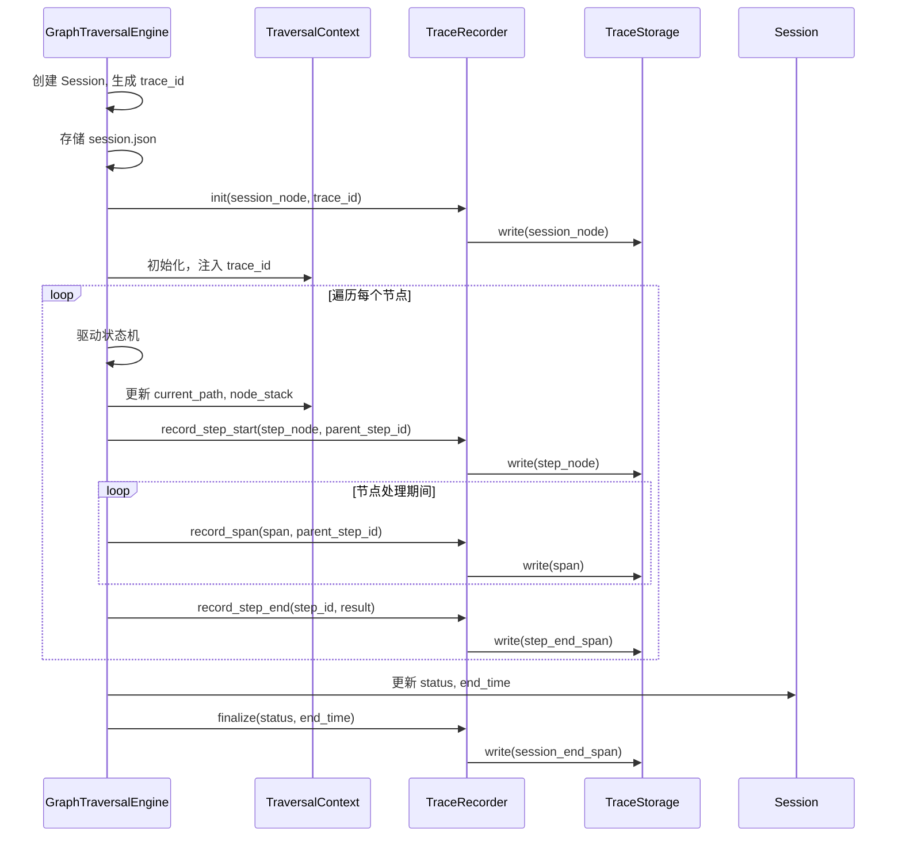

## 系统核心模型集成 Trace 设计文档 (V6.3)

### 1. 概述

本文档定义了车机遍历引擎的核心数据模型（**Session**、**TraversalContext**）以及**Trace 系统**的架构、接口和集成方案。Trace 系统以分布式追踪模式被动记录引擎运行过程中的关键操作，构建一棵统一的调用树。它不参与任何运行时决策，只提供事后审计、回放、分析、仿真验证和断点恢复能力。

**核心原则**：
- **职责分离**：Session 管理任务元数据，Context 负责运行时决策，Trace 负责操作记录。
- **纯追加写入**：Trace 数据仅追加，不修改已写入内容。
- **存储可插拔**：底层存储由 `TraceStorage` 抽象，支持文件系统和内存实现。
- **全局链路追踪**：使用 Span 节点记录完整的组件调用链，支持分布式追踪。
- **分析器重建**：分析时从 Span 流重建树结构、回填状态。
- **仿真可观测**：仿真环境利用 Trace 数据生成可视化报告和验证断言。
- **Span 流恢复**：断点恢复时直接回放 Trace Span 流重建 Context。

### 2. 核心模型定义

#### 2.1 Session

由引擎在遍历开始前创建，独立存储为 `session.json`。

```python
@dataclass
class Session:
    session_id: str              # 全局唯一标识（即 Trace ID）
    device_model: str
    os_version: str
    app_version: str
    start_time: float
    end_time: Optional[float] = None
    status: str = "running"
```

#### 2.2 TraversalContext

运行时工作内存，仅用于状态机、规则引擎的实时决策，不持久化。恢复时通过回放 Trace Span 流重建。

```python
@dataclass
class TraversalContext:
    trace_id: str               # Trace ID（由引擎注入）
    node_stack: List[StackFrame] = field(default_factory=list)
    current_path: List[str] = field(default_factory=list)
    current_page_analysis: Optional[PageAnalysis] = None
    cache_valid: bool = False
    page_tree: Dict[str, PageNode] = field(default_factory=dict)
    current_fingerprint: Optional[str] = None
    visited_pages: Set[str] = field(default_factory=set)
    visited_level1_menus: Set[str] = field(default_factory=set)
    visited_level2_menus: Set[str] = field(default_factory=set)
    action_history: List[ActionRecord] = field(default_factory=list)
    failed_nodes: Dict[str, ErrorRecord] = field(default_factory=dict)
    consecutive_errors: int = 0
    device_experience: Optional[DeviceExperience] = None
    max_depth: int = 10
    completion_policy: CompletionPolicy = field(default_factory=CompletionPolicy)
```

#### 2.3 Trace 节点模型

所有节点均继承自 `TraceNode`，使用 **ULID** 作为唯一标识，支持全局链路追踪。

**术语说明**（行业标准）：
- **Trace ID**：全局 Trace ID，贯穿整个遍历任务，所有节点共享
- **Span ID**：每个节点的唯一标识，标识单个操作单元
- **Parent Span ID**：引用父节点的 Span ID，建立调用链关系

```python
from ulid import ULID

def generate_id() -> str:
    """生成 ULID 格式的唯一标识"""
    return str(ULID())

@dataclass
class TraceNode:
    """Trace 节点基类"""
    span_id: str = ""           # Span ID（当前节点唯一标识）
    trace_id: str = ""          # Trace ID（全局 Trace ID）
    parent_span_id: Optional[str] = None  # Parent Span ID（父节点的 span_id）
    node_type: str = ""         # session / step / span
    timestamp: float = 0.0

@dataclass
class SessionNode(TraceNode):
    device_model: str = ""
    os_version: str = ""
    app_version: str = ""
    start_time: float = 0.0
    end_time: Optional[float] = None
    status: str = "running"

    def __post_init__(self):
        self.node_type = "session"
        # 注意：trace_id 由引擎在创建时设置为 session.session_id
        # 确保根节点的 Span ID 与全局 Trace ID 一致

@dataclass
class StepNode(TraceNode):
    step_id: int = 0
    node_id: str = ""           # 处理的 TraversalNode ID
    page_path: List[str] = field(default_factory=list)
    result: Optional[str] = None   # 由 step_end Span 回填

    def __post_init__(self):
        self.node_type = "step"

@dataclass
class SpanNode(TraceNode):
    """Span 节点 - 分布式追踪的基本单位"""
    span_type: str = ""         # 见 2.4 节
    component: str = ""         # engine / ai_client / external_api / llm / state / action
    data: Dict[str, Any] = field(default_factory=dict)

    def __post_init__(self):
        self.node_type = "span"
```

**树结构与调用链**：
- `SessionNode` 为根，`parent_span_id = null`，所有节点的 `trace_id` 相同。
- `StepNode` 的父子关系由引擎根据 `TraversalContext.node_stack` 深度变化确定。
- `SpanNode` 通过 `parent_span_id` 建立关系：
  - 指向 `StepNode.span_id` → 表示"属于该步骤"
  - 指向另一个 `SpanNode.span_id` → 表示"调用链的一部分"

**示例**：
```
Trace(trace_id="trace_abc123")  # 全局 Trace
└── SessionNode(span_id="span_001", parent_span_id=null)
    └── StepNode(span_id="span_002", parent_span_id="span_001")
        └── SpanNode(span_id="span_003", parent_span_id="span_002")      # 属于 Step
            └── SpanNode(span_id="span_004", parent_span_id="span_003")  # 调用链
                └── SpanNode(span_id="span_005", parent_span_id="span_004") # 调用链
```

#### 2.4 Span 类型详细规范

##### 2.4.1 `state_transition` — 状态转移

```python
data = {
    "from_state": str,
    "to_state": str,
    "state_machine": str,       # "global" / "traversal"
    "node_id": str,             # 可选
    "reason": str               # 可选
}
```

##### 2.4.2 `execution` — 操作执行（含跳过）

```python
data = {
    "action": str,              # "click" / "swipe" / "back" / "input_text" / "no_action" / "skip" 等
    "status": str,              # "success" / "failed" / "skipped" / "timeout"
    "target": str,              # 操作目标
    "target_by": str,           # "text" / "coordinate" / "ui_index"
    "page_before": List[str],
    "page_after": List[str],
    "duration_ms": float,
    "screenshot_ref": str,
    "error_message": str,       # status="failed" 时
    "error_type": str,
    "skip_reason": str,         # status="skipped" 时
    "skip_details": str
}
```

##### 2.4.3 `ai_call` — AI/视觉调用

```python
data = {
    "capability": str,          # "vision_analysis" / "make_decision" / "screen_elements" / "verify_page_type" / "parse_task_to_plan"
    "provider_id": str,
    "mode": str,                # "text" / "vision" / "multimodal"
    "success": bool,
    "input_summary": dict,
    "output_summary": dict,
    "confidence": float,
    "latency_ms": float,
    "input_tokens": int,
    "output_tokens": int,
    "was_accepted": bool,
    "rejection_reason": str,
    "error_message": str,
    # 视觉分析专用
    "page_id": str,
    "page_name": str,
    "page_type": str,
    "element_count": int,
    "has_scroll": bool,
    "is_popup": bool,
    "screenshot_ref": str,
    # 决策专用
    "decision_node_id": str,
    "decision_node_type": str,
    "decision_action": str,
    "decision_target": str,
    "decision_source": str     # "ai_fallback" / "ai_popup" / "ai_branch"
}
```

##### 2.4.4 `error` — 错误

```python
data = {
    "error_type": str,
    "error_message": str,
    "severity": str,            # "info" / "warning" / "error" / "critical" / "fatal"
    "stack_trace": str,
    "node_id": str,
    "page_id": str,
    "context": dict
}
```

##### 2.4.5 `step_end` — 步骤结束

```python
data = {
    "step_id": int,
    "result": str,              # "success" / "failed" / "skipped"
    "total_events": int,
    "duration_ms": float
}
```

##### 2.4.6 `session_end` — 遍历结束

```python
data = {
    "status": str,              # "completed" / "error" / "terminated"
    "end_time": float,
    "total_steps": int,
    "completion_reason": str,   # "natural" / "target_found" / "timeout" / "max_steps" / "error"
    "total_events": int,
    "total_duration_ms": float
}
```

### 3. 组件职责与边界

| 组件 | 职责 | 生命周期 |
|------|------|----------|
| **GraphTraversalEngine** | 创建 Session，初始化 Context，驱动状态机，组装 Span，调用 TraceRecorder，处理恢复 | 遍历任务期间 |
| **Session** | 任务元数据，由引擎创建、存储、更新 | 任务期间 |
| **TraversalContext** | 运行层工作内存，不持久化，恢复时从 Span 流重建 | 任务运行期 |
| **各层组件** | 收集原始指标（token、延迟、结果） | 操作执行时 |
| **TraceRecorder** | 被动接收引擎通知，追加写入节点到存储 | 任务期间 |
| **TraceStorage** | 抽象存储接口，实现节点持久化和读取 | 独立于任务 |
| **TraceAnalyzer** | 从存储读取 Trace 数据，构建树，提取视图（离线/仿真） | 离线 |

**边界约定**：
- Context 不记录完整历史，完整历史由 Trace 记录。
- Trace 不修改 Context。
- Session 元数据独立存储，Trace 树中的 `SessionNode` 是其快照。
- TraceStorage 只提供 `write` 和 `read`。
- 恢复时直接回放 Span 流重建 Context。
- **信息收集在发生的地方，信息组装在引擎层**（分层集成原则）。

### 4. 引擎集成 Trace 方案

#### 4.1 交互序列



#### 4.2 TraceRecorder 接口

```python
class TraceRecorder:
    def __init__(self, storage: TraceStorage):
        self.storage = storage
        self._step_tracker = StepTracker()  # 管理 Step 栈和 parent_span_id

    def init(self, session_node: SessionNode, trace_id: str) -> None:
        """初始化 Session"""
        session_node.trace_id = trace_id
        self.storage.write(session_node)

    def record_step_start(self, step: StepNode, parent_span_id: str) -> None:
        """记录步骤开始"""
        step.parent_span_id = parent_span_id
        self.storage.write(step)
        self._step_tracker.on_node_enter(step.span_id)

    def record_span(self, span: SpanNode, parent_span_id: str) -> None:
        """记录 Span（组件调用）"""
        span.parent_span_id = parent_span_id
        self.storage.write(span)

    def record_step_end(self, step_span_id: str, result: str) -> None:
        """记录步骤结束"""
        span = SpanNode(
            span_id=generate_id(),
            span_type="step_end",
            component="traversal",
            parent_span_id=step_span_id,
            data={"result": result}
        )
        self.storage.write(span)
        self._step_tracker.on_node_exit()

    def finalize(self, status: str, end_time: float, trace_id: str) -> None:
        """结束 Session"""
        span = SpanNode(
            span_id=generate_id(),
            span_type="session_end",
            component="traversal",
            parent_span_id=None,  # Session 级别
            data={"status": status, "end_time": end_time, "trace_id": trace_id}
        )
        self.storage.write(span)
```

**步骤边界**：引擎在 `NODE_SELECT` 后调用 `record_step_start`，在 `BRANCH_COMPLETE` 或 `FRAME_COMPLETE` 后调用 `record_step_end`。引擎根据 `node_stack` 深度变化计算 `parent_span_id`。

**Span 生成时机**：Span ID 在操作开始前生成，可传递给下游组件进行分布式追踪。

#### 4.3 TraceStorage 接口

```python
class TraceStorage(ABC):
    @abstractmethod
    def write(self, node: TraceNode) -> None: ...
    @abstractmethod
    def read(self, trace_id: str) -> List[TraceNode]: ...
```

**实现**：
- **FileStorage**：写入 JSONL 文件 `trace.jsonl`。
- **MemoryStorage**：内存列表，供仿真使用。

### 5. 上下文恢复

引擎回放 Trace Span 流重建 Context：从 `session.init` Span 开始，按序重现所有 Span，逐步恢复 `current_path`、`node_stack`、`visited_pages` 等，然后继续遍历。恢复由引擎直接处理，不通过分析器。

**恢复策略**：支持扩展点，当前实现 FULL 策略（完整恢复）。

### 6. 仿真环境下的可观测数据构建

仿真使用 `MemoryStorage`，引擎正常运行产生 Trace。仿真结束后，通过 `storage.read(trace_id)` 获取节点，调用 `build_tree(nodes)` 重建树，再用 `TraceAnalyzer` 提取视图：

- `extract_page_tree()`：从 StepNode 的 `page_path` 聚合页面层级。
- `extract_state_sequence()`：状态转移序列。
- `extract_span_chain()`：完整的 Span 调用链。
- `extract_ai_calls()`：AI 调用列表（含步骤 `page_path` 和深度）。
- `extract_action_sequence()`：操作执行序列。
- `extract_error_statistics()`：错误统计和分类。
- `extract_time_analysis()`：时间序列分析。
- `extract_coverage_analysis()`：页面覆盖率分析。

#### 6.1 树重建（支持调用链）

```python
def build_tree(nodes: List[TraceNode]) -> Optional[SessionNode]:
    """重建树结构，支持 Span 调用链"""
    # 按 span_id 建立索引
    index = {n.span_id: n for n in nodes}
    children_map = {n.span_id: [] for n in nodes}
    
    for node in nodes:
        # 通过 parent_span_id 建立父子关系
        parent_id = node.parent_span_id
        
        if parent_id and parent_id in index:
            children_map[parent_id].append(node)
            
        # 处理 step_end 和 session_end 的回填
        if isinstance(node, SpanNode):
            if node.span_type == "step_end":
                # 找到对应的 Step
                parent = index.get(node.parent_span_id)
                if isinstance(parent, StepNode):
                    parent.result = node.data.get("result")
            elif node.span_type == "session_end":
                # 找到 Session 并更新
                session = next((s for s in index.values() if isinstance(s, SessionNode)), None)
                if session:
                    session.status = node.data.get("status")
                    session.end_time = node.data.get("end_time")
    
    # 构建树
    root = None
    for n in nodes:
        n.children = children_map.get(n.span_id, [])
        if n.parent_span_id is None:
            root = n
    
    return root
```

### 7. 存储与文件组织

```
traces/{trace_id}/              # 使用 trace_id 作为目录名
├── session.json
├── trace.jsonl
├── screenshots/
└── summary.json
```

### 8. 附录：接口速查

**TraceRecorder**：
- `init(session_node: SessionNode, trace_id: str)`
- `record_step_start(step: StepNode, parent_span_id: str)`
- `record_span(span: SpanNode, parent_span_id: str)`
- `record_step_end(step_span_id: str, result: str)`
- `finalize(status: str, end_time: float, trace_id: str)`

**TraceStorage**：
- `write(node: TraceNode)`
- `read(trace_id: str) -> List[TraceNode]`

**TraceAnalyzer**：
- `extract_page_tree() -> dict`
- `extract_state_sequence() -> list[dict]`
- `extract_span_chain(span_id: str) -> List[SpanNode]`
- `extract_ai_calls() -> list[dict]`
- `extract_action_sequence() -> list[dict]`
- `extract_error_statistics() -> dict`
- `extract_time_analysis() -> dict`
- `extract_coverage_analysis() -> dict`

**引擎恢复**：
- 通过 `TraceStorage.read(trace_id)` 获取 Span 流，按序回放重建 `TraversalContext`。

### 9. 单元测试要求

- **数据模型**：验证各节点构造、序列化、SpanNode 各 span_type 的 data 字段完整性。
- **TraceRecorder**：使用 MemoryStorage，验证 init、步骤周期、finalize 写入正确，parent_span_id 传递正确。
- **TraceStorage**：MemoryStorage 写入后按 trace_id 读取验证；FileStorage 验证文件存在及可解析。
- **树重建**：准备含 step_end 和 session_end 的 Span，验证结果回填、父子关系和调用链。
- **分析器**：验证 extract_page_tree、extract_span_chain 等返回正确的结构和路径。
- **仿真集成**：用模拟引擎生成 Trace，通过分析器提取视图，与预期对比。

所有测试在 CI 中自动运行，通过后方可合并。

---

## 10. 设计决策摘要（V6.3 补充）

### 10.1 TraversalContext 统一策略

采用分层使用方式，区分可变和不可变场景：

| 类 | 可变性 | 用途 |
|---|---|---|
| `TraversalRuntimeContext` | 可变 | 引擎内部运行时状态 |
| `TraversalContext` | frozen=True | 传给 AI 顾问，只读 |

```python
@dataclass
class TraversalRuntimeContext:
    """可变运行时上下文，引擎使用"""
    node_stack: List[str] = field(default_factory=list)
    visited_pages: Set[str] = field(default_factory=set)
    # ... PRD_V6_3 定义的所有字段

    def to_readonly(self) -> TraversalContext:
        """转换为不可变版本传给 AI"""
        return TraversalContext(
            node_stack=tuple(self.node_stack),
            visited_pages=frozenset(self.visited_pages),
        )

@dataclass(frozen=True)
class TraversalContext:
    """只读上下文，传给 AI 顾问"""
    node_stack: Tuple[str, ...]
    visited_pages: FrozenSet[str, ...]
```

### 10.2 Context 恢复策略

预留策略扩展点，当前实现 FULL 策略：

```python
class RecoveryStrategy(str, Enum):
    FULL = "full"           # 完整恢复（当前实现）
    REPLAY = "replay"       # 回放恢复（未来）
    MINIMAL = "minimal"     # 最小恢复（未来）

class ContextRebuilder:
    def rebuild(self, spans: List[SpanNode], trace_id: str,
                 strategy: RecoveryStrategy = RecoveryStrategy.FULL) -> TraversalRuntimeContext:
        """从 Span 流重建 Context"""
        # 设置 trace_id
        context = TraversalRuntimeContext()
        context.trace_id = trace_id
        
        if strategy == RecoveryStrategy.FULL:
            return self._rebuild_full(spans, context)
        else:
            raise NotImplementedError(f"策略 {strategy} 暂未实现")
```

**FULL 策略恢复内容**：
- 必须恢复：`current_path`, `node_stack`, `visited_pages`, `visited_nodes`
- 可选恢复：`action_history`, `failed_nodes`, `consecutive_errors`
- 不恢复：`page_tree`, `current_page_analysis`, `page_cache`（可按需重建）

### 10.3 Span 验证策略

采用选择性验证：

| 字段类型 | 策略 | 示例 |
|---------|------|------|
| 内部字段 | 严格验证 | `from_state`, `to_state`, `action`, `status` |
| 外部字段 | 不验证 | `confidence`, `output_summary`, `stack_trace` |

```python
INTERNAL_FIELDS = {
    "state_transition": ["from_state", "to_state", "state_machine"],
    "execution": ["action", "status", "page_before", "page_after"],
    "step_end": ["step_id", "result"],
    "session_end": ["status", "end_time"],
}
```

### 10.4 parent_span_id 计算规则

- **创建时机**：`NODE_SELECT` 状态转换时创建新 StepNode
- **栈管理**：
  - `NODE_SELECT` → 压栈，parent = 栈顶
  - `FRAME_COMPLETE` → 弹栈
  - parent_span_id = 栈顶元素的 span_id

```python
class StepTracker:
    """管理 Step 栈和 parent_span_id"""
    def __init__(self):
        self.stack: List[str] = []  # 存储的是 span_id
    
    def on_node_enter(self, span_id: str) -> None:
        """节点进入时压栈"""
        self.stack.append(span_id)
    
    def on_node_exit(self) -> None:
        """节点退出时弹栈"""
        if self.stack:
            self.stack.pop()
    
    def get_parent_span_id(self) -> Optional[str]:
        """获取当前父 span_id"""
        return self.stack[-1] if self.stack else None
```

### 10.5 引擎集成策略

分层集成原则：

```
低层组件（数据收集）
├── 执行实际操作
├── 收集原始指标
└── 返回结果 + 指标

引擎层（Trace 组装）
├── 汇总各层数据
├── 组装完整 Span
└── 调用 TraceRecorder

TraceRecorder（被动记录）
└── 只负责写入
```

| Span 类型 | 数据收集者 | 组装者 |
|-----------|-----------|--------|
| `state_transition` | StateMachine | Engine |
| `ai_call` | AIClient | Engine |
| `execution` | ActionExecutor | Engine |
| `error` | ExceptionChain | Engine |

### 10.6 截图处理机制

| 设计点 | 方案 |
|--------|------|
| 截图时机 | 页面变化 + 失败时 + 可配置 |
| 引用格式 | ID 映射（`screenshot_ref = "s_abc123"`） |
| 存储位置 | `traces/{trace_id}/screenshots/` |
| 映射文件 | `screenshots/index.json` |
| 清理策略 | 外部脚本处理 |

### 10.7 Session 模型统一

合并现有 SessionInfo 和 PRD Session 定义：

```python
@dataclass
class Session:
    """统一的遍历会话元数据"""
    session_id: str              # 这将成为全局 Trace ID
    device_id: Optional[str] = None
    device_name: Optional[str] = None
    device_model: str = ""
    os_version: str = ""
    app_version: Optional[str] = None
    app_package: Optional[str] = None
    start_time: float = 0.0
    end_time: Optional[float] = None
    status: str = "running"
    traversal_mode: str = "graph"
    config: Dict[str, Any] = field(default_factory=dict)

# 用途分离
# - Session: 存储到 traces/{trace_id}/session.json
# - SessionNode: Trace 树中的快照（从 Session 创建）
#   - SessionNode.trace_id = Session.session_id（全局 Trace ID）
#   - SessionNode.span_id 由引擎生成（根节点的 Span ID）
```

### 10.8 TraceStorage 实现

| 实现 | 设计要点 |
|------|----------|
| **FileStorage** | 队列缓冲 + 后台写入线程，非阻塞 write() |
| **MemoryStorage** | 简单内存存储，无锁（仿真单线程） |

```python
class FileStorage(TraceStorage):
    def __init__(self, session_dir: Path, buffer_size: int = 100):
        self._queue: queue.Queue = queue.Queue(maxsize=buffer_size)
        self._writer_thread = Thread(target=self._writer_loop, daemon=True)
```

### 10.9 TraceAnalyzer 功能扩展

除 PRD 原有功能外，增加：

| 新功能 | 说明 |
|--------|------|
| `extract_error_statistics()` | 错误统计（按类型、严重度、页面） |
| `extract_time_analysis()` | 时间分析（总耗时、百分位、最慢步骤） |
| `extract_coverage_analysis()` | 覆盖率（总页面数、访问率、热力图） |

### 10.10 错误处理策略

Trace 写入失败采用"日志继续"策略：

```python
def record_span(self, span: SpanNode, parent_span_id: str) -> None:
    try:
        span.parent_span_id = parent_span_id
        self.storage.write(span)
    except Exception as e:
        logger.warning(f"Span 写入失败: {e}, span_id={span.span_id}")
        # 不抛异常，继续执行
```

**原则**：Trace 是辅助功能，写入失败不应中断主流程。

---

## 11. 架构总结

### 11.1 数据流

```
组件层 → 引擎层 → TraceRecorder → TraceStorage

组件层：
├── AIClient: 收集 token、延迟
├── ActionExecutor: 收集执行结果、截图
└── StateMachine: 收集状态转换

引擎层 (GraphTraversalEngine)：
├── 汇总各层数据
├── 组装完整 SpanNode
└── 调用 TraceRecorder

TraceRecorder：
├── 接收已组装的 Span
├── 计算 parent_span_id
└── 调用 Storage.write()

TraceStorage：
├── FileStorage: 队列缓冲 → 文件
└── MemoryStorage: 直接写入内存
```

### 11.2 文件组织

```
traces/{trace_id}/            # 使用 Trace ID 作为目录名
├── session.json              # Session 元数据（完整）
├── trace.jsonl               # Trace 节点流（追加写入）
├── screenshots/
│   ├── index.json            # ID 映射
│   ├── {context}_{timestamp}.png
│   └── ...
└── summary.json              # 可选：分析报告
```

---

## 12. V6.3 分布式追踪设计

### 12.1 核心变更

| 原设计 | 新设计 (V6.3) | 说明 |
|--------|---------------|------|
| `EventNode` | `SpanNode` | 对齐分布式追踪术语 |
| `event_type` | `span_type` | 类型字段重命名 |
| `record_event` | `record_span` | 接口方法重命名 |
| UUID | **ULID** | 可排序的唯一标识 |
| 扁平事件 | **调用链** | 支持组件层级追踪 |
| `session_id` | **trace_id** | Trace ID（全局） |
| `trace_id` | **span_id** | Span ID（节点） |
| `parent_trace_id` | **parent_span_id** | Parent Span ID（调用链） |

### 12.2 标准术语（行业一致）

| 术语 | 定义 | 范围 |
|------|------|------|
| **Trace ID** | 一次完整遍历任务的唯一标识，贯穿整个调用链 | 所有节点共享相同的 trace_id |
| **Span ID** | 单个操作单元的唯一标识，标识自身 | 每个节点有唯一的 span_id |
| **Parent Span ID** | 引用父节点的 Span ID，建立调用链关系 | 指向父节点的 span_id |

### 12.3 Span 节点模型

```python
@dataclass
class SpanNode(TraceNode):
    """Span 节点 - 分布式追踪的基本单位"""
    span_id: str = ""           # Span ID（当前节点唯一标识）
    trace_id: str = ""          # Trace ID（全局 Trace ID）
    parent_span_id: Optional[str] = None  # Parent Span ID
    span_type: str = ""         # state_transition / ai_call / execution / error / step_end / session_end
    component: str = ""         # engine / ai_client / external_api / llm / state / action / traversal
    data: Dict[str, Any] = field(default_factory=dict)
    
    def __post_init__(self):
        self.node_type = "span"
```

### 12.4 关系模型

所有节点通过 `parent_span_id` 建立统一的父子关系：

```
SessionNode(span_id="span_001", parent_span_id=null, trace_id="trace_abc")
└── StepNode(span_id="span_002", parent_span_id="span_001", trace_id="trace_abc")
    └── SpanNode(span_id="span_003", parent_span_id="span_002", trace_id="trace_abc")  # 属于 Step
        └── SpanNode(span_id="span_004", parent_span_id="span_003", trace_id="trace_abc")  # 调用链
            └── SpanNode(span_id="span_005", parent_span_id="span_004", trace_id="trace_abc")  # 调用链
```

**关系含义**：
- `parent_span_id` 指向 `SessionNode/StepNode` → 属于该任务/步骤
- `parent_span_id` 指向另一个 `SpanNode` → 调用链的一部分

### 12.5 ULID 标识符

使用 **ULID** (Universally Unique Lexicographically Sortable Identifier)：

```python
from ulid import ULID

def generate_id() -> str:
    """生成 ULID 格式的唯一标识"""
    return str(ULID())
```

**特性**：
- 26 字符（Base32 编码）
- 按字典序可排序（按时间）
- 全局唯一（128 位随机性）
- URL 安全

### 12.6 Span ID 生成时机

| 组件 | 生成时机 | 目的 |
|------|----------|------|
| SessionNode | 遍历开始前 | 作为整个 Trace 的根 |
| StepNode | NODE_SELECT 时 | 标记步骤开始 |
| SpanNode (父) | 发起操作前 | 可传递给下游追踪 |
| SpanNode (子) | 子操作开始前 | 形成调用链 |

**原则**：Span ID 在操作开始前生成，可传递给下游组件进行分布式追踪。

### 12.7 组件调用链示例

```
Engine发起 AI 分析
└── SpanNode(span_id="span_engine", parent_span_id="span_step", trace_id="trace_abc")
    └── AIClient 调用 OCR
        └── SpanNode(span_id="span_client", parent_span_id="span_engine", trace_id="trace_abc")
            └── 外部 API 调用
                └── SpanNode(span_id="span_api", parent_span_id="span_client", trace_id="trace_abc")
```

### 12.8 兼容性策略

**不兼容**：新系统与现有 Trace 系统不兼容。

```
旧系统 (V6.2)
├── TraceStep, TraceRecorder
└── traces/trace_YYYYMMDD_HHMMSS/  ← 归档

新系统 (V6.3)
├── SessionNode, StepNode, SpanNode
└── traces/{trace_id}/  ← 新格式
```

**实施方式**：
- 旧 trace 归档到 `traces/archive/`
- 新工具只读取新格式
- 旧工具仍可访问归档数据