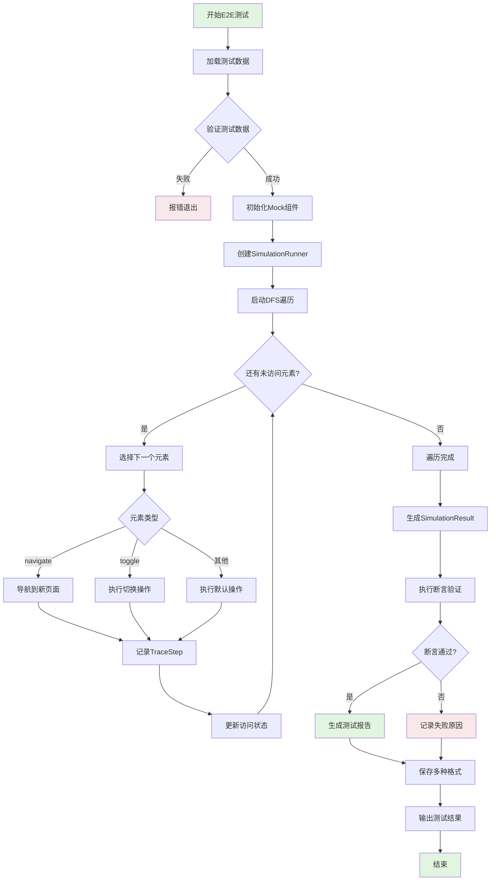
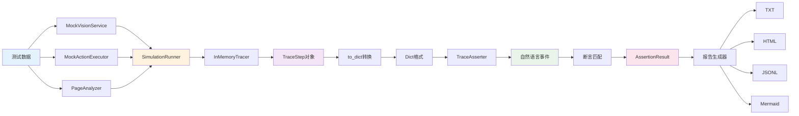
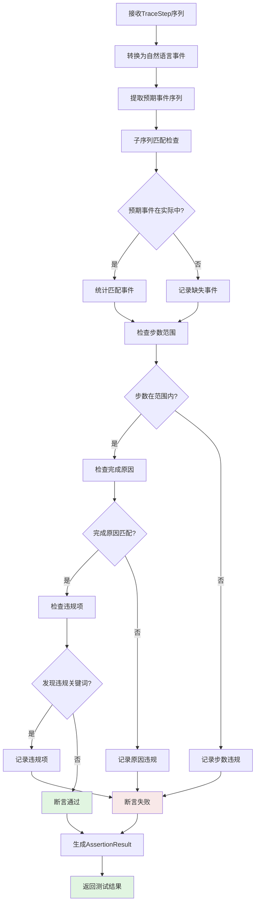
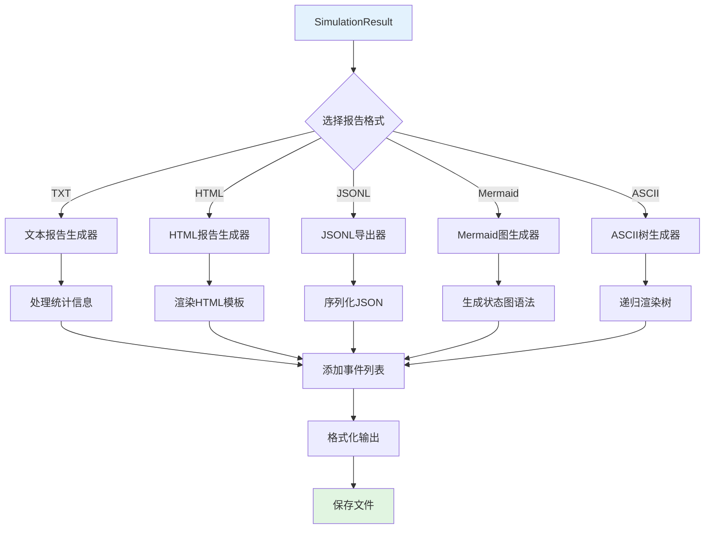
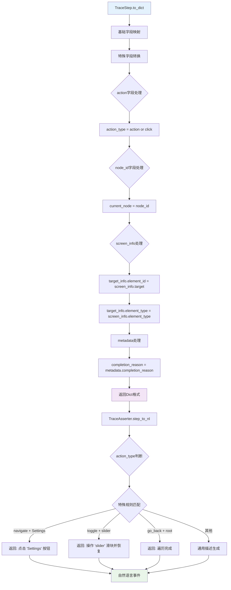
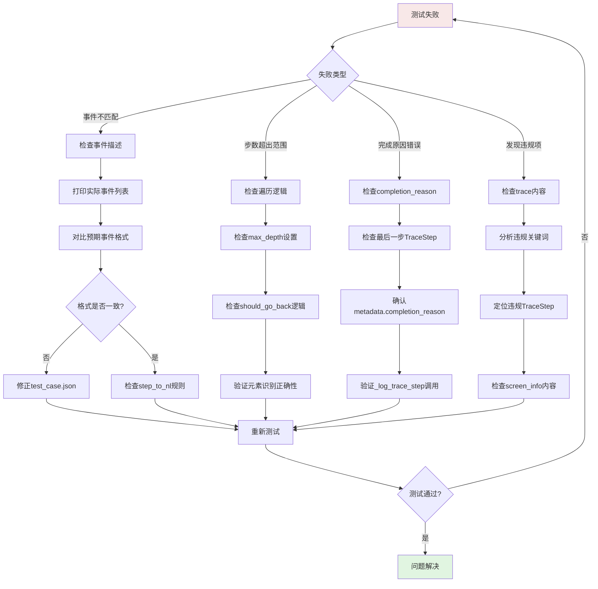

# E2E测试执行流程图

## 主流程



## 数据转换流程



## 断言验证流程



## 报告生成流程



## DFS遍历算法流程

```mermaid
graph TD
    A[开始DFS遍历] --> B[初始化: current_path = [], visited = {}]
    B --> C[访问root节点]
    
    C --> D{遍历深度 < max_depth?}
    D -->|否| E[触发go_back]
    D -->|是| F{当前页面有未访问元素?}
    
    E --> Q{path栈为空?}
    Q -->|是| R[遍历完成]
    Q -->|否| S[弹出栈顶元素]
    S --> T[更新current_path]
    T --> D
    
    F -->|否| E
    F -->|是| G[获取下一个未访问元素]
    
    G --> H{元素类型判断}
    H -->|navigate| I[current_path.append元素名]
    H -->|toggle| J[执行切换操作]
    H -->|其他| K[执行默认操作]
    
    I --> L[记录navigate事件]
    J --> M[记录toggle事件]
    K --> N[记录action事件]
    
    L --> O[标记元素已访问]
    M --> O
    N --> O
    
    O --> P[返回D继续遍历]
    P --> D
    
    R --> S1[返回遍历结果]
    
    style A fill:#e1f5e1
    style R fill:#e1f5e1
    style S1 fill:#e1f5e1
    style E fill:#fff3e0
```

## 事件转换规则流程



## 测试失败诊断流程



## 关键决策点

### 1. 遍历决策
```
should_go_back() 判断:
├── 深度 >= max_depth? → YES, 返回
├── 所有元素已访问? → YES, 返回
├── 存在可交互元素? → NO, 返回
└── 默认 → NO, 继续深入
```

### 2. 事件描述规则优先级
```
step_to_nl() 决策:
├── 特殊规则匹配 → navigate+Settings → "点击 'Settings' 按钮"
├── 通用动作处理 → toggle+restore → "操作 'X' 并恢复"
├── 状态特殊处理 → go_back+root → "遍历完成"
└── 默认描述 → action_type + current_node
```

### 3. 报告格式选择
```
报告格式决策:
├── 调试阶段 → TXT + ASCII (快速查看)
├── 演示阶段 → HTML + Mermaid (可视化)
├── 数据分析 → JSONL (机器处理)
└── 存档阶段 → 全部格式 (完整记录)
```

---

**使用说明**: 这些流程图展示了E2E测试系统的核心流程和决策逻辑，可以帮助理解系统运作机制。配合 [TESTING_ARCHITECTURE.md](TESTING_ARCHITECTURE.md) 和 [TESTING_QUICK_REFERENCE.md](TESTING_QUICK_REFERENCE.md) 使用效果更佳。