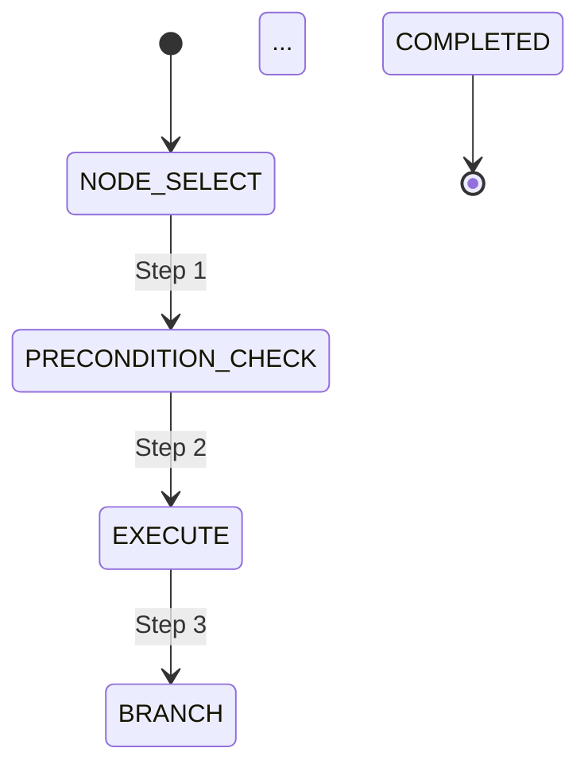

# Uni-Claw Architecture: Graph-Based Traversal Framework

> **Version**: V6.3
> **Status**: Production
> **Last Updated**: 2026-06-08
> **Project**: Uni-Claw - AI-driven Mobile UI Automation Traversal Framework

## Overview

Uni-Claw is a modular, testable mobile application UI automation traversal framework that combines AI vision analysis with ADB control for intelligent app interface exploration.

### Core Capabilities

- **AI Vision Analysis**: Multiple vision services (Claude, MiMo) for screen content understanding
- **ADB Device Control**: Precise device interaction via Android Debug Bridge
- **Intelligent State Management**: Cache support with breakpoint recovery
- **Exception Handling**: Comprehensive error recovery mechanisms
- **Observability**: Distributed tracing, metrics collection, and logging
- **Simulation Testing**: Zero-cost testing framework with V6+ enhancements

### V6 Architecture

V6 introduces a declarative, testable graph-based traversal framework with simulation capabilities. The architecture separates concerns between plan definition, execution, and testing.

## Design Goals

1. **Declarative Plans**: Define traversal behavior through data, not code
2. **Testability**: Full test coverage without physical devices
3. **Observability**: Complete trace recording and visualization
4. **State Machine Clarity**: Explicit state transitions for all execution paths

## Architecture Diagram

```
┌─────────────────────────────────────────────────────────────┐
│                        TraversalPlan                          │
│  ┌──────────────┐  ┌───────────────┐  ┌──────────────────┐ │
│  │ EntryPolicy  │  │ CompletionPol │  │  Root Node       │ │
│  │              │  │               │  │  + Children      │ │
│  └──────────────┘  └───────────────┘  │  + ExitCond     │ │
│                                       └──────────────────┘ │
└─────────────────────────────────────────────────────────────┘
                              │
                              ▼
┌─────────────────────────────────────────────────────────────┐
│                    GraphTraversalEngine                       │
│  ┌──────────────────────────────────────────────────────┐  │
│  │            TraversalStateMachine                       │  │
│  │  ┌──────────┐  ┌──────────┐  ┌──────────────────┐   │  │
│  │  │ FRAME_   │  │ ERROR_   │  │  POPUP_          │   │  │
│  │  │ COMPLETE │  │ HANDLING │  │  HANDLING        │   │  │
│  │  └──────────┘  └──────────┘  └──────────────────┘   │  │
│  └──────────────────────────────────────────────────────┘  │
│  ┌──────────────────────────────────────────────────────┐  │
│  │         Components                                    │  │
│  │  • VisionService (real or mock)                     │  │
│  │  • ActionExecutor (real or mock)                    │  │
│  │  • TraceRecorder                                    │  │
│  └──────────────────────────────────────────────────────┘  │
└─────────────────────────────────────────────────────────────┘
                              │
                              ▼
┌─────────────────────────────────────────────────────────────┐
│                    Simulation Mode                           │
│  ┌──────────────┐  ┌───────────────┐  ┌──────────────────┐ │
│  │ MockVision   │  │ MockAction    │  │ InMemoryTracer   │ │
│  │ Service      │  │ Executor      │  │                  │ │
│  └──────────────┘  └───────────────┘  └──────────────────┘ │
│  ┌──────────────────────────────────────────────────────┐  │
│  │  Visualization Outputs                               │  │
│  │  • ASCII Tree                                         │  │
│  │  • Mermaid State Diagram                              │  │
│  │  • HTML Report                                        │  │
│  │  • JSONL Trace                                       │  │
│  └──────────────────────────────────────────────────────┘  │
└─────────────────────────────────────────────────────────────┘
```

## Core Components

### 1. TraversalPlan

**Location**: `src/graph/plan.py`

Defines the complete traversal strategy in a declarative format:

```python
@dataclass
class TraversalPlan:
    entry_app: str
    entry_policy: EntryPolicy
    root_node: TraversalNode
    static_nodes: Dict[str, TraversalNode]
    mode: TraversalMode
    completion_policy: CompletionPolicy
```

**Key Features**:
- JSON serialization/deserialization
- Static node registry for ID references
- Multiple traversal modes (HYBRID, CONCRETE, ABSTRACT)

### 2. GraphTraversalEngine

**Location**: `src/traversal/graph_engine.py`

Executes TraversalPlan using state machine-driven control:

```python
class GraphTraversalEngine:
    def initialize(self, plan: TraversalPlan) -> None
    def run(self) -> TraversalResult
    def generate_children(self, node: TraversalNode) -> List[TraversalNode]
    def update_page_cache(self, path: str, analysis: PageAnalysis) -> None
```

**Responsibilities**:
- Entry strategy execution (COLD_LAUNCH, DIRECT_DEEPLINK, BIND_CURRENT_SCREEN)
- Depth-limited traversal
- Page cache management
- Completion policy checking

### 3. TraversalStateMachine Extensions

**Location**: `src/state_machine/traversal_fsm.py`

New states for V6:

| State | Description | Entry From |
|-------|-------------|------------|
| `FRAME_COMPLETE` | Container frame finished, decide fallback | EXECUTE |
| `ERROR_HANDLING` | Three-layer error handling | Any state on error |
| `POPUP_HANDLING` | Popup detection and resolution | Any state on popup |

**Fallback Actions**:
- `BACK`: Execute back navigation
- `AUTO_ESCAPE`: Try sibling menu, else back
- `SKIP`: Skip without action
- `ABORT`: Terminate traversal

### 4. Simulation Components

#### MockVisionService

**Location**: `src/simulation/mock_vision.py`

Provides virtual page analysis without device:

```python
class MockVisionService:
    def __init__(self, virtual_pages: Dict[str, PageAnalysis])
    def analyze_screenshot(self) -> PageAnalysis
    def inject_path(self, path: str)
```

#### MockActionExecutor

**Location**: `src/simulation/mock_action.py`

Records actions without device interaction:

```python
class MockActionExecutor:
    def tap(self, x: float, y: float) -> bool
    def swipe(self, start, end) -> bool
    def press_back(self) -> bool
    def get_history(self) -> List[ActionRecord]
```

#### InMemoryTracer

**Location**: `src/simulation/visualizer.py`

Records and visualizes traces:

```python
class InMemoryTracer:
    def record_transition(self, transition) -> None
    def render_tree(self) -> str
    def render_mermaid(self) -> str
    def export_trace(self, format: str) -> str
```

### 5. Visualization Outputs

**ASCII Tree**:
```
Settings Home [container] ✓
├── Wi-Fi Settings [screen] ✓
│   ├── HomeNetwork [leaf] ✓
│   ├── OfficeWiFi [leaf] ✓
│   └── GuestNetwork [leaf] ✓
├── Bluetooth Settings [screen] ✓
│   ├── Headphones Pro [leaf] ✓
│   └── Speaker Mini [leaf] ✓
└── Display Settings [screen] ✓
    └── Brightness [leaf] ✓
```

**Mermaid Diagram**:


## Data Flow

### Production Flow

```
TraversalPlan.json
       │
       ▼
GraphTraversalEngine.initialize()
       │
       ├─→ EntryStrategy.execute()
       │
       ├─→ TraceRecorder.start_session()
       │
       └─→ run()
            │
            └─→ loop:
                 ├─→ TraversalStateMachine.step()
                 ├─→ VisionService.analyze_screenshot()
                 ├─→ ActionExecutor.execute()
                 ├─→ TraceRecorder.record_transition()
                 └─→ CompletionPolicy.check()
```

### Simulation Flow

```
TraversalPlan.json
       │
       ▼
SimulationRunner.__init__(virtual_pages, plan)
       │
       ├─→ MockVisionService(virtual_pages)
       ├─→ MockActionExecutor()
       └─→ InMemoryTracer()
       │
       ▼
run()
       │
       ├─→ Execute simulation
       └─→ Generate visualizations
            │
            ├─→ render_tree()
            ├─→ render_mermaid()
            └─→ export_trace()
```

## State Machine Details

### FRAME_COMPLETE Handling

```
EXECUTE (all children visited)
       │
       ▼
FRAME_COMPLETE
       │
       ├─→ ExitCondition.fallback == BACK
       │       └─→ ActionExecutor.press_back() → NODE_SELECT
       │
       ├─→ ExitCondition.fallback == AUTO_ESCAPE
       │       └─→ Try sibling menu → EXECUTE
       │       └─→ No sibling → press_back() → NODE_SELECT
       │
       ├─→ ExitCondition.fallback == SKIP
       │       └─→ Pop stack → NODE_SELECT
       │
       └─→ ExitCondition.fallback == ABORT
               └─→ COMPLETED → [*]
```

### ERROR_HANDLING Layers

```
ERROR (any state)
       │
       ▼
ERROR_HANDLING
       │
       ├─→ Layer 1: Node.error_policy
       │       └─→ Apply node-level error handling
       │
       ├─→ Layer 2: ExceptionHandlingChain
       │       └─→ Apply configured handlers
       │
       └─→ Layer 3: AI Exception Handling (reserved)
               └─→ Call AI for recovery decision
```

### POPUP_HANDLING Flow

```
POPUP_DETECTED (any state)
       │
       ▼
POPUP_HANDLING
       │
       ├─→ Find cancel button
       │       └─→ Found → tap() → PREVIOUS_STATE
       │
       ├─→ Try back navigation
       │       └─→ Success → PREVIOUS_STATE
       │
       └─→ AI decision (reserved)
               └─→ Call AI for handling strategy
```

## Testing Strategy

### Unit Tests

**Location**: `tests/v6/`

- `test_graph_models.py`: Plan and node models
- `test_state_machine.py`: State transitions and handlers
- `test_executor.py`: GraphTraversalEngine
- `test_simulation.py`: Mock components
- `test_examples.py`: End-to-end scenarios

### Fixture Data

**Location**: `tests/v6/fixtures/`

- `plan_all.json`: Full menu traversal plan
- `pages_all.json`: Virtual page data
- `plan_find_version.json`: Target search plan
- `pages_find.json`: Target search pages
- `plan_static.json`: Static path plan

### Coverage Goals

- Unit tests: >80% coverage
- E2E tests: All major scenarios
- Visualization tests: All output formats

## Integration Points

### With Existing Components

| Component | Integration Method |
|-----------|-------------------|
| `VisionService` | MockVisionService implements same interface |
| `ADBClient` | MockActionExecutor replaces for simulation |
| `TraceRecorder` | InMemoryTracer adds visualization on top |
| `TraversalContext` | Extended with V6 fields (page_cache, max_depth, etc.) |

### Compatibility

- **Backward Compatible**: All existing V5 components work unchanged
- **Optional**: Simulation mode is opt-in
- **Non-Breaking**: New fields in TraversalContext have defaults

## Performance Considerations

### Memory Usage

- Trace recording: ~1KB per step
- Virtual pages: ~5KB per page
- InMemoryTracer: O(steps) for storage

### Execution Speed

- Simulation: ~1000 steps/second (vs ~1 step/second real device)
- Trace rendering: <100ms for 1000 steps
- Mermaid generation: <50ms

### Optimization Points

- Page cache TTL: Configurable (default 5 minutes)
- Trace buffer size: Configurable (default 1000 steps)
- Visualization depth limit: Configurable (default unlimited)

## Future Enhancements

### V6.1 Potential Features

1. **Real-time Trace Streaming**: Websocket-based live updates
2. **Diff Visualization**: Compare two traces side-by-side
3. **Performance Profiling**: Step timing analysis
4. **Custom Visualizers**: Plugin architecture for outputs

### V7.0 Direction

1. **Concurrent Traversal**: Multiple device simulation
2. **ML-Based Planning**: AI-generated traversal plans
3. **Replay Capability**: Re-execute traces with modifications
4. **Cloud Execution**: Distributed simulation

## References

- **PRD V6**: [docs/superpowers/specs/2026-06-02-v6-executor-state-machine-simulator.md](../docs/superpowers/specs/2026-06-02-v6-executor-state-machine-simulator.md)
- **OpenSpec Change**: [openspec/changes/v6-executor-state-machine-simulator/](../openspec/changes/v6-executor-state-machine-simulator/)
- **Test Suite**: [tests/v6/](../tests/v6/)
