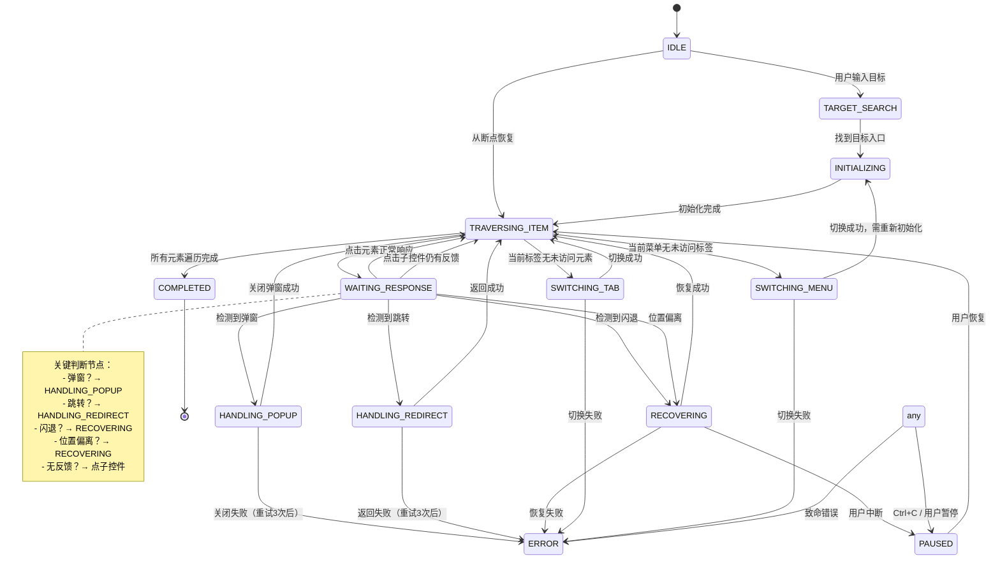

# ADB 遍历工具状态机设计

> 补充 PRD：明确状态转换规则，确保遍历过程的可控性和可恢复性

---

## 一、状态定义

### 主状态枚举

```python
enum TraversalState:
    IDLE                # 空闲，等待开始
    TARGET_SEARCH       # 搜索目标入口
    INITIALIZING        # 初始化结构树
    TRAVERSING_ITEM     # 遍历内容元素
    WAITING_RESPONSE    # 等待点击响应
    HANDLING_POPUP      # 处理弹窗
    HANDLING_REDIRECT   # 处理页面跳转
    RECOVERING          # 恢复位置（闪退/偏离后）
    SWITCHING_TAB       # 切换二级标签
    SWITCHING_MENU      # 切换一级菜单
    COMPLETED           # 遍历完成
    ERROR               # 错误状态
    PAUSED              # 暂停（断点续跑）
```

---

## 二、状态转换图



---

## 三、状态转换条件表

| 当前状态 | 事件 | 转换条件 | 目标状态 |
|----------|------|----------|----------|
| IDLE | 用户输入目标 | 输入非空 | TARGET_SEARCH |
| IDLE | 加载状态文件 | 有有效断点 | TRAVERSING_ITEM |
| TARGET_SEARCH | AI 分析 | 找到目标入口 | INITIALIZING |
| TARGET_SEARCH | AI 分析 | 未找到目标 | ERROR |
| INITIALIZING | 初始化完成 | 结构树建立 | TRAVERSING_ITEM |
| TRAVERSING_ITEM | 选择元素 | 有未访问元素 | WAITING_RESPONSE |
| TRAVERSING_ITEM | 选择元素 | 当前标签无元素 | SWITCHING_TAB |
| TRAVERSING_ITEM | 选择元素 | 当前菜单无标签 | SWITCHING_MENU |
| TRAVERSING_ITEM | 选择元素 | 全部完成 | COMPLETED |
| WAITING_RESPONSE | AI 分析 | 弹窗出现 | HANDLING_POPUP |
| WAITING_RESPONSE | AI 分析 | 页面跳转 | HANDLING_REDIRECT |
| WAITING_RESPONSE | AI 分析 | APP 闪退 | RECOVERING |
| WAITING_RESPONSE | AI 分析 | 位置偏离 | RECOVERING |
| WAITING_RESPONSE | AI 分析 | 正常变化 | TRAVERSING_ITEM |
| WAITING_RESPONSE | AI 分析 | 无变化（有子控件） | WAITING_RESPONSE |
| WAITING_RESPONSE | AI 分析 | 无变化（无子控件） | TRAVERSING_ITEM |
| HANDLING_POPUP | 关闭操作 | 成功 | TRAVERSING_ITEM |
| HANDLING_POPUP | 关闭操作 | 失败（<3次） | HANDLING_POPUP |
| HANDLING_POPUP | 关闭操作 | 失败（>=3次） | ERROR |
| HANDLING_REDIRECT | 返回操作 | 成功 | TRAVERSING_ITEM |
| HANDLING_REDIRECT | 返回操作 | 失败（<3次） | HANDLING_REDIRECT |
| HANDLING_REDIRECT | 返回操作 | 失败（>=3次） | ERROR |
| RECOVERING | 恢复操作 | 成功 | TRAVERSING_ITEM |
| RECOVERING | 恢复操作 | 失败（<3次） | RECOVERING |
| RECOVERING | 恢复操作 | 失败（>=3次） | ERROR |
| SWITCHING_TAB | 切换操作 | 成功 | TRAVERSING_ITEM |
| SWITCHING_TAB | 切换操作 | 失败 | ERROR |
| SWITCHING_MENU | 切换操作 | 成功 | INITIALIZING |
| SWITCHING_MENU | 切换操作 | 失败 | ERROR |
| any | 用户中断 | - | PAUSED |
| any | 致命错误 | - | ERROR |

---

## 四、每个状态的行为规范

### IDLE（空闲）
- **能做什么**：接受用户输入、加载状态文件
- **不能做什么**：执行任何 ADB 操作
- **进入条件**：程序启动、遍历完成
- **退出条件**：用户输入目标 / 加载断点

### TARGET_SEARCH（搜索目标）
- **能做什么**：截图、AI 识别、点击目标入口
- **不能做什么**：修改内容树
- **进入条件**：用户输入目标
- **退出条件**：找到目标 / 未找到

### INITIALIZING（初始化）
- **能做什么**：全量分析、建立结构树骨架、切换到起点
- **不能做什么**：遍历内容元素
- **进入条件**：找到目标入口 / 切换一级菜单
- **退出条件**：初始化完成

### TRAVERSING_ITEM（遍历元素）
- **能做什么**：选择下一个元素、点击、更新 visited
- **不能做什么**：切换菜单/标签
- **进入条件**：初始化完成 / 响应处理完成
- **退出条件**：点击元素 / 无更多元素

### WAITING_RESPONSE（等待响应）
- **能做什么**：等待、截图、AI 分析
- **不能做什么**：选择新元素
- **进入条件**：点击元素
- **退出条件**：AI 分析完成

### HANDLING_POPUP（处理弹窗）
- **能做什么**：点击关闭按钮、记录弹窗
- **不能做什么**：遍历其他元素
- **进入条件**：检测到弹窗
- **退出条件**：关闭成功/失败

### HANDLING_REDIRECT（处理跳转）
- **能做什么**：点击返回、记录跳转
- **不能做什么**：遍历跳转页内容
- **进入条件**：检测到页面跳转
- **退出条件**：返回成功/失败

### RECOVERING（恢复位置）
- **能做什么**：重启 APP、按路径恢复、重试点击
- **不能做什么**：遍历新元素
- **进入条件**：闪退 / 位置偏离
- **退出条件**：恢复成功/失败

### SWITCHING_TAB（切换标签）
- **能做什么**：点击下一个二级标签
- **不能做什么**：遍历内容
- **进入条件**：当前标签无未访问元素
- **退出条件**：切换成功/失败

### SWITCHING_MENU（切换菜单）
- **能做什么**：点击下一个一级菜单
- **不能做什么**：遍历内容
- **进入条件**：当前菜单无未访问标签
- **退出条件**：切换成功/失败

### COMPLETED（完成）
- **能做什么**：导出结构树
- **不能做什么**：任何遍历操作
- **进入条件**：所有元素遍历完成
- **退出条件**：程序退出

### ERROR（错误）
- **能做什么**：记录错误、保存状态
- **不能做什么**：继续遍历
- **进入条件**：任何致命错误
- **退出条件**：程序退出

### PAUSED（暂停）
- **能做什么**：保存状态
- **不能做什么**：任何 ADB 操作
- **进入条件**：用户中断（Ctrl+C）
- **退出条件**：用户恢复

---

## 五、状态持久化

### 保存时机
- 进入 PAUSED 状态
- 每次遍历完一个元素后
- 进入 ERROR 状态前

### 保存内容
```json
{
  "state": "TRAVERSING_ITEM",
  "current_path": ["车辆设置", "DiLink", "互联"],
  "visited": ["车辆设置|DiLink|互联|移动数据", ...],
  "content_tree": {...},
  "retry_count": 0,
  "timestamp": "2026-05-31T14:30:00"
}
```

---

## 六、实现建议

### 状态机基类
```python
class TraversalStateMachine:
    def __init__(self):
        self.current_state = TraversalState.IDLE
        self.retry_count = 0
        self.MAX_RETRIES = 3

    def transition_to(self, new_state: TraversalState) -> bool:
        """状态转换，带验证"""
        if self._can_transition(self.current_state, new_state):
            self.current_state = new_state
            self.retry_count = 0  # 重置重试计数
            return True
        return False

    def _can_transition(self, from_state, to_state) -> bool:
        """检查是否允许转换"""
        return (to_state, from_state) in VALID_TRANSITIONS

    def handle_event(self, event: TraversalEvent) -> None:
        """处理事件，触发状态转换"""
        new_state = self._get_next_state(self.current_state, event)
        if new_state:
            self.transition_to(new_state)
```

### 与现有代码集成
- 在 `TraversalEngine` 中嵌入状态机
- 每次操作前检查状态是否允许
- 操作成功/失败后触发状态转换
- 错误回调中集成状态恢复逻辑
