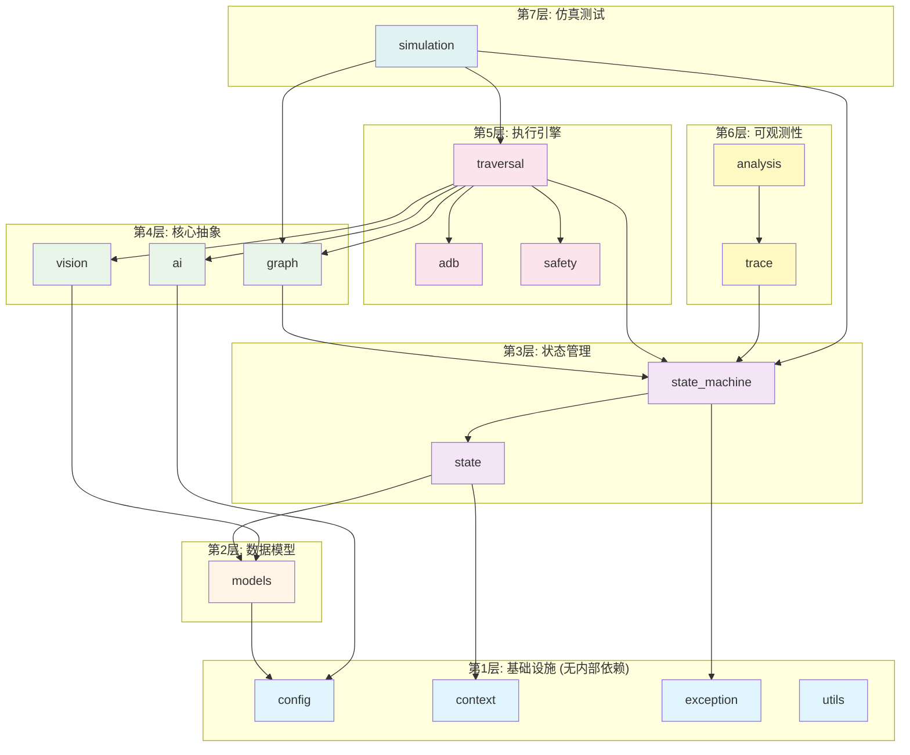

# Uni-Claw 模块设计文档索引

本文档目录包含 Uni-Claw 项目所有核心模块的设计文档，每个模块都有独立的详细设计说明和依赖关系图。

## 📚 模块列表

| 模块 | 文档 | 描述 |
|------|------|------|
| **配置与基础设施** | | |
| `config` | [config_design.md](config_design.md) | 集中配置管理 |
| `context` | [context_design.md](context_design.md) | 运行时上下文 |
| `exception` | [exception_design.md](exception_design.md) | 异常处理系统 |
| `utils` | [utils_design.md](utils_design.md) | 工具函数 |
| **数据模型** | | |
| `models` | [models_design.md](models_design.md) | 核心数据模型 |
| **状态管理** | | |
| `state` | [state_design.md](state_design.md) | 状态管理 |
| `state_machine` | [state_machine_design.md](state_machine_design.md) | 三层状态机 |
| **核心功能** | | |
| `graph` | [graph_design.md](graph_design.md) | 图遍历模型 |
| `traversal` | [traversal_design.md](traversal_design.md) | 遍历引擎 |
| `ai` | [ai_design.md](ai_design.md) | AI 策略顾问 |
| `vision` | [vision_design.md](vision_design.md) | 视觉分析服务 |
| `adb` | [adb_design.md](adb_design.md) | ADB 客户端 |
| `safety` | [safety_design.md](safety_design.md) | 安全过滤 |
| **仿真测试** | | |
| `simulation` | [simulation_design.md](simulation_design.md) | 离线仿真测试 |
| **可观测性** | | |
| `trace` | [trace_design.md](trace_design.md) | 遍历追踪 |
| `analysis` | [analysis_design.md](analysis_design.md) | 数据分析 |

## 📊 模块依赖关系图

### 层级依赖图

### 模块间依赖矩阵

| 依赖→\被依赖↓ | config | context | exception | models | state | state_machine | graph | ai | vision | adb | safety | traversal | trace | analysis | simulation |
|---------------|--------|---------|----------|--------|-------|--------------|-------|----|--------|-----|--------|-----------|-------|----------|-------------|
| config | - | - | - | - | - | - | - | - | - | - | - | - | - | - | - |
| context | - | - | - | - | - | - | - | - | - | - | - | - | - | - | - |
| exception | - | - | - | - | - | - | - | - | - | - | - | - | - | - | - |
| utils | - | - | - | - | - | - | - | - | - | - | - | - | - | - | - |
| models | ✓ | - | - | - | - | - | - | - | - | - | - | - | - | - | - |
| state | - | ✓ | - | ✓ | - | - | - | - | - | - | - | - | - | - | - |
| state_machine | - | ✓ | - | - | ✓ | - | - | - | - | - | - | - | - | - | - |
| graph | - | - | - | - | - | ✓ | - | - | - | - | - | - | - | - | - |
| ai | ✓ | - | - | - | - | - | - | - | - | - | - | - | - | - | - |
| vision | - | - | - | ✓ | - | - | - | - | - | - | - | - | - | - | - |
| adb | - | - | - | - | - | - | - | - | - | - | - | - | - | - | - |
| safety | - | - | - | - | - | - | - | - | - | - | - | - | - | - | - |
| traversal | - | - | ✓ | - | - | ✓ | ✓ | ✓ | ✓ | ✓ | ✓ | - | - | - | - |
| trace | - | - | - | - | - | ✓ | - | - | - | - | - | - | - | - | - |
| analysis | - | - | - | - | - | - | - | - | - | - | - | - | ✓ | - | - |
| simulation | - | - | - | - | - | ✓ | ✓ | - | - | - | - | ✓ | - | - | - |

## 🔍 查找指南

### 按功能查找

- **配置管理**: [config_design.md](config_design.md)
- **数据模型**: [models_design.md](models_design.md)
- **状态管理**: [state_design.md](state_design.md), [state_machine_design.md](state_machine_design.md)
- **遍历计划**: [graph_design.md](graph_design.md)
- **遍历执行**: [traversal_design.md](traversal_design.md)
- **AI 决策**: [ai_design.md](ai_design.md)
- **视觉分析**: [vision_design.md](vision_design.md)
- **设备控制**: [adb_design.md](adb_design.md)
- **安全过滤**: [safety_design.md](safety_design.md)
- **仿真测试**: [simulation_design.md](simulation_design.md)
- **追踪分析**: [trace_design.md](trace_design.md), [analysis_design.md](analysis_design.md)

### 按层级查找

- **无依赖模块**: config, context, exception, utils
- **数据模型层**: models
- **状态管理层**: state, state_machine
- **核心抽象层**: graph, ai, vision
- **执行引擎层**: traversal, adb, safety
- **可观测性层**: trace, analysis
- **仿真测试层**: simulation

## 📖 使用说明

每个设计文档包含：

1. **模块概述** - 职责、定位、核心功能
2. **核心类和接口** - 主要类、方法、字段说明
3. **依赖关系** - 模块间依赖、外部依赖
4. **设计决策** - 关键设计选择的理由
5. **依赖图** - Mermaid 格式的可视化依赖关系
6. **使用示例** - 典型使用代码
7. **测试策略** - 测试文件和覆盖范围

## 🧪 测试标准

所有模块开发应遵循项目测试标准：

- **测试标准文档**: [TESTING_STANDARDS.md](../../TESTING_STANDARDS.md)
- **覆盖率要求**: 80% 最低，95% 关键路径
- **测试类型**: 正常路径、边界条件、异常处理
- **质量门禁**: 所有测试必须通过才能标记任务完成

## 🔄 更新日志

- **2026-06-06**: 添加测试标准文档引用
- **2026-06-03**: 初始版本，所有模块设计文档创建完成
