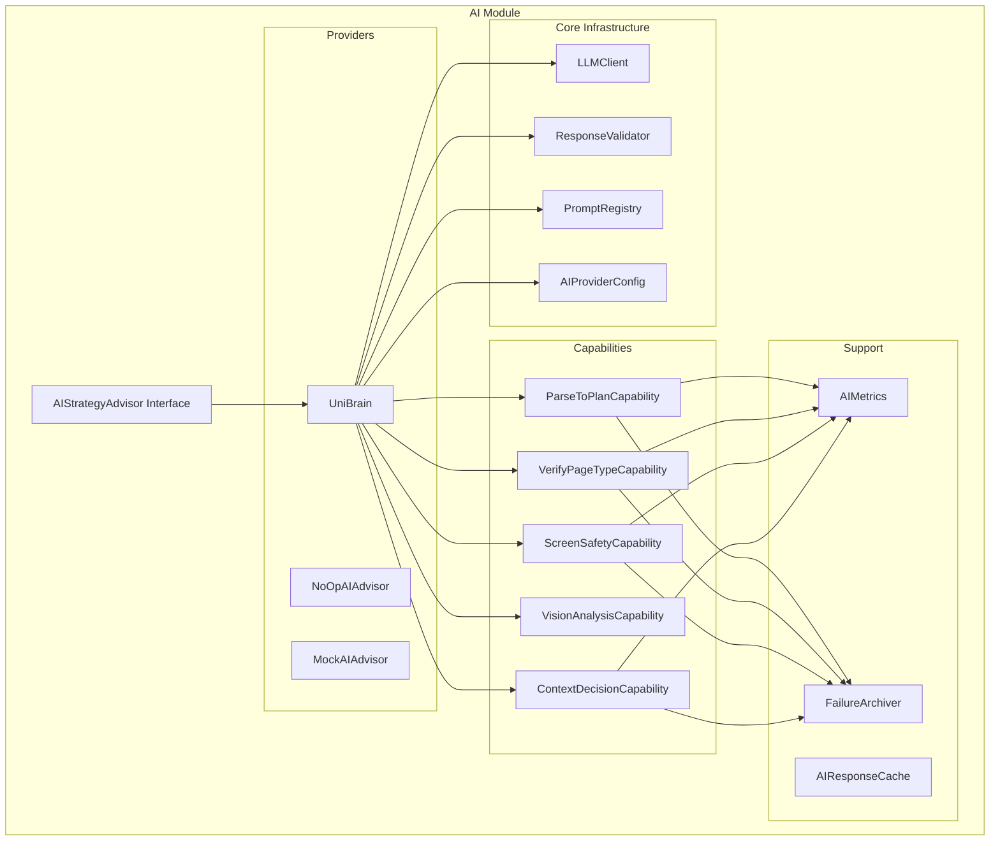
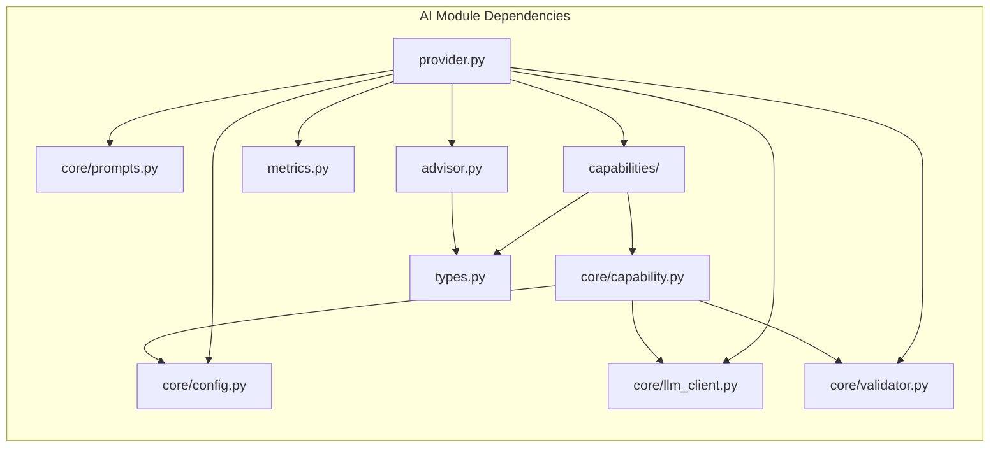
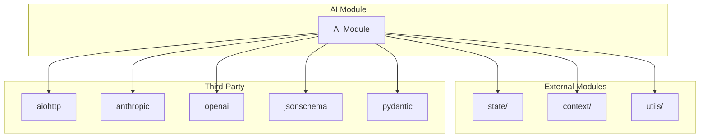

# AI Module Design Document

> **Module**: `src/ai/`
> **Version**: 1.0
> **Last Updated**: 2026-06-03

---

## 1. Module Overview

The AI module provides intelligent decision-making capabilities for the Uni-Claw framework. It implements AI-powered strategy advising for UI traversal, using large language models (LLMs) to parse instructions, verify page states, screen elements for safety, and make context-aware decisions.

### 1.1 Core Responsibilities

- **Instruction Parsing**: Convert natural language instructions into structured traversal plans
- **Page Type Verification**: Verify if current page matches expected type using AI
- **Safety Screening**: Evaluate UI elements for safety before interaction
- **Context Decision Making**: Make intelligent decisions based on traversal context
- **Vision Analysis**: Analyze screenshots to extract page structure
- **Metrics Collection**: Track AI performance and failure patterns

### 1.2 Key Design Principles

1. **Interface-Driven Design**: All implementations derive from `AIStrategyAdvisor` interface
2. **Capability-Based Architecture**: Five distinct capabilities for different AI tasks
3. **Provider Abstraction**: Support multiple AI providers (DeepSeek, Anthropic, MiMo)
4. **Observability First**: Built-in metrics, tracing, and failure archiving
5. **Prompt Engineering**: Centralized prompt management with variable injection

---

## 2. Architecture

### 2.1 Layer Structure

```
AIStrategyAdvisor (Interface)
         ↓
    UniBrain (Provider)
         ↓
    Core Infrastructure (LLMClient, ResponseValidator, PromptRegistry)
         ↓
    Capabilities (5 specialized capabilities)
```

### 2.2 Component Diagram



---

## 3. Core Classes and Interfaces

### 3.1 AIStrategyAdvisor (Interface)

**Location**: `src/ai/advisor.py`

**Purpose**: Abstract interface for AI-powered decision making during traversal

**Methods**:
- `infer_container_type(ui, context) -> ContainerInference`: Infer page container type
- `decide_next_action(goal, ui, context) -> Tuple[DecisionResult, Optional[dict]]`: Decide next action
- `handle_exception(exception, ui, context) -> Tuple[DecisionResult, Optional[dict]]`: Handle exceptions

**Implementations**:
- `UniBrain`: Production AI provider
- `NoOpAIAdvisor`: No-op implementation for testing
- `MockAIAdvisor`: Mock implementation for development

### 3.2 UniBrain (Provider)

**Location**: `src/ai/provider.py`

**Purpose**: Main AI provider implementing AIStrategyAdvisor

**Key Features**:
- Orchestrates five AI capabilities
- Manages LLM client and response validator
- Integrates metrics collection and failure archiving
- Provides factory methods for capability creation

**Configuration**:
```python
AIProviderConfig(
    api_key: str,
    model: str = "deepseek-v4-flash",
    base_url: str = "https://api.deepseek.com/v1",
    max_concurrent_requests: int = 4,
    request_timeout: float = 30.0,
    reasoning_detail: Literal["concise", "step_by_step", "detailed"] = "detailed",
    retry: RetryConfig = field(default_factory=RetryConfig),
    fallback: FallbackConfig = field(default_factory=FallbackConfig),
)
```

### 3.3 Core Infrastructure

#### 3.3.1 LLMClient

**Location**: `src/ai/core/llm_client.py`

**Purpose**: DeepSeek API client with retry logic and concurrent control

**Key Features**:
- Async HTTP client with connection pooling
- Exponential backoff retry logic
- Concurrent request limiting via semaphore
- JSON extraction from markdown code blocks
- Error classification (APIError, RateLimitError, TimeoutError)

#### 3.3.2 ResponseValidator

**Location**: `src/ai/core/validator.py`

**Purpose**: Response validation using parser registry pattern

**Key Features**:
- Parser registration for each response type
- JSON Schema validation support (optional)
- Domain object parsing from validated responses
- Type-safe parsing with custom exceptions

**Parser Registry**:
```python
validator.register_parser("TraversalPlan", parse_traversal_plan)
validator.register_parser("PageTypeVerification", parse_page_verification)
validator.register_parser("SafetyScreeningResult", parse_safety_result)
validator.register_parser("ContextDecisionResult", parse_decision_result)
validator.register_parser("PageAnalysis", lambda r: PageAnalysis(**r))
```

#### 3.3.3 PromptRegistry

**Location**: `src/ai/core/prompts.py`

**Purpose**: Centralized prompt template management with variable injection

**Key Features**:
- Template storage for all capabilities
- Variable injection into templates
- Reasoning level injection (`{{REASONING_LEVEL}}`)
- Custom prompt registration support

**Prompt Categories**:
- Parse task prompts (instruction parsing)
- Verify page prompts (page type verification)
- Screen elements prompts (safety screening)
- Decision prompts (context decision making)
- Vision analysis prompts (screenshot analysis)

#### 3.3.4 BaseCapability

**Location**: `src/ai/core/capability.py`

**Purpose**: Generic base class for all AI capabilities

**Key Features**:
- Unified execution flow (async with sync wrapper)
- Automatic logging and error handling
- Failure archiving integration
- Metrics recording
- Trace logging support

**Abstract Properties**:
- `system_prompt_key`: Key for system prompt template
- `user_prompt_key`: Key for user prompt template
- `response_schema`: JSON Schema for output validation
- `response_type`: Type identifier for parser lookup

**Abstract Methods**:
- `prepare_input(raw_input) -> Dict`: Convert raw input to prompt variables

### 3.4 Capabilities

#### 3.4.1 ParseToPlanCapability

**Purpose**: Parse natural language instructions into traversal plans

**Input**: String (natural language instruction)

**Output**: `TraversalPlan` with entry_app, root_node, static_nodes, mode

**Key Features**:
- Hybrid mode support (dynamic + static nodes)
- Safety constraint enforcement (no dangerous operations)
- Default plan generation for ambiguous instructions

#### 3.4.2 VerifyPageTypeCapability

**Purpose**: Verify if current page matches expected type

**Input**: Dict with page_analysis, expected_type, expected_page_name

**Output**: `PageTypeVerification` with is_match, confidence, actual_type

**Key Features**:
- Page type classification (menu_list, settings_group, dialog, etc.)
- Mismatch detection with detailed analysis
- Suggestion generation (back, retry, skip, close_popup)

#### 3.4.3 ScreenSafetyCapability

**Purpose**: Screen UI elements for safety before interaction

**Input**: Dict with page_analysis, instruction, page_type

**Output**: `SafetyScreeningResult` with evaluations and page_level_guidance

**Key Features**:
- Safety classification (safe, caution, skip, unknown)
- Task-aware evaluation (adjusts based on instruction keywords)
- Page-level guidance (overall_safe_to_proceed, recommended_max_parallel)

#### 3.4.4 VisionAnalysisCapability

**Purpose**: Analyze screenshots to extract page structure

**Input**: Bytes (PNG image data)

**Output**: `PageAnalysis` with items, menus, path, popup info

**Key Features**:
- Integrates with VisionService
- Button type classification
- Coordinate normalization
- Popup detection

#### 3.4.5 ContextDecisionCapability

**Purpose**: Make context-aware next-action decisions

**Input**: Dict with reason, page_analysis, context, safety_result

**Output**: `ContextDecisionResult` with result, action, target, confidence

**Key Features**:
- Safety-aware decision making
- Popup handling priority
- Branch selection logic
- Exception recovery strategies

### 3.5 Metrics and Archiving

#### 3.5.1 AIMetrics

**Location**: `src/ai/metrics.py`

**Purpose**: Metrics collector for AI operations

**Metrics Tracked**:
- Call counts (by capability and success/failure)
- Latency metrics (P50, P95, P99, mean)
- Confidence distribution
- Token usage
- Error counts by type

#### 3.5.2 FailureArchiver

**Location**: `src/ai/metrics.py`

**Purpose**: Archive failed AI operations for analysis

**Features**:
- Persistent JSONL archive (`.ai_failures.jsonl`)
- Configurable max_records limit
- Failure summary by error type and capability
- Input data preservation for debugging

### 3.6 Caching and Debounce

#### 3.6.1 AIResponseCache

**Location**: `src/ai/cache.py`

**Purpose**: TTL cache for AI responses to avoid redundant calls

**Features**:
- LRU eviction policy
- Configurable TTL (default 300 seconds)
- Cache key generation from UI hash, path hash, and method name

#### 3.6.2 DebounceTracker

**Location**: `src/ai/cache.py`

**Purpose**: Track AI call counts to prevent infinite loops

**Features**:
- Per-node, per-exception call counting
- Configurable max_calls limit (default 2)
- Reset capability for single node or all nodes

---

## 4. Data Types

### 4.1 Decision Types

```python
class DecisionResult(str, Enum):
    SUCCESS = "success"
    UNSURE = "unsure"
    GIVE_UP = "give_up"
```

### 4.2 Container Inference

```python
@dataclass(frozen=True)
class ContainerInference:
    container_type: str
    confidence: float  # 0.0 - 1.0
    matched_template: Optional[str] = None
```

### 4.3 Traversal Plan Types

```python
@dataclass
class TraversalPlan:
    entry_app: Optional[str]
    root_node: TraversalNode
    static_nodes: List[TraversalNode]
    template_registry: str
    mode: Literal["hybrid", "concrete", "dynamic"]
    reasoning: Optional[str]
    confidence: float

@dataclass
class TraversalNode:
    node_id: str
    name: str
    node_type: str
    operation: NodeOperation
    precondition: Optional[Dict[str, Any]]
    children_strategy: NodeStrategy
    error_policy: Optional[Any]
```

### 4.4 Verification Types

```python
@dataclass
class PageTypeVerification:
    is_match: bool
    confidence: float
    actual_type: Literal["menu_list", "settings_group", "dialog", "home_desktop", "leaf_page", "unknown"]
    reasoning: str
    mismatch_details: Optional[MismatchDetails]
    suggestion: Optional[Suggestion]
```

### 4.5 Safety Types

```python
@dataclass
class SafetyScreeningResult:
    evaluations: List[SafetyEvaluation]
    page_level_guidance: Optional[PageLevelGuidance]

@dataclass
class SafetyEvaluation:
    name: str
    safety_tag: Literal["safe", "caution", "skip", "unknown"]
    confidence: float
    reason: str
    context_dependency: Optional[str]
    task_relevance: Optional[str]
```

---

## 5. Dependency Relationships

### 5.1 Internal Dependencies



### 5.2 External Dependencies



### 5.3 Dependency Flow

**Input Flow**:
```
TraversalContext → AIStrategyAdvisor → UniBrain → Capabilities → LLMClient → AI APIs
```

**Output Flow**:
```
AI APIs → LLMClient → ResponseValidator → Domain Objects → TraversalEngine
```

---

## 6. Design Decisions

### 6.1 Capability-Based Architecture

**Decision**: Split AI functionality into five distinct capabilities

**Rationale**:
- Separation of concerns: each capability handles one specific task
- Independent testing: capabilities can be tested in isolation
- Flexible composition: providers can choose which capabilities to implement
- Easy extension: new capabilities can be added without modifying existing code

**Trade-offs**:
- Increased complexity: more classes and interfaces to maintain
- Potential code duplication: some capabilities share similar logic

### 6.2 Provider Abstraction

**Decision**: Use provider pattern with AIStrategyAdvisor interface

**Rationale**:
- Testability: easy to mock AI for testing
- Flexibility: support multiple AI providers (DeepSeek, Anthropic, MiMo)
- Migration path: easy to switch providers as technology evolves

**Trade-offs**:
- Interface overhead: need to maintain interface compatibility
- Least common denominator: limited to features supported by all providers

### 6.3 Centralized Prompt Management

**Decision**: Use PromptRegistry for all prompt templates

**Rationale**:
- Single source of truth: all prompts in one place
- Version control: prompt changes are tracked
- A/B testing: easy to test different prompt variations
- Variable injection: consistent template formatting

**Trade-offs**:
- Large file size: prompts can be very long
- Maintenance overhead: need to keep prompts in sync with code

### 6.4 Async with Sync Wrapper

**Decision**: Implement async execution with sync wrapper in BaseCapability

**Rationale**:
- Performance: async allows concurrent API calls
- Compatibility: sync wrapper maintains compatibility with existing code
- Flexibility: users can choose async or sync based on their needs

**Trade-offs**:
- Complexity: need to maintain both code paths
- Event loop dependency: requires running event loop

### 6.5 Failure Archiving

**Decision**: Automatically archive all failures for analysis

**Rationale**:
- Debugging: preserve failure context for investigation
- Prompt optimization: analyze patterns to improve prompts
- Metrics: track failure rates and types

**Trade-offs**:
- Storage: requires disk space for archive
- Privacy: may contain sensitive data in failures
- Maintenance: need to prune old archives

### 6.6 Confidence Thresholds

**Decision**: Use 0.7 confidence threshold for decisions

**Rationale**:
- Balance: filters out low-confidence decisions without being too restrictive
- Empirical: based on testing with actual AI responses
- Adjustable: threshold can be tuned per use case

**Trade-offs**:
- False negatives: some valid decisions may be filtered
- False positives: some invalid decisions may pass

---

## 7. Usage Examples

### 7.1 Basic Usage

```python
from src.ai import UniBrain, AIProviderConfig

# Configure the provider
ai_config = AIProviderConfig(
    api_key="your-deepseek-api-key",
    model="deepseek-v4-flash",
    reasoning_detail="detailed",
)

# Create the provider
provider = UniBrain(ai_config)

# Use the provider
container = provider.infer_container_type(page_analysis, context)
decision, node_data = provider.decide_next_action(goal, page_analysis, context)
```

### 7.2 With Vision Service

```python
from src.ai import UniBrain, AIProviderConfig
from src.ai.vision import VisionConfig

ai_config = AIProviderConfig(api_key="key")
vision_config = VisionConfig(service_type="claude", api_key="anthropic-key")

provider = UniBrain(ai_config, vision_config)

# Analyze screenshot
page_analysis = provider.analyze_screenshot(image_bytes)

# Verify page type
verification = provider.verify_page_with_vision(image_bytes, "menu_list")
```

### 7.3 With Metrics

```python
# Get metrics summary
metrics = provider.get_metrics_summary()
print(metrics)

# Get latency stats
latency = provider.get_latency_stats("ParseToPlanCapability")
print(f"P95 latency: {latency['p95']}ms")

# Get failure summary
failures = provider.get_failure_summary()
print(f"Total failures: {failures['total_failures']}")
```

---

## 8. Configuration

### 8.1 Environment Variables

```bash
# Required
export DEEPSEEK_API_KEY="your-api-key"

# Optional
export DEEPSEEK_MODEL="deepseek-v4-flash"
export AI_PROVIDER_MAX_CONCURRENT="4"
export AI_PROVIDER_TIMEOUT="30.0"
export AI_PROVIDER_REASONING_LEVEL="detailed"

# Vision Service
export VISION_SERVICE_TYPE="claude"
export VISION_API_KEY="your-anthropic-key"
export VISION_MODEL="claude-3-5-sonnet-20241022"
```

### 8.2 Configuration Loading

```python
from src.ai.config_loader import load_ai_config, load_vision_config

ai_config = load_ai_config()
vision_config = load_vision_config()

provider = UniBrain(ai_config, vision_config)
```

---

## 9. Testing

### 9.1 Mock Providers

```python
from src.ai import MockAIAdvisor

# Use mock for testing
mock_provider = MockAIAdvisor()
decision, node_data = mock_provider.decide_next_action(goal, ui, context)
```

### 9.2 NoOp Provider

```python
from src.ai import NoOpAIAdvisor

# Use no-op for fast iteration
noop_provider = NoOpAIAdvisor()
```

### 9.3 Mock Vision

```python
from src.ai.vision import MockVisionService

# Use mock vision for testing
mock_vision = MockVisionService()
mock_vision.add_response(predefined_page_analysis)
```

---

## 10. Performance Considerations

### 10.1 Latency

- LLM calls: 500-2000ms typical
- Vision analysis: 1000-5000ms typical
- Total decision loop: 2-7 seconds

### 10.2 Optimization Tips

1. Enable response caching for repeated inputs
2. Limit `visited_pages` history size
3. Adjust `max_concurrent_requests` for parallel operations
4. Use faster models (deepseek-v4-flash) for text
5. Set appropriate `max_retries` to balance reliability and speed

### 10.3 Cost Management

- Use response caching to reduce API calls
- Batch similar requests when possible
- Monitor token usage metrics
- Set reasonable retry limits

---

## 11. Error Handling

### 11.1 Error Types

- `APIError`: Base exception for API errors
- `RateLimitError`: Rate limit exceeded (auto-retry)
- `TimeoutError`: Request timeout (auto-retry)
- `ValidationError`: Response validation failed
- `ParserNotFoundError`: Parser not registered for type

### 11.2 Retry Strategy

```python
RetryConfig(
    max_attempts=3,
    base_delay=1.0,
    max_delay=8.0,
    exponential_base=2.0,
)
```

### 11.3 Fallback Strategy

```python
FallbackConfig(
    strategy="partial",  # none, partial, full
    partial_allowlist=["verify", "vision"],
)
```

---

## 12. Future Enhancements

### 12.1 Planned Features

1. **Structured Output**: Native support for structured output in LLM calls
2. **Multi-Provider**: Simultaneous use of multiple providers for redundancy
3. **Prompt Optimization**: Automated prompt tuning based on failure analysis
4. **Caching Layer**: Persistent caching for long-running sessions
5. **Batch Processing**: Process multiple requests in single API call

### 12.2 Research Areas

1. **Few-Shot Learning**: Improve accuracy with few-shot examples
2. **Chain of Thought**: Enable multi-step reasoning for complex decisions
3. **Tool Use**: Integrate AI with external tools for enhanced capabilities
4. **Fine-tuning**: Customize models for specific use cases

---

**Document Version**: 1.0
**Author**: Uni-Claw Development Team
**Last Updated**: 2026-06-03
