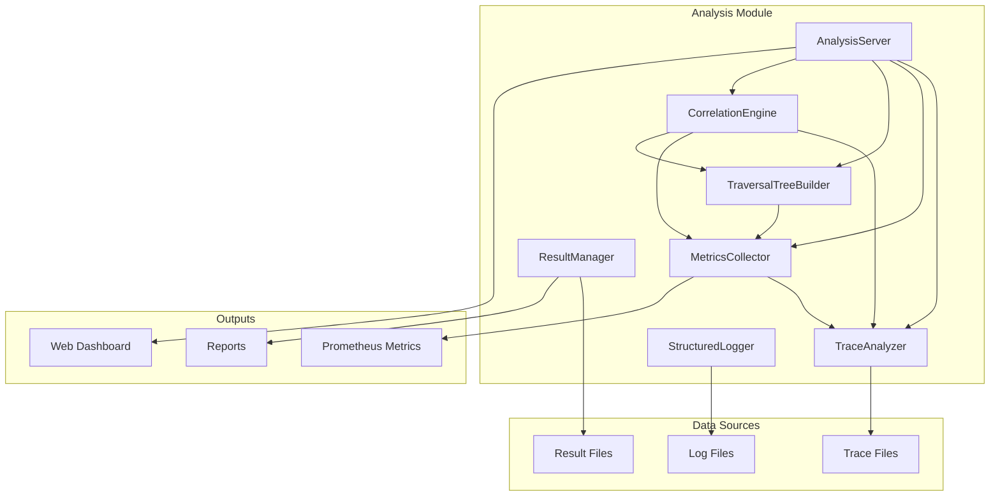

# Analysis 模块设计文档

## 模块概述

**位置**: `src/analysis/`

**职责**: 遍历结果分析、指标收集、可视化报告生成

### 核心功能

1. **Trace 分析** - 解析和追踪日志，提取性能指标
2. **指标收集** - 聚合 AI 调用、遍历操作的实时指标
3. **树形可视化** - 构建遍历结果的层级树结构
4. **结果管理** - 结构化存储和检索遍历结果
5. **结构化日志** - JSON 格式的结构化日志系统
6. **Web 仪表板** - 实时分析和可视化服务

## 核心类和接口

### TraceAnalyzer

Trace 分析引擎，解析遍历追踪日志并提取指标。

```python
class TraceAnalyzer:
    """遍历追踪分析器"""

    def analyze_trace(self, trace_file: Path) -> TraceAnalysis:
        """分析追踪文件，返回分析结果"""

    def extract_metrics(self, trace: TraversalTrace) -> Dict[str, Any]:
        """提取性能指标"""

    def detect_anomalies(self, trace: TraversalTrace) -> List[Anomaly]:
        """检测异常模式"""
```

### MetricsCollector

全局指标收集器，使用单例模式聚合所有模块的指标。

```python
class MetricsCollector:
    """全局指标收集器（单例）"""

    def record_ai_call(self, capability: str, latency: float, success: bool):
        """记录 AI 调用"""

    def record_traversal_operation(self, op_type: str, success: bool):
        """记录遍历操作"""

    def get_metrics(self) -> Dict[str, Any]:
        """获取所有聚合指标"""

    def export_prometheus(self) -> str:
        """导出 Prometheus 格式指标"""
```

### TraversalTreeBuilder

树形构建器，将扁平的遍历结果转换为层级树结构。

```python
class TraversalTreeBuilder:
    """遍历树构建器"""

    def build_tree(self, result: TraversalResult) -> TreeNode:
        """从遍历结果构建树"""

    def to_mermaid(self, tree: TreeNode) -> str:
        """转换为 Mermaid 图表"""

    def to_ascii(self, tree: TreeNode) -> str:
        """转换为 ASCII 树"""
```

### ResultManager

结果管理器，负责遍历结果的存储和检索。

```python
class ResultManager:
    """遍历结果管理器（单例）"""

    def save_result(self, result: TraversalResult, path: Path):
        """保存遍历结果"""

    def load_result(self, path: Path) -> TraversalResult:
        """加载遍历结果"""

    def list_results(self, filter: ResultFilter) -> List[Path]:
        """列出符合条件的结果"""
```

### StructuredLogger

结构化日志器，输出 JSON 格式的结构化日志。

```python
class StructuredLogger:
    """结构化日志器"""

    def log_event(self, event: str, **kwargs):
        """记录结构化事件"""

    def log_metric(self, name: str, value: float, tags: Dict[str, str]):
        """记录指标"""

    def log_error(self, error: Exception, context: Dict[str, Any]):
        """记录错误"""
```

### AnalysisServer

Web 仪表板服务器，提供实时分析和可视化。

```python
class AnalysisServer:
    """分析服务器"""

    def start(self, port: int = 8080):
        """启动 Web 服务器"""

    def register_handler(self, route: str, handler: Callable):
        """注册路由处理器"""

    def generate_report(self, format: str = "html") -> str:
        """生成分析报告"""
```

## 依赖关系

### 内部依赖



### 外部依赖

- **Python 标准库**: `json`, `pathlib`, `datetime`, `collections`
- **第三方库**: `flask` (Web 服务器), `prometheus_client` (指标导出)

### 被依赖模块

- **测试模块**: 使用 MetricsCollector 收集测试指标
- **监控模块**: 使用 AnalysisServer 暴露指标

## 设计决策

### 1. 单例模式

MetricsCollector 和 ResultManager 使用单例模式，确保全局唯一实例。

**理由**:
- 指标需要在整个应用中聚合
- 避免文件写入冲突
- 简化访问逻辑

### 2. JSON Lines 日志格式

使用 JSON Lines 格式存储日志和追踪数据。

**理由**:
- 支持增量写入，不需要加载整个文件
- 每行是一个完整的 JSON 对象，容错性强
- 支持流式处理和并行分析

### 3. 多格式报告

支持多种报告格式（HTML、Markdown、JSON、Prometheus）。

**理由**:
- HTML: 人类可读的可视化报告
- Markdown: 版本控制友好的文档
- JSON: 机器可读的结构化数据
- Prometheus: 监控系统集成

### 4. 异步指标收集

MetricsCollector 支持异步指标收集。

**理由**:
- 不阻塞主执行流程
- 提高遍历性能
- 批量写入减少 I/O 操作

## 使用示例

### 分析追踪文件

```python
from src.analysis.analyzer import TraceAnalyzer

analyzer = TraceAnalyzer()
analysis = analyzer.analyze_trace(Path("traces/session_001.jsonl"))

print(f"总步数: {analysis.total_steps}")
print(f"Ai 调用次数: {analysis.ai_calls}")
print(f"平均延迟: {analysis.avg_ai_latency:.2f}s")
```

### 收集指标

```python
from src.analysis.metrics import MetricsCollector

collector = MetricsCollector.getInstance()

collector.record_ai_call("parse_to_plan", latency=1.5, success=True)
collector.record_traversal_operation("click", success=True)

metrics = collector.get_metrics()
print(metrics)
```

### 生成树形可视化

```python
from src.analysis.tree_builder import TraversalTreeBuilder

builder = TraversalTreeBuilder()
tree = builder.build_tree(traversal_result)

# Mermaid 图表
mermaid = builder.to_mermaid(tree)
print(mermaid)

# ASCII 树
ascii_tree = builder.to_ascii(tree)
print(ascii_tree)
```

### 启动 Web 仪表板

```python
from src.analysis.server import AnalysisServer

server = AnalysisServer()
server.start(port=8080)
# 访问 http://localhost:8080
```

## 测试策略

| 测试文件 | 覆盖内容 |
|---------|---------|
| `tests/analysis/test_analyzer.py` | TraceAnalyzer 测试 |
| `tests/analysis/test_metrics.py` | MetricsCollector 测试 |
| `tests/analysis/test_tree_builder.py` | TraversalTreeBuilder 测试 |
| `tests/analysis/test_server.py` | AnalysisServer 测试 |

## 配置选项

```python
# 环境变量
ANALYSIS_SERVER_PORT=8080      # Web 服务器端口
ANALYSIS_METRICS_ENABLED=true  # 是否启用指标收集
ANALYSIS_LOG_LEVEL=INFO        # 日志级别
```

## 未来增强

1. **实时流处理** - 支持实时分析正在进行的遍历
2. **机器学习异常检测** - 使用 ML 模型检测异常模式
3. **自定义仪表板** - 允许用户自定义仪表板布局
4. **告警规则** - 基于指标阈值的自动告警
