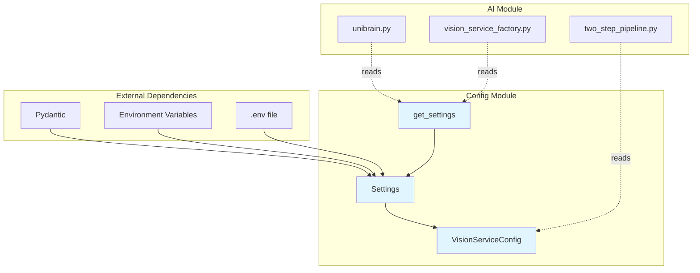
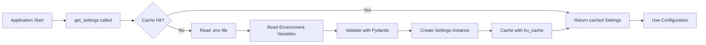

# Config Module Design

**Module Path**: `src/config/`

**Version**: V6.0

**Last Updated**: 2026-06-03

---

## 1. Module Overview

### 1.1 Purpose

The config module provides centralized configuration management for the uni-claw traversal system using Pydantic settings. It enables type-safe, environment-driven configuration with validation and defaults.

### 1.2 Responsibilities

- Environment variable-based configuration loading
- Type-safe settings with Pydantic validation
- API key management for AI services
- Vision model configuration (including two-step pipeline)
- ADB device configuration
- Traversal parameter defaults
- Project path resolution

### 1.3 Design Philosophy

- **Environment-First**: Configuration loaded from environment variables with `.env` file support
- **Type Safety**: Pydantic ensures type validation and conversion
- **Modular**: Nested config structures for different subsystems (vision, ADB, etc.)
- **Defaults with Overrides**: Sensible defaults that can be overridden per environment
- **Singleton Pattern**: `get_settings()` uses `lru_cache` for consistent access

---

## 2. Core Classes and Interfaces

### 2.1 Settings

```python
class Settings(BaseSettings):
    """Application settings with environment variable support."""
```

**Attributes**:

| Field | Type | Default | Description |
|-------|------|---------|-------------|
| `anthropic_api_key` | str | `""` | Anthropic API key for Claude vision service |
| `deepseek_api_key` | str | `""` | DeepSeek API key for LLM capabilities |
| `mimo_api_key` | str | `""` | XiaoMi MiMo API key for vision service |
| `vision_provider` | Literal | `"mimo-cc"` | Vision service provider (anthropic/mimo/mimo-cc/mock) |
| `vision_model` | str | `"claude-3-5-sonnet-20241022"` | Vision model for screen analysis |
| `mimo_model` | str | `"mimo-v2.5"` | MiMo model version |
| `mimo_base_url` | str | `"https://api.xiaomimimo.com/v1"` | MiMo API base URL (OpenAI protocol) |
| `mimo_cc_model` | str | `"mimo-v2.5"` | MiMo CC model version |
| `mimo_cc_base_url` | str | `"https://token-plan-cn.xiaomimimo.com/anthropic"` | MiMo CC API base URL |
| `vision` | VisionServiceConfig | factory | Two-step pipeline configuration |
| `adb_device_id` | str | `""` | ADB device ID (empty for auto-detect) |
| `adb_path` | str | `"adb"` | Path to adb executable |
| `max_steps` | int | `200` | Maximum traversal steps |
| `wait_time` | float | `0.5` | Wait time after click (seconds) |
| `max_retries` | int | `2` | Maximum retries for failed operations |
| `timeout` | int | `30` | Timeout for operations (seconds) |
| `state_file` | str | `".traversal_state.json"` | State persistence file path |
| `log_level` | Literal | `"INFO"` | Logging level |

**Properties**:

- `project_root: Path` - Project root directory (computed)
- `screenshots_dir: Path` - Screenshots directory (computed)

### 2.2 VisionServiceConfig

```python
class VisionServiceConfig(BaseSettings):
    """Vision service configuration for the two-step pipeline."""
```

**Attributes**:

| Field | Type | Default | Description |
|-------|------|---------|-------------|
| `mode` | Literal | `"flattened"` | Pipeline mode (legacy/flattened/dual) |
| `multimodal_model` | str | `"claude-3-5-sonnet-20241022"` | Multimodal model for visual perception |
| `multimodal_max_tokens` | int | `4096` | Max tokens for multimodal output |
| `text_model` | str | `"deepseek-v4-flash"` | Text model for logical assembly |
| `text_max_tokens` | int | `2048` | Max tokens for text model output |
| `enable_cache` | bool | `True` | Enable caching for vision results |
| `screen_cache_ttl` | int | `300` | Screen cache TTL (seconds) |
| `page_analysis_cache_ttl` | int | `600` | Page analysis cache TTL (seconds) |
| `cache_max_size` | int | `1000` | Maximum cache size |
| `enable_fallback` | bool | `True` | Enable fallback to legacy service |
| `fallback_on_error` | bool | `True` | Fallback on any error |
| `fallback_timeout_ms` | float | `5000` | Timeout before fallback (ms) |
| `enable_metrics` | bool | `True` | Enable metrics collection |
| `metrics_sample_rate` | float | `0.1` | Metrics sampling rate (0.0-1.0) |

### 2.3 get_settings()

```python
@lru_cache
def get_settings() -> Settings:
    """Get cached settings instance."""
```

- Singleton access pattern using `lru_cache`
- Returns the same Settings instance for subsequent calls
- Reads environment variables on first call only

---

## 3. Dependency Relationships

### 3.1 Internal Dependencies

The config module has **no internal dependencies** on other src modules. It only depends on:

- `pydantic` - Settings validation
- `pydantic_settings` - BaseSettings, SettingsConfigDict
- Standard library - `os`, `functools`, `pathlib`, `typing`

### 3.2 External Modules That Depend on Config

| Module | Usage |
|--------|-------|
| `src.ai.core.unibrain` | API key configuration |
| `src.ai.vision.vision_service_factory` | Provider and model selection |
| `src.ai.vision.two_step_pipeline` | Pipeline configuration |

### 3.3 Dependency Graph



---

## 4. Design Decisions

### 4.1 Pydantic Settings

**Decision**: Use Pydantic BaseSettings instead of plain Python or other config libraries.

**Rationale**:
- Type validation and automatic conversion
- Clear field definitions with defaults
- Environment variable mapping built-in
- Easy to test with `model_construct()` or overrides
- IDE autocomplete support

### 4.2 Environment Prefixes

**Decision**: Use nested config with `env_prefix` for subsystems.

**Rationale**:
- `VISION_*` prefix for vision service configuration
- Clear separation of concerns
- Avoids naming collisions
- Enables modular configuration loading

### 4.3 Singleton Pattern with lru_cache

**Decision**: Use `@lru_cache` decorator for `get_settings()`.

**Rationale**:
- Ensures consistent configuration across the application
- Avoids repeated environment variable lookups
- Simple and thread-safe (Python's LRU cache is thread-safe for single read)
- No complex singleton boilerplate

### 4.4 Computed Properties

**Decision**: Use `@property` for computed paths like `project_root`.

**Rationale**:
- Dynamic path calculation based on file location
- No hardcoded paths
- Works across different deployment scenarios
- Clear separation of static vs dynamic configuration

### 4.5 Two-Step Pipeline Configuration

**Decision**: Nest vision pipeline config as separate `VisionServiceConfig` class.

**Rationale**:
- Supports PRD V5.2 two-step pipeline architecture
- Enables independent testing of pipeline configuration
- Clear separation between legacy and new pipeline config
- Future-proof for additional pipeline modes

### 4.6 Multiple Vision Provider Support

**Decision**: Support multiple vision providers (Anthropic, MiMo, MiMo CC, Mock).

**Rationale**:
- Flexibility for different cost/latency requirements
- Easy switching via environment variable
- Mock provider for testing without API calls
- Supports both OpenAI and Anthropic protocols

---

## 5. Configuration Flow



---

## 6. Environment Variable Reference

### 6.1 API Keys

| Variable | Required | Example |
|----------|----------|---------|
| `ANTHROPIC_API_KEY` | Yes (for Anthropic) | `sk-ant-...` |
| `DEEPSEEK_API_KEY` | Yes (for DeepSeek) | `sk-...` |
| `MIMO_API_KEY` | Yes (for MiMo) | `sk-...` |

### 6.2 Vision Provider

| Variable | Values | Default |
|----------|--------|---------|
| `VISION_PROVIDER` | anthropic, mimo, mimo-cc, mock | `mimo-cc` |
| `VISION_MODEL` | model name | `claude-3-5-sonnet-20241022` |
| `MIMO_MODEL` | model name | `mimo-v2.5` |
| `MIMO_BASE_URL` | URL | `https://api.xiaomimimo.com/v1` |
| `MIMO_CC_MODEL` | model name | `mimo-v2.5` |
| `MIMO_CC_BASE_URL` | URL | `https://token-plan-cn.xiaomimimo.com/anthropic` |

### 6.3 Vision Pipeline (Two-Step)

| Variable | Values | Default |
|----------|--------|---------|
| `VISION_MODE` | legacy, flattened, dual | `flattened` |
| `VISION_MULTIMODAL_MODEL` | model name | `claude-3-5-sonnet-20241022` |
| `VISION_TEXT_MODEL` | model name | `deepseek-v4-flash` |
| `VISION_ENABLE_CACHE` | true, false | `true` |
| `VISION_ENABLE_FALLBACK` | true, false | `true` |

### 6.4 ADB Settings

| Variable | Values | Default |
|----------|--------|---------|
| `ADB_DEVICE_ID` | device ID | (empty, auto-detect) |
| `ADB_PATH` | path | `adb` |

### 6.5 Traversal Settings

| Variable | Values | Default |
|----------|--------|---------|
| `MAX_STEPS` | integer | `200` |
| `WAIT_TIME` | float (seconds) | `0.5` |
| `MAX_RETRIES` | integer | `2` |
| `TIMEOUT` | integer (seconds) | `30` |
| `LOG_LEVEL` | DEBUG, INFO, WARNING, ERROR | `INFO` |

---

## 7. Usage Examples

### 7.1 Basic Usage

```python
from src.config import get_settings

settings = get_settings()

# Access configuration
api_key = settings.anthropic_api_key
vision_provider = settings.vision_provider
max_steps = settings.max_steps

# Access computed properties
project_root = settings.project_root
screenshots_dir = settings.screenshots_dir
```

### 7.2 Vision Service Configuration

```python
from src.config import get_settings

settings = get_settings()

# Two-step pipeline config
pipeline_mode = settings.vision.mode
multimodal_model = settings.vision.multimodal_model
text_model = settings.vision.text_model
cache_enabled = settings.vision.enable_cache
```

### 7.3 Testing with Overrides

```python
from src.config import Settings

# Create test settings without environment variables
test_settings = Settings.model_construct(
    anthropic_api_key="test-key",
    vision_provider="mock",
    max_steps=10,
)
```

---

## 8. Future Enhancements

### 8.1 Potential Improvements

1. **Settings Profiles**: Support for dev/staging/prod profiles
2. **Config Validation Hook**: Custom validation logic for complex dependencies
3. **Secrets Management**: Integration with cloud secret managers
4. **Hot Reload**: Ability to reload config without restart (careful with cached settings)
5. **Config Export**: Export current config as .env template

### 8.2 Extension Points

- Custom field validators for complex validation rules
- Additional nested configs for new subsystems
- Computed properties for dynamic values
- Settings factories for different deployment scenarios

---

**Document Version**: 1.0
**Author**: Uni-Claw Architecture Team
