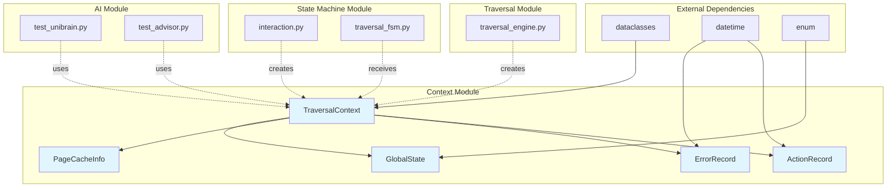
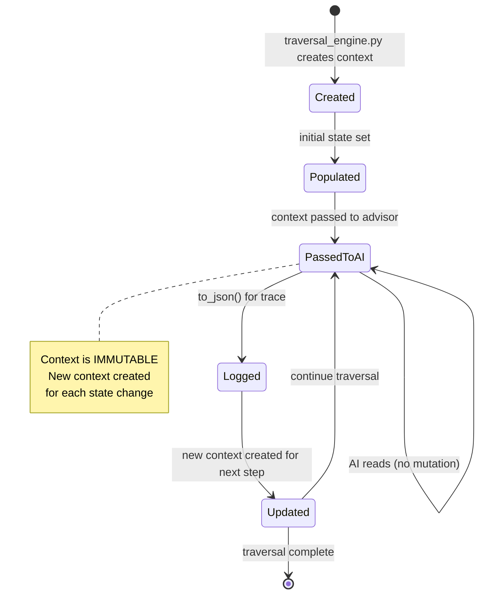
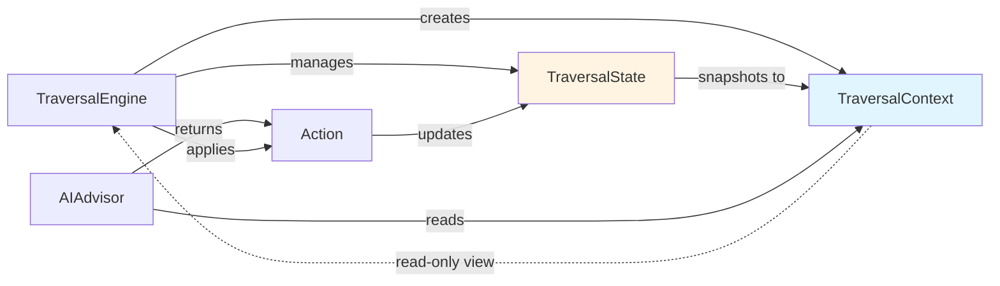

# Context Module Design

**Module Path**: `src/context/`

**Version**: V6.0

**Last Updated**: 2026-06-03

---

## 1. Module Overview

### 1.1 Purpose

The context module provides runtime context data structures for the uni-claw traversal system. It encapsulates read-only traversal state passed to AI advisors and other components that need visibility into the current traversal state without modifying it.

### 1.2 Responsibilities

- Define immutable traversal context data structures
- Encapsulate runtime state for AI decision-making
- Track visited pages, failed nodes, and action history
- Provide V6 extensions for page caching and global state
- Enable JSON serialization for logging and debugging

### 1.3 Design Philosophy

- **Immutability**: Frozen dataclasses prevent accidental mutation
- **Read-Only Context**: Clear separation between state modification and state observation
- **V6 Compatibility**: Extended fields for V6 graph traversal and state machine
- **Self-Contained**: Context includes everything needed for AI decisions
- **Serializable**: JSON export for debugging and trace analysis

---

## 2. Core Classes and Interfaces

### 2.1 TraversalContext

```python
@dataclass(frozen=True)
class TraversalContext:
    """Read-only runtime state for AI advisors."""
```

**Core Fields (V5.x)**:

| Field | Type | Default | Description |
|-------|------|---------|-------------|
| `node_stack` | List[str] | `[]` | Stack of visited node IDs |
| `current_path` | List[str] | `[]` | Current navigation path |
| `visited_pages` | Set[str] | `{}` | Set of visited page IDs |
| `failed_nodes` | Dict[str, ErrorRecord] | `{}` | Map of failed nodes to error records |
| `action_history` | List[ActionRecord] | `[]` | Recent actions (max 5) |
| `inference_history` | List[ContainerInference] | `[]` | Recent AI inferences (max 3) |
| `goal_attempts` | Dict[str, int] | `{}` | Counter for goal retry attempts |

**V6 Extensions**:

| Field | Type | Default | Description |
|-------|------|---------|-------------|
| `page_cache` | Dict[str, PageCacheInfo] | `{}` | Cached page information |
| `max_depth` | int | `10` | Maximum traversal depth |
| `step_count` | int | `0` | Current step counter |
| `global_state` | GlobalState | `IDLE` | Global traversal state |
| `visited_nodes` | Set[str] | `{}` | Set of visited node IDs (graph nodes) |

**Methods**:

- `to_json() -> str`: Serialize context to JSON string
- `__post_init__()`: Enforce history limits (5 actions, 3 inferences)

### 2.2 GlobalState (Enum)

```python
class GlobalState(Enum):
    """Global traversal state (V6)."""
```

**Values**:

| Value | Description |
|-------|-------------|
| `IDLE` | Traversal not started |
| `TRAVERSING` | Active traversal in progress |
| `PAUSED` | Traversal paused (resumable) |
| `COMPLETED` | Traversal completed successfully |
| `TERMINATED` | Traversal terminated (error or user) |
| `ERROR` | Traversal in error state |

### 2.3 PageCacheInfo (V6)

```python
@dataclass(frozen=True)
class PageCacheInfo:
    """Page cache information (V6)."""
```

**Fields**:

| Field | Type | Default | Description |
|-------|------|---------|-------------|
| `items` | List[Dict] | `[]` | Cached page items/elements |
| `timestamp` | float | `0.0` | Cache timestamp (epoch) |
| `path` | str | `""` | Page path identifier |

### 2.4 ErrorRecord

```python
@dataclass(frozen=True)
class ErrorRecord:
    """Record of a failed node."""
```

**Fields**:

| Field | Type | Description |
|-------|------|-------------|
| `node_id` | str | ID of the failed node |
| `error_type` | str | Type/classification of error |
| `timestamp` | datetime | When the error occurred |
| `retry_count` | int | Number of retry attempts made |

### 2.5 ActionRecord

```python
@dataclass(frozen=True)
class ActionRecord:
    """Record of an action taken."""
```

**Fields**:

| Field | Type | Description |
|-------|------|-------------|
| `action_type` | str | Type of action (click, input, back, etc.) |
| `target` | Optional[str] | Target element or coordinate |
| `timestamp` | datetime | When the action was executed |
| `result` | Optional[str] | Result of the action (success/failure) |

---

## 3. Dependency Relationships

### 3.1 Internal Dependencies

The context module has **no internal dependencies** on other src modules. It only depends on:

- Standard library - `dataclasses`, `datetime`, `enum`, `typing`

### 3.2 External Modules That Depend on Context

| Module | Usage |
|--------|-------|
| `src.ai.test_unibrain` | AI advisor testing |
| `src.ai.test_advisor` | AI advisor testing |
| `src.state_machine.interaction` | TraversalContext in InteractionManager |
| `src.state_machine.traversal_fsm` | Context passed to state handlers |
| `src.traversal.traversal_engine` | Context creation and management |

### 3.3 Dependency Graph



---

## 4. Design Decisions

### 4.1 Frozen Dataclasses

**Decision**: Use `@dataclass(frozen=True)` for immutability.

**Rationale**:
- Prevents accidental modification of context
- Ensures thread-safe read-only access
- Clear ownership: context is created, not mutated
- Enables safe sharing across components
- Hashable for potential caching use cases

### 4.2 History Limits

**Decision**: Limit action_history to 5 items and inference_history to 3 items.

**Rationale**:
- Prevents unbounded memory growth
- Recent history is most relevant for AI decisions
- Reduces token count when passing to AI
- Maintains context window for LLM advisors
- Enforced in `__post_init__` for automatic truncation

### 4.3 Set vs List for Visited Tracking

**Decision**: Use `Set[str]` for visited_pages and visited_nodes.

**Rationale**:
- O(1) lookup for "is visited?" checks
- Automatic deduplication
- Clear semantics (visited is a boolean property)
- Memory efficient for large traversal spaces

### 4.4 Separate Stack and Path

**Decision**: Maintain both `node_stack` (for backtracking) and `current_path` (for context).

**Rationale**:
- Stack enables efficient backtracking operations
- Path provides readable navigation context for AI
- Different semantics: stack is LIFO, path is sequence
- Enables both "where can I go back to?" and "how did I get here?"

### 4.5 V6 Extensions Design

**Decision**: Add V6 fields to existing TraversalContext rather than separate class.

**Rationale**:
- Backward compatibility (all fields have defaults)
- Single context type simplifies APIs
- Gradual migration from V5 to V6
- Avoids context wrapper/adapter complexity
- Clear versioning through optional fields

### 4.6 Global State Enum

**Decision**: Use enum for global_state rather than string.

**Rationale**:
- Type-safe state values
- IDE autocomplete support
- Clear list of valid states
- Enables exhaustiveness checking in type checkers
- Self-documenting code

### 4.7 JSON Serialization

**Decision**: Provide `to_json()` method for debugging.

**Rationale**:
- Easy logging and debugging
- Trace export for offline analysis
- Human-readable context inspection
- No external JSON library dependency (uses standard lib)
- Handles special cases (sets, datetimes, nested objects)

---

## 5. Context Lifecycle



---

## 6. Usage Examples

### 6.1 Creating Context

```python
from src.context import TraversalContext, GlobalState, PageCacheInfo

# Basic context (V5 style)
context = TraversalContext(
    node_stack=["root", "home"],
    current_path=["root", "home"],
    visited_pages={"root", "home"},
)

# V6 context with extensions
context_v6 = TraversalContext(
    node_stack=["root", "settings"],
    current_path=["root", "settings"],
    visited_pages={"root", "settings"},
    page_cache={
        "settings": PageCacheInfo(
            items=[{"id": "wifi-btn", "text": "WiFi"}],
            timestamp=1678900000.0,
            path="settings"
        )
    },
    global_state=GlobalState.TRAVERSING,
    step_count=5,
    max_depth=10,
)
```

### 6.2 Accessing Context

```python
# AI advisor reading context
def advise(context: TraversalContext) -> Action:
    # Check if already visited
    if target_page in context.visited_pages:
        return Action.skip()

    # Check retry count
    attempts = context.goal_attempts.get(goal_id, 0)
    if attempts >= 3:
        return Action.backtrack()

    # Access recent history
    recent_actions = context.action_history
    last_action = recent_actions[-1] if recent_actions else None

    # V6: Check global state
    if context.global_state == GlobalState.PAUSED:
        return Action.wait()
```

### 6.3 Serialization

```python
# Export context for debugging
json_str = context.to_json()

# Log context
logger.info(f"Traversal context: {context.to_json()}")

# Save to trace file
with open("trace.jsonl", "a") as f:
    f.write(context.to_json() + "\n")
```

---

## 7. Context vs State Separation

### 7.1 TraversalContext (src/context/)

**Purpose**: Read-only observation of runtime state

**Characteristics**:
- Immutable (frozen dataclass)
- Passed to AI advisors for decision-making
- Represents "what is happening now"
- No modification methods
- Lightweight, focused data

**Contains**:
- Current navigation state (stack, path)
- History (actions, inferences)
- Visited tracking
- Error records

### 7.2 TraversalState (src/state/)

**Purpose**: Mutable state management for persistence

**Characteristics**:
- Mutable (can be updated)
- Managed by traversal engine
- Represents "complete traversal state"
- Has modification methods
- Includes full state for resume

**Contains**:
- All context fields (mutable)
- Step counters
- Goal tracking
- Persistent state fields

### 7.3 Relationship Diagram



---

## 8. V6 Migration Guide

### 8.1 New Fields

When migrating from V5 to V6, consider these new context fields:

1. `page_cache` - Use for performance optimization
2. `max_depth` - Check before deep traversals
3. `step_count` - Use for progress tracking
4. `global_state` - Check for PAUSED/ERROR states
5. `visited_nodes` - Graph-specific visited tracking

### 8.2 Backward Compatibility

V5 code continues to work because all V6 fields have defaults:

```python
# V5 code still works
old_context = TraversalContext(
    node_stack=["a", "b"],
    visited_pages={"a", "b"},
)
# V6 fields are set to defaults
```

### 8.3 Recommended V6 Usage

```python
def v6_advisor(context: TraversalContext) -> Action:
    # Check V6 global state
    if context.global_state != GlobalState.TRAVERSING:
        return Action.wait()

    # Check depth limit
    if len(context.node_stack) >= context.max_depth:
        return Action.backtrack()

    # Use page cache if available
    cached = context.page_cache.get(current_page)
    if cached and time.time() - cached.timestamp < 300:
        # Use cached page info
        items = cached.items
```

---

## 9. Future Enhancements

### 9.1 Potential Improvements

1. **Context Validation**: Add validation for invariants (e.g., stack and path consistency)
2. **Context Differ**: Track what changed between contexts
3. **Context Filters**: Helper methods to query context (e.g., `get_recent_errors()`)
4. **Context Builders**: Fluent API for building complex contexts
5. **Context Metrics**: Derived metrics (e.g., success rate, average depth)

### 9.2 Extension Points

- Add new cached information types
- Extend history with filtering options
- Add context versioning for schema evolution
- Support custom serialization formats

---

**Document Version**: 1.0
**Author**: Uni-Claw Architecture Team
