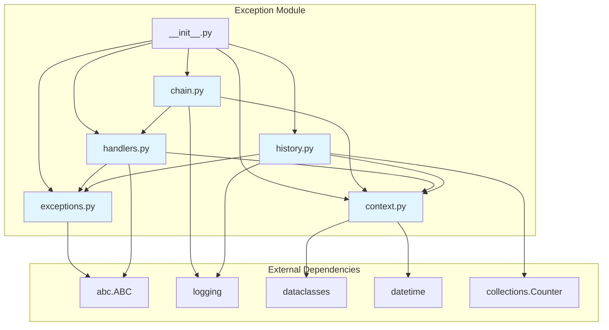
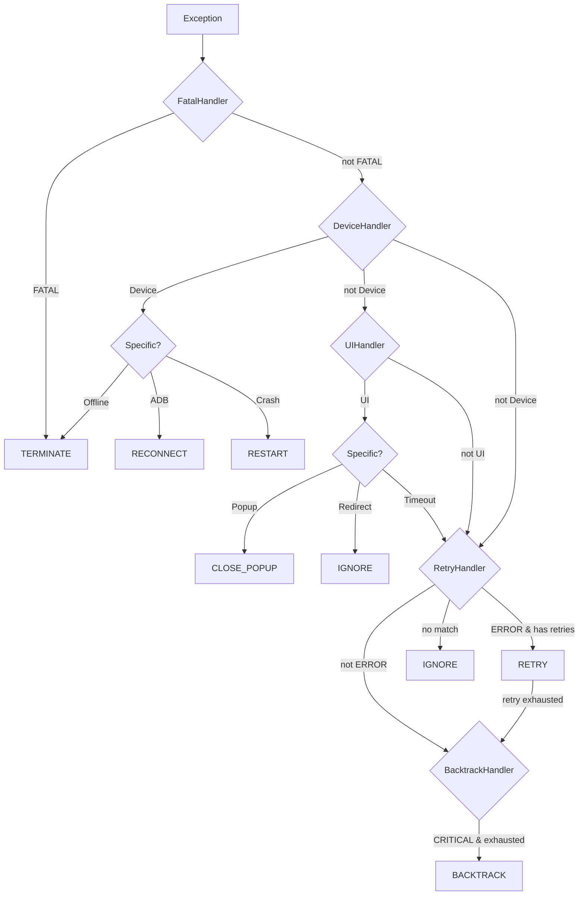
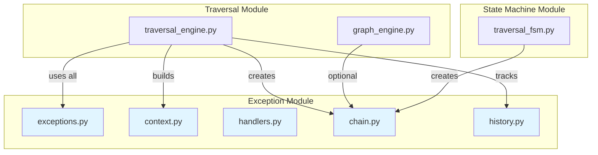
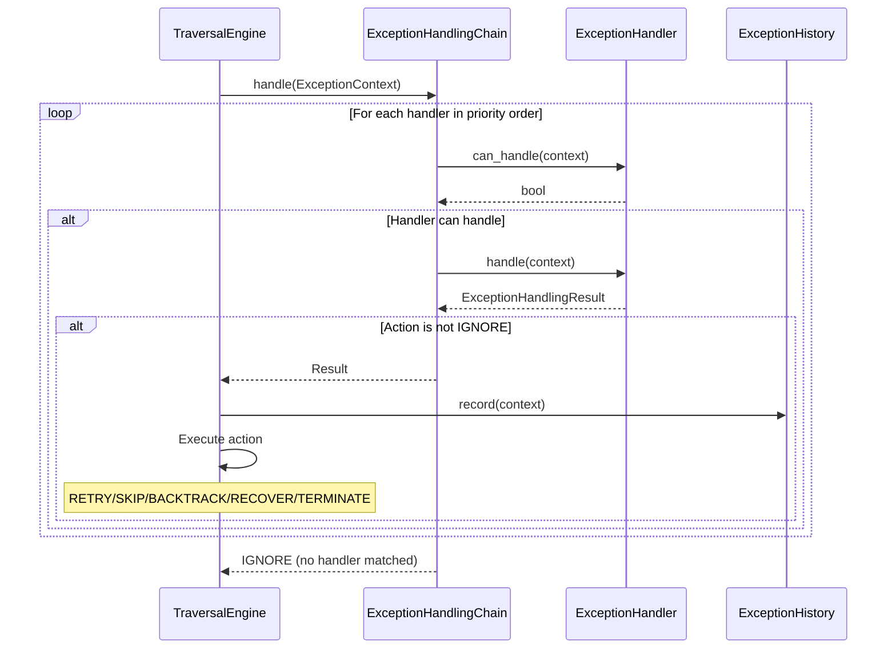
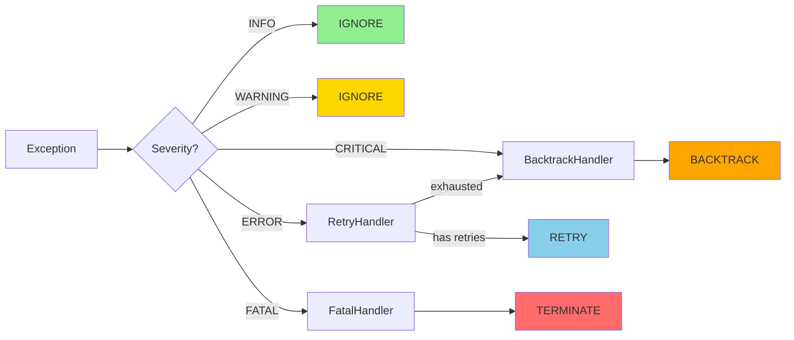

# Exception Module Design

**Module Path**: `src/exception/`

**Version**: V6.0

**Last Updated**: 2026-06-03

---

## 1. Module Overview

### 1.1 Purpose

The exception module provides a comprehensive exception handling framework for the uni-claw traversal system. It implements a hierarchical exception model with severity levels, chain-of-responsibility processing, and intelligent recovery actions.

### 1.2 Responsibilities

- Define exception hierarchy with severity classification
- Provide exception context and result data structures
- Implement chain-of-responsibility handler pattern
- Support recovery actions (retry, backtrack, reconnect, etc.)
- Track exception history for analysis
- Enable intelligent exception handling strategies

### 1.3 Design Philosophy

- **Severity-Based**: Exceptions classified by severity for appropriate handling
- **Chain of Responsibility**: Handlers tried in priority order
- **Context-Rich**: Exceptions carry context for intelligent recovery
- **Recovery-First**: Focus on recovery rather than failure
- **Extensible**: Easy to add new exception types and handlers

---

## 2. Module Structure

### 2.1 File Organization

```
src/exception/
├── __init__.py           # Public API exports
├── exceptions.py         # Exception class hierarchy
├── context.py            # Context and result dataclasses
├── handlers.py           # Handler implementations
├── chain.py              # Chain-of-responsibility manager
└── history.py            # Exception history tracking
```

### 2.2 Module Dependencies



---

## 3. Core Classes and Interfaces

### 3.1 Exception Severity

```python
class ExceptionSeverity(Enum):
    """Severity levels for exception classification."""
```

**Levels** (ordered from least to most severe):

| Severity | Description | Default Handling |
|----------|-------------|------------------|
| `INFO` | Normal variations (popups, redirects) | IGNORE - transparent handling |
| `WARNING` | Issues needing attention but not blocking | IGNORE - log and continue |
| `ERROR` | Failures requiring retry | RETRY - attempt recovery |
| `CRITICAL` | Serious issues requiring intervention | BACKTRACK - recover or backtrack |
| `FATAL` | Unrecoverable failures | TERMINATE - stop traversal |

**Methods**:
- `values() -> list[str]`: Get all enum values
- `from_value(value: str) -> ExceptionSeverity`: Create from string
- `is_valid(value: str) -> bool`: Validate string value

### 3.2 Exception Hierarchy

```mermaid
classDiagram
    class TraversalException {
        <<abstract>>
        +message: str
        +severity: ExceptionSeverity
        +_get_default_severity() ExceptionSeverity
    }

    class LocationException {
        <<Location/Positioning>>
    }

    class ElementNotFoundException {
        +element: str
        +context: str
    }

    class PathMismatchException {
        +expected: list~str~
        +actual: list~str~
    }

    class CoordinateExpiredException {
        +coordinate: str
        +reason: str
    }

    class OperationException {
        <<Operation Execution>>
    }

    class ClickFailedException {
        +target: str
        +attempts: int
    }

    class InputFailedException {
        +target: str
        +text: str
    }

    class DeviceException {
        <<Device-Related>>
    }

    class ADBDisconnectedException {
        +device: str
    }

    class AppCrashException {
        +app: str
        +reason: str
    }

    class DeviceOfflineException {
        +device: str
    }

    class UIException {
        <<UI State Changes>>
    }

    class PopupDetectedException {
        +popup_info: str
    }

    class PageRedirectException {
        +destination: str
    }

    class LoadingTimeoutException {
        +timeout: float
    }

    class AIException {
        <<AI Service Errors>>
    }

    class AIAnalysisFailedException {
        +service: str
        +error: str
    }

    class AIResponseInvalidException {
        +response: str
        +expected: str
    }

    TraversalException <|-- LocationException
    TraversalException <|-- OperationException
    TraversalException <|-- DeviceException
    TraversalException <|-- UIException
    TraversalException <|-- AIException

    LocationException <|-- ElementNotFoundException
    LocationException <|-- PathMismatchException
    LocationException <|-- CoordinateExpiredException

    OperationException <|-- ClickFailedException
    OperationException <|-- InputFailedException

    DeviceException <|-- ADBDisconnectedException
    DeviceException <|-- AppCrashException
    DeviceException <|-- DeviceOfflineException

    UIException <|-- PopupDetectedException
    UIException <|-- PageRedirectException
    UIException <|-- LoadingTimeoutException

    AIException <|-- AIAnalysisFailedException
    AIException <|-- AIResponseInvalidException
```



### 3.3 Exception Context

```python
@dataclass
class ExceptionContext:
    """Context information passed to exception handlers."""
```

**Fields**:

| Field | Type | Description |
|-------|------|-------------|
| `exception` | TraversalException | The exception that occurred |
| `severity` | ExceptionSeverity | Severity level |
| `state` | TraversalState | Current traversal state |
| `node` | Optional[ContentNode] | Current tree node |
| `operation` | str | Operation being performed |
| `timestamp` | datetime | When exception occurred |
| `retry_count` | int | Current retry attempt |

**Methods**:
- `to_dict() -> dict`: Serialize for logging

### 3.4 Exception Handling Result

```python
@dataclass
class ExceptionHandlingResult:
    """Result returned by exception handlers."""
```

**Fields**:

| Field | Type | Description |
|-------|------|-------------|
| `action` | ExceptionAction | Action to take |
| `message` | str | Human-readable description |
| `new_state` | Optional[str] | State transition target |
| `recovery_action` | Optional[RecoveryAction] | Recovery if action is RECOVER |

**Factory Methods**:
- `retry(message, retry_count, max_retries)` - Create RETRY result
- `skip(message)` - Create SKIP result
- `backtrack(message)` - Create BACKTRACK result
- `recover(recovery, new_state, message)` - Create RECOVER result
- `terminate(message)` - Create TERMINATE result
- `ignore(message)` - Create IGNORE result

### 3.5 Exception Actions

```python
class ExceptionAction(str, Enum):
    """Actions that can be taken when handling an exception."""
```

**Actions**:

| Action | Description | Use Case |
|--------|-------------|----------|
| `RETRY` | Retry operation with incremented count | Recoverable errors |
| `SKIP` | Skip current operation, continue next | Non-critical failures |
| `BACKTRACK` | Return to previous node | Exhausted retries |
| `RECOVER` | Execute recovery, then retry | Specific recovery needed |
| `TERMINATE` | Stop traversal, re-raise | Fatal errors |
| `IGNORE` | Log exception, continue | Info-level issues |

### 3.6 Recovery Actions

```python
class RecoveryAction(str, Enum):
    """Specific recovery actions to execute."""
```

**Actions**:

| Action | Description |
|--------|-------------|
| `RECONNECT_ADB` | Reconnect ADB connection |
| `RESTART_APP` | Stop and restart target app |
| `CLOSE_POPUP` | Close detected popup |
| `NAVIGATE_BACK` | Press back button |
| `WAIT_AND_RETRY` | Wait before retrying |
| `IGNORE_UI_CHANGE` | Log and continue |

### 3.7 Exception Handlers

```python
class ExceptionHandler(ABC):
    """Abstract base class for exception handlers."""
```

**Built-in Handlers**:

| Handler | Priority | Handles | Returns |
|---------|----------|---------|---------|
| `FatalExceptionHandler` | 0 | FATAL severity | TERMINATE |
| `DeviceExceptionHandler` | 1 | DeviceException | RECOVER/TERMINATE |
| `UIExceptionHandler` | 2 | UIException | RECOVER/IGNORE/RETRY |
| `RetryHandler` | 3 | ERROR severity | RETRY |
| `BacktrackHandler` | 4 | CRITICAL severity | BACKTRACK |

**Interface Methods**:
- `can_handle(context) -> bool`: Check if handler can process
- `handle(context) -> ExceptionHandlingResult`: Process exception

### 3.8 Exception Handling Chain

```python
class ExceptionHandlingChain:
    """Chain of responsibility for exception handling."""
```

**Features**:
- Handlers tried in priority order
- First non-IGNORE result wins
- Factory method for default chain
- Configurable handler list

**Methods**:
- `add_handler(handler, priority)`: Add handler at priority
- `set_handlers(handlers)`: Set complete handler list
- `handle(context) -> ExceptionHandlingResult`: Process exception
- `create_default(adb_client, max_retries)`: Create default chain

**Default Priority Order**:



### 3.9 Exception History

```python
class ExceptionHistory:
    """Records and queries exception history during traversal."""
```

**Features**:
- Rolling buffer with max size limit
- Query by type or severity
- Statistics generation
- Recent record retrieval

**Methods**:
- `record(context)`: Record exception context
- `get_by_type(exc_type)`: Query by exception type
- `get_by_severity(severity)`: Query by severity
- `get_statistics()`: Get exception statistics
- `get_recent(count)`: Get recent exceptions
- `clear()`: Clear all history

---

## 4. External Dependencies

### 4.1 Modules That Depend on Exception

| Module | Usage |
|--------|-------|
| `src.state_machine.traversal_fsm` | ExceptionHandlingChain |
| `src.traversal.traversal_engine` | Full exception system |
| `src.traversal.graph_engine` | Optional exception_chain |

### 4.2 Dependency Graph



---

## 5. Design Decisions

### 5.1 Severity Classification

**Decision**: Classify exceptions by severity rather than just type.

**Rationale**:
- Enables context-aware handling (FATAL > CRITICAL > ERROR > WARNING > INFO)
- Handlers can filter by severity regardless of exception type
- Supports graceful degradation (log warning but continue)
- Clear escalation path for retries

### 5.2 Chain of Responsibility

**Decision**: Use chain-of-responsibility pattern for handler ordering.

**Rationale**:
- Flexible handler composition
- Clear priority ordering
- Easy to add/remove handlers
- Handlers can be decorated or chained
- Testable in isolation

### 5.3 Recovery Actions

**Decision**: Separate recovery actions from exception actions.

**Rationale**:
- Recovery is a specific type of action (RECOVER)
- Enables specific recovery logic (close popup, reconnect ADB)
- Clear separation: what to do vs how to recover
- Extensible for new recovery types

### 5.4 Rich Exception Context

**Decision**: Include state, node, operation, and retry count in context.

**Rationale**:
- Handlers need full context for intelligent decisions
- Enables retry limit enforcement
- Supports state-aware recovery
- Useful for logging and debugging

### 5.5 History Tracking

**Decision**: Separate exception history from chain processing.

**Rationale**:
- History is orthogonal to handling
- Enables post-traversal analysis
- Supports statistics and pattern detection
- Rolling buffer prevents memory bloat
- Can be queried independently

### 5.6 Factory Methods for Results

**Decision**: Use factory methods for ExceptionHandlingResult creation.

**Rationale**:
- Consistent result creation
- Self-documenting (result.retry() vs Result(action=RETRY))
- Handles default values automatically
- Reduces boilerplate code

### 5.7 Default Handler Priority

**Decision**: Fatal > Device > UI > Retry > Backtrack.

**Rationale**:
- Fatal exceptions must stop immediately
- Device issues have specific recovery
- UI issues are common and handled automatically
- Retry is general fallback for ERROR
- Backtrack is last resort for CRITICAL

---

## 6. Exception Processing Flow



---

## 7. Usage Examples

### 7.1 Creating and Throwing Exceptions

```python
from src.exception import ElementNotFoundException, ExceptionSeverity

# Throw with context
raise ElementNotFoundException(
    element="submit-button",
    context="login-page"
)
# Default severity: ERROR
```

### 7.2 Using the Exception Chain

```python
from src.exception import ExceptionHandlingChain, ExceptionContext

# Create default chain
chain = ExceptionHandlingChain.create_default(
    adb_client=adb,
    max_retries=3
)

# Handle exception
result = chain.handle(ExceptionContext(
    exception=exc,
    severity=exc.severity,
    state=state,
    node=current_node,
    operation="click",
    timestamp=datetime.now(),
    retry_count=2
))

# Execute action
if result.action == ExceptionAction.RETRY:
    # Retry operation
    retry()
elif result.action == ExceptionAction.BACKTRACK:
    # Backtrack
    go_back()
```

### 7.3 Custom Handler

```python
from src.exception import ExceptionHandler, ExceptionContext, ExceptionHandlingResult

class CustomHandler(ExceptionHandler):
    def can_handle(self, context: ExceptionContext) -> bool:
        # Check if custom condition met
        return isinstance(context.exception, MyCustomException)

    def handle(self, context: ExceptionContext) -> ExceptionHandlingResult:
        # Handle with custom logic
        return ExceptionHandlingResult.recover(
            recovery=RecoveryAction.WAIT_AND_RETRY,
            message="Custom recovery"
        )

# Add to chain
chain.add_handler(CustomHandler(), priority=2)
```

### 7.4 Using Exception History

```python
from src.exception import ExceptionHistory

history = ExceptionHistory(max_records=1000)

# Record exceptions
history.record(exception_context)

# Query by type
element_not_found = history.get_by_type(ElementNotFoundException)

# Query by severity
errors = history.get_by_severity(ExceptionSeverity.ERROR)

# Get statistics
stats = history.get_statistics()
# {"total": 50, "by_type": {...}, "by_severity": {...}}

# Check if exception type occurred
if ElementNotFoundException in history:
    print("Element not found exceptions occurred")
```

---

## 8. Exception Severity Mapping

### 8.1 Default Severity by Exception Type

| Exception | Default Severity | Rationale |
|-----------|------------------|------------|
| `ElementNotFoundException` | ERROR | Element missing, retry may find it |
| `PathMismatchException` | WARNING | Navigation worked but path differs |
| `CoordinateExpiredException` | ERROR | Cache invalid, retry with fresh vision |
| `ClickFailedException` | ERROR | Action failed, retry may succeed |
| `InputFailedException` | ERROR | Input failed, retry may succeed |
| `ADBDisconnectedException` | CRITICAL | Can't operate without ADB |
| `AppCrashException` | CRITICAL | Can't continue without app |
| `DeviceOfflineException` | FATAL | Can't recover without device |
| `PopupDetectedException` | INFO | Normal UI variation |
| `PageRedirectException` | INFO | Navigation side effect |
| `LoadingTimeoutException` | WARNING | Performance issue, not blocking |
| `AIAnalysisFailedException` | ERROR | AI failure, may be transient |
| `AIResponseInvalidException` | WARNING | AI returned bad format |

### 8.2 Severity-Based Handler Routing



---

## 9. Integration with Traversal Engine

### 9.1 Exception Handling in TraversalEngine

```python
# From src/traversal/traversal_engine.py

def _build_exception_chain(self) -> ExceptionHandlingChain:
    """Build exception handling chain."""
    return ExceptionHandlingChain.create_default(
        adb_client=self.adb,
        max_retries=self.max_retries
    )

def _get_severity(self, exception: TraversalException) -> ExceptionSeverity:
    """Get exception severity."""
    return exception.severity

def execute_with_retry(self, operation, max_attempts=3):
    """Execute operation with exception handling."""
    for attempt in range(max_attempts):
        try:
            return operation()
        except TraversalException as e:
            exc_context = ExceptionContext(
                exception=e,
                severity=self._get_severity(e),
                state=self.state,
                operation=operation.__name__,
                timestamp=datetime.now(),
                retry_count=attempt
            )
            result = self.exception_chain.handle(exc_context)

            if result.action == ExceptionAction.RETRY:
                continue
            elif result.action == ExceptionAction.TERMINATE:
                raise
            # ... handle other actions
```

### 9.2 State Machine Integration

```python
# From src/state_machine/traversal_fsm.py

# V6 state machine can use exception chain
from src.exception import ExceptionHandlingChain

class TraversalFSM:
    def __init__(self):
        self.exception_chain = ExceptionHandlingChain.create_default()

    def execute_with_exception_handling(self, operation):
        try:
            operation()
        except TraversalException as e:
            # Use chain for handling
            result = self.exception_chain.handle(context)
            # Take action based on result
```

---

## 10. Future Enhancements

### 10.1 Phase 2: AI-Driven Handler

**Planned Feature**: AI-driven exception handler that analyzes screenshots and makes intelligent recovery decisions.

**Integration Points**:
- `ExceptionContext.screenshot` field (currently commented)
- `ExceptionHandlingResult.ai_result` field (currently commented)
- `AIDrivenExceptionHandler` class (placeholder in handlers.py)

**Design**:

```python
# Phase 2 implementation (future)
class AIDrivenExceptionHandler(ExceptionHandler):
    def __init__(self, ai_service):
        self.ai = ai_service

    def can_handle(self, context):
        return context.screenshot is not None

    def handle(self, context):
        analysis = self.ai.analyze_exception(
            screenshot=context.screenshot,
            exception=context.exception,
            state=context.state
        )
        return ExceptionHandlingResult.from_ai_decision(analysis)
```

### 10.2 Potential Improvements

1. **Exception Recovery Policies**: Configurable retry/backtrack strategies
2. **Exception Patterns**: Detect repeated exception patterns
3. **Exception Metrics**: Integration with observability system
4. **Exception Learning**: Learn from successful recoveries
5. **Exception Prediction**: Predict likely failures based on state

### 10.3 Extension Points

- New exception types for specific scenarios
- Custom handlers for domain-specific recovery
- Plugin architecture for handler loading
- Exception handler decorators
- Composite handlers combining multiple strategies

---

**Document Version**: 1.0
**Author**: Uni-Claw Architecture Team
