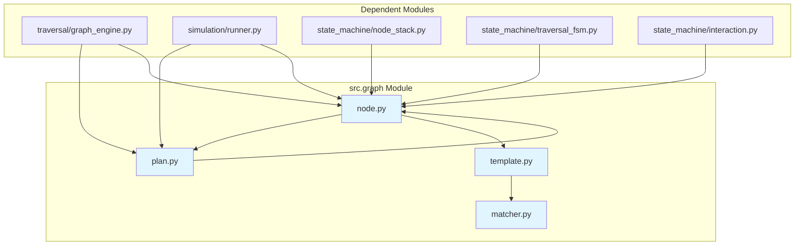

# Graph Module Design Document

> **Module**: `src/graph/`
> **Version**: V6.0
> **Last Updated**: 2026-06-03
> **Author**: Uni-Claw Development Team

---

## Table of Contents

1. [Module Overview](#module-overview)
2. [Core Abstractions](#core-abstractions)
3. [Data Model](#data-model)
4. [Template System](#template-system)
5. [Dynamic Matching](#dynamic-matching)
6. [Design Decisions](#design-decisions)
7. [Dependencies](#dependencies)
8. [Usage Examples](#usage-examples)

---

## 1. Module Overview

### 1.1 Purpose

The `src.graph` module provides the **core data model** for uni-claw's V6 declarative traversal system. It defines:

- **TraversalPlan**: Top-level container for declarative traversal specifications
- **TraversalNode**: Unified node abstraction representing UI elements and operations
- **Template System**: Reusable patterns for dynamic node instantiation
- **Dynamic Matching**: Runtime UI element to template matching

### 1.2 Key Responsibilities

| Responsibility | Description |
|----------------|-------------|
| **Data Model** | Define all data structures for traversal plans |
| **Serialization** | JSON import/export for plan persistence |
| **Template Registry** | Manage reusable node templates |
| **Placeholder Resolution** | Runtime template instantiation |
| **Dynamic Matching** | UI element to template mapping |

### 1.3 Module Structure

```
src/graph/
├── __init__.py         # Public API exports
├── node.py             # TraversalNode and all related data classes
├── plan.py             # TraversalPlan top-level container
├── template.py         # Template system (Template, TemplateRegistry, etc.)
├── matcher.py          # Dynamic matching (DynamicMatcher, MatchCondition)
└── test/               # Test suite
```

---

## 2. Core Abstractions

### 2.1 TraversalPlan

**Purpose**: Top-level container for complete traversal specifications

**Key Attributes**:
```python
@dataclass
class TraversalPlan:
    entry_app: str                          # Target application name
    entry_policy: EntryPolicy               # How to enter the app
    root_node: Optional[TraversalNode]     # Root traversal node
    static_nodes: Dict[str, TraversalNode] # Static node registry
    template_registry: Optional[str]       # Path to template registry JSON
    mode: TraversalMode                     # HYBRID, CONCRETE, or ABSTRACT
    completion_policy: CompletionPolicy    # Global completion criteria
    intent_slots: Optional[IntentSlots]    # AI-extracted intent
    meta: Dict[str, Any]                   # Additional metadata
```

**Design Rationale**:
- Separates **entry strategy** from **traversal logic**
- Supports both **static graphs** (predefined paths) and **dynamic graphs** (template-based)
- Enables **declarative traversal** - separate specification from execution

### 2.2 TraversalNode

**Purpose**: Unified abstraction for any UI element or operation in traversal

**Key Attributes**:
```python
@dataclass
class TraversalNode:
    node_id: str                      # Unique identifier
    name: str                         # Display name
    node_type: NodeType               # CONTAINER, LEAF_*, SCREEN, etc.
    operation: Operation              # Action to execute
    precondition: Optional[Precondition]       # Pre-execution checks
    children_strategy: ChildrenStrategy       # How to generate children
    error_policy: Optional[ErrorPolicy]       # Error handling
    exit_condition: Optional[ExitCondition]   # Container exit behavior
    meta: Dict[str, Any]              # Runtime metadata
```

**Design Rationale**:
- **Single abstraction** for all UI elements (menus, switches, sliders, screens)
- **Composability** through children_strategy (static or dynamic)
- **Explicit error handling** per node
- **State tracking** through meta dictionary

### 2.3 NodeType Enum

Defines all possible node types:

| Type | Description | Children Strategy |
|------|-------------|-------------------|
| `CONTAINER` | Expandable element (menus, lists) | DYNAMIC_MATCH or STATIC |
| `LEAF_SWITCH` | Toggle control | NONE (with restore) |
| `LEAF_SLIDER` | Slider control | NONE (with restore) |
| `LEAF_ACTION` | One-time action button | NONE |
| `LEAF_INFO` | Information display | NONE |
| `SCREEN` | Screen page | DYNAMIC_MATCH or STATIC |
| `ACTION` | Generic action | NONE |
| `TARGET` | Target node | NONE |

---

## 3. Data Model

### 3.1 Operation

**Defines what action to execute on a node**:

```python
@dataclass
class Operation:
    action: str                # "click", "swipe", "back", "input_text", "no_action"
    target: Optional[Target]  # Which element to target
    params: Dict[str, Any]   # Action parameters
    restore: Optional[RestoreAction]  # Optional state restoration
```

### 3.2 Target

**Specifies how to locate UI elements**:

```python
@dataclass
class Target:
    by: str      # "text", "coordinate", "ui_index"
    value: Any   # The actual value (str, tuple, int)
    meta: Dict[str, Any]
```

### 3.3 ChildrenStrategy

**Defines how to generate child nodes**:

```python
@dataclass
class ChildrenStrategy:
    type: ChildrenStrategyType        # STATIC, DYNAMIC_MATCH, NONE
    static_children: List[str]        # For STATIC type
    dynamic_rules: Dict[str, DynamicRule]  # For DYNAMIC_MATCH
    max_children: int = 100           # Safety limit
```

**Strategy Types**:
- **STATIC**: Predefined list of child node IDs
- **DYNAMIC_MATCH**: Runtime UI element discovery and template matching
- **NONE**: Leaf node (no children)

### 3.4 V6 Policy Types

#### CompletionPolicy

**Global traversal completion criteria**:

```python
@dataclass
class CompletionPolicy:
    type: CompletionPolicyType          # NONE, TARGET_FOUND, TIMEOUT, MAX_STEPS
    target_name: Optional[str]          # For TARGET_FOUND
    match_mode: MatchMode               # EXACT or CONTAINS
    action_on_found: TargetFoundAction  # MARK_AND_STOP or EXECUTE_THEN_STOP
    timeout_seconds: Optional[float]    # For TIMEOUT
    max_steps: Optional[int]            # For MAX_STEPS
```

#### ExitCondition

**Container node exit behavior**:

```python
@dataclass
class ExitCondition:
    type: ExitConditionType      # ALL_CHILDREN_VISITED, DEPTH_LIMITED, SINGLE_LEVEL
    fallback: FallbackAction      # BACK, AUTO_ESCAPE, SKIP, ABORT
    max_depth: Optional[int]      # For DEPTH_LIMITED
```

#### EntryPolicy

**Application entry strategy**:

```python
@dataclass
class EntryPolicy:
    strategy: EntryStrategy       # COLD_LAUNCH, DIRECT_DEEPLINK, BIND_CURRENT_SCREEN
    fallback: Optional[str]      # Fallback entry if primary fails
    wait_condition: Optional[Dict[str, Any]]  # Expected screen state
    timeout_seconds: float = 10.0
```

---

## 4. Template System

### 4.1 Overview

The template system enables **dynamic node instantiation** from reusable patterns. This is critical for:

- **Dynamic UI traversal**: Handle unknown app structures
- **Pattern reuse**: Define common UI patterns once
- **Runtime flexibility**: Adapt to discovered UI elements

### 4.2 Template

```python
@dataclass
class Template:
    template_id: str
    node_type: NodeType
    operation: Dict[str, Any]
    precondition: Optional[Dict[str, Any]]
    children_strategy: Optional[Dict[str, Any]]
    error_policy: Optional[Dict[str, Any]]
    meta: Dict[str, Any]
```

### 4.3 PlaceholderResolver

**Resolves placeholders in templates**:

**Supported Placeholders**:
- `{{item_text}}` - UI element text content
- `{{item_index}}` - UI element index in list
- `{{coordinate_x}}` - X coordinate (0-1 normalized)
- `{{coordinate_y}}` - Y coordinate (0-1 normalized)
- `{{parent_id}}` - Parent node ID

**Design**: Uses regex pattern matching (`\{\{(\w+)\}\}`) for recursive resolution.

### 4.4 TemplateRegistry

**Manages template collection and instantiation**:

```python
class TemplateRegistry:
    def __init__(self, custom_path: Optional[Path] = None):
        # Loads built-in defaults + optional custom templates

    def load_from_file(self, path: Path) -> None:
        # Load from JSON file

    def instantiate(self, template_id: str, context: Dict[str, Any]) -> Optional[TraversalNode]:
        # Instantiate template with runtime context
```

**Built-in Templates**:
- `menu_container`: Standard menu item with nested menu discovery
- `switch_leaf`: Toggle switch with automatic restore
- `slider_leaf`: Slider control with bidirectional swipe

### 4.5 TemplateInstantiator

**Creates concrete TraversalNode from Template**:

```python
class TemplateInstantiator:
    def instantiate(self, template: Template, context: Dict[str, Any]) -> TraversalNode:
        # 1. Generate unique node_id
        # 2. Resolve all placeholders
        # 3. Create node components
        # 4. Return TraversalNode
```

---

## 5. Dynamic Matching

### 5.1 DynamicMatcher

**Matches discovered UI elements to templates**:

```python
class DynamicMatcher:
    def __init__(self, template_registry: TemplateRegistry):
        self.template_registry = template_registry
        self.rules: Dict[str, Dict[str, Any]] = {}

    def match(self, menu_item: Dict[str, Any], parent_node: TraversalNode) -> MatchResult:
        # Evaluate menu_item against rules, return best match

    def instantiate_match(self, match_result: MatchResult) -> Optional[TraversalNode]:
        # Create node from match result
```

### 5.2 MatchCondition

**Criteria for matching UI elements**:

```python
class MatchCondition:
    def __init__(self, condition: Dict[str, Any]):
        self.type = condition.get("type")              # UI element type
        self.expected_action = condition.get("expected_action")
        self.text_pattern = condition.get("text_pattern")  # Regex
        self.min_index = condition.get("min_index")
        self.max_index = condition.get("max_index")
        self.custom = condition.get("custom")
```

### 5.3 MatchResult

```python
@dataclass
class MatchResult:
    matched: bool
    rule_id: Optional[str]
    template_id: Optional[str]
    action: MatchAction           # GENERATE_CHILD, SKIP, EXECUTE_INLINE
    menu_item: Optional[Dict[str, Any]]
    context: Dict[str, Any]
```

---

## 6. Design Decisions

### 6.1 Dataclass-Based Design

**Decision**: Use Python `dataclass` for all model classes

**Rationale**:
- **Boilerplate reduction**: Auto-generated `__init__`, `__repr__`, `__eq__`
- **Type safety**: Built-in type annotation support
- **Immutability**: Optional `frozen=True` for value types
- **IDE support**: Better autocomplete and type checking

### 6.2 Enum for Fixed Values

**Decision**: Use `str, Enum` for all enumerated types

**Rationale**:
- **Serialization**: String enums serialize cleanly to JSON
- **Validation**: Built-in value validation
- **Documentation**: Self-documenting code
- **Type safety**: Compile-time type checking

### 6.3 Placeholder Strategy

**Decision**: Double-brace placeholders (`{{name}}`)

**Rationale**:
- **Unambiguous**: Doesn't conflict with JSON or Python syntax
- **Industry standard**: Used by Jinja2, Mustache, etc.
- **Explicit**: Clear separation of template and runtime data
- **Limited set**: Prevents injection attacks through whitelist

### 6.4 Post-Init Validation

**Decision**: Validate in `__post_init__` rather than properties

**Rationale**:
- **Fail-fast**: Catch errors immediately on construction
- **No hidden costs**: No runtime validation overhead
- **Clear errors**: Validation failures at construction point
- **Simple**: No need for property setters

### 6.5 Recursive Placeholder Resolution

**Decision**: Support nested structures (dict, list) for placeholders

**Rationale**:
- **Flexibility**: Allow placeholders anywhere in the template
- **Nested structures**: Support complex UI element hierarchies
- **Consistent**: Single resolution mechanism for all data types

### 6.6 Separation of Template and Node

**Decision**: Separate `Template` from `TraversalNode`

**Rationale**:
- **Intent**: Template is pattern, Node is concrete instance
- **Validation**: Different validation rules for each
- **Serialization**: Templates serialize to JSON, Nodes use in-memory
- **Lifecycle**: Templates are reusable, Nodes are single-use

### 6.7 Strategy Pattern for Children

**Decision**: Enum-based strategy types + configuration dataclasses

**Rationale**:
- **Extensible**: Easy to add new strategies
- **Type-safe**: Compile-time validation of strategy types
- **Documented**: Self-documenting through enum names
- **Testable**: Each strategy can be tested independently

---

## 7. Dependencies

### 7.1 Internal Dependencies

**Zero external dependencies** - pure Python standard library only:

- `dataclasses` (Python 3.7+)
- `enum` (standard library)
- `json` (standard library)
- `pathlib` (standard library)
- `re` (standard library)
- `typing` (standard library)

### 7.2 Intra-Project Dependencies

**Modules that depend on `src.graph`**:

| Module | Purpose | Imports |
|--------|---------|---------|
| `src/traversal/graph_engine.py` | Graph traversal execution | `TraversalPlan`, `TraversalNode`, enums |
| `src/simulation/runner.py` | Simulation testing | `TraversalPlan`, `TraversalNode` |
| `src/state_machine/node_stack.py` | Stack management | `TraversalNode` |
| `src/state_machine/traversal_fsm.py` | State machine logic | Enums (ExitCondition, FallbackAction, etc.) |
| `src/state_machine/interaction.py` | Node interaction | `TraversalNode` |

### 7.3 Dependency Graph



### 7.4 Import Summary

**Public API Exports** (`__init__.py`):
```python
# Node types and classes
TraversalNode, NodeType, Operation, Target, Precondition
ChildrenStrategy, ChildrenStrategyType, DynamicRule, ErrorPolicy, RestoreAction

# V6 enums
ExitConditionType, FallbackAction, CompletionPolicyType
TargetFoundAction, MatchMode, EntryStrategy, TraversalMode

# V6 policy classes
ExitCondition, CompletionPolicy, EntryPolicy, IntentSlots

# Plan model
TraversalPlan

# Template system
Template, TemplateRegistry, TemplateRegistryError
PlaceholderResolver, TemplateInstantiator, TemplateValidator

# Dynamic matching
DynamicMatcher, MatchResult, MatchCondition, MatchAction
```

---

## 8. Usage Examples

### 8.1 Creating a Simple Plan

```python
from src.graph import (
    TraversalPlan, TraversalNode, NodeType,
    Operation, Target, ChildrenStrategy, ChildrenStrategyType,
    EntryPolicy, EntryStrategy
)

# Create a simple static plan
root = TraversalNode(
    node_id="root",
    name="Root Menu",
    node_type=NodeType.CONTAINER,
    operation=Operation(action="no_action"),
    children_strategy=ChildrenStrategy(
        type=ChildrenStrategyType.STATIC,
        static_children=["settings", "profile"]
    ),
    static_nodes={
        "settings": TraversalNode(
            node_id="settings",
            name="Settings",
            node_type=NodeType.LEAF_ACTION,
            operation=Operation(
                action="click",
                target=Target(by="text", value="Settings")
            )
        ),
        "profile": TraversalNode(
            node_id="profile",
            name="Profile",
            node_type=NodeType.LEAF_ACTION,
            operation=Operation(
                action="click",
                target=Target(by="text", value="Profile")
            )
        )
    }
)

plan = TraversalPlan(
    entry_app="MyApp",
    entry_policy=EntryPolicy(strategy=EntryStrategy.COLD_LAUNCH),
    root_node=root
)

# Serialize to JSON
json_plan = plan.to_json()
```

### 8.2 Using Templates

```python
from src.graph import TemplateRegistry

# Load template registry
registry = TemplateRegistry()

# Instantiate a menu template
context = {
    "item_text": "Settings",
    "item_index": 0,
    "parent_id": "root"
}

settings_node = registry.instantiate("menu_container", context)
```

### 8.3 Dynamic Matching

```python
from src.graph import DynamicMatcher, TemplateRegistry

# Setup matcher
registry = TemplateRegistry()
matcher = DynamicMatcher(registry)

# Load rules
rules = {
    "menu_rule": {
        "match_condition": {"type": "menu_item"},
        "child_template": "menu_container",
        "action": "generate_child"
    }
}
matcher.load_rules(rules)

# Match discovered UI element
menu_item = {"type": "menu_item", "text": "Settings", "index": 0}
parent_node = TraversalNode(...)  # Some parent

result = matcher.match(menu_item, parent_node)
if result.matched:
    child_node = matcher.instantiate_match(result)
```

### 8.4 Completion Policies

```python
from src.graph import (
    TraversalPlan, CompletionPolicy, CompletionPolicyType,
    MatchMode, TargetFoundAction, IntentSlots
)

# Create plan with target-based completion
plan = TraversalPlan(
    entry_app="MyApp",
    completion_policy=CompletionPolicy(
        type=CompletionPolicyType.TARGET_FOUND,
        target_name="Version",
        match_mode=MatchMode.CONTAINS,
        action_on_found=TargetFoundAction.MARK_AND_STOP
    ),
    intent_slots=IntentSlots(
        target_app="MyApp",
        scope="target_only",
        target="Version",
        depth=10
    )
)
```

---

## Appendix A: Enum Values

### NodeType
- `CONTAINER` - Expandable elements
- `LEAF_SWITCH` - Toggle controls
- `LEAF_SLIDER` - Slider controls
- `LEAF_ACTION` - Action buttons
- `LEAF_INFO` - Information displays
- `SCREEN` - Screen pages
- `ACTION` - Generic actions
- `TARGET` - Target nodes

### ExitConditionType
- `ALL_CHILDREN_VISITED` - Wait for all children
- `DEPTH_LIMITED` - Exit at max depth
- `SINGLE_LEVEL` - Process direct children only

### FallbackAction
- `BACK` - Press Back key
- `AUTO_ESCAPE` - Try sibling or Back
- `SKIP` - Skip without action
- `ABORT` - Abort traversal

### CompletionPolicyType
- `NONE` - Run to natural completion
- `TARGET_FOUND` - Stop when target found
- `TIMEOUT` - Stop after timeout
- `MAX_STEPS` - Stop after N steps

### TargetFoundAction
- `MARK_AND_STOP` - Mark and immediately stop
- `EXECUTE_THEN_STOP` - Execute operation then stop

### EntryStrategy
- `COLD_LAUNCH` - Start from home screen
- `DIRECT_DEEPLINK` - Use Intent/ADB
- `BIND_CURRENT_SCREEN` - Assume already on screen

### TraversalMode
- `HYBRID` - Static + dynamic
- `CONCRETE` - Predefined paths only
- `ABSTRACT` - Fully dynamic

---

## Appendix B: Serialization Format

### TraversalPlan JSON Schema

```json
{
  "entry_app": "string (required)",
  "mode": "hybrid|concrete|abstract",
  "entry_policy": {
    "strategy": "cold_launch|direct_deeplink|bind_current_screen",
    "fallback": "string (optional)",
    "wait_condition": {},
    "timeout_seconds": 10.0
  },
  "root_node": {
    "node_id": "string",
    "name": "string",
    "node_type": "container|leaf_switch|...",
    "operation": {
      "action": "click|swipe|back|input_text|no_action",
      "target": {"by": "text|coordinate|ui_index", "value": "..."},
      "params": {},
      "restore": {"action": "...", "target": {...}}
    },
    "precondition": {
      "page_name": "string (optional)",
      "path": ["...", "..."],
      "ui_condition": "string (optional)",
      "timeout_seconds": 5.0
    },
    "children_strategy": {
      "type": "static|dynamic_match|none",
      "static_children": ["node_id1", "node_id2"],
      "dynamic_rules": {
        "rule_id": {
          "rule_id": "string",
          "match_condition": {},
          "child_template": "template_id",
          "action": "generate_child|skip|execute_inline"
        }
      },
      "max_children": 100
    },
    "error_policy": {
      "on_error": "retry|skip|abort|fallback|backtrack",
      "max_retries": 1,
      "fallback_target": "node_id (optional)",
      "continue_on_error": false
    },
    "exit_condition": {
      "type": "all_children_visited|depth_limited|single_level",
      "fallback": "back|auto_escape|skip|abort",
      "max_depth": 3
    },
    "meta": {}
  },
  "static_nodes": {
    "node_id": { /* same structure as root_node */ }
  },
  "completion_policy": {
    "type": "none|target_found|timeout|max_steps",
    "target_name": "string (for target_found)",
    "match_mode": "exact|contains",
    "action_on_found": "mark_and_stop|execute_then_stop",
    "timeout_seconds": 30.0,
    "max_steps": 1000
  },
  "intent_slots": {
    "target_app": "string",
    "scope": "full|partial|target_only",
    "target": "string",
    "depth": 10,
    "element_handling": "string",
    "navigation": "string",
    "restore": true,
    "completion": "string"
  },
  "template_registry": "path/to/registry.json",
  "meta": {}
}
```

---

## 9. Testing and Mock Configuration

> **测试场景**: 详见 [GRAPH_TEST_SCENARIOS.md](../../testing/GRAPH_TEST_SCENARIOS.md)  
> **Mock配置**: 本节

### 9.1 Core Test Scenarios

Graph模块有205+个测试场景，覆盖：

| 类别 | 场景数 | 示例场景ID |
|------|--------|-----------|
| Data Models | 40+ | PLAN-001 to PLAN-010 |
| Node Types | 50+ | NODE-001 to NODE-010 |
| Operations | 30+ | OP-001 to OP-010 |
| Boundaries | 15+ | SM-B001 to SM-B005 |
| Error Cases | 25+ | SM-E001 to SM-E005 |
| Features | 35+ | TPL-001 to TPL-010 |
| Integration | 10+ | Various |

### 9.2 Mock Configuration Guide

#### External Dependencies

| 组件 | 方法/属性 | Mock要求 | 返回值设置 |
|------|-----------|----------|------------|
| **TraversalContext** | `current_screen` | Mock或真实 | `Mock(screen_info)` |
| **TraversalContext** | `match_results` | Mock或真实 | `[MatchResult(...)]` |
| **UIElementFinder** | `find_elements()` | 必须Mock | `[MockElement(...)]` |
| **ScreenCapturer** | `capture()` | 可选Mock | `Mock(screen_image)` |
| **ElementMatcher** | `match()` | 可选Mock | `bool` |

#### Standard Mock Template

```python
import pytest
from unittest.mock import Mock, MagicMock
from src.graph.node import TraversalNode, NodeType, ChildrenStrategy
from src.graph.plan import TraversalPlan

@pytest.fixture
def graph_test_setup():
    """完整的Graph模块测试Mock配置"""
    
    # Mock TraversalContext
    mock_context = Mock()
    mock_context.current_screen = Mock()
    mock_context.match_results = []
    
    # Mock UIElementFinder
    mock_finder = Mock()
    mock_element = Mock()
    mock_element.text = "Settings"
    mock_element.resource_id = "com.app:id/settings"
    mock_finder.find_elements.return_value = [mock_element]
    
    # Mock ScreenCapturer
    mock_capturer = Mock()
    mock_capturer.capture.return_value = Mock()
    
    # Mock ElementMatcher
    mock_matcher = Mock()
    mock_matcher.match.return_value = True
    
    # 示例节点
    sample_node = TraversalNode(
        node_id="settings",
        node_type=NodeType.LEAF_ACTION,
        children_strategy=ChildrenStrategy(strategy_type=StrategyType.NONE),
        operation={"action": "click", "target": {"by": "text", "value": "Settings"}}
    )
    
    return {
        'context': mock_context,
        'finder': mock_finder,
        'capturer': mock_capturer,
        'matcher': mock_matcher,
        'sample_node': sample_node
    }
```

### 9.3 Critical Scenarios

#### GR-001: 创建最小遍历计划

**类型**: normal  
**优先级**: P1

```python
def test_create_minimal_plan():
    plan_data = {
        "entry_app": "com.example.app",
        "entry_strategy": {"type": "COLD_LAUNCH"},
        "root_node": {
            "node_id": "root",
            "node_type": "SCREEN",
            "children_strategy": {"strategy_type": "NONE"}
        }
    }
    plan = TraversalPlan.from_dict(plan_data)
    assert plan.entry_app == "com.example.app"
```

#### GR-004: 循环引用检测

**类型**: error  
**优先级**: P1

```python
def test_circular_reference_detection():
    # A → B → A (循环引用)
    plan_data = {
        "root_node": {"node_id": "a", "static_children": ["b"]},
        "static_nodes": {
            "a": {...},
            "b": {"node_id": "b", "static_children": ["a"]}  # 循环
        }
    }
    with pytest.raises(ValidationError):
        TraversalPlan.from_dict(plan_data)
```

#### GR-005: 占位符解析

**类型**: normal  
**优先级**: P1

```python
def test_placeholder_resolution():
    template = "Click on {{item_text}} button"
    context = {"item_text": "Settings"}
    resolved = PlaceholderResolver.resolve(template, context)
    assert resolved == "Click on Settings button"
    assert "{{" not in resolved  # 所有占位符已解析
```

---

**Document Version**: 1.1 (补充测试场景版本)
**Last Modified**: 2026-06-08
**Status**: Stable
