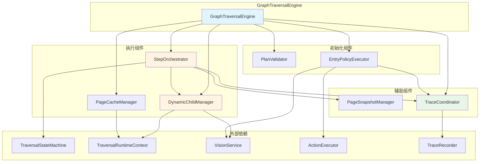
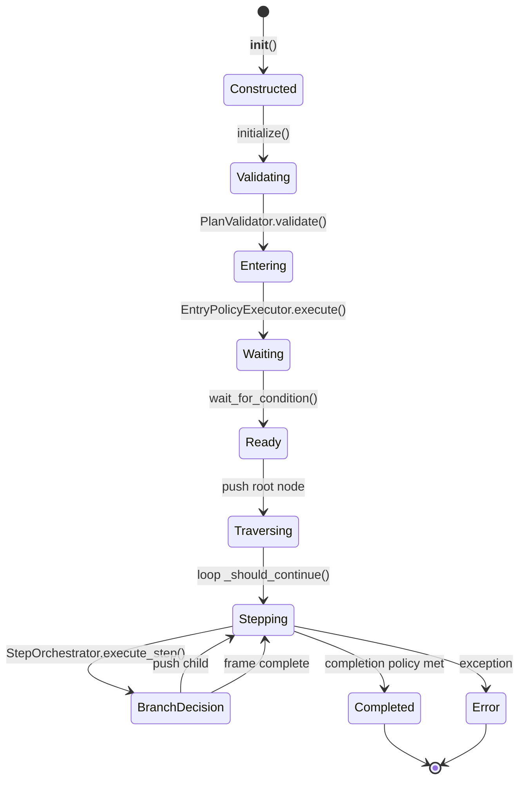
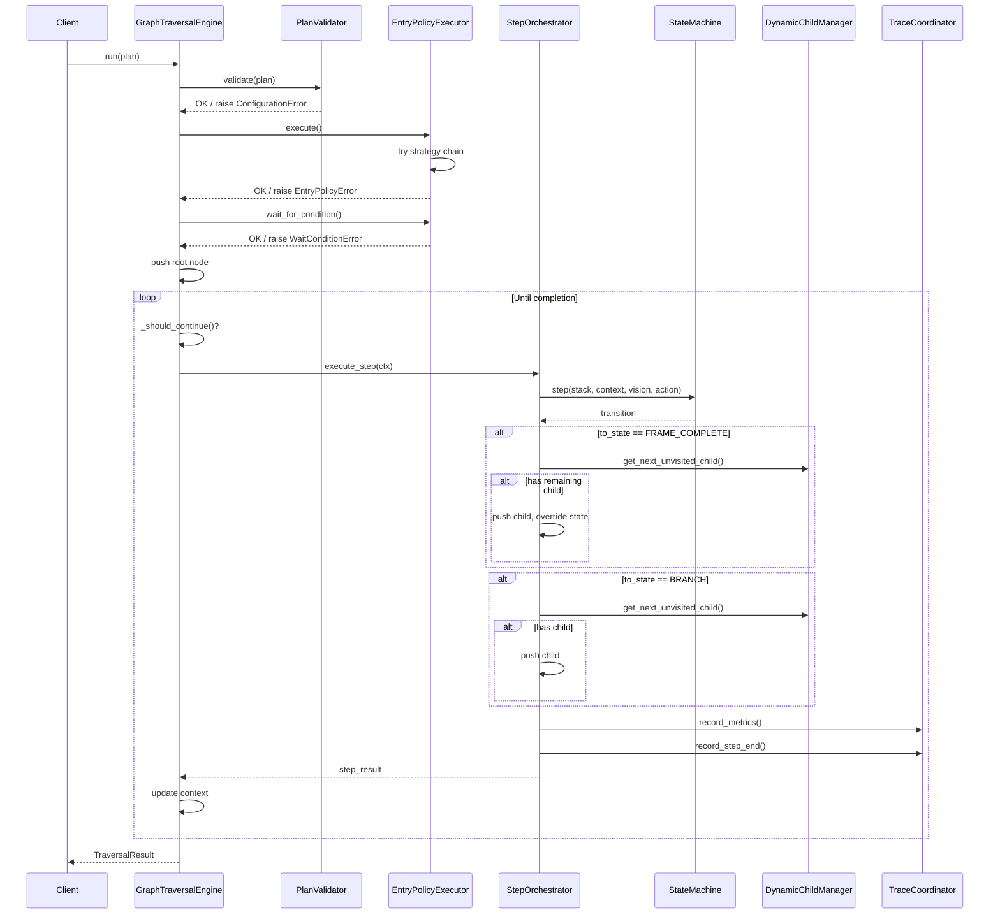
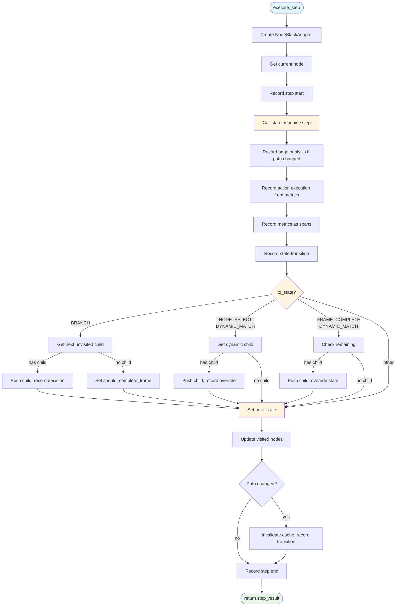
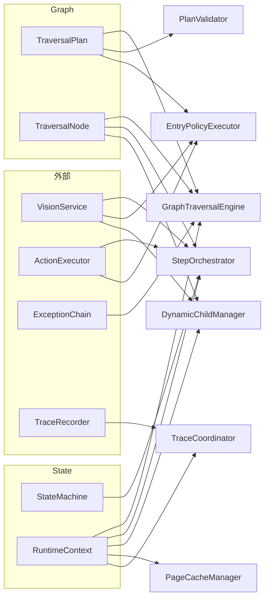

# GraphTraversalEngine 架构设计文档 (V6.11)

> **模块**: `src/traversal/graph_engine.py`
> **版本**: V6.11.0
> **最后更新**: 2026-06-09
> **状态**: 已实施

---

## 目录

1. [概述](#概述)
2. [架构目标](#架构目标)
3. [组件架构](#组件架构)
4. [流转过程](#流转过程)
5. [组件详解](#组件详解)
6. [状态管理](#状态管理)
7. [Trace 集成](#trace-集成)
8. [错误处理](#错误处理)
9. [与 V6.5/V6.9 的差异](#与-v65v69-的差异)
10. [设计决策](#设计决策)

---

## 1. 概述

### 1.1 目的

GraphTraversalEngine 是 Uni-Claw V6 声明式遍历的核心执行引擎。它负责：
- 根据 TraversalPlan 执行 UI 遍历
- 通过状态机驱动控制流
- 协调视觉服务、动作执行器、异常处理链
- 集成分布式追踪系统

### 1.2 V6.11 重构目标

V6.11 将**流转逻辑**与**组件职责**分离，使 Engine 成为纯粹的编排者：

| 问题 | 解决方案 |
|------|----------|
| `_step_once` 方法混合多种职责 | 提取 StepOrchestrator |
| 动态匹配逻辑散落在 Engine 中 | 提取 DynamicChildManager |
| 入口策略承载初始化流程 | 提取 EntryPolicyExecutor |
| `_record_*` 方法混杂在 Engine 中 | 提取 TraceCoordinator |

### 1.3 设计原则

1. **单一职责**: 每个组件只负责一个明确的职责
2. **依赖注入**: 所有外部服务通过构造函数注入
3. **接口隔离**: 组件之间通过明确的小接口通信
4. **可测试性**: 每个组件可独立单元测试
5. **仿真验证**: 所有重构必须通过仿真测试

---

## 2. 架构目标

### 2.1 硬性约束

**仿真测试是唯一的成功标准。** 重构不改变任何外部行为，仿真测试必须通过：
- 89 步 COMPLETED
- 19 个节点
- 全部一级菜单 + 二级菜单遍历

### 2.2 职责分离

```
V6.10: GraphTraversalEngine (1990 行, 54 个方法)
   ├── 初始化
   ├── 入口策略
   ├── 动态匹配
   ├── 缓存管理
   ├── Trace 记录
   └── 状态机调度

V6.11: GraphTraversalEngine (编排者)
   ├── PlanValidator          # 计划验证
   ├── EntryPolicyExecutor    # 入口策略 & 等待条件
   ├── StepOrchestrator       # 核心步骤调度
   ├── DynamicChildManager    # 动态子节点生成、缓存、失效
   ├── PageSnapshotManager    # 页面指纹计算
   ├── TraceCoordinator       # Metrics → Span 转换
   └── PageCacheManager       # 页面缓存存取
```

---

## 3. 组件架构

### 3.1 组件图



### 3.2 模块结构

```
src/traversal/
├── graph_engine.py              # 主引擎 (编排者)
├── step_orchestrator.py         # 步骤编排器
├── dynamic_child_manager.py     # 动态子节点管理器
├── entry_policy_executor.py     # 入口策略执行器
├── plan_validator.py           # 计划验证器
├── page_cache_manager.py       # 页面缓存管理器
├── page_snapshot_manager.py    # 页面快照管理器
└── trace_coordinator.py        # Trace 协调器
```

---

## 4. 流转过程

### 4.1 生命周期



### 4.2 主循环流程



### 4.3 StepOrchestrator 内部流程



---

## 5. 组件详解

### 5.1 GraphTraversalEngine (编排者)

**职责**:
- 持有所有组件实例
- 实现主循环 `run()`
- 检查完成策略和深度限制
- 创建 `TraversalResult`

**关键方法**:

```python
class GraphTraversalEngine:
    def __init__(
        self,
        plan: TraversalPlan,
        vision_service: Any,
        action_executor: Any,
        exception_chain: Optional[Any] = None,
        trace_recorder: Optional[TraceRecorder] = None,
        test_metadata: Optional[Dict[str, Any]] = None,
    )

    def initialize(self) -> None:
        """初始化: 验证计划 → 执行入口策略 → 等待条件 → 推入根节点"""

    def run(self) -> TraversalResult:
        """执行主循环"""

    def _should_continue(self) -> bool:
        """检查是否应该继续遍历"""

    def _check_completion_policy(self) -> bool:
        """检查完成策略是否触发"""
```

**初始化流程**:

```
initialize()
  ├── 设置 global_state = INITIALIZING
  ├── PlanValidator.validate(plan)
  ├── 创建 Session + TraceRecorder.init()
  ├── EntryPolicyExecutor.execute()
  ├── EntryPolicyExecutor.wait_for_condition()
  ├── _validate_and_push_root_node()
  └── 设置 global_state = TRAVERSING
```

---

### 5.2 PlanValidator

**职责**: 验证 TraversalPlan 的结构正确性

**接口**:

```python
class PlanValidator:
    @staticmethod
    def validate(plan: TraversalPlan) -> None:
        """验证计划合法性，不合法抛出 ConfigurationError"""
```

**验证规则**:
1. `root_node` 必须存在
2. `root_node.node_type` 必须是 `CONTAINER`
3. `root_node.operation.action` 必须是 `"no_action"`

---

### 5.3 EntryPolicyExecutor

**职责**: 执行入口策略链，等待入口条件

**接口**:

```python
class EntryPolicyExecutor:
    def __init__(
        self,
        plan: TraversalPlan,
        vision_service: Any,
        action_executor: Any,
        trace: Optional[Any] = None,
    )

    def execute(self) -> None:
        """运行入口策略回退链。全部失败抛出 EntryPolicyError"""

    def wait_for_condition(self) -> bool:
        """验证入口条件。失败抛出 WaitConditionError"""
```

**策略链构建**:

```
_build_chain():
  1. 主策略 (entry_policy.strategy)
  2. 回退策略 (entry_policy.fallback)
  3. BIND_CURRENT_SCREEN (兜底)
```

**策略执行**:

| 策略 | 实现 |
|------|------|
| `DIRECT_DEEPLINK` | `action.execute_deeplink(app://)` |
| `COLD_LAUNCH` | `action.press_home()` → 找图标 → `action.click()` |
| `BIND_CURRENT_SCREEN` | 无操作，仅等待 |

**等待条件**:

| 模式 | 行为 |
|------|------|
| `fast` | 单次验证 |
| `polling` | 轮询直到超时 |

---

### 5.4 StepOrchestrator

**职责**: 执行单个状态机步骤，处理引擎级别的拦截和决策

**接口**:

```python
class StepOrchestrator:
    def execute_step(self, ctx: StepContext) -> Dict[str, Any]:
        """
        执行一个完整的状态机步骤：
        1. 获取当前节点
        2. 调用状态机
        3. FRAME_COMPLETE 拦截
        4. BRANCH 后子节点推入
        5. 路径变化检测 & 缓存失效
        6. 记录 step 结束
        """
```

**StepContext 结构**:

```python
@dataclass
class StepContext:
    context: TraversalRuntimeContext
    state_machine: TraversalStateMachine
    vision: Any
    action: Any
    child_mgr: Any
    node_registry: Dict[str, TraversalNode]
    trace: Any
    # 可变跟踪字段
    last_known_path: List[str]
    last_recorded_path: List[str]
    last_recorded_action: Optional[str] = None
```

**关键拦截逻辑**:

1. **FRAME_COMPLETE 拦截** (针对 DYNAMIC_MATCH):
```python
if to_state == FRAME_COMPLETE and container is DYNAMIC_MATCH:
    remaining_child = child_mgr.get_next_unvisited_child(container)
    if remaining_child:
        push(remaining_child)
        override to_state = NODE_SELECT
```

2. **BRANCH 子节点推入**:
```python
if to_state == BRANCH and from in (EXECUTE, RESULT_VERIFY, PRECONDITION_CHECK):
    child = child_mgr.get_next_unvisited_child(container)
    if child:
        push(child)
```

3. **NODE_SELECT 动态子节点**:
```python
if to_state == NODE_SELECT and container is DYNAMIC_MATCH:
    child = child_mgr.get_next_unvisited_child(container)
    if child:
        push(child)
```

---

### 5.5 DynamicChildManager

**职责**: 动态子节点生成、缓存、失效、去重

**接口**:

```python
class DynamicChildManager:
    def __init__(
        self,
        dynamic_matcher: Optional[DynamicMatcher],
        node_registry: Dict[str, TraversalNode],
        trace: Optional[Any] = None,
    )

    def get_next_unvisited_child(
        self, node: TraversalNode, context: TraversalRuntimeContext
    ) -> Optional[str]:
        """获取下一个未访问的子节点 ID"""

    def has_unvisited(
        self, node: TraversalNode, context: TraversalRuntimeContext
    ) -> Optional[bool]:
        """检查是否有未访问的子节点"""

    def generate(
        self, node: TraversalNode, context: TraversalRuntimeContext
    ) -> None:
        """生成动态子节点"""

    def invalidate(self, node_id: str) -> None:
        """使指定节点的缓存失效"""
```

**内部状态**:

```python
_dynamic_children: Dict[str, List[TraversalNode]]  # 缓存的子节点
_generated_pairs: Set[tuple]  # (page_fingerprint, element_name) 去重
```

**策略处理**:

| 策略 | has_unvisited 行为 |
|------|-------------------|
| `NONE` | 返回 `False` |
| `STATIC` | 检查 `visited_children[node_id]` |
| `DYNAMIC_MATCH` | 调用 `get_next_unvisited_child()` |

**去重逻辑**:

```python
pair = (page_fingerprint, child.name)
if pair in self._generated_pairs:
    continue  # 跳过重复
self._generated_pairs.add(pair)
```

---

### 5.6 PageSnapshotManager

**职责**: 页面指纹计算（纯函数，无状态）

**接口**:

```python
class PageSnapshotManager:
    @staticmethod
    def fingerprint(page_analysis: Any) -> str:
        """计算页面指纹 hash"""

    @staticmethod
    def has_changed(before: str, after: str) -> bool:
        """两个指纹是否不同"""
```

---

### 5.7 PageCacheManager

**职责**: 页面缓存存取

**接口**:

```python
class PageCacheManager:
    def __init__(self, context: TraversalRuntimeContext)

    def update(self, path: str, page_info: Dict[str, Any]) -> None:
        """更新缓存"""

    def restore(self, path: str) -> Optional[Dict[str, Any]]:
        """恢复缓存"""
```

**PageCacheInfo 结构**:

```python
@dataclass
class PageCacheInfo:
    items: List[Dict[str, Any]]
    timestamp: float
    screen_hash: Optional[str]
```

---

### 5.8 TraceCoordinator

**职责**: Metrics → Span 转换 & 记录

**接口**:

```python
class TraceCoordinator:
    def __init__(
        self,
        recorder: Optional[TraceRecorder],
        plan: Any = None,
        context: Optional[TraversalRuntimeContext] = None,
    )

    # 状态转换
    def record_state_transition(self, from_state: str, to_state: str) -> None

    # 页面分析
    def record_page_analysis(self, page_analysis: Any) -> None

    # 动作执行
    def record_action_execution(
        self, action: str, target: Any, success: bool,
        page_context: Optional[Dict[str, Any]] = None,
    ) -> None

    # Metrics 转换
    def record_metrics_as_spans(self, metrics: Optional[Dict[str, Any]]) -> None

    # 单个 Span 类型
    def record_execution_span(self, ex: Dict[str, Any]) -> None
    def record_ai_call_span(self, ai: Dict[str, Any]) -> None
    def record_error_span(
        self, error_type: str, error_message: str,
        severity: str = "error", stack_trace: Optional[str] = None,
    ) -> None
    def record_decision(self, decision: str, ctx: Dict[str, Any]) -> None
    def record_page_transition(
        self, from_path: List[str], to_path: List[str],
        transition: Any = None,
    ) -> None
    def record_dynamic_lifecycle(
        self, event: str, node_id: str, parent_id: Optional[str] = None,
        match_rule_id: Optional[str] = None, element_id: Optional[str] = None,
        **extra,
    ) -> None

    # 步骤边界
    def record_step_start(self, node_id: str, page_path: List[str]) -> None
    def record_step_end(
        self, step_span_id: str, result: Optional[Dict[str, Any]] = None,
    ) -> None
```

**Trace Level 控制**:

| Level | entry_attempt | vision_call |
|-------|---------------|-------------|
| `minimal` | ✗ | ✗ |
| `standard` | ✓ | ✗ |
| `detailed` | ✓ | ✓ |

---

### 5.9 辅助类

#### _NodeStackAdapter

```python
class _NodeStackAdapter:
    """适配器，将 TraversalRuntimeContext.node_stack 转换为状态机需要的接口"""

    @property
    def is_empty(self) -> bool
    @property
    def size(self) -> int
    def peek(self) -> Optional[TraversalNode]
    def pop(self) -> Optional[TraversalNode]
    def push(self, node: TraversalNode) -> None
```

#### TraversalResult

```python
@dataclass
class TraversalResult:
    status: GlobalState
    elapsed_seconds: float
    total_steps: int
    visited_nodes: Set[str]
    trace: List[Dict[str, Any]]
    trace_id: str = ""
    error: Optional[Exception] = None
    metrics: Dict[str, Any] = field(default_factory=dict)
```

---

## 6. 状态管理

### 6.1 TraversalRuntimeContext

**位置**: `src/trace/context.py`

**关键字段**:

```python
@dataclass
class TraversalRuntimeContext:
    # 身份
    trace_id: str = ""

    # 栈
    node_stack: List[StackFrame] = field(default_factory=list)

    # 位置
    current_path: List[str] = field(default_factory=list)

    # 页面分析
    current_page_analysis: Optional[Any] = None
    current_fingerprint: Optional[str] = None
    cache_valid: bool = False

    # 访问跟踪
    visited_pages: Set[str] = field(default_factory=set)
    visited_level1_menus: Set[str] = field(default_factory=set)
    visited_level2_menus: Set[str] = field(default_factory=set)
    visited_nodes: Set[str] = field(default_factory=set)
    visited_children: Dict[str, Set[str]] = field(default_factory=dict)

    # 页面树
    page_tree: Dict[str, Any] = field(default_factory=dict)

    # 动作/错误历史
    action_history: List[Dict[str, Any]] = field(default_factory=list)
    failed_nodes: Dict[str, Dict[str, Any]] = field(default_factory=dict)
    consecutive_errors: int = 0

    # 限制
    max_depth: int = 100

    # 引擎内部
    step_count: int = 0
    global_state: Any = None
    last_error: Optional[Exception] = None
    page_cache: Dict[str, Any] = field(default_factory=dict)
    wait_after_action_ms: int = 100
```

### 6.2 状态转换

**GlobalState**:

```python
class GlobalState(Enum):
    IDLE = "idle"
    INITIALIZING = "initializing"
    TRAVERSING = "traversing"
    PAUSED = "paused"
    COMPLETED = "completed"
    TERMINATED = "terminated"
    ERROR = "error"
```

**初始化时的状态转换**:

```
IDLE → INITIALIZING → TRAVERSING
```

**完成时的状态转换**:

```
TRAVERSING → COMPLETED
TRAVERSING → ERROR
```

---

## 7. Trace 集成

### 7.1 Span 类型

| Span 类型 | 记录时机 | 字段 |
|-----------|----------|------|
| `state_transition` | 每次状态转换 | from_state, to_state |
| `execution` | 动作执行 | action, target, status, duration_ms |
| `ai_call` | AI 调用 | capability, provider_id, latency_ms, tokens |
| `error` | 错误发生 | error_type, error_message, severity |
| `decision` | 引擎决策 | action, metadata |
| `page_snapshot` | 页面快照 | page_id, elements |
| `page_transition` | 页面跳转 | from_page, to_page |
| `dynamic_lifecycle` | 动态节点生命周期 | event, node_id, parent_id |
| `dynamic_matching` | 动态匹配跳过 | reason, element |

### 7.2 步骤边界

**StepNode**:

```python
StepNode(
    node_id: str,
    step_type: str,  # "NODE_SELECT"
    page_path: List[str],
)
```

**记录时机**:
- `record_step_start`: 步骤开始时
- `record_step_end`: 步骤结束时

### 7.3 Trace 输出结构

```
traces/
└── {trace_id}/
    ├── session.json          # Session 元数据
    ├── steps/                # 步骤 JSON
    │   ├── {node_id}.json
    │   └── ...
    └── spans/                # Span JSON
        ├── {span_id}.json
        └── ...
```

---

## 8. 错误处理

### 8.1 初始化异常

| 异常类型 | 抛出时机 | 处理方式 |
|----------|----------|----------|
| `ConfigurationError` | PlanValidator.validate() | 设置 global_state = ERROR，重新抛出 |
| `EntryPolicyError` | EntryPolicyExecutor.execute() | 记录错误，设置 global_state = ERROR |
| `WaitConditionError` | EntryPolicyExecutor.wait_for_condition() | 记录错误，设置 global_state = ERROR |

### 8.2 运行时异常

```python
def run(self) -> TraversalResult:
    try:
        self.initialize()
        # ... 主循环 ...
        return self._create_result(GlobalState.COMPLETED)
    except Exception as e:
        self.context.last_error = e
        # 记录 error span
        self._trace.record_error_span(...)
        return self._create_result(GlobalState.ERROR)
```

### 8.3 状态机错误处理

状态机内部通过 `error_policy` 处理异常：

| error_policy.on_error | 行为 |
|----------------------|------|
| `retry` | 重试操作 |
| `skip` | 跳过节点 |
| `backtrack` | 返回上层 |
| `abort` | 中止遍历 |
| `fallback` | 跳转到回退节点 |

---

## 9. 与 V6.5/V6.9 的差异

### 9.1 V6.5 → V6.11

| 方面 | V6.5 | V6.11 |
|------|------|-------|
| `_step_once` | 200+ 行单一方法 | 提取到 StepOrchestrator |
| 动态匹配 | 散落在 Engine 中 | DynamicChildManager |
| 入口策略 | 混在 initialize() 中 | EntryPolicyExecutor |
| Trace 记录 | 12 个 `_record_*` 方法 | TraceCoordinator |
| 测试 | 难以单测 | 每个组件可独立测试 |

### 9.2 V6.9 → V6.11

| 方面 | V6.9 | V6.11 |
|------|------|-------|
| `_dynamic_children` | Engine 字段 | DynamicChildManager 内部 |
| `_generated_pairs` | Engine 字段 | DynamicChildManager 内部 |
| `_get_next_unvisited_child` | Engine 方法 | DynamicChildManager 方法 |
| PageSnapshotManager | 不存在 | 新增纯函数类 |

---

## 10. 设计决策

### 10.1 为什么拆分这么细？

**决策**: 按职责全拆，不设体量阈值

**理由**:
- 一致性：小如 PlanValidator 也独立
- 可测试性：每个组件可独立单测
- AI 友好：小粒度接口，AI 辅助开发时上下文更可控

### 10.2 为什么状态机和编排器分离？

**决策**: StepOrchestrator 覆盖状态机结果

**理由**:
- 状态机不应知道子节点如何生成
- FRAME_COMPLETE 拦截是引擎级别的逻辑
- 保持状态机的纯粹性

### 10.3 为什么 _generated_pairs 归属 DynamicChildManager？

**决策**: 去重是动态子节点生成的核心策略

**理由**:
- `_generated_pairs` 只服务于动态子节点生成
- 与页面指纹计算密切相关
- 不应该暴露给其他组件

### 10.4 为什么 PageSnapshotManager 是无状态的？

**决策**: 纯函数，无副作用

**理由**:
- 仅提供 fingerprint hash
- 不参与去重逻辑
- 可复用、可测试

### 10.5 为什么 TraceCoordinator 是独立的？

**决策**: 集中 Trace 记录逻辑

**理由**:
- 统一 Trace Level 控制
- 简化其他组件（不需要检查 trace_recorder 是否为 None）
- Metrics → Span 转换逻辑集中

---

## 附录 A: 组件依赖关系



---

## 附录 B: 与 traversal-design.md 的映射

| traversal-design.md 章节 | V6.11 对应组件 |
|--------------------------|----------------|
| `GraphTraversalEngine` 初始化 | PlanValidator + EntryPolicyExecutor |
| `initialize()` 方法 | GraphTraversalEngine.initialize() |
| `run()` 主循环 | GraphTraversalEngine.run() + StepOrchestrator |
| `_step_once()` 方法 | StepOrchestrator.execute_step() |
| `_record_*` 方法 | TraceCoordinator |
| 动态匹配逻辑 | DynamicChildManager |
| 入口策略 | EntryPolicyExecutor |
| 页面缓存 | PageCacheManager |

---

**文档版本**: 1.0
**最后修改**: 2026-06-09
**状态**: Active
