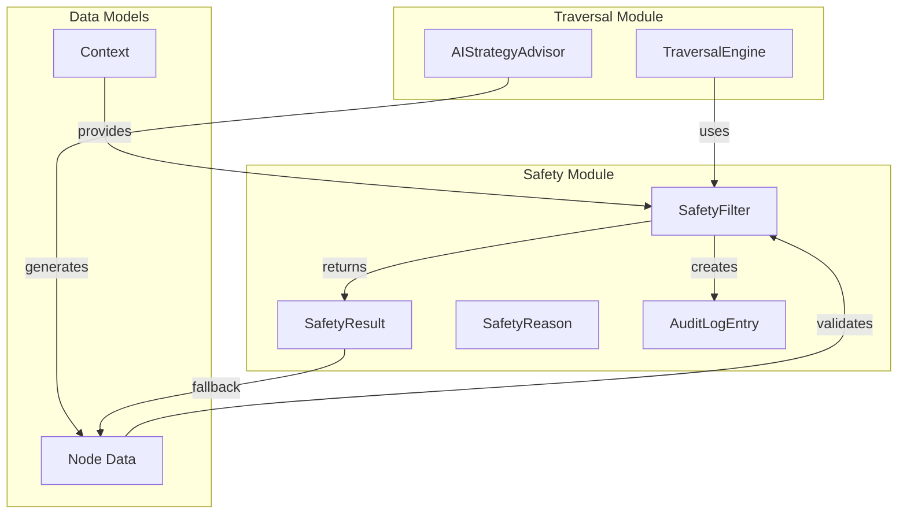

# Safety Module Design Document

> **Module**: `src/safety/`
> **Version**: 1.0
> **Last Updated**: 2025-06-03

---

## Overview

The Safety module provides AI output validation to prevent dangerous operations during UI traversal. It implements a whitelist + blacklist approach to filter AI-generated actions before execution.

---

## Module Responsibility

1. **Action Validation**: Verify AI-generated actions against allowed operations
2. **Text Filtering**: Block dangerous text patterns (factory reset, data clearing, etc.)
3. **Audit Logging**: Record rejected operations for debugging and compliance
4. **Fallback Generation**: Provide safe fallback actions when operations are rejected
5. **Context Awareness**: Consider traversal path in validation decisions

---

## Architecture

### Core Components

```
SafetyFilter
    ├── ALLOWED_ACTIONS (whitelist)
    ├── BLOCKED_TEXTS (blacklist)
    └── _audit_log (AuditLogEntry[])
```

### Data Flow

```
AI Advisor Output
    ↓
SafetyFilter.validate(node, context)
    ↓
┌───────────────────────────────┐
│ Check 1: Action in whitelist? │ → No → Fallback + Audit Log
├───────────────────────────────┤
│ Check 2: Text in blacklist?   │ → No → Fallback + Audit Log
├───────────────────────────────┤
│ All checks passed             │ → Yes → Return Safe
└───────────────────────────────┘
```

---

## Core Classes

### 1. `SafetyFilter`

**Purpose**: Validate AI-generated operations

**Key Features**:
- Whitelist-based action validation
- Blacklist-based text filtering
- Configurable audit logging
- Case-insensitive text matching
- Partial pattern matching

**Configuration**:

```python
ALLOWED_ACTIONS = {
    "click",
    "swipe",
    "back",
    "input_text",
    "no_action",
}

BLOCKED_TEXTS = {
    "恢复出厂设置",
    "清除数据",
    "删除所有",
    "格式化",
    "重置系统",
    "factory reset",
    "clear data",
    "delete all",
    "format",
    "reset system",
}
```

### 2. `SafetyResult`

**Purpose**: Immutable validation result

```python
@dataclass(frozen=True)
class SafetyResult:
    is_safe: bool
    reason: Optional[str] = None
    fallback_node: Optional[dict] = None
```

**Invariant**: When `is_safe=False`, `reason` must be provided.

### 3. `SafetyReason` (Enum)

**Purpose**: Categorize rejection reasons

```python
class SafetyReason(str, Enum):
    ACTION_NOT_ALLOWED = "action_not_allowed"
    TEXT_BLOCKED = "text_blocked"
    CONFIDENCE_LOW = "confidence_low"
```

### 4. `AuditLogEntry`

**Purpose**: Record rejected operations

```python
@dataclass(frozen=True)
class AuditLogEntry:
    timestamp: datetime
    original_operation: dict
    rejection_reason: str
    current_path: list[str]
    action_taken: str
```

---

## Validation Rules

### Rule 1: Action Whitelist

**Description**: Only whitelisted action types are permitted.

**Implementation**:
```python
action = node.get("action", "")
if action not in self.ALLOWED_ACTIONS:
    return SafetyResult(
        is_safe=False,
        reason=f"Action '{action}' not in whitelist",
        fallback_node=self._create_fallback_node("Action not allowed")
    )
```

**Examples**:
- Allowed: `click`, `swipe`, `back`, `input_text`, `no_action`
- Blocked: `delete`, `reset`, `format`, `clear`

### Rule 2: Text Blacklist

**Description**: Text matching blocked patterns is rejected.

**Implementation**:
```python
text = node.get("text", "")
if text and self._is_text_blocked(text):
    return SafetyResult(
        is_safe=False,
        reason=f"Text '{text}' matches blacklist",
        fallback_node=self._create_fallback_node("Text blocked")
    )

def _is_text_blocked(self, text: str) -> bool:
    text_lower = text.lower()
    for blocked in self.BLOCKED_TEXTS:
        if blocked.lower() in text_lower:
            return True
    return False
```

**Examples**:
- Blocked: "恢复出厂设置", "factory reset", "清除数据"
- Allowed: "Settings", "Cancel", "OK"

### Matching Behavior

- **Case-insensitive**: "Factory Reset" = "factory reset"
- **Partial match**: "确认清除数据吗？" contains "清除数据" → blocked

---

## Fallback Strategy

### Fallback Node Generation

When an operation is rejected, a safe fallback is generated:

```python
def _create_fallback_node(self, reason: str) -> dict:
    return {
        "action": "no_action",
        "reason": f"Safety filter: {reason}",
        "skipped": True,
    }
```

### Fallback Execution

```python
if not safety_result.is_safe:
    logger.warning(f"AI output rejected: {safety_result.reason}")
    self._emit("ai_output_rejected", {
        "reason": safety_result.reason,
        "fallback": safety_result.fallback_node,
    })
    return safety_result.fallback_node  # Safe no_action
```

---

## Audit Logging

### Logging Behavior

**Purpose**: Track rejected operations for debugging and compliance

**Configuration**:
```python
safety_filter = SafetyFilter(enable_audit_log=True)
```

### Audit Flow

```
Rejected Operation
    ↓
_log_if_enabled()
    ↓
AuditLogEntry created
    ↓
Added to _audit_log
    ↓
Logged via Python logger
```

### Audit Log Entry

```python
AuditLogEntry(
    timestamp=datetime.now(),
    original_operation={"action": "delete", "text": "Item"},
    rejection_reason="Action 'delete' not in whitelist",
    current_path=["Home", "Settings"],
    action_taken="Used fallback"
)
```

### Log Management

```python
# Get audit log
log = filter.get_audit_log()

# Clear audit log
filter.clear_audit_log()
```

---

## Integration

### TraversalEngine Integration

The safety filter is integrated into the traversal engine:

```python
# Initialization (TraversalEngine.__init__)
if config.enable_ai_advisor:
    self.safety_filter = SafetyFilter(enable_audit_log=True)

# Usage (_call_ai_with_validation)
safety_result = self.safety_filter.validate(node_data, context)

if not safety_result.is_safe:
    logger.warning(f"AI output rejected: {safety_result.reason}")
    return safety_result.fallback_node
```

### Validation Points

1. **Primary AI Advice**: `TraversalEngine._call_ai_with_validation()`
2. **Exception Fallback**: AI-based exception recovery (Task 5.5)

---

## Dependencies

### External Dependencies

```python
import logging       # Audit logging
from datetime import datetime  # Audit timestamps
from dataclasses import dataclass, field  # Data models
from typing import Optional, Set  # Type hints
from enum import Enum  # Enums
```

### Internal Dependencies

None - safety module has no internal dependencies.

### Module Dependencies (Incoming)

```python
# Used by TraversalEngine
from ..safety import SafetyFilter

# Used by test modules
from src.safety.filter import SafetyFilter, SafetyResult
```

---

## Design Decisions

### 1. Whitelist + Blacklist Approach

**Decision**: Use whitelist for actions, blacklist for text

**Rationale**:
- **Whitelist actions**: Safer default, only allow known safe operations
- **Blacklist text**: Flexible, allows legitimate text while blocking dangerous patterns
- **Defense in depth**: Two-stage validation reduces risk

### 2. Frozen Dataclasses

**Decision**: Use `frozen=True` for `SafetyResult` and `AuditLogEntry`

**Rationale**:
- Immutability prevents accidental modification
- Thread-safe for concurrent operations
- Clearly communicates intent (result vs. mutable state)

### 3. Fallback Instead of Exception

**Decision**: Return fallback node instead of raising exception

**Rationale**:
- Non-blocking to traversal flow
- Allows traversal to continue safely
- Provides audit trail via fallback node metadata

### 4. Case-Insensitive Text Matching

**Decision**: Convert to lowercase for text comparison

**Rationale**:
- Catches variations: "Factory Reset", "FACTORY RESET", "factory reset"
- More robust against AI output variations
- Reduces false negatives

### 5. Partial Pattern Matching

**Decision**: Use substring matching (`in` operator)

**Rationale**:
- Catches dangerous patterns in sentences: "确认清除数据吗？"
- More flexible than exact matching
- Higher security coverage

### 6. Optional Audit Logging

**Decision**: Configurable audit logging

**Rationale**:
- Performance optimization for production
- Debugging support when needed
- Compliance auditing capability

---

## Security Considerations

### Threat Model

**Assumption**: AI advisor may generate unsafe operations due to:
- Hallucination
- Misinterpretation of UI state
- Adversarial input (future)

### Defense Strategy

1. **Action Whitelist**: Only known-safe action types
2. **Text Blacklist**: Block dangerous keywords
3. **Audit Trail**: All rejections logged
4. **Fallback Behavior**: Safe default (no_action)

### Limitations

1. **Language-specific**: Blacklist patterns are language-dependent
2. **False positives**: Legitimate text may be blocked (e.g., "清除历史记录")
3. **No context analysis**: Does not understand UI context, only patterns

### Future Enhancements

1. **Context-aware filtering**: Consider UI state in validation
2. **Multi-language support**: Expand blacklist for more languages
3. **Configurable patterns**: Allow app-specific blacklists
4. **Learning from feedback**: Adaptive filtering based on traversal results

---

## Testing

### Test Coverage

Located in `src/safety/test_filter.py`:

- `TestSafetyResult`: Result object behavior
- `TestSafetyFilter`: Core validation logic
- Action whitelist validation
- Text blacklist validation
- Case-insensitive matching
- Partial pattern matching
- Audit logging
- Fallback node structure

### Test Patterns

```python
def test_validate_allowed_action():
    filter = SafetyFilter()
    node = {"action": "click", "text": "Settings"}
    result = filter.validate(node)
    assert result.is_safe is True

def test_validate_blocked_text():
    filter = SafetyFilter()
    node = {"action": "click", "text": "恢复出厂设置"}
    result = filter.validate(node)
    assert result.is_safe is False
    assert "blocked" in result.reason.lower()
```

---

## Usage Example

```python
from src.safety import SafetyFilter

# Initialize
filter = SafetyFilter(enable_audit_log=True)

# Validate AI output
node = {"action": "click", "text": "Settings"}
result = filter.validate(node, context={"current_path": ["Home"]})

if result.is_safe:
    execute(node)
else:
    execute(result.fallback_node)
    logger.warning(f"Blocked: {result.reason}")

# Check audit log
for entry in filter.get_audit_log():
    print(f"{entry.timestamp}: {entry.rejection_reason}")
```

---

## API Reference

### `SafetyFilter`

| Method | Parameters | Returns | Description |
|--------|-----------|---------|-------------|
| `__init__()` | enable_audit_log | SafetyFilter | Initialize filter |
| `validate()` | node, context | SafetyResult | Validate operation |
| `get_audit_log()` | - | list[AuditLogEntry] | Get rejected operations |
| `clear_audit_log()` | - | None | Clear audit log |

### `SafetyResult`

| Attribute | Type | Description |
|-----------|------|-------------|
| `is_safe` | bool | Validation result |
| `reason` | Optional[str] | Rejection reason |
| `fallback_node` | Optional[dict] | Safe fallback action |

---

## Mermaid Dependency Diagram



---

## Related Documentation

- [PRD V5.1 - AI Integration](../PRD_V5_1-ai-integration.md): AI advisor integration
- [PRD Unified](../PRD_UNIFIED.md): Safety requirements
- [Architecture](../ARCHITECTURE.md): System security design

---

**Document Version**: 1.0
**Author**: Uni-Claw Development Team
