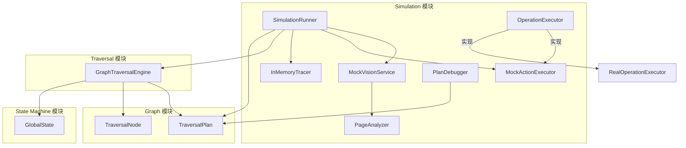
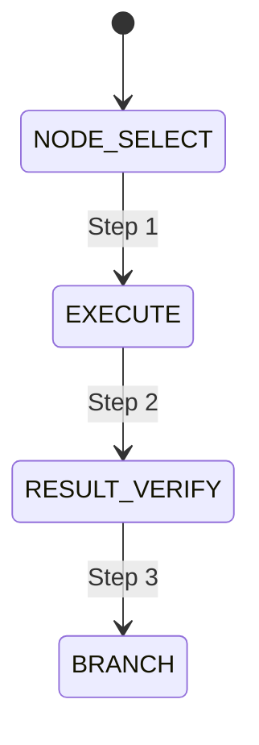

# Simulation 模块设计文档

> **模块**: `src/simulation/`
> **版本**: V6.0
> **更新日期**: 2026-06-03
> **作者**: Uni-Claw 开发团队

---

## 1. 模块概述

### 1.1 职责

Simulation 模块是 V6 版本的核心创新，提供了**离线仿真测试能力**，允许在没有真实设备的情况下测试遍历逻辑。该模块通过 Mock 组件模拟真实设备的视觉分析和动作执行，实现了快速、可重复的测试验证。

### 1.2 核心价值

- **零设备测试**: 无需物理设备或 ADB 连接即可运行完整遍历测试
- **快速反馈**: 仿真测试执行速度远快于真实设备测试
- **可重复性**: 消除设备状态、网络等环境因素的影响
- **可观测性**: 内置 Trace 收集和多种可视化输出格式
- **计划调试**: 提供交互式计划调试工具

### 1.3 设计理念

仿真测试模块基于以下设计原则：

1. **接口一致性**: Mock 组件实现与真实组件相同的接口
2. **依赖注入**: 通过构造函数注入所有依赖，易于测试和替换
3. **完整记录**: 记录所有操作用于断言和验证
4. **多格式输出**: 支持 JSONL、HTML、ASCII 等多种输出格式

---

## 2. 核心类和接口

### 2.1 模块结构

```
src/simulation/
├── __init__.py              # 模块导出
├── runner.py                # 仿真运行器
├── mock_vision.py           # Mock 视觉服务
├── mock_action.py           # Mock 动作执行器
├── visualizer.py            # Trace 可视化
├── page_analyzer.py         # 页面分析器
├── operation_executor.py    # 操作执行器接口
└── demo_visualization.py    # 演示可视化
```

### 2.2 核心类

#### 2.2.1 SimulationRunner

仿真运行器，协调整个仿真测试流程。

```python
class SimulationRunner:
    """完整的仿真运行器，包装 GraphTraversalEngine 和所有 Mock 组件"""

    def __init__(
        self,
        virtual_pages: Dict[str, Dict[str, Any]],
        plan: TraversalPlan,
        config: Optional[Dict[str, Any]] = None,
    ):
        """初始化运行器，创建所有 Mock 组件和引擎"""
        self.vision = MockVisionService(virtual_pages)
        self.action = MockActionExecutor(simulate_delay=config.get("action_delay", 0.0))
        self.tracer = InMemoryTracer()
        self.engine = GraphTraversalEngine(...)

    def run(self) -> SimulationResult:
        """执行仿真并返回完整结果"""
        ...

    def render_tree(self, max_depth: Optional[int] = None) -> str:
        """渲染遍历树为 ASCII 格式"""

    def render_mermaid(self) -> str:
        """渲染状态图为 Mermaid 格式"""

    def export_trace(self, format: str = "jsonl") -> str:
        """导出 Trace 为指定格式 (jsonl, html, json)"""
```

**核心方法**:

- `run()`: 执行完整仿真，返回 SimulationResult
- `_simulate_dfs_traversal()`: 仿真深度优先遍历逻辑
- `_execute_fallback_simulation()`: 当 GraphTraversalEngine 不可用时的回退实现

#### 2.2.2 MockVisionService

模拟视觉服务，返回虚拟页面分析。

```python
class MockVisionService:
    """Mock 视觉服务，基于当前路径返回虚拟页面分析"""

    def __init__(self, virtual_pages: Dict[str, Dict[str, Any]]):
        """初始化，创建 PageAnalyzer 用于智能分析"""
        self._analyzer = PageAnalyzer(virtual_pages)
        self._path_mapping = self._build_path_mapping(virtual_pages)

    def analyze_screenshot(self, screenshot_path: Optional[str] = None) -> Dict[str, Any]:
        """分析当前截图，返回当前路径的 PageAnalysis"""

    def set_context(self, context: Any) -> None:
        """设置遍历上下文，用于路径解析"""

    def inject_path(self, path: str) -> None:
        """注入特定路径用于测试"""
```

**核心方法**:

- `analyze_screenshot()`: 返回当前路径的页面分析
- `set_context()`: 接收 TraversalContext 或 InMemoryTracer 用于路径推断
- `inject_path()`: 测试时注入特定路径

#### 2.2.3 MockActionExecutor

模拟动作执行器，记录所有操作而不实际执行。

```python
class MockActionExecutor:
    """Mock 动作执行器，记录所有操作"""

    def __init__(self, simulate_delay: float = 0.0):
        """初始化，可配置模拟延迟"""
        self.action_history: List[OperationRecord] = []

    def tap(self, x: float, y: float) -> bool:
        """记录点击操作"""

    def swipe(self, start: Tuple[float, float], end: Tuple[float, float], duration: float = 0.3) -> bool:
        """记录滑动操作"""

    def press_back(self) -> bool:
        """记录返回操作"""

    def get_history(self) -> List[OperationRecord]:
        """获取操作历史副本"""

    def get_operations_by_type(self, action_type: str) -> List[OperationRecord]:
        """按类型过滤操作历史"""
```

**OperationRecord 结构**:

```python
class OperationRecord(TypedDict):
    """完整操作记录结构"""
    action_type: str           # 操作类型
    timestamp: float           # 时间戳
    result: str                # 执行结果
    current_node: Optional[str] # 当前节点
    current_path: List[str]    # 当前路径
    page_context: Dict[str, Any] # 页面上下文
    target_info: Dict[str, Any]  # 目标信息
    metadata: Dict[str, Any]    # 元数据
    node_stack: List[str]       # 节点栈
```

#### 2.2.4 InMemoryTracer

内存 Trace 记录器，支持多种可视化输出。

```python
class InMemoryTracer:
    """内存 Trace 记录器，支持可视化输出"""

    def __init__(self):
        self.steps: List[TraceStep] = []
        self.visited_tree: Dict[str, VisitedNode] = {}

    def start_traversal(self, plan: Any) -> None:
        """开始新的 Trace 记录"""

    def record_transition(self, transition: Any, screen_info: Optional[Dict] = None) -> None:
        """记录状态转换"""

    def render_tree(self, max_depth: Optional[int] = None) -> str:
        """渲染为 ASCII 树"""

    def render_mermaid(self) -> str:
        """渲染为 Mermaid 状态图"""

    def render_html(self) -> str:
        """渲染为 HTML 报告"""

    def export_trace(self, format: str = "jsonl") -> str:
        """导出 Trace"""
```

**TraceStep 结构**:

```python
@dataclass
class TraceStep:
    """单个 Trace 步骤"""
    step_number: int
    timestamp: datetime
    from_state: str
    to_state: str
    node_id: Optional[str] = None
    action: Optional[str] = None
    screen_info: Dict[str, Any] = field(default_factory=dict)
    metadata: Dict[str, Any] = field(default_factory=dict)
```

#### 2.2.5 PageAnalyzer

页面分析器，将原始页面数据转换为正确的 PageAnalysis 格式。

```python
class PageAnalyzer:
    """页面分析器，仿真视觉分析管道"""

    def analyze_page(self, path: str) -> Dict[str, Any]:
        """分析页面并返回结构化的 PageAnalysis"""

    def _process_elements(self, elements: List[Dict]) -> List[Dict]:
        """处理 UI 元素，添加类型和元数据"""

    def _infer_action_hint(self, element: Dict) -> str:
        """推断元素的操作提示"""
```

#### 2.2.6 PlanDebugger

计划调试工具，支持交互式修改和测试计划。

```python
class PlanDebugger:
    """计划调试工具"""

    def __init__(self, plan: TraversalPlan):
        self.original_plan = plan
        self.current_plan = plan
        self.modifications: List[ModifiedPlan] = []

    def remove_rule(self, rule_id: str) -> TraversalPlan:
        """移除动态规则"""

    def set_target(self, target_name: str, match_mode: str = "contains") -> TraversalPlan:
        """设置目标完成策略"""

    def set_max_depth(self, max_depth: int) -> TraversalPlan:
        """设置最大遍历深度"""

    def undo_last(self) -> Optional[TraversalPlan]:
        """撤销上次修改"""

    def reset_to_original(self) -> TraversalPlan:
        """重置到原始计划"""
```

#### 2.2.7 OperationExecutor 接口

操作执行器接口，支持 Mock 和真实实现。

```python
class OperationExecutor(ABC):
    """操作执行器接口"""

    @abstractmethod
    def execute(self, context: ExecutionContext) -> ExecutionResult:
        """执行操作"""

    @abstractmethod
    def get_executed_actions(self) -> list[str]:
        """获取已执行的操作列表"""

    @abstractmethod
    def clear_history(self) -> None:
        """清除历史记录"""
```

**实现类**:
- `MockOperationExecutor`: Mock 实现，仅记录操作
- `RealOperationExecutor`: 真实实现，通过 ADB 控制设备

---

## 3. 依赖关系

### 3.1 模块依赖图



### 3.2 外部依赖

| 模块 | 依赖项 | 用途 |
|------|--------|------|
| `runner.py` | `src.graph.plan.TraversalPlan` | 遍历计划 |
| `runner.py` | `src.graph.node.TraversalNode` | 遍历节点 |
| `runner.py` | `src.graph.graph_traversal_engine.GraphTraversalEngine` | 图遍历引擎 |
| `runner.py` | `src.state_machine.global_fsm.GlobalState` | 全局状态 |
| `mock_vision.py` | 无 | 独立模块 |
| `mock_action.py` | 无 | 独立模块 |
| `visualizer.py` | 无 | 独立模块 |

### 3.3 内部依赖关系

```
SimulationRunner
    ├── MockVisionService
    │   └── PageAnalyzer
    ├── MockActionExecutor
    ├── InMemoryTracer
    └── GraphTraversalEngine (可选)
```

---

## 4. 设计决策

### 4.1 仿真策略

#### 4.1.1 DFS 遍历仿真

SimulationRunner 实现了完整的深度优先搜索 (DFS) 遍历逻辑：

1. **前进**: 遇到可交互元素时，进入下一层级
2. **探索**: 逐个访问页面上的元素
3. **回溯**: 当所有元素访问完毕或达到最大深度时返回

```python
def _simulate_dfs_traversal(self) -> None:
    """仿真完整的 DFS 遍历，包含正确的回溯"""
    # 从 root 开始
    self._visit_page("root")

    # 主 DFS 循环
    while self.step_count < max_steps:
        if self._should_go_back(elements, max_depth):
            self._go_back()
        else:
            self._interact_with_next_element(elements)
```

#### 4.1.2 路径推断

MockVisionService 通过多种方式推断当前路径：

1. **注入路径优先**: `inject_path()` 设置的路径优先级最高
2. **上下文推断**: 从 TraversalContext 或 InMemoryTracer 推断
3. **默认路径**: 其他情况返回 "root"

### 4.2 记录策略

#### 4.2.1 操作记录

MockActionExecutor 记录完整的操作上下文：

```python
operation_record = {
    "action_type": action_type,
    "timestamp": timestamp,
    "result": "success",
    "current_node": current_node,
    "current_path": current_path.copy(),
    "page_context": page_context,
    "target_info": target_info,
    "metadata": metadata,
    "node_stack": node_stack.copy(),
}
```

这种详细的记录支持：
- 测试断言
- 回放分析
- 调试诊断

#### 4.2.2 Trace 记录

InMemoryTracer 记录状态转换，支持：
- ASCII 树可视化
- Mermaid 状态图
- HTML 报告
- JSONL 导出

### 4.3 可视化设计

#### 4.3.1 ASCII 树

使用 Unicode 字符绘制层级树：

```
root [page] ✓
├── SettingsPage [page] ✓ → click: Settings
│   ├── DisplaySettings [page] ✓ → click: Display
│   └── SoundSettings [page] ✓ → click: Sound
└── AboutPage [page] ✗
```

#### 4.3.2 Mermaid 状态图

自动生成 Mermaid 状态图代码：



#### 4.3.3 HTML 报告

生成包含以下内容的 HTML 报告：
- 执行统计（步骤数、访问节点数）
- 访问树（含预期操作和未访问原因）
- 操作对比表（预期 vs 实际）
- 状态转换追踪表

### 4.4 错误处理

#### 4.4.1 容错设计

- 页面不存在时返回空分析而非抛出异常
- 引擎不可用时使用回退实现
- 路径推断失败时使用默认路径

#### 4.4.2 错误记录

所有错误都被记录到 Trace 中，包含：
- 错误类型
- 错误消息
- 发生时的上下文

---

## 5. 使用示例

### 5.1 基本仿真测试

```python
from src.simulation import SimulationRunner
from src.graph.plan import TraversalPlan

# 定义虚拟页面
virtual_pages = {
    "HomeScreen": {
        "page_name": "HomeScreen",
        "items": [
            {"name": "Settings", "expected_action": "navigate"},
            {"name": "About", "expected_action": "navigate"},
        ]
    },
    "SettingsPage": {
        "page_name": "SettingsPage",
        "items": [
            {"name": "Display", "expected_action": "navigate"},
            {"name": "Sound", "expected_action": "navigate"},
        ]
    },
}

# 创建遍历计划
plan = TraversalPlan(entry_app="SettingsApp")

# 运行仿真
runner = SimulationRunner(virtual_pages, plan)
result = runner.run()

# 检查结果
print(f"访问节点数: {len(result.visited_tree)}")
print(f"执行操作数: {len(result.executed_actions)}")
print(f"遍历树:\n{runner.render_tree()}")
```

### 5.2 计划调试

```python
from src.simulation import PlanDebugger

# 创建调试器
debugger = PlanDebugger(plan)

# 修改计划
debugger.set_target("DisplaySettings", match_mode="contains")
debugger.set_max_depth(3)

# 运行测试
runner = SimulationRunner(virtual_pages, debugger.current_plan)
result = runner.run()

# 撤销修改
debugger.undo_last()
```

### 5.3 Trace 导出

```python
# 导出 JSONL
jsonl_trace = runner.export_trace("jsonl")
with open("trace.jsonl", "w") as f:
    f.write(jsonl_trace)

# 导出 HTML
html_report = runner.export_trace("html")
with open("report.html", "w") as f:
    f.write(html_report)
```

---

## 6. 测试策略

### 6.1 单元测试

每个组件都有对应的单元测试：

- `tests/simulation/test_mock_vision.py`: MockVisionService 测试
- `tests/simulation/test_mock_action.py`: MockActionExecutor 测试
- `tests/v6/test_simulation.py`: 仿真框架集成测试

### 6.2 测试覆盖范围

单元测试覆盖：
- 组件初始化
- 基本功能
- 边界情况
- 错误处理
- 记录验证

### 6.3 断言方法

测试中的常用断言：

```python
# 检查操作历史
assert executor.get_tap_count() == 2
assert executor.has_action("go_back")

# 检查 Trace
assert tracer.get_step_count() == 5
assert len(result.visited_tree) == 3

# 检查特定操作
actions = executor.get_operations_by_type("navigate")
assert len(actions) == 2
```

---

## 7. 性能考虑

### 7.1 优化策略

- **页面缓存**: PageAnalyzer 内置分析缓存
- **延迟模拟**: 可选的模拟延迟用于性能测试
- **历史限制**: action_history 只保留最近操作

### 7.2 性能指标

SimulationResult 包含以下性能指标：

```python
statistics = {
    "total_steps": total_steps,
    "unique_nodes": unique_nodes,
    "action_count": action_count,
    "steps_per_node": total_steps / unique_nodes,
    "execution_time": elapsed_seconds,
}
```

---

## 8. 未来扩展

### 8.1 计划中的增强

1. **更多可视化格式**
   - Graphviz DOT 格式
   - 交互式 Web 可视化

2. **高级仿真功能**
   - 网络延迟模拟
   - 设备性能差异模拟
   - 异常注入

3. **Trace 分析工具**
   - 模式匹配
   - 异常检测
   - 性能分析

### 8.2 集成点

- 与状态机模块集成：Trace 格式化为状态转换
- 与异常处理模块集成：异常恢复验证
- 与 AI 模块集成：AI 决策的仿真测试

---

## 9. 参考资料

### 9.1 相关文档

- [ARCHITECTURE_V6.md](../ARCHITECTURE_V6.md): V6 架构总览
- [GRAPH_MODEL.md](../GRAPH_MODEL.md): 图模型设计
- [SIMULATION_TESTING_GUIDE.md](../SIMULATION_TESTING_GUIDE.md): 仿真测试指南

### 9.2 相关模块

- `src/graph/`: 图模型和计划定义
- `src/traversal/`: 遍历引擎
- `src/state_machine/`: 状态机

---

**文档版本**: 1.0
**最后更新**: 2026-06-03
