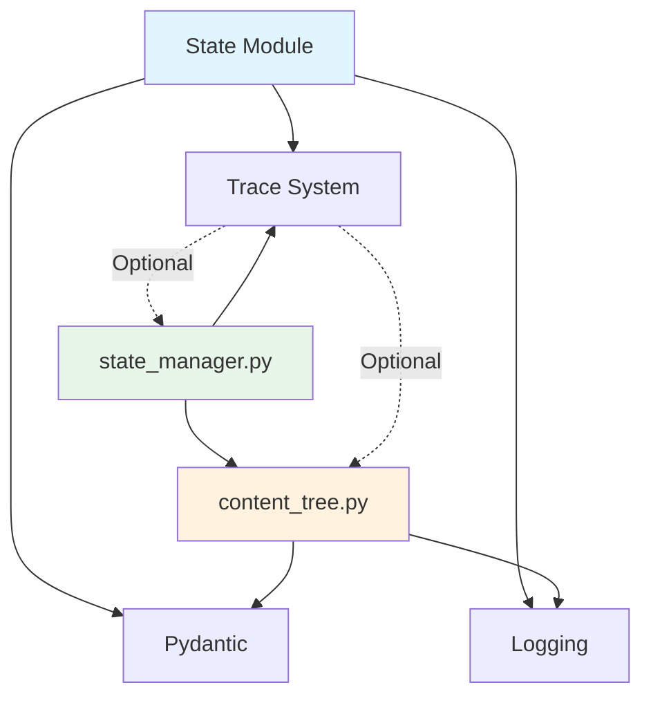
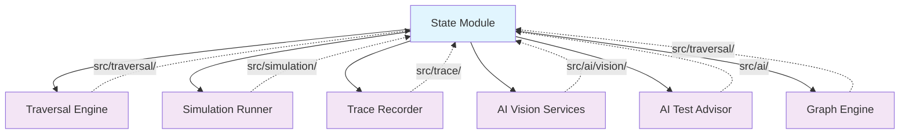
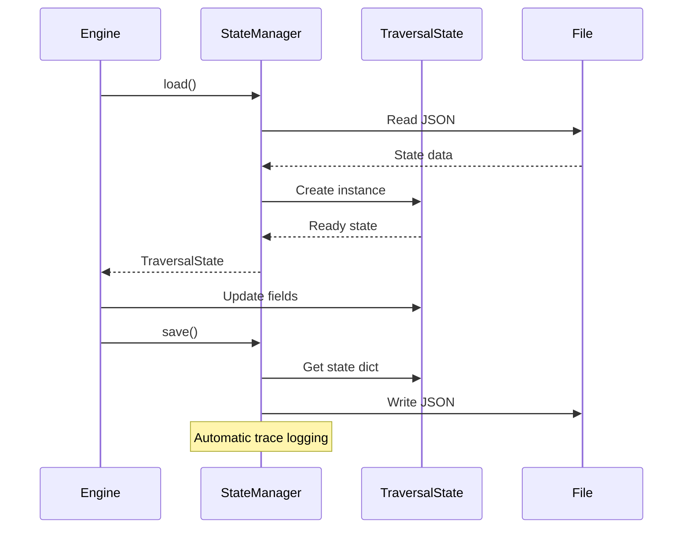

# State Management Module Design

## Overview

The State Management module (`src/state/`) provides core data models and persistence for uni-claw's traversal operations. It maintains the traversal state across sessions and serves as the single source of truth for the current state of UI exploration.

## Module Location

```
src/state/
├── __init__.py           # Public API exports
├── state_manager.py      # State persistence and recovery
└── content_tree.py       # Core data models
```

## Core Responsibilities

1. **Data Models**: Define all data structures for state representation
2. **State Persistence**: Save and restore traversal state
3. **Content Tracking**: Maintain discovered UI elements and their relationships
4. **Visit Tracking**: Track visited elements to avoid redundant operations
5. **Cache Management**: Cache analyzed content for performance

## Core Classes and Interfaces

### 1. TraversalState

The central state container, tracking all aspects of a traversal session.

```python
class TraversalState(BaseModel):
    # Current location
    current_path: list[str]

    # Visit tracking
    visited: set[str]

    # Caches
    all_level1_menus: dict[str, MenuInfo]
    level2_menus_cache: dict[str, list[MenuInfo]]
    items_cache: dict[str, list[MenuItem]]

    # Content tree
    content_tree: ContentTree

    # Progress tracking
    step_count: int
    current_phase: str

    # Error recovery
    consecutive_errors: int
    last_error: Optional[str]

    # Target info
    target_app: Optional[str]

    # Exception history (V5.3+)
    exception_history_records: list[dict]

    # Graph mode support (V4.0+)
    node_stack: list[dict]
    current_node_id: Optional[str]
    use_graph_mode: bool
```

**Key Methods**:
- `get_current_cache_key()` - Generate cache key from current path
- `is_visited(fingerprint)` - Check if element was visited
- `mark_visited(fingerprint)` - Mark element as visited
- `get_exception_history_summary()` - Get exception statistics
- `get_exceptions_by_type(type)` - Filter exceptions by type

### 2. StateManager

Manages state persistence and recovery.

```python
class StateManager:
    def __init__(self, state_file: Union[str, Path])

    def load(self) -> TraversalState
    def save(self) -> None
    def reset(self) -> None
    def update(**kwargs) -> None
```

**Features**:
- Automatic JSON serialization/deserialization
- Set-to-list conversion for JSON compatibility
- Automatic state creation if file doesn't exist
- Trace logging integration for observability

### 3. ContentTree

Hierarchical tree structure of discovered content.

```python
class ContentTree(BaseModel):
    root_title: str
    nodes: dict[str, ContentNode]
    level_counters: dict[int, int]

    def add_node(title, level, parent_id, node_type, coordinate, description)
    def add_child_node(title, parent_id, node_type, coordinate, description)
    def mark_visited(node_id)
    def get_unvisited_children(node_id)
    def to_markdown()
```

**ID Generation**:
- Hierarchical IDs: `1`, `1.1`, `1.2`, `2`, `2.1`, etc.
- Automatic counter management per level

### 4. ContentNode

Individual node in the content tree.

```python
class ContentNode(BaseModel):
    id: str
    title: str
    level: int
    parent_id: Optional[str]
    children: list[str]
    coordinate: Optional[Coordinate]
    node_type: str  # item, popup, jump, no_feedback
    description: Optional[str]
    visited: bool
```

### 5. PageAnalysis

Complete analysis of a screen page.

```python
class PageAnalysis(BaseModel):
    # Menu structure
    level1_dir: Direction
    level1_menus: list[MenuInfo]
    level2_dir: Direction
    level2_menus: list[MenuInfo]

    # Current location
    current_path: list[str]

    # Content items
    items: list[MenuItem]

    # Special elements
    is_popup: bool
    popup_info: Optional[PopupInfo]
    close_button: Optional[Coordinate]
    back_button: Optional[Coordinate]

    # Navigation hints
    has_scroll: bool
    is_end_of_list: bool
```

### 6. MenuItem

A clickable item on the screen with behavior prediction.

```python
class MenuItem(BaseModel):
    name: str
    type: MenuItemType
    coordinate: Coordinate
    parent: Optional[str]
    description: Optional[str]

    # V5+ Behavior prediction fields
    expected_action: ExpectedAction
    expects_page_change: bool
    expects_state_change: bool

    def get_fingerprint(level1, level2) -> str
```

### 7. Enums

#### Direction

```python
class Direction(str, Enum):
    LEFT = "left"
    RIGHT = "right"
    TOP = "top"
    BOTTOM = "bottom"
```

#### MenuItemType

```python
class MenuItemType(str, Enum):
    # Navigation types
    MENU_ITEM = "menu_item"
    TAB = "tab"
    BACK_BUTTON = "back_button"

    # Action types
    SWITCH = "switch"
    TOGGLE = "toggle"
    BUTTON = "button"

    # Other types
    ICON = "icon"
    LINK = "link"
    TEXT = "text"
    READONLY = "readonly"
    ITEM = "item"  # Legacy
```

#### ExpectedAction

```python
class ExpectedAction(str, Enum):
    NAVIGATE = "navigate"    # Expects page navigation
    TOGGLE = "toggle"        # Expects state change
    ACTION = "action"        # Expects action trigger
    NONE = "none"           # No expected response
```

## Module Dependencies



## External Dependencies

The State module is used by:



## Data Flow



## State File Format

```json
{
  "current_path": ["Settings", "Display"],
  "visited": ["Settings|Display|Brightness"],
  "all_level1_menus": {
    "Settings": {"name": "Settings", "coordinate": {"x": 0.5, "y": 0.1}}
  },
  "level2_menus_cache": {
    "Settings": [...]
  },
  "items_cache": {
    "Settings|Display": [...]
  },
  "content_tree": {
    "root_title": "App",
    "nodes": {...},
    "_level_counters": {...}
  },
  "step_count": 42,
  "current_phase": "traversing",
  "consecutive_errors": 0,
  "target_app": "Settings",
  "exception_history_records": [],
  "_node_stack": [],
  "current_node_id": "display.1",
  "use_graph_mode": false
}
```

## Design Patterns

### 1. Value Objects

Most classes (Coordinate, MenuInfo, MenuItem, etc.) are value objects - immutable data containers validated by Pydantic.

### 2. Repository Pattern

StateManager acts as a repository, abstracting persistence details from the rest of the system.

### 3. Lazy Loading

State is loaded on first access via the `state` property, not during initialization.

### 4. Enum Safety

All enums provide:
- `values()` - List of valid values
- `from_value(value)` - Safe instantiation with error handling
- `is_valid(value)` - Validation check

## V6+ Extensions

### Graph Mode Support

- `node_stack` - Stack of frames for depth-first traversal
- `current_node_id` - Current node being processed
- `use_graph_mode` - Flag to enable graph-based traversal

### Exception History

- `exception_history_records` - Serialized exception contexts
- Query methods for filtering by type and severity

## Testing

Unit tests verify:
- Model validation and field constraints
- JSON serialization/deserialization
- Cache key generation
- Visit tracking logic
- Hierarchical ID generation

## Related Documentation

- [State Machine Design](state_machine_design.md) - State machine implementation
- [Graph Model](../GRAPH_MODEL.md) - Graph-based traversal
- [Core Business Models](../core_business_models.md) - Extended model documentation
