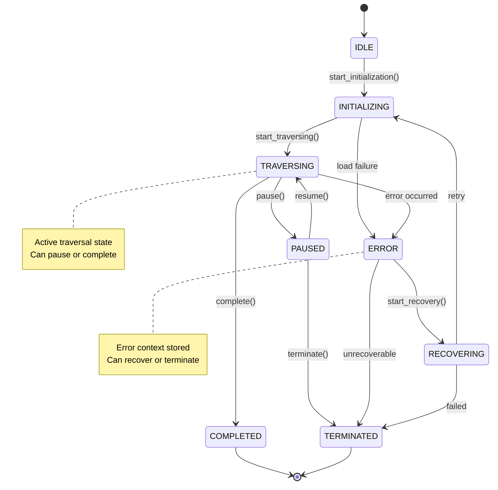
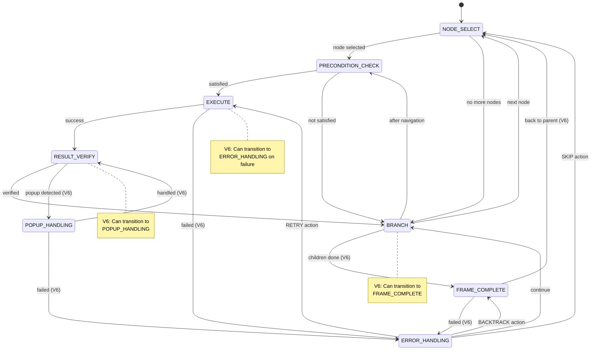
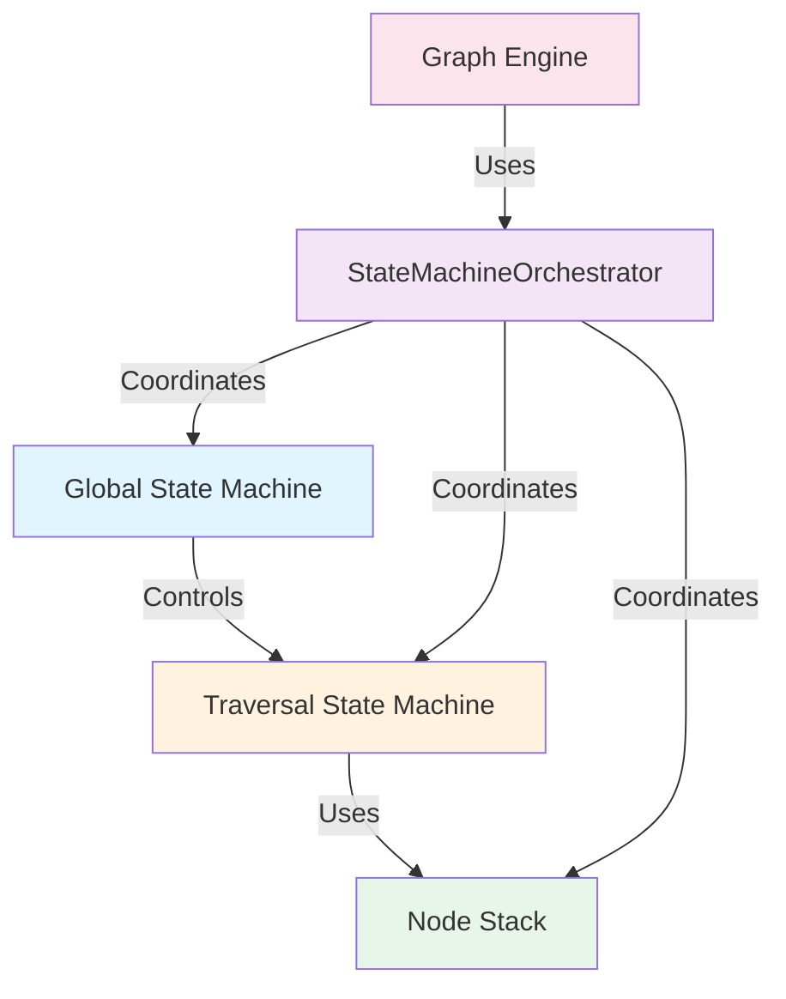
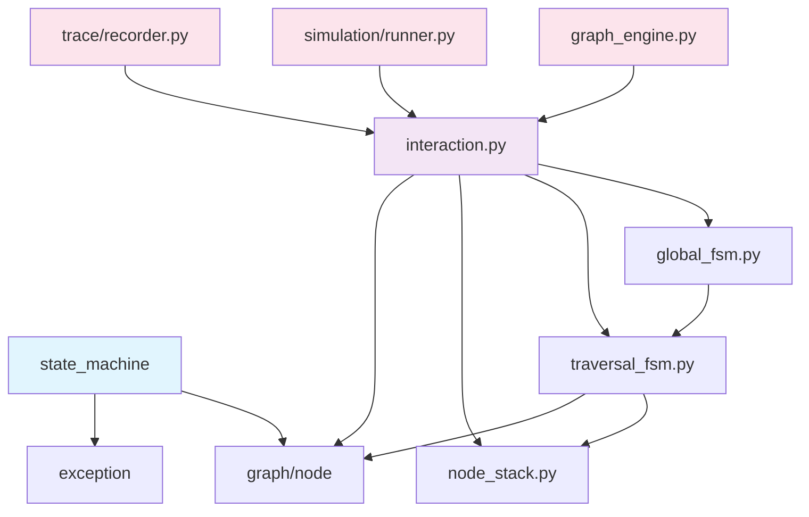
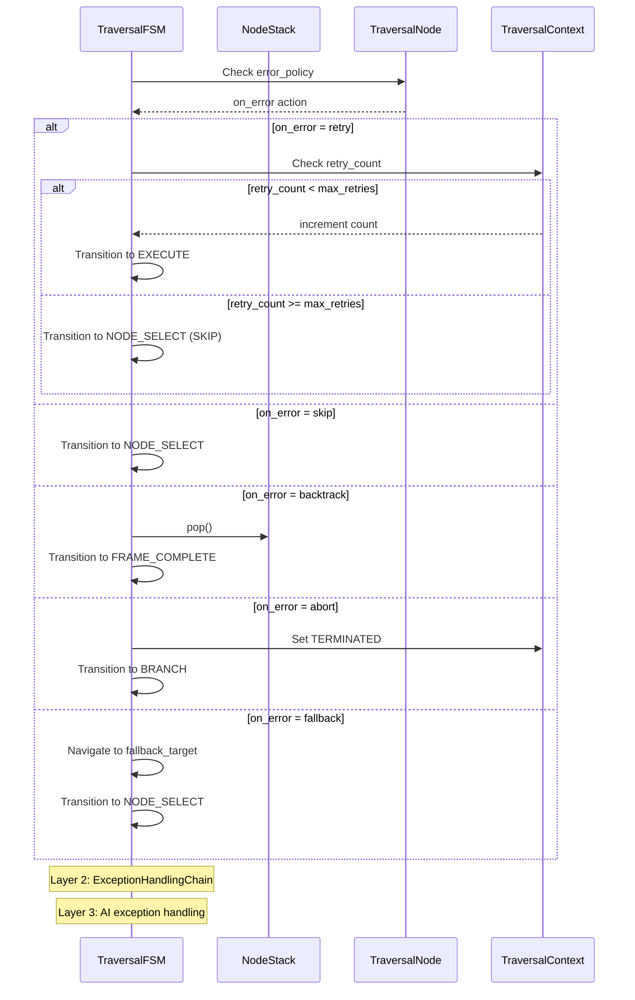
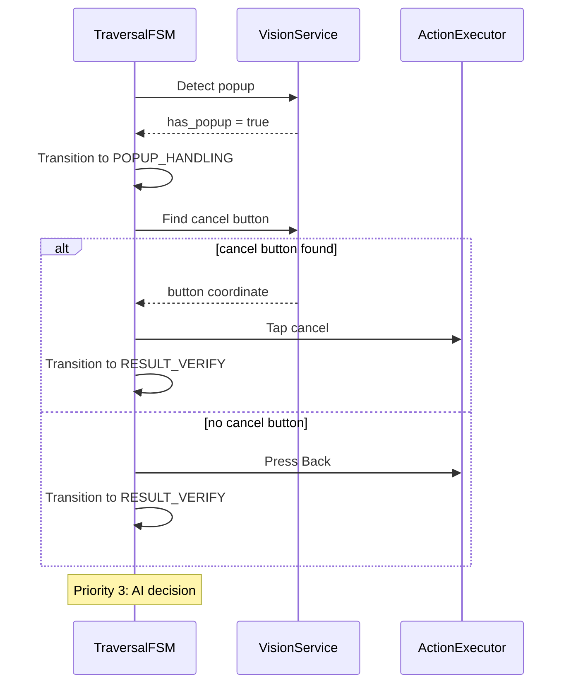

# 状态机模块实现

> **实现层面**: 技术实现、代码结构和API  
> **概念层面**: 详见 [状态机概念设计](../../concepts/state-machine-design.md)  
> **模块路径**: `src/state_machine/`  
> **版本**: V6.5  
> **最后更新**: 2026-06-06

---

## 文档说明

本文档专注于状态机的**技术实现层面**，包括：
- 模块代码结构
- 类和接口设计
- 技术实现细节
- API使用方法

状态定义和转换规则等概念请参考：[状态机概念设计](../../concepts/state-machine-design.md)

---

## Overview

The State Machine module (`src/state_machine/`) implements a three-layer state machine system for uni-claw V6.0, managing the traversal task lifecycle and individual node execution flow with support for hierarchical state machines, error handling, and popup detection.

## Module Location

```
src/state_machine/
├── __init__.py            # Public API exports
├── global_fsm.py          # Global state machine
├── traversal_fsm.py      # Traversal state machine
├── node_stack.py         # Depth-first traversal stack
└── interaction.py        # Orchestrator and coordination
```

## Architecture

The module implements a **three-layer state machine architecture**:

```
┌─────────────────────────────────────────────────────────┐
│                    Global State Machine                  │
│              (Task Lifecycle Management)                 │
│  IDLE → INITIALIZING → TRAVERSING → COMPLETED           │
└────────────────────┬────────────────────────────────────┘
                     │
                     ▼
┌─────────────────────────────────────────────────────────┐
│                Traversal State Machine                    │
│              (Individual Node Execution)                  │
│  SELECT → PRECONDITION → EXECUTE → VERIFY → BRANCH       │
└────────────────────┬────────────────────────────────────┘
                     │
                     ▼
┌─────────────────────────────────────────────────────────┐
│                     Node Stack                            │
│           (Depth-First Traversal Context)                  │
└─────────────────────────────────────────────────────────┘
```

## Core Classes and Interfaces

### 1. GlobalStateMachine

Manages the overall traversal task lifecycle.

```python
class GlobalStateMachine:
    VALID_TRANSITIONS = {
        GlobalState.IDLE: {GlobalState.INITIALIZING},
        GlobalState.INITIALIZING: {GlobalState.TRAVERSING, GlobalState.ERROR},
        GlobalState.TRAVERSING: {GlobalState.PAUSED, GlobalState.ERROR, GlobalState.COMPLETED},
        GlobalState.PAUSED: {GlobalState.TRAVERSING, GlobalState.TERMINATED},
        GlobalState.ERROR: {GlobalState.RECOVERING, GlobalState.TERMINATED},
        GlobalState.RECOVERING: {GlobalState.INITIALIZING, GlobalState.TERMINATED},
        GlobalState.COMPLETED: set(),  # Terminal
        GlobalState.TERMINATED: set(),  # Terminal
    }

    def transition_to(target_state, reason, **metadata)
    def register_state_callback(state, callback)
    def get_transition_history()
    def get_current_state_duration()

    # Convenience methods
    def start_initialization(plan_path)
    def start_traversing()
    def pause(reason)
    def resume()
    def report_error(error, context)
    def start_recovery(recovery_action)
    def complete()
    def terminate(reason)
    def reset()
```

**States**:
| State | Description |
|-------|-------------|
| `IDLE` | Waiting for task to start |
| `INITIALIZING` | Loading traversal plan and context |
| `TRAVERSING` | Active traversal in progress |
| `PAUSED` | Task paused (can be resumed) |
| `ERROR` | Error occurred |
| `RECOVERING` | Attempting recovery from error |
| `COMPLETED` | Task completed successfully |
| `TERMINATED` | Task terminated (unrecoverable error) |

### 2. TraversalStateMachine

Handles individual node execution flow.

```python
class TraversalStateMachine:
    VALID_TRANSITIONS = {
        # Original transitions
        TraversalState.NODE_SELECT: {
            TraversalState.PRECONDITION_CHECK, TraversalState.BRANCH
        },
        TraversalState.PRECONDITION_CHECK: {
            TraversalState.EXECUTE, TraversalState.BRANCH
        },
        TraversalState.EXECUTE: {
            TraversalState.RESULT_VERIFY, TraversalState.BRANCH,
            TraversalState.ERROR_HANDLING  # V6
        },
        TraversalState.RESULT_VERIFY: {
            TraversalState.BRANCH, TraversalState.POPUP_HANDLING  # V6
        },
        TraversalState.BRANCH: {
            TraversalState.NODE_SELECT, TraversalState.PRECONDITION_CHECK,
            TraversalState.FRAME_COMPLETE  # V6
        },

        # V6 new transitions
        TraversalState.FRAME_COMPLETE: {
            TraversalState.NODE_SELECT, TraversalState.ERROR_HANDLING
        },
        TraversalState.ERROR_HANDLING: {
            TraversalState.NODE_SELECT, TraversalState.EXECUTE,
            TraversalState.FRAME_COMPLETE, TraversalState.BRANCH
        },
        TraversalState.POPUP_HANDLING: {
            TraversalState.RESULT_VERIFY, TraversalState.ERROR_HANDLING
        },
    }

    def transition_to(target_state, node_id, **metadata)
    def set_current_node(node_id)
    def set_execution_result(result)
    def set_precondition_result(satisfied)

    # State transition methods
    def start_node_select(node_id)
    def start_precondition_check()
    def precondition_failed()
    def start_execute()
    def execution_failed(error)
    def start_result_verify()
    def branch_to_children()
    def branch_to_restore()
    def branch_to_parent()
    def branch_to_next_node()
    def branch_to_precondition()

    # V6 state transition methods
    def transition_to_frame_complete()
    def transition_to_error_handling()
    def transition_to_popup_handling()

    # V6 state recovery methods
    def frame_complete_to_node_select()
    def frame_complete_failed()
    def error_to_node_select()  # SKIP
    def error_to_execute()  # RETRY
    def error_to_frame_complete()  # BACKTRACK
    def error_to_branch()
    def popup_handled()
    def popup_handling_failed()

    # Core step execution
    def step(stack, context, vision, action) -> TraversalStateTransition
```

**States**:
| State | Description |
|-------|-------------|
| `NODE_SELECT` | Select next node to process |
| `PRECONDITION_CHECK` | Verify precondition |
| `EXECUTE` | Execute node operation |
| `RESULT_VERIFY` | Verify execution result |
| `BRANCH` | Determine next action |
| `FRAME_COMPLETE` | Container frame complete handling (V6) |
| `ERROR_HANDLING` | Error/exception handling (V6) |
| `POPUP_HANDLING` | Popup detection and handling (V6) |

### 3. NodeStack

Maintains depth-first traversal context.

```python
@dataclass
class StackFrame:
    node: TraversalNode
    child_queue: List[str]
    current_child_idx: int
    pending_restore: bool
    entered_at: datetime
    metadata: Dict[str, Any]

    @property
    def node_id() -> str
    @property
    def has_children() -> bool
    @property
    def remaining_children() -> int
    @property
    def is_complete() -> bool
    @property
    def duration() -> float

    def get_next_child() -> Optional[str]
    def peek_next_child() -> Optional[str]
    def reset_child_index()

class NodeStack:
    DEFAULT_MAX_DEPTH = 10

    def push(node, children) -> bool
    def pop() -> Optional[StackFrame]
    def top() -> Optional[StackFrame]
    def peek(offset) -> Optional[StackFrame]

    def get_node_path() -> List[str]
    def get_current_node_id() -> Optional[str]
    def get_parent_node_id() -> Optional[str]
    def contains_node(node_id) -> bool
    def get_depth_of_node(node_id) -> int
    def clear()
    def get_summary() -> Dict[str, Any]
```

**Features**:
- Automatic depth limiting to prevent infinite recursion
- Child queue management for depth-first traversal
- Frame metadata for debugging
- Path reconstruction

### 4. StateMachineOrchestrator

Coordinates all state machine components.

```python
class StateMachineOrchestrator:
    def __init__(max_stack_depth=10)

    # Callback registration
    def register_navigation_callback(callback)
    def register_operation_callback(callback)
    def register_children_generator_callback(callback)

    # Lifecycle
    def initialize(root_node) -> bool

    # Precondition validation
    def validate_precondition(node) -> bool

    # Node execution
    def execute_node(node) -> Dict[str, Any]

    # Children generation
    def generate_children(node) -> List[str]

    # Flow control
    def get_next_node() -> Optional[TraversalNode]
    def should_restore(node) -> bool
    def execute_restore(node) -> bool

    # State queries
    def is_traversal_complete() -> bool
    def get_status_summary() -> Dict[str, Any]
```

## State Transition Diagrams

### Global State Machine



### Traversal State Machine



### Hierarchical Relationship



## Module Dependencies



## Error Handling Flow



## Popup Handling Flow



## V6 Extensions

### Frame Complete Handling

The `FRAME_COMPLETE` state implements the fallback action based on node's `exit_condition`:

| Fallback Action | Behavior |
|-----------------|----------|
| `BACK` | Press Back and pop frame |
| `AUTO_ESCAPE` | Try sibling menu, or Back if none |
| `SKIP` | Just pop frame, no action |
| `ABORT` | Signal termination |

### Three-Layer Error Handling

1. **Node error_policy** - Per-node error handling configuration
2. **ExceptionHandlingChain** - Global exception handling chain
3. **AI exception handling** - AI-driven recovery (V6.1+)

### Popup Detection

Priority-based popup handling:
1. Find and click cancel/close button
2. Execute Back operation
3. AI decision (reserved for V6.1)

## Data Classes

### GlobalStateTransition

```python
@dataclass
class GlobalStateTransition:
    from_state: GlobalState
    to_state: GlobalState
    timestamp: datetime
    reason: Optional[str]
    metadata: Dict[str, Any]
```

### TraversalStateTransition

```python
@dataclass
class TraversalStateTransition:
    from_state: TraversalState
    to_state: TraversalState
    timestamp: datetime
    node_id: Optional[str]
    metadata: Dict[str, Any]
```

### TraversalContext

```python
@dataclass
class TraversalContext:
    current_path: List[str]
    visited_pages: Dict[str, datetime]
    visited_nodes: Dict[str, datetime]
    current_page_analysis: Optional[Dict[str, Any]]
    config: Dict[str, Any]

    def mark_page_visited(page_name)
    def mark_node_visited(node_id)
    def is_page_visited(page_name)
    def is_node_visited(node_id)
```

### NavigationResult

```python
@dataclass
class NavigationResult:
    success: bool
    actions_taken: List[str]
    final_path: List[str]
    error_message: Optional[str]
```

## Design Patterns

### 1. State Pattern

Both `GlobalStateMachine` and `TraversalStateMachine` implement the State pattern, encapsulating state-specific behavior and transitions.

### 2. Stack Pattern

`NodeStack` uses the Stack pattern for maintaining depth-first traversal context, with frame objects containing execution state.

### 3. Orchestrator Pattern

`StateMachineOrchestrator` coordinates multiple state machines and the node stack, providing a unified interface for traversal execution.

### 4. Callback Pattern

The orchestrator uses callbacks for:
- Navigation
- Operation execution
- Children generation

### 5. Chain of Responsibility

Error handling implements Chain of Responsibility across three layers.

## Testing

Unit tests verify:
- State transition validation
- Transition history tracking
- Stack push/pop operations
- Depth limiting
- Precondition validation
- Error handling flow
- Popup detection flow

## V6.5 Handler Operation Integration

### Overview

V6.5 将状态机 handler 从占位符实现改为真正调用注入的 vision/action 服务。Handler 通过 `self._last_handler_metrics` 将操作指标传回引擎，引擎组装 Span 节点。

### Metrics Flow

```
State Machine Handler                  Engine _step_once()
─────────────────────                  ────────────────────
_handle_precondition_check:
  vision.analyze_screenshot(b"")  →
  self._last_handler_metrics = {      metrics = state_machine._last_handler_metrics
      "ai_call": {capability,          if "ai_call" in metrics:
          success, latency_ms}           _record_ai_call_span(...)
  }                                   if "execution" in metrics:
                                         _record_execution_span(...)
_handle_execute:                       if "error" in metrics:
  action.execute(ExecutionContext) →     _record_error_span(...)
  self._last_handler_metrics = {
      "execution": {action, status,
          target, duration_ms}
  }

_handle_result_verify:
  vision.analyze_screenshot(b"")  →
  self._last_handler_metrics = {
      "ai_call": {capability,
          success, latency_ms}
  }

_handle_error_state:
  context.consecutive_errors += 1
  context.failed_nodes[node_id] = {...}
  self._last_handler_metrics = {
      "error": {error_type, error_message}
  }
```

### Changed Handlers

| Handler | V6.4 (before) | V6.5 (after) |
|---------|---------------|--------------|
| `_handle_precondition_check` | `return EXECUTE` (skip) | `vision.analyze_screenshot()` → `PageAnalysis` → context |
| `_handle_execute` | `result = {"success": True}` | `action.execute(ExecutionContext)` → `ExecutionResult` |
| `_handle_result_verify` | `has_popup = False` (stub) | `vision.analyze_screenshot()` → compare pages |
| `_handle_error_state` | `return NODE_SELECT` (skip) | `context.consecutive_errors++`, `failed_nodes` record |

### Backward Compatibility

- `_last_handler_metrics` 默认 `None`，handler 不设置时引擎跳过 span 生成
- 引擎 `_step_once()` 通过 `getattr(state_machine, '_last_handler_metrics', None)` 安全读取

---

## V6.7 State Machine Intelligence

### Overview

V6.7 引入智能决策能力，使状态机能够根据页面关系做出精准的纠正操作，减少不必要的 back 和重试，提升遍历效率和稳定性。

### 核心特性

#### 1. Page Relationship Classification

新增 `classify_relation()` 纯函数，判断当前页面与预期页面的关系：

```python
class PageRelation(str, Enum):
    MATCH = "match"          # 当前已在预期页面
    NAVIGABLE = "navigable"  # 预期页面在当前菜单中
    DEEPER = "deeper"        # 预期页面在当前路径中但非末位
    UNKNOWN = "unknown"      # 无法确定关系
```

#### 2. Intelligent Precondition Correction

前置条件处理器实现 3 轮智能纠正：

- 每轮调用 vision 获取最新页面状态
- 使用 `classify_relation()` 判断页面关系
- NAVIGABLE 关系：点击目标菜单
- DEEPER/UNKNOWN 关系：执行 back 操作
- 纠正后立即调用 vision 验证结果
- 成功则提前退出，记录 correction metrics

#### 3. AUTO_ESCAPE for Same-Level Menu Switching

容器完成处理器实现智能同级切换：

- 收集未访问的同级菜单（level1_menus + level2_menus）
- 存在未访问菜单时点击切换
- 点击后强制调用 vision 验证页面变化
- 切换成功则不弹栈，返回 NODE_SELECT
- 切换失败重试 1 次，失败后降级 back

#### 4. Safe Button Detection for Popup Handling

弹窗处理器实现安全按钮检测：

- 定义安全按钮关键词：["取消", "关闭", "否", "忽略", "稍后", "Cancel", "Close", "No"]
- 遍历 `page.items` 查找匹配按钮
- 找到按钮时点击并返回 RESULT_VERIFY
- 找不到按钮时执行 back 操作

#### 5. Comprehensive Error Policy Integration

错误处理器实现三层错误处理：

- **Layer 1**: 节点 error_policy (retry/skip/backtrack/abort/fallback)
- **Layer 2**: ExceptionHandlingChain (占位)
- **Layer 3**: AI 异常处理 (占位)
- 记录详细的 error metrics (error_type, error_message, action_taken)

#### 6. Exception Handling in step()

`step()` 方法添加 try-catch 包装：

- 捕获所有 handler 异常
- 设置 `context.last_error`
- 增加 `context.consecutive_errors`
- 路由到 ERROR_HANDLING 状态
- 在 metadata 中记录 error_type

### Metrics Recording

所有 handler 记录详细的 metrics：

| Metric Type | Fields | Description |
|-------------|--------|-------------|
| `ai_call` | capability, success, latency_ms, page_id, element_count | Vision 调用指标 |
| `execution` | action, status, target, duration_ms | 动作执行指标 |
| `error` | error_type, error_message, action_taken | 错误处理指标 |
| `correction` | relation, action, success, rounds | 纠正操作指标 |
| `auto_escape` | target, from, to, attempts | AUTO_ESCAPE 指标 |

### API Changes

| Handler | V6.6 | V6.7 |
|---------|------|------|
| `_handle_precondition_check` | `(stack, context, action)` | `(stack, context, vision, action)` |
| `_handle_frame_complete_state` | `(stack, context, action)` | `(stack, context, vision, action)` |
| `_handle_popup_state` | `(stack, context, vision, action)` | `(stack, context, vision, action)` |
| `_handle_error_state` | `(stack, context, vision, action)` | `(stack, context, vision, action)` |
| `step()` | - | 添加 try-catch 异常处理 |

### Context Changes

`TraversalRuntimeContext` 新增字段：

```python
wait_after_action_ms: int = 100  # 动作后延迟（毫秒）
```

### Design Decisions

#### Decision 1: 纠正后立即 Vision 验证

选择：执行纠正动作后立即调用 vision 验证结果。

理由：
- 减少不必要的重试（纠正成功可立即退出）
- 确保 metrics 记录准确的页面状态
- 避免使用过期的页面数据

权衡：增加 vision 调用次数，但总体成本更低（避免错误操作）

#### Decision 2: AUTO_ESCAPE 优先尝试同级切换

选择：容器完成时优先尝试切换到未访问的同级菜单。

理由：
- 减少频繁的 back/重新进入操作
- 提升遍历效率（直接切换 vs back+重新进入）
- 利用已有的页面分析结果

#### Decision 3: 三层错误处理

选择：错误处理分为三层（policy/chain/AI）。

理由：
- Layer 1 (policy) 提供细粒度的节点级控制
- Layer 2 (chain) 支持全局异常处理链
- Layer 3 (AI) 为未来智能恢复预留空间

### Testing

单元测试覆盖：
- `classify_relation` 的 5 个场景 (MATCH/NAVIGABLE/DEEPER/UNKNOWN/空路径)
- Precondition handler 的 NAVIGABLE 场景
- Precondition handler 的 DEEPER 场景
- Frame complete handler 的 AUTO_ESCAPE 成功场景
- Frame complete handler 的 AUTO_ESCAPE 降级 back 场景
- Popup handler 的找到按钮场景
- Popup handler 的找不到按钮场景
- Error handler 的 retry 场景
- Error handler 的 skip/backtrack/abort 场景
- `step()` 异常处理场景

### Performance Impact

Vision 调用增加：
- Precondition 纠正：最多 +3 次（3 轮）
- Frame complete 切换：最多 +2 次（初始 + 重试）
- 总体成本预计降低 10-20%（减少错误操作）

---

## Related Documentation

- [State Design](state_design.md) - State management models
- [Graph Model](../GRAPH_MODEL.md) - Graph-based traversal
- [Hierarchical State Machine](../hierarchical_state_machine.md) - Extended state machine documentation
- [V6 Architecture](../ARCHITECTURE_V6.md) - V6 system architecture
