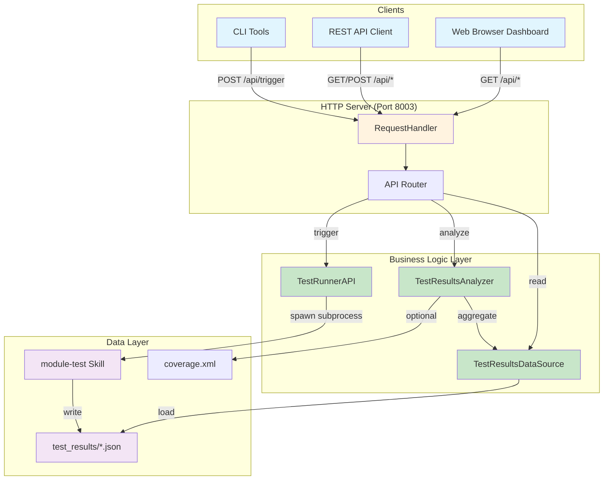
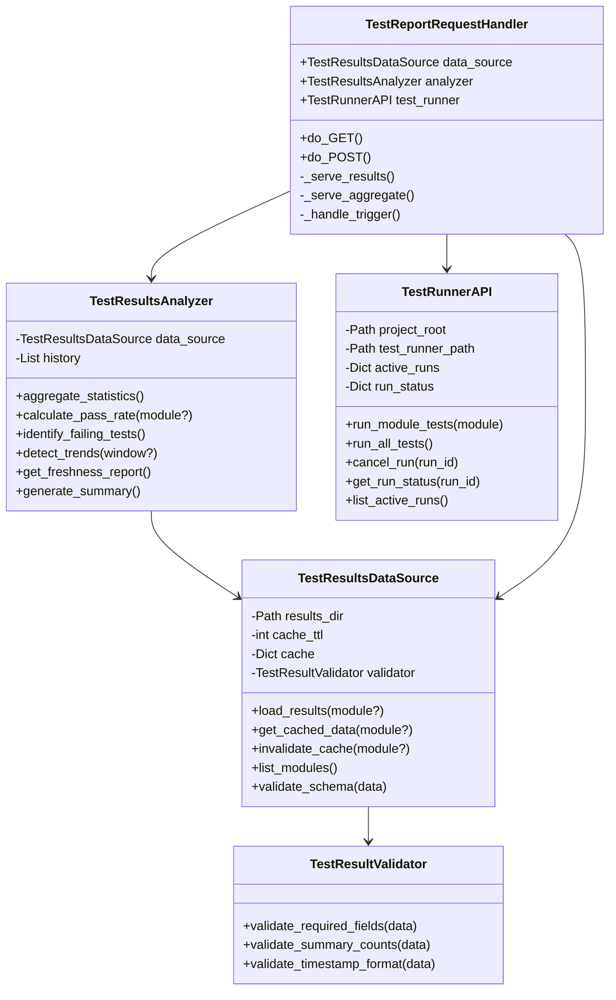
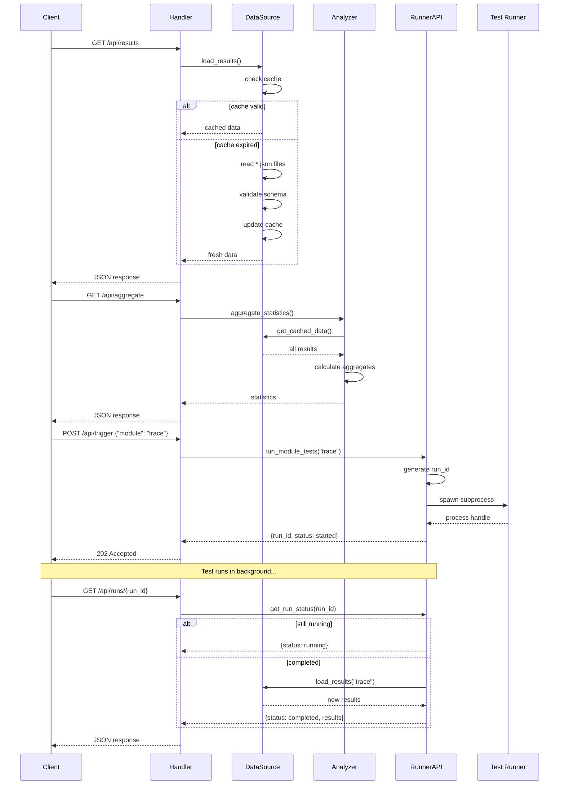
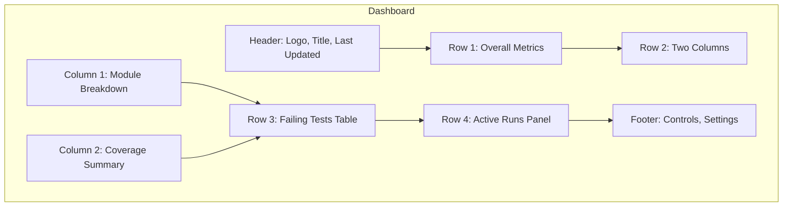
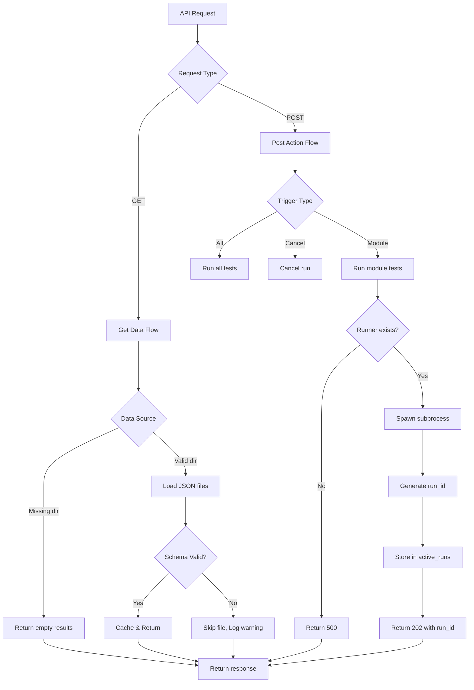

# Test Report Server - Architecture Diagrams

**Version**: 1.0
**Date**: 2026-06-06

## Component Interaction Diagram



## Class Diagram



## Data Flow Diagram



## API Endpoint Map

```mermaid
mindmap
    root((Test Report API))
        GET Endpoints
            /api/results
                Per-module results
                Query: ?module=name
            /api/aggregate
                Overall statistics
                Pass rates
            /api/failures
                Failing tests list
                Grouped by module
            /api/freshness
                Data age report
                Stale warnings
            /api/trends
                Trend analysis
                Query: ?window=N
            /api/runs
                Active runs list
                Recent history
            /api/runs/{id}
                Run status
                Results when done
            /
                Dashboard HTML
        POST Endpoints
            /api/trigger
                Run specific module
                Body: {module}
            /api/trigger/all
                Run all modules
            /api/cancel/{id}
                Cancel running test
```

## Dashboard Layout



## Error Handling Flow



## Timeline / Phases

```mermaid
gantt
    title Test Report Server Implementation Timeline
    dateFormat  HH
    axisFormat  %Hh

    section Phase 1
    Core Data Layer           :p1, 0, 2h

    section Phase 2
    Analysis Layer            :p2, after p1, 2h

    section Phase 3
    Test Runner Integration   :p3, after p2, 2h

    section Phase 4
    HTTP Server               :p4, after p3, 3h

    section Phase 5
    Web Dashboard             :p5, after p4, 3h

    section Phase 6
    Integration & Testing     :p6, after p5, 2h
```


