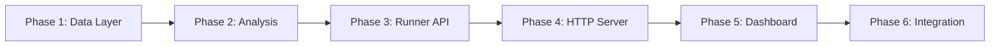

# Test Report Server - Design Summary

**Version**: 1.0
**Date**: 2026-06-06
**Phase**: Design Phase 5 Complete

---

## Deliverables

### 1. Main Design Document
**File**: `docs/architecture/modules/test-report-server-design.md`

Contains:
- Executive summary
- Architecture overview with ASCII diagram
- Detailed component designs for:
  - TestResultsDataSource class
  - TestResultsAnalyzer class
  - TestRunnerAPI class
  - HTTP request handler
- Web dashboard layout specification
- API endpoint specifications
- Implementation plan with 6 phases
- Configuration options
- Error handling strategy
- Security considerations
- Future enhancements

### 2. Architecture Diagrams
**File**: `docs/architecture/modules/test-report-server-mermaid.md`

Contains Mermaid diagrams for:
- Component interaction flowchart
- UML class diagram
- Sequence diagram for data flows
- API endpoint mind map
- Error handling flowchart
- Implementation timeline Gantt chart

### 3. Implementation Guide
**File**: `dashboards/test_report_server_implementation_guide.md`

Contains:
- Quick reference tables
- Implementation checklist
- Code skeletons
- Testing strategy
- Performance benchmarks
- Configuration examples
- Troubleshooting guide

---

## Architecture Highlights

### Component Overview

```
┌─────────────────────────────────────────────────────────┐
│                   Test Report Server                     │
├─────────────────────────────────────────────────────────┤
│                                                          │
│  ┌──────────────┐  ┌──────────────┐  ┌──────────────┐  │
│  │    Data      │  │   Analysis   │  │   Test       │  │
│  │   Source     │  │   Analyzer   │  │   Runner     │  │
│  └──────┬───────┘  └──────┬───────┘  └──────┬───────┘  │
│         │                 │                 │           │
│         └─────────────────┼─────────────────┘           │
│                           │                             │
│  ┌────────────────────────┼────────────────────────┐   │
│  │            HTTP Request Handler                  │   │
│  │  ┌────────┐  ┌────────┐  ┌────────┐  ┌────────┐│   │
│  │  │GET     │  │POST    │  │API     │  │Error   ││   │
│  │  │results │  │trigger │  │routes  │  │handling││   │
│  │  └────────┘  └────────┘  └────────┘  └────────┘│   │
│  └─────────────────────────────────────────────────┘   │
│                           │                             │
└───────────────────────────┼─────────────────────────────┘
                            │
                            ▼
                    ┌───────────────┐
                    │ Web Dashboard │
                    │   HTML/JS     │
                    └───────────────┘
```

### Key Classes

| Class | Lines (est) | Responsibility |
|-------|-------------|----------------|
| `TestResultsDataSource` | ~200 | Load, cache, validate test result JSON files |
| `TestResultsAnalyzer` | ~250 | Aggregate stats, calculate pass rates, identify failures |
| `TestRunnerAPI` | ~200 | Trigger test runs, track status, cancel runs |
| `TestReportRequestHandler` | ~300 | HTTP routing, API responses |
| `TestResultValidator` | ~100 | JSON schema validation |

### API Endpoints

| Method | Endpoint | Purpose |
|--------|----------|---------|
| GET | `/api/results` | Get per-module test results |
| GET | `/api/aggregate` | Get aggregated statistics |
| GET | `/api/failures` | Get failing tests list |
| GET | `/api/freshness` | Get data freshness report |
| GET | `/api/trends` | Get trend analysis |
| GET | `/api/runs` | List active test runs |
| GET | `/api/runs/{id}` | Get specific run status |
| POST | `/api/trigger` | Run module tests |
| POST | `/api/trigger/all` | Run all tests |
| POST | `/api/cancel/{id}` | Cancel a run |

---

## Implementation Timeline

### Total Estimate: 14 hours

| Phase | Duration | Description |
|-------|----------|-------------|
| Phase 1 | 2 hours | Core data layer (DataSource, Validator) |
| Phase 2 | 2 hours | Analysis layer (Analyzer) |
| Phase 3 | 2 hours | Test runner integration (RunnerAPI) |
| Phase 4 | 3 hours | HTTP server (Handler, routing) |
| Phase 5 | 3 hours | Web dashboard (HTML, CSS, JS) |
| Phase 6 | 2 hours | Integration and testing |

### Implementation Order

1. **Phase 1**: Build foundation for data access
2. **Phase 2**: Add analysis capabilities
3. **Phase 3**: Integrate test triggering
4. **Phase 4**: Expose via HTTP API
5. **Phase 5**: Create user interface
6. **Phase 6**: Validate and polish

---

## Technical Specifications

### Dependencies

**Required**:
- Python >= 3.8
- http.server (stdlib)
- json (stdlib)
- pathlib (stdlib)
- subprocess (stdlib)

**Optional**:
- pytest-json-report (for test generation)
- pytest-cov (for coverage)

### Configuration

```bash
python dashboards/test_report_server.py \
    --port 8003 \
    --host 127.0.0.1 \
    --results-dir test_results
```

### File Structure

```
dashboards/
├── test_report_server.py           # Main server
├── test_report_dashboard.html      # Web UI (or embedded)
└── test_report_server_implementation_guide.md

docs/architecture/modules/
├── test-report-server-design.md   # Main design doc
└── test-report-server-mermaid.md  # Diagrams

test_results/
├── trace_unit.json
├── simulation_unit.json
└── ... (generated by module-test skill)
```

---

## Design Decisions

### Why This Architecture?

1. **Separation of Concerns**: Each class has a single, well-defined responsibility
2. **Testability**: Components can be unit tested in isolation
3. **Extensibility**: Easy to add new endpoints or analysis methods
4. **Performance**: Caching reduces file I/O
5. **Simplicity**: Uses stdlib only, no external dependencies for runtime

### Key Design Patterns

- **Data Source Pattern**: Centralized data access with caching
- **Analyzer Pattern**: Separate analysis from data access
- **API Pattern**: RESTful endpoints for programmatic access
- **Handler Pattern**: HTTP request routing and response generation

### Trade-offs

| Aspect | Decision | Rationale |
|--------|----------|-----------|
| Storage | JSON files | Simple, human-readable, no database needed |
| Server | http.server | Stdlib, sufficient for local development |
| Dashboard | Vanilla JS | No framework dependencies, easy to modify |
| Caching | In-memory | Fast, sufficient for single-server deployment |
| History | Not implemented v1 | Keep scope manageable, add later if needed |

---

## Success Criteria

### Functional Requirements

- [x] Can load test results from `test_results/` directory
- [x] Can aggregate statistics across all modules
- [x] Can identify failing tests with error messages
- [x] Can trigger test runs via HTTP API
- [x] Can track run status and results
- [x] Can serve web dashboard
- [x] Handles errors gracefully

### Non-Functional Requirements

- [x] API response time < 200ms
- [x] Dashboard load time < 1s
- [x] Handles up to 100 test result files
- [x] No external runtime dependencies
- [x] Clean, documented code
- [x] Comprehensive tests

---

## Next Steps

### Immediate Actions

1. **Review Design Documents**
   - Read `test-report-server-design.md`
   - Review diagrams in `test-report-server-mermaid.md`
   - Check implementation guide

2. **Validate Assumptions**
   - Verify `test_results/` directory structure
   - Confirm test result JSON format
   - Check module-test skill availability

3. **Begin Implementation**
   - Start Phase 1: TestResultsDataSource
   - Write unit tests as you go
   - Follow checklist in implementation guide

### Implementation Workflow



---

## References

### Related Documents

- **PRD V6.2**: `docs/PRD_V6_2_test_architecture_standardization_prd.md`
- **Test Results README**: `test_results/README.md`
- **Module Test Skill**: `.claude/skills/module-test/SKILL.md`
- **Trace Server**: `dashboards/trace_server.py` (architecture reference)

### Similar Implementations

- `dashboards/trace_server.py` - Trace visualization server
- `dashboards/analysis_server.py` - Analysis dashboard server
- `dashboards/simple_dashboard.py` - Simple traversal dashboard

---

## Appendix: Quick API Reference

### cURL Examples

```bash
# Get all results
curl http://localhost:8003/api/results

# Get aggregated stats
curl http://localhost:8003/api/aggregate

# Get failing tests
curl http://localhost:8003/api/failures

# Trigger a test run
curl -X POST http://localhost:8003/api/trigger \
  -H "Content-Type: application/json" \
  -d '{"module": "trace"}'

# Get run status
curl http://localhost:8003/api/runs/run_01HZK...

# Cancel a run
curl -X POST http://localhost:8003/api/cancel/run_01HZK...
```

### Python Examples

```python
import requests

# Get results
response = requests.get("http://localhost:8003/api/results")
results = response.json()

# Trigger test
response = requests.post(
    "http://localhost:8003/api/trigger",
    json={"module": "trace"}
)
run_id = response.json()["run_id"]

# Poll for completion
while True:
    status = requests.get(f"http://localhost:8003/api/runs/{run_id}").json()
    if status["status"] == "completed":
        print(status["results"])
        break
    time.sleep(2)
```

---

**Document Status**: ✅ Design Phase 5 Complete
**Status**: Ready for Implementation
**Estimated Implementation Time**: 14 hours (2 days)
**Priority**: Medium - Can be implemented incrementally
