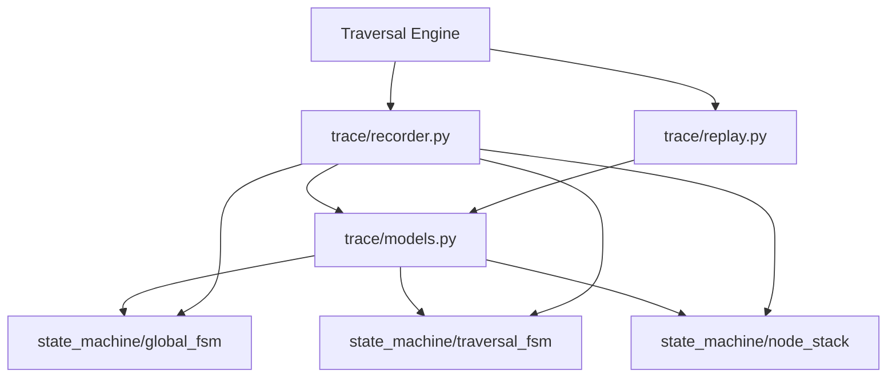
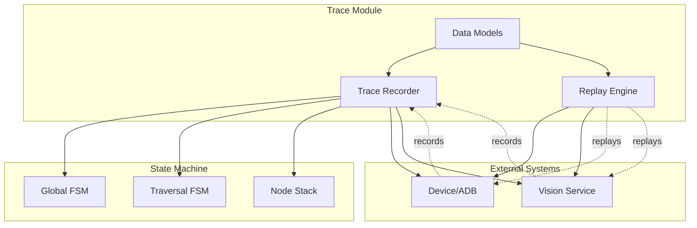
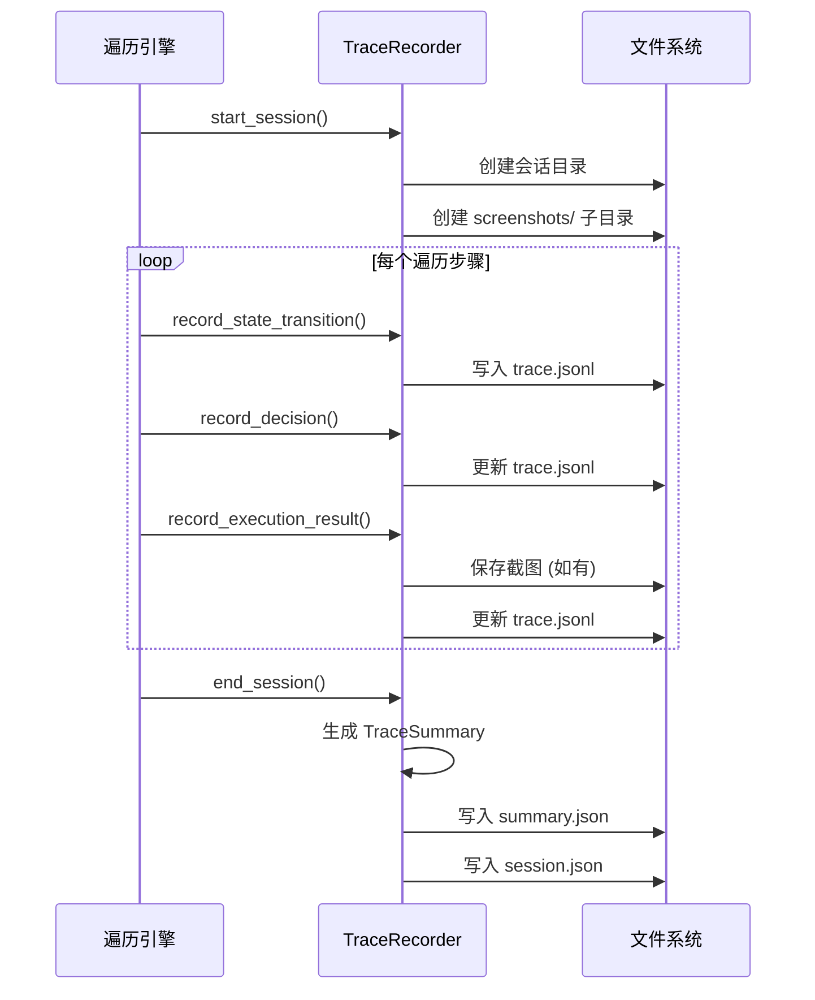
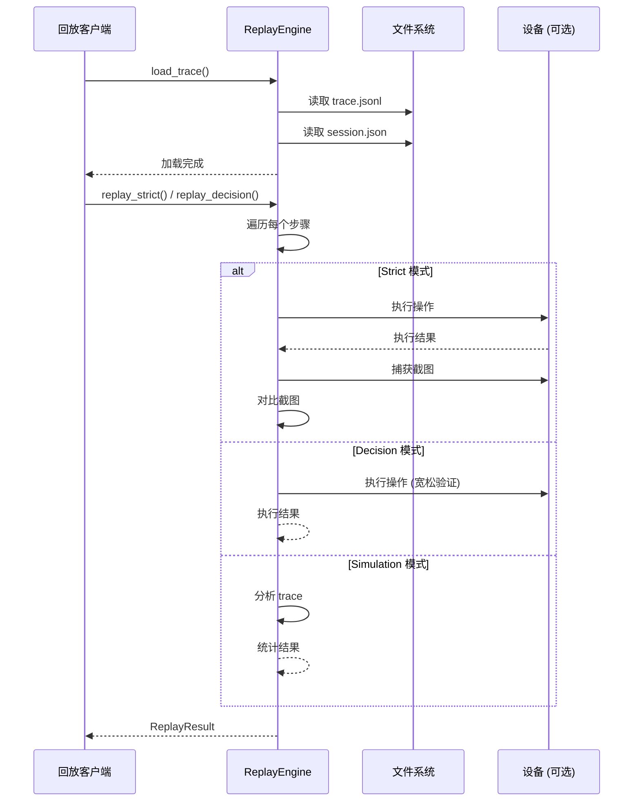

# Trace 模块设计文档

> **模块**: `src/trace/`
> **版本**: V1.0
> **更新日期**: 2026-06-03

---

## 1. 模块概述

### 1.1 职责

Trace 模块是 Uni-Claw 可观测性系统的核心组件，负责记录和回放 UI 遍历执行过程。

### 1.2 核心功能

- **遍历记录**: 捕获遍历执行过程中的状态转换、决策和执行结果
- **状态快照**: 定期保存完整状态，支持故障恢复
- **遍历回放**: 支持三种模式的遍历回放
- **持久化存储**: JSON Lines 格式存储，便于分析和调试

---

## 2. 核心类和接口

### 2.1 数据模型 (`models.py`)

#### ExecutionStatus (Enum)

```python
class ExecutionStatus(str, Enum):
    SUCCESS = "success"
    FAILED = "failed"
    SKIPPED = "skipped"
    TIMEOUT = "timeout"
```

执行状态枚举，记录每个遍历步骤的执行结果。

#### TraceDecision (Dataclass)

```python
@dataclass
class TraceDecision:
    node_id: str
    node_type: str
    operation_action: str
    target_description: Optional[str] = None
    reasoning: Optional[str] = None
    confidence: float = 1.0
```

记录遍历过程中做出的决策，包含目标节点信息、操作类型和置信度。

#### TraceExecution (Dataclass)

```python
@dataclass
class TraceExecution:
    status: ExecutionStatus
    duration_ms: float
    screenshot_ref: Optional[str] = None
    error_message: Optional[str] = None
    error_type: Optional[str] = None
    stack_trace: Optional[str] = None
```

记录单个步骤的执行结果，包含状态、耗时、截图引用和错误信息。

#### TraceStep (Dataclass)

```python
@dataclass
class TraceStep:
    step_id: int
    timestamp: datetime
    global_state: str
    traversal_state: str
    page_analysis_summary: Optional[str] = None
    decision: Optional[TraceDecision] = None
    execution: Optional[TraceExecution] = None
    stack_snapshot: List[str] = field(default_factory=list)
    path_before: List[str] = field(default_factory=list)
    path_after: List[str] = field(default_factory=list)
    screenshot_ref: Optional[str] = None
    error: Optional[Dict[str, Any]] = None
    metadata: Dict[str, Any] = field(default_factory=dict)
```

单个遍历步骤的完整记录，包含状态上下文、决策、执行结果和路径信息。

#### StateSnapshot (Dataclass)

```python
@dataclass
class StateSnapshot:
    snapshot_id: str
    timestamp: datetime
    step_id: int
    full_state: Dict[str, Any]
    node_stack: List[Dict[str, Any]]
    visited_nodes: Dict[str, str]
    current_path: List[str]
    metadata: Dict[str, Any] = field(default_factory=dict)
```

完整状态快照，用于故障恢复和状态分析。

#### TraversalTrace (Dataclass)

```python
@dataclass
class TraversalTrace:
    session_info: SessionInfo
    steps: List[TraceStep] = field(default_factory=list)
    state_snapshots: List[StateSnapshot] = field(default_factory=list)
    summary: Optional[TraceSummary] = None
    trace_id: str = field(default_factory=lambda: datetime.now().strftime("%Y%m%d_%H%M%S"))
```

完整的遍历记录，包含会话信息、所有步骤、状态快照和汇总统计。

### 2.2 录制器 (`recorder.py`)

#### TraceConfig (Dataclass)

```python
@dataclass
class TraceConfig:
    enabled: bool = True
    output_path: Path = field(default_factory=lambda: Path("./traces"))
    keep_count: int = 10
    snapshot_interval: int = 10
    save_screenshots: bool = True
    screenshot_format: str = "png"
    compress_old_traces: bool = False
```

Trace 录制配置，控制输出路径、保留数量、快照频率等。

#### TraceRecorder (Class)

```python
class TraceRecorder:
    def start_session(...) -> None
    def record_state_transition(...) -> TraceStep
    def record_decision(...) -> None
    def record_execution_start(...) -> None
    def record_execution_result(...) -> None
    def record_error(...) -> None
    def end_session() -> Optional[TraversalTrace]
```

核心录制器类，提供完整的录制生命周期管理。

### 2.3 回放引擎 (`replay.py`)

#### ReplayMode (Enum)

```python
class ReplayMode(str, Enum):
    STRICT = "strict"      # 精确回放，验证截图
    DECISION = "decision"  # 复用决策，灵活执行
    SIMULATION = "simulation"  # 干运行分析
```

三种回放模式，适应不同的测试场景。

#### ReplayEngine (Class)

```python
class ReplayEngine:
    def load_trace(trace_path: Path) -> bool
    def replay_strict(...) -> ReplayResult
    def replay_decision(...) -> ReplayResult
    def replay_simulation() -> ReplayResult
    def rebuild_runtime_graph() -> Dict[str, Any]
    def analyze_dynamic_matching_effects() -> Dict[str, Any]
```

回放引擎，支持多种回放模式和高级分析功能。

---

## 3. 依赖关系

### 3.1 外部依赖



### 3.2 内部依赖

```
trace/
  __init__.py
  models.py          # 基础数据模型
  recorder.py        # 依赖 models.py
  replay.py          # 依赖 models.py
```

---

## 4. 设计决策

### 4.1 JSON Lines 存储格式

**决策**: 使用 JSON Lines (`.jsonl`) 而非单一 JSON 文件

**理由**:
1. **增量写入**: 支持流式写入，无需维护内存中的完整数据结构
2. **容错性**: 单行损坏不影响其他记录
3. **易于处理**: 标准 Linux 工具 (grep, sed, awk) 可直接处理
4. **内存友好**: 处理大型 trace 时无需加载全部内容

### 4.2 三种回放模式

**决策**: 提供 STRICT、DECISION、SIMULATION 三种回放模式

**理由**:
1. **STRICT**: 用于回归测试，验证行为完全一致
2. **DECISION**: 用于兼容性测试，允许 UI 变化但保持遍历逻辑
3. **SIMULATION**: 用于离线分析，无需设备连接

### 4.3 状态快照机制

**决策**: 定期创建状态快照，而非依赖连续日志重建

**理由**:
1. **快速恢复**: 从快照恢复比重放日志更快
2. **故障隔离**: 快照之间的日志损坏影响有限
3. **分析便利**: 可直接查看特定时刻的完整状态

### 4.4 截图引用设计

**决策**: 存储截图文件引用而非嵌入数据

**理由**:
1. **文件大小**: JSON Lines 文件保持可读性
2. **灵活处理**: 可独立压缩、归档截图
3. **按需加载**: 分析时才加载截图，节省内存

---

## 5. 模块架构



---

## 6. 数据流

### 6.1 录制流程



### 6.2 回放流程



---

## 7. 文件结构

```
traces/
  trace_20260603_143022/           # 会话目录 (时间戳命名)
    trace.jsonl                     # 遍历步骤记录
    snapshots.jsonl                 # 状态快照
    summary.json                    # 汇总统计
    session.json                    # 会话元数据
    screenshots/                   # 截图目录
      step_1_screenshot_1.png
      step_2_screenshot_1.png
      ...
```

---

## 8. 性能考虑

### 8.1 写入优化

- **批量写入**: 步骤更新时批量写入减少 I/O
- **异步写入**: 可扩展为异步日志写入 (未来)
- **压缩**: 旧 trace 支持压缩存储

### 8.2 内存管理

- **流式处理**: 加载 trace 时逐行读取
- **快照缓存**: 热点快照可缓存到内存
- **截图延迟**: 仅在需要时加载截图

---

## 9. 扩展点

### 9.1 自定义序列化

可通过继承 `TraceStep` 实现自定义序列化逻辑。

### 9.2 回放回调

`ReplayEngine` 支持注册自定义回调:
- `operation_callback`: 自定义操作执行
- `screenshot_callback`: 自定义截图处理
- `navigation_callback`: 自定义导航逻辑

### 9.3 存储后端

当前使用文件系统，可扩展为:
- 数据库存储 (SQLite/PostgreSQL)
- 对象存储 (S3/OSS)
- 时序数据库 (InfluxDB)

---

## 10. 使用示例

### 10.1 录制遍历

```python
from src.trace import TraceRecorder, TraceConfig

# 配置录制器
config = TraceConfig(
    output_path=Path("./traces"),
    keep_count=20,
    save_screenshots=True,
)
recorder = TraceRecorder(config)

# 开始会话
recorder.start_session(
    device_id="emulator-5554",
    app_package="com.example.app",
    traversal_mode="graph",
)

# 记录状态转换
step = recorder.record_state_transition(
    global_state=global_state,
    traversal_state=traversal_state,
    node_stack=node_stack,
    current_path=current_path,
    page_analysis=analysis,
)

# 记录决策
recorder.record_decision(
    step=step,
    node_id="btn_home",
    node_type="button",
    operation_action="tap",
    reasoning="返回主页",
)

# 记录执行结果
recorder.record_execution_result(
    step=step,
    status=ExecutionStatus.SUCCESS,
    duration_ms=250.5,
    screenshot_data=screenshot_bytes,
)

# 结束会话
trace = recorder.end_session()
```

### 10.2 回放遍历

```python
from src.trace import ReplayEngine, ReplayMode

# 创建回放引擎
engine = ReplayEngine(mode=ReplayMode.STRICT)

# 加载 trace
engine.load_trace(Path("traces/trace_20260603_143022"))

# 注册回调
engine.register_operation_callback(lambda node_id, action, target: {
    "success": execute_action(node_id, action)
})

# 执行回放
result = engine.replay_strict(
    screenshot_match_threshold=0.9,
    stop_on_failure=True,
)

print(f"回放成功: {result.success}")
print(f"步骤匹配: {result.steps_matched}/{result.steps_replayed}")
```

---

**最后更新**: 2026-06-03
**维护者**: Uni-Claw 开发团队
