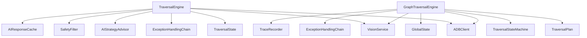
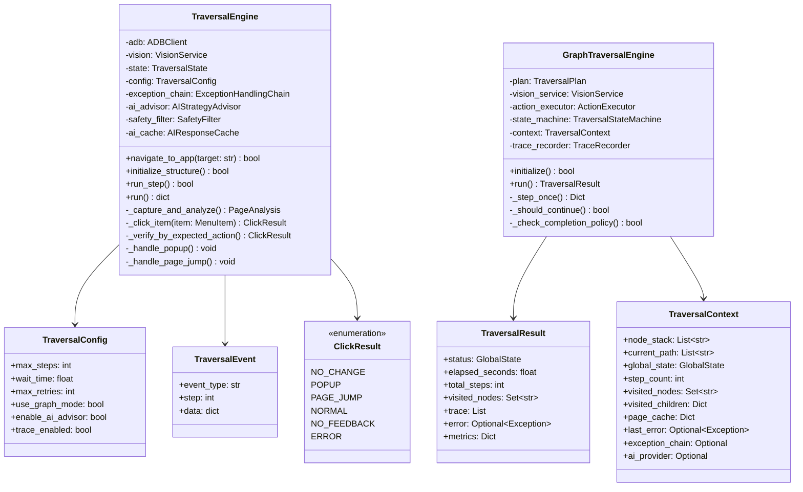
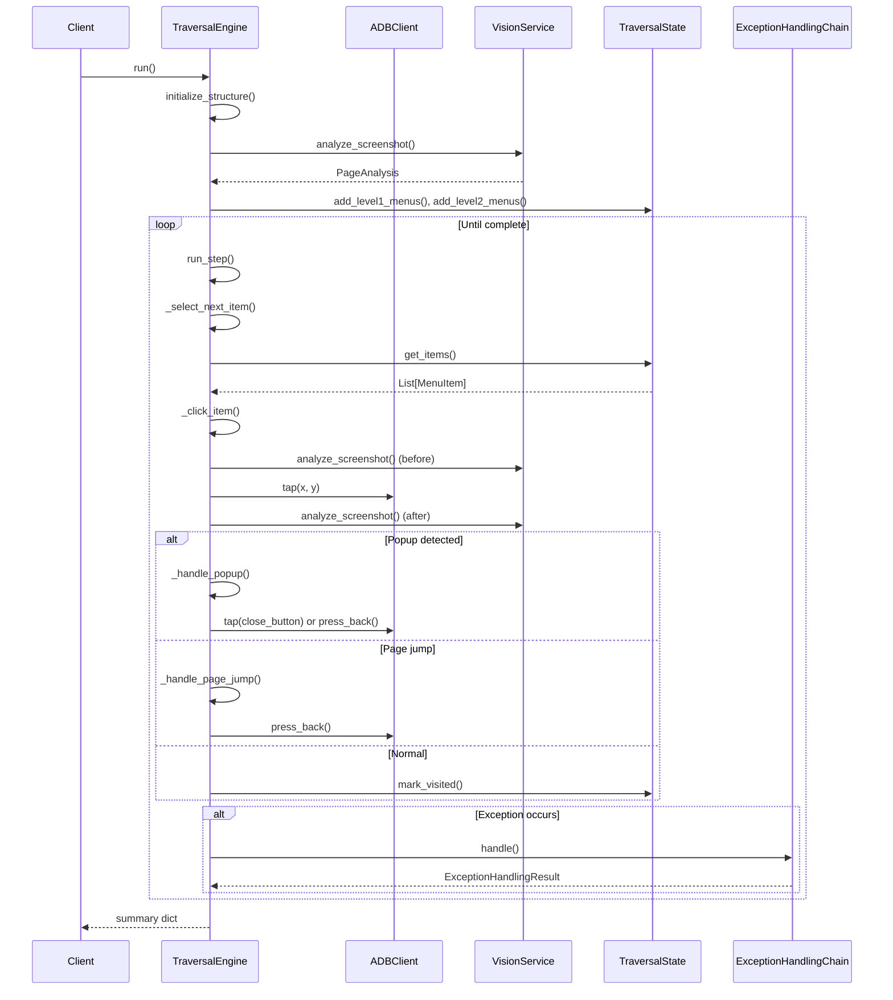
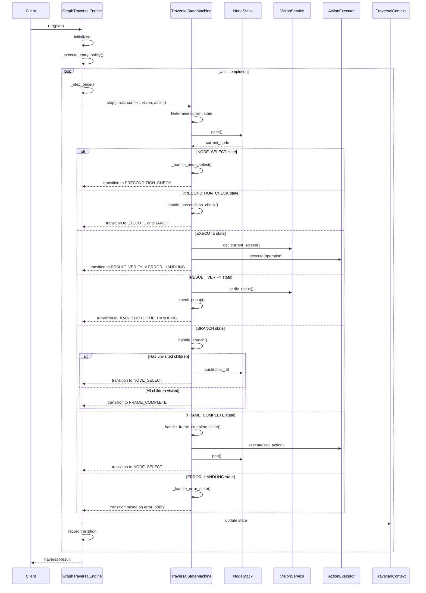
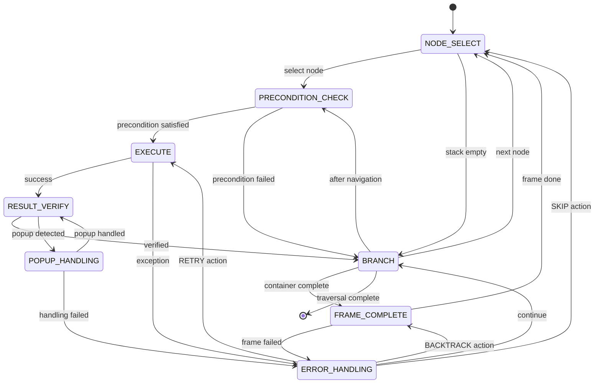
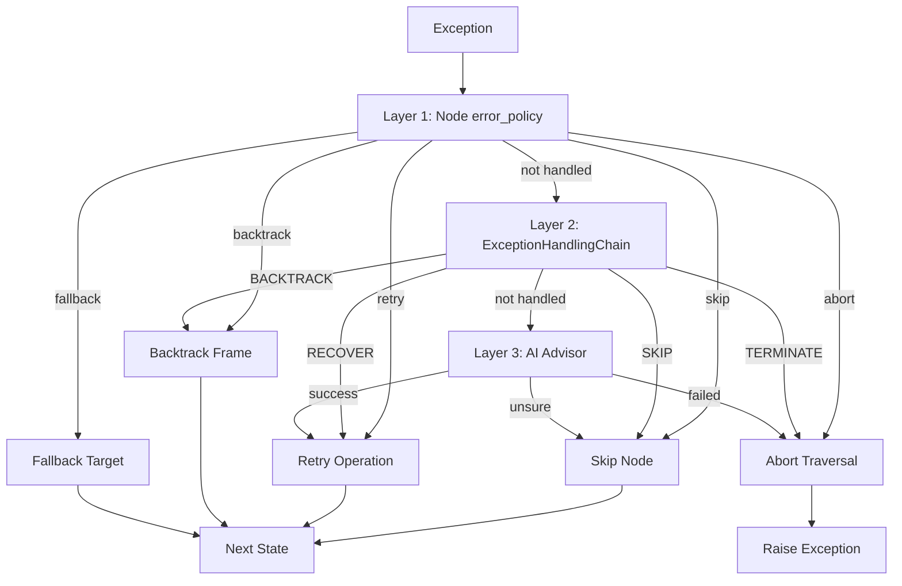
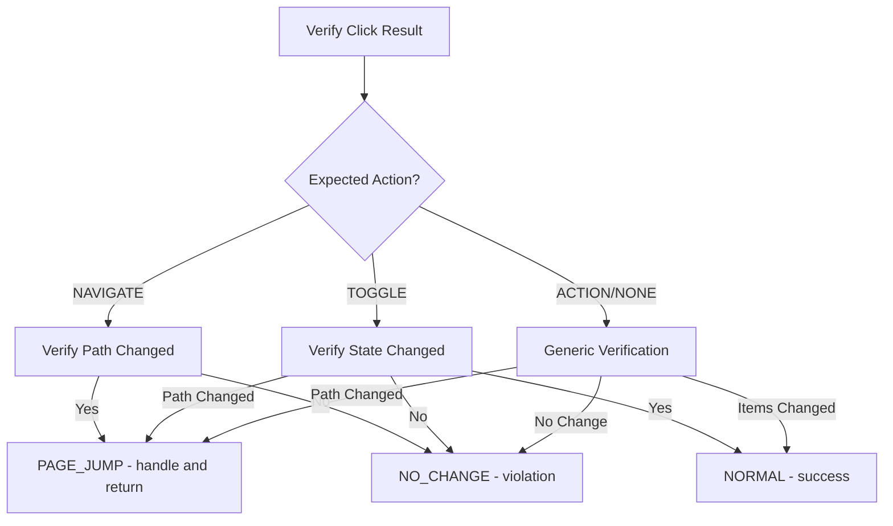

# Traversal Module Design

> **Module Path**: `src/traversal/`
> **Version**: V6.0
> **Last Updated**: 2026-06-03

---

## 1. Module Overview

The traversal module is the core execution engine for Uni-Claw's mobile UI automation. It orchestrates the entire traversal process, coordinating with vision services, action executors, state management, and (in V6) graph-based declarative plans.

### 1.1 Primary Responsibilities

1. **Traversal Execution**: Execute UI traversal according to plans (V5: state-based, V6: graph-based)
2. **State Management**: Coordinate traversal state and transitions
3. **Action Execution**: Execute device actions (tap, swipe, back, etc.) through ADB
4. **Exception Handling**: Detect and recover from traversal errors
5. **Event Emission**: Provide real-time traversal events for observability
6. **Result Verification**: Verify expected behavior after UI interactions

### 1.2 Module Variants

The module supports two traversal modes:

| Mode | Version | Description |
|------|---------|-------------|
| **Legacy Mode** | V5.x | State-based traversal using `TraversalEngine` |
| **Graph Mode** | V6.0 | Graph-based traversal using `GraphTraversalEngine` |

---

## 2. Core Classes and Interfaces

### 2.1 Legacy Engine (V5.x)

#### `TraversalConfig`

Configuration dataclass for traversal behavior.

```python
@dataclass
class TraversalConfig:
    max_steps: int = 200
    wait_time: float = 0.5
    max_retries: int = 2
    timeout: int = 30
    save_screenshots: bool = True
    screenshot_dir: Optional[str] = None
    skip_readonly: bool = True
    enable_exception_handling: bool = True
    exception_max_retries: int = 3
    use_graph_mode: bool = False  # V4.0
    enable_ai_advisor: bool = False  # V5.0
    trace_enabled: bool = False  # V4.0
```

#### `TraversalEvent`

Event emitted during traversal for observability.

```python
@dataclass
class TraversalEvent:
    event_type: str
    step: int
    data: dict
```

#### `TraversalEngine`

Main traversal engine for legacy mode.

**Key Methods**:
- `navigate_to_app(target: str) -> bool`: Navigate to target app
- `initialize_structure() -> bool`: Analyze and cache initial menu structure
- `run_step() -> bool`: Execute one traversal step
- `run() -> dict`: Run complete traversal

**Event Types Emitted**:
- `navigate_start`, `navigate_success`, `navigate_failed`
- `initialize_start`, `initialize_complete`
- `page_analyzed`
- `click_start`
- `popup_detected`
- `page_jump`
- `expected_behavior_violation`
- `exception_occurred`, `exception_ignored`, `operation_skipped`
- `recovery_start`, `recovery_success`, `recovery_failed`
- `traversal_start`, `traversal_complete`, `traversal_finished`

---

### 2.2 Graph Engine (V6.0)

#### `GraphTraversalEngine`

V6 graph-based traversal engine using declarative TraversalPlan.

**Key Methods**:
- `initialize() -> bool`: Execute entry policy and setup initial state
- `run() -> TraversalResult`: Execute the traversal plan
- `_step_once() -> Dict[str, Any]`: Execute a single state machine step

#### `TraversalResult`

Result of graph traversal execution.

```python
@dataclass
class TraversalResult:
    status: GlobalState
    elapsed_seconds: float
    total_steps: int
    visited_nodes: Set[str]
    trace: List[Dict[str, Any]]
    error: Optional[Exception] = None
    metrics: Dict[str, Any] = field(default_factory=dict)
```

#### `TraversalContext`

Runtime context for traversal execution.

```python
@dataclass
class TraversalContext:
    # Stack management
    node_stack: List[str] = field(default_factory=list)
    current_path: List[str] = field(default_factory=list)

    # Runtime state
    global_state: GlobalState = GlobalState.IDLE
    step_count: int = 0
    max_depth: int = 100
    retry_count: int = 0

    # Tracking
    visited_nodes: Set[str] = field(default_factory=set)
    visited_pages: Set[str] = field(default_factory=set)
    failed_nodes: Dict[str, Dict[str, Any]] = field(default_factory=dict)
    visited_children: Dict[str, Set[str]] = field(default_factory=dict)

    # Caching
    page_cache: Dict[str, Dict[str, Any]] = field(default_factory=dict)

    # History
    action_history: List[Dict[str, Any]] = field(default_factory=list)

    # Error handling
    last_error: Optional[Exception] = None

    # Optional dependencies
    exception_chain: Optional[Any] = None
    ai_provider: Optional[Any] = None
```

---

## 3. Dependencies

### 3.1 Internal Dependencies



### 3.2 External Dependencies

| Module | Purpose |
|--------|---------|
| `src.adb.ADBClient` | Device control (tap, swipe, screenshot) |
| `src.vision.VisionService` | Screen analysis and AI vision |
| `src.state.TraversalState` | State persistence |
| `src.state_machine.*` | State machine orchestration |
| `src.graph.*` | Graph model and plan |
| `src.exception.*` | Exception handling |
| `src.ai.*` | AI strategy advisory |
| `src.trace.*` | Trace recording |

---

## 4. Design Decisions

### 4.1 Dual Engine Architecture

**Decision**: Maintain both `TraversalEngine` (V5) and `GraphTraversalEngine` (V6)

**Rationale**:
- V5 engine is stable and proven for state-based traversal
- V6 engine provides declarative graph-based traversal with better control
- Allows gradual migration and backward compatibility
- Graph mode can be toggled via `TraversalConfig.use_graph_mode`

### 4.2 State Machine-Driven Control

**Decision**: Use state machine for traversal flow control

**Rationale**:
- Clear, predictable state transitions
- Easy to debug and visualize
- Supports complex execution flows (precondition, execute, verify, branch)
- Enables trace-based debugging

### 4.3 Event-Driven Observability

**Decision**: Emit events at all key traversal points

**Rationale**:
- Enables real-time monitoring via dashboards
- Supports trace-based debugging
- Allows external systems to react to traversal events
- Facilitates analytics and metrics collection

### 4.4 Exception Handling Chain

**Decision**: Implement multi-layer exception handling

**Rationale**:
- Node-level error policies for local handling
- Global exception chain for system-level recovery
- AI fallback as last resort (V5.0+)
- Configurable retry limits and actions

### 4.5 Action-Based Verification

**Decision**: Verify click results based on expected action type

**Rationale**:
- Navigate-type actions should change path
- Toggle-type actions should change state (not path)
- Action-type actions are generic
- Enables detection of UI behavior violations

### 4.6 Read-Only Element Handling

**Decision**: Skip read-only elements by default

**Rationale**:
- Reduces unnecessary clicks
- Focuses on interactive elements
- Configurable via `skip_readonly` flag
- Respects `ExpectedAction.NONE` marker

---

## 5. Dependency Graph

### 5.1 Module-Level Dependencies

```mermaid
graph TB
    subgraph "Traversal Module"
        TE[TraversalEngine]
        GE[GraphTraversalEngine]
        TC[TraversalConfig]
        TRE[TraversalEvent]
        TR[TraversalResult]
        TCX[TraversalContext]
    end

    subgraph "Graph Module"
        TP[TraversalPlan]
        TN[TraversalNode]
    end

    subgraph "State Machine"
        TFSM[TraversalStateMachine]
        GFSM[GlobalFSM]
        GS[GlobalState]
    end

    subgraph "State Module"
        TS[TraversalState]
        CT[ContentTree]
    end

    subgraph "Exception Module"
        EHC[ExceptionHandlingChain]
        EH[ExceptionHistory]
    end

    subgraph "AI Module"
        AIA[AIStrategyAdvisor]
        SF[SafetyFilter]
        AIC[AIResponseCache]
    end

    subgraph "Vision Module"
        VS[VisionService]
        MVS[MockVisionService]
    end

    subgraph "ADB Module"
        ADB[ADBClient]
        MADB[MockADBClient]
    end

    subgraph "Trace Module"
        TRR[TraceRecorder]
    end

    TE --> TC
    TE --> TS
    TE --> ADB
    TE --> VS
    TE --> EHC
    TE --> AIA

    GE --> TP
    GE --> TN
    GE --> TFSM
    GE --> GS
    GE --> ADB
    GE --> VS
    GE --> EHC
    GE --> TRR

    TFSM --> GS
    TFSM --> CT

    TCX --> GS
    TCX --> EHC

    EHC --> ADB
    EHC --> VS

    AIA --> SF
    AIA --> AIC
```



### 5.2 Class Relationship Diagram



---

## 6. Data Flow

### 6.1 Legacy Traversal Flow (V5.x)



### 6.2 Graph Traversal Flow (V6.0)



---

## 7. State Machine

### 7.1 Traversal State Machine (V6.0)



### 7.2 State Descriptions

| State | Description |
|-------|-------------|
| `NODE_SELECT` | Select next node from stack to process |
| `PRECONDITION_CHECK` | Verify node's precondition is satisfied |
| `EXECUTE` | Execute the node's operation |
| `RESULT_VERIFY` | Verify operation result, detect popups |
| `BRANCH` | Determine next action (children, return, error) |
| `FRAME_COMPLETE` | Handle container frame completion (V6) |
| `ERROR_HANDLING` | Process exceptions and recover (V6) |
| `POPUP_HANDLING` | Handle detected popups (V6) |

---

## 8. Exception Handling

### 8.1 Exception Handling Layers



### 8.2 Recovery Actions

| Recovery Action | Implementation | Description |
|-----------------|----------------|-------------|
| `RECONNECT_ADB` | `adb.reconnect()` | Re-establish ADB connection |
| `RESTART_APP` | `adb.stop_app()`, `adb.start_app()` | Restart target application |
| `CLOSE_POPUP` | Find and click close button | Dismiss detected popup |
| `NAVIGATE_BACK` | `adb.press_back()` | Navigate to previous page |
| `WAIT_AND_RETRY` | `time.sleep()` | Wait before retry |
| `IGNORE_UI_CHANGE` | Log and continue | Continue despite UI change |

---

## 9. Verification Logic

### 9.1 Action-Based Verification

The engine uses different verification strategies based on the expected action type:



### 9.2 Click Results

| Result | Description | Handling |
|--------|-------------|----------|
| `NO_CHANGE` | No UI state change | Try children or mark as no_feedback |
| `POPUP` | Popup detected | Close popup, continue |
| `PAGE_JUMP` | Path/navigation changed | Record jump, return to previous |
| `NORMAL` | Expected change occurred | Mark visited, continue |
| `NO_FEEDBACK` | No actionable feedback | Try children, mark as no_feedback |
| `ERROR` | Exception occurred | Use exception handling chain |

---

## 10. Configuration

### 10.1 TraversalConfig Options

| Category | Option | Type | Default | Description |
|----------|--------|------|---------|-------------|
| **Basic** | `max_steps` | int | 200 | Maximum traversal steps |
| | `wait_time` | float | 0.5 | Default wait time after actions |
| | `max_retries` | int | 2 | Max retries for operations |
| | `timeout` | int | 30 | Operation timeout |
| **Screenshots** | `save_screenshots` | bool | true | Save screenshots during traversal |
| | `screenshot_dir` | str | None | Directory for screenshots |
| **Elements** | `skip_readonly` | bool | true | Skip read-only elements |
| **Exception** | `enable_exception_handling` | bool | true | Enable exception handling |
| | `exception_max_retries` | int | 3 | Max retries for exception handling |
| | `exception_history_max_records` | int | 1000 | Max exception history records |
| | `recovery_timeout` | float | 10.0 | Timeout for recovery actions |
| **Graph Mode** | `use_graph_mode` | bool | false | Enable graph-based traversal |
| | `template_registry_path` | str | None | Path to template registry |
| | `max_stack_depth` | int | 10 | Maximum stack depth |
| **Trace** | `trace_enabled` | bool | false | Enable trace recording |
| | `trace_output_path` | str | None | Path for trace output |
| | `trace_keep_count` | int | 10 | Number of traces to keep |
| **AI Advisor** | `enable_ai_advisor` | bool | false | Enable AI strategy advisor |
| | `ai_call_timeout` | float | 30.0 | Timeout for AI calls |
| | `ai_min_confidence` | float | 0.7 | Minimum confidence threshold |
| | `ai_cache_ttl` | int | 300 | AI response cache TTL |

---

## 11. Testing

### 11.1 Test Files

| File | Description |
|------|-------------|
| `test_engine.py` | Unit tests for TraversalEngine |
| `run_tests.py` | Test runner for traversal module |

### 11.2 Test Coverage Areas

- Configuration initialization and defaults
- Event emission and capture
- App navigation (success and failure)
- Structure initialization
- Item selection and visiting
- Click handling and verification
- Menu switching (level1 and level2)
- Wait time calculation by action type
- Action-based verification logic
- Read-only element handling
- Behavior violation detection

### 11.3 Mock Services

- `MockADBClient`: Simulates ADB operations
- `MockVisionService`: Simulates screen analysis

---

## 12. Evolution History

### V5.x - Legacy Engine

- State-based traversal
- AI integration for strategy advice
- Exception handling chain
- Action-based verification

### V6.0 - Graph Engine

- Declarative traversal plans
- Graph-based node traversal
- State machine-driven control
- Enhanced completion policies
- Frame completion handling
- Multi-layer error handling
- Trace integration

---

## 13. Future Considerations

1. **Unified Interface**: Consider unifying `TraversalEngine` and `GraphTraversalEngine` behind a common interface
2. **Parallel Traversal**: Support multiple device traversal
3. **Live Visualization**: Real-time traversal visualization
4. **ML-based Verification**: Use ML for smarter result verification
5. **Traversal Planning**: AI-assisted traversal plan generation
6. **Performance Optimization**: Caching, batching, parallelization

---

**Document Owner**: Uni-Claw Development Team
**Status**: Active
**Related Docs**: [ARCHITECTURE_V6.md](../ARCHITECTURE_V6.md), [GRAPH_MODEL.md](../GRAPH_MODEL.md)
