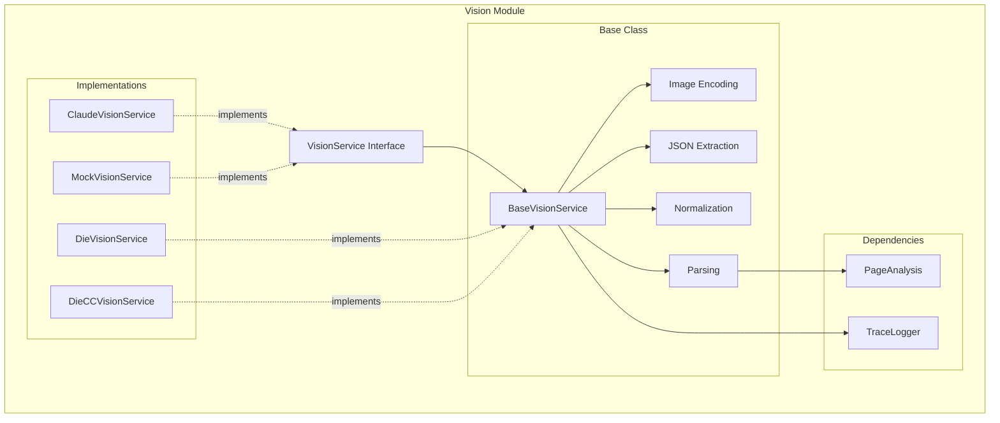
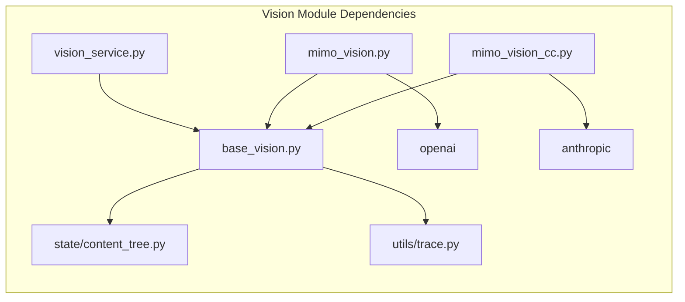
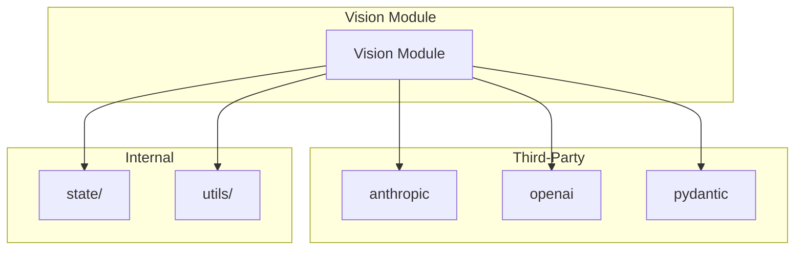

# Vision Module Design Document

> **Module**: `src/vision/`
> **Version**: 1.0
> **Last Updated**: 2026-06-03

---

## 1. Module Overview

The Vision module provides screen analysis capabilities for the Uni-Claw framework. It uses multimodal AI models to analyze screenshots and extract structured information about UI elements, page structure, and interactive components.

### 1.1 Core Responsibilities

- **Screenshot Analysis**: Extract page structure from PNG screenshots
- **Element Detection**: Identify and classify UI elements (buttons, menus, switches, etc.)
- **Coordinate Mapping**: Provide normalized coordinates for all detected elements
- **App Entry Finding**: Locate app icons on home screens
- **Popup Detection**: Identify dialogs, alerts, and special UI elements

### 1.2 Key Design Principles

1. **Provider Abstraction**: Support multiple vision providers (Claude, MiMo)
2. **Protocol Flexibility**: Support both OpenAI and Anthropic API protocols
3. **Error Resilience**: Handle API failures with retry logic
4. **Response Normalization**: Fix common AI response issues automatically
5. **Trace Integration**: Built-in tracing for observability

---

## 2. Architecture

### 2.1 Layer Structure

```
VisionService (Abstract Interface)
         ↓
    BaseVisionService (Base Class with Utilities)
         ↓
    Implementations (ClaudeVisionService, MiMoVisionService, etc.)
```

### 2.2 Component Diagram



---

## 3. Core Classes and Interfaces

### 3.1 VisionService (Interface)

**Location**: `src/vision/vision_service.py`

**Purpose**: Abstract base for vision/analysis services

**Methods**:
- `analyze_screenshot(image_data: bytes) -> PageAnalysis`: Analyze screenshot and return page structure
- `find_app_entry(image_data: bytes, target: str) -> Optional[Dict]`: Find app icon on home screen

**Key Features**:
- Protocol-agnostic interface
- Works with PNG image bytes
- Returns structured PageAnalysis objects

### 3.2 BaseVisionService (Base Class)

**Location**: `src/vision/base_vision.py`

**Purpose**: Base class with common utilities for all vision services

**Key Features**:
- Image encoding (base64 and data URL formats)
- JSON extraction from markdown code blocks
- Page data normalization (handles empty strings, invalid values)
- Trace logging integration
- Error handling

**Protected Methods**:
- `_encode_image(image_data, mime_type)`: Encode to base64 data URL
- `_encode_image_base64(image_data)`: Encode to base64 string (Anthropic format)
- `_extract_json(content)`: Extract JSON from AI response
- `_normalize_page_data(data)`: Normalize and fix common issues
- `_parse_page_analysis(response)`: Parse JSON into PageAnalysis
- `_parse_find_entry(response)`: Parse find_entry response

**Public Methods**:
- `analyze_screenshot(image_data)`: Main analysis method with tracing
- `find_app_entry(image_data, target)`: Find app entry point

### 3.3 Implementations

#### 3.3.1 ClaudeVisionService

**Location**: `src/vision/vision_service.py`

**Purpose**: Vision service using official Claude API (Anthropic)

**Configuration**:
```python
ClaudeVisionService(
    api_key: str,
    model: str = "claude-3-5-sonnet-20241022"
)
```

**Key Features**:
- Uses Anthropic SDK
- Supports Claude 3.5 Sonnet
- Native Anthropic protocol
- Base64 image encoding

#### 3.3.2 DieVisionService

**Location**: `src/vision/mimo_vision.py`

**Purpose**: Vision service using Xiaomi Die API via OpenAI SDK

**Configuration**:
```python
DieVisionService(
    api_key: Optional[str] = None,  # Defaults to MIMO_API_KEY env var
    model: str = "mimo-v2.5",
    base_url: str = "https://api.xiaomimimo.com/v1"
)
```

**Key Features**:
- Uses OpenAI SDK (v1 endpoint with OpenAI protocol)
- Environment variable support (MIMO_API_KEY)
- Data URL image encoding
- Factory method for settings-based creation

#### 3.3.3 DieCCVisionService

**Location**: `src/vision/mimo_vision_cc.py`

**Purpose**: Vision service using Xiaomi Die API via Anthropic SDK (Claude protocol)

**Configuration**:
```python
DieCCVisionService(
    api_key: Optional[str] = None,  # Defaults to MIMO_API_KEY env var
    model: str = "mimo-v2.5",
    base_url: str = "https://token-plan-cn.xiaomimimo.com/anthropic"
)
```

**Key Features**:
- Uses Anthropic SDK with Die CC endpoint
- Anthropic protocol compatibility
- Retry logic for empty responses (up to 3 attempts)
- Handles ThinkingBlock responses (skips non-text content)
- Exponential backoff on retries

**Retry Logic**:
```python
# Handles empty responses from Die
max_retries = 3
for attempt in range(max_retries):
    # Try to extract text from response
    # Skip ThinkingBlock, only use TextBlock
    # If no text found, retry with exponential backoff
```

#### 3.3.4 MockVisionService

**Location**: `src/vision/vision_service.py`

**Purpose**: Mock vision service for testing

**Key Features**:
- No API calls required
- Configurable predefined responses
- Call count tracking
- Default response generator

**Usage**:
```python
mock = MockVisionService()
mock.add_response(predefined_page_analysis)
result = mock.analyze_screenshot(image_data)
print(mock.call_count)  # Track API calls
```

---

## 4. Data Structures

### 4.1 PageAnalysis

**Location**: `src/state/content_tree.py`

**Purpose**: Structured representation of analyzed page

**Structure**:
```python
@dataclass
class PageAnalysis:
    level1_dir: Direction  # LEFT, RIGHT, TOP, BOTTOM
    level1_menus: List[MenuInfo]
    level2_dir: Direction
    level2_menus: List[MenuInfo]
    current_path: List[str]
    items: List[MenuItem]
    is_popup: bool
    popup_info: Optional[dict]
    close_button: Optional[Coordinate]
    back_button: Optional[Coordinate]
    has_scroll: bool
    is_end_of_list: bool
```

### 4.2 MenuItem

**Purpose**: Individual UI element

**Structure**:
```python
@dataclass
class MenuItem:
    name: str
    type: str  # menu_item, tab, switch, button, etc.
    expected_action: str  # navigate, toggle, action, none
    expects_page_change: bool
    expects_state_change: bool
    coordinate: Coordinate
    parent: Optional[str]
```

### 4.3 Button Types

The vision service classifies buttons into these types:

| Type | Description | Expected Action |
|------|-------------|-----------------|
| menu_item | List items that navigate to sub-pages | navigate |
| tab | Tab buttons that switch views | navigate |
| back_button | Back/return navigation buttons | navigate |
| switch | On/off toggle switches | toggle |
| toggle | Buttons that toggle between states | toggle |
| button | Generic action buttons | action |
| link | Navigation links or hypertext | action |
| icon | Icon-only buttons without text | action |
| text | Non-interactive text | none |
| readonly | Elements that don't respond | none |

---

## 5. Prompts

### 5.1 Structure Analysis Prompt

**Purpose**: Analyze screenshot and extract complete page structure

**Key Requirements**:
- Menu structure (level 1 and level 2)
- Current active path
- All clickable items with button type classification
- Popups, dialogs, special UI elements
- Normalized coordinates (0-1)

**Output Format**: JSON with page structure

### 5.2 Find Entry Prompt

**Purpose**: Find specific app icon on home screen

**Input**: Target app name
**Output**: JSON with found status, name, coordinates, confidence

---

## 6. Response Normalization

### 6.1 Direction Normalization

**Issue**: AI may return invalid direction values like "none", "top|bottom", empty strings

**Solution**: `BaseVisionService._normalize_page_data()`

```python
# Handles:
# - None or empty values → default
# - 'none', 'null', 'n/a', 'undefined' → default  
# - Pipe-separated values ('top|bottom') → first valid direction
# - Invalid single values → default
# - Valid values → passthrough

valid_directions = {'left', 'right', 'top', 'bottom'}
default = 'left'  # for level1_dir
default = 'bottom'  # for level2_dir
```

### 6.2 Missing Fields

**Default Values**:
- `level1_menus`: []
- `level2_menus`: []
- `items`: []
- `current_path`: []
- `is_popup`: false
- `has_scroll`: false

### 6.3 JSON Extraction

**Handles**:
- Markdown code blocks: ````json ... ````
- Plain JSON: `{...}`
- Mixed content: Extracts JSON from longer response

---

## 7. Error Handling

### 7.1 Error Types

- `VisionError`: Base exception for vision service errors
- API errors from providers (rate limits, timeouts)
- JSON parsing errors
- Empty response handling (Die CC)

### 7.2 Retry Strategy (Die CC)

```python
max_retries = 3
# Exponential backoff: 2s, 4s, 6s
# Handles empty responses from Thinking blocks
# Skips non-text content blocks
```

### 7.3 Error Recovery

1. **JSON Parse Error**: Log and raise VisionError
2. **API Error**: Propagate as VisionError with context
3. **Empty Response**: Retry (Die CC only)
4. **Invalid Directions**: Normalize to default value

---

## 8. Trace Integration

### 8.1 Trace Logging

All vision services integrate with the trace system:

```python
# In BaseVisionService
self._trace = TraceLogger("vision")

# Spans for:
# - analyze_screenshot operation
# - Image size and hash logging
# - Items count, path, popup status
# - Error tracking
```

### 8.2 Trace Fields

**Input**:
- image_size: Length of image data in bytes
- image_hash: Hash of image data (modulo 10000)
- prompt: Prompt template used

**Output**:
- items_count: Number of detected items
- current_path: Detected navigation path
- is_popup: Popup detection status
- has_scroll: Scroll detection status

---

## 9. Dependency Relationships

### 9.1 Internal Dependencies



### 9.2 External Dependencies



---

## 10. Design Decisions

### 10.1 Provider Abstraction

**Decision**: Use abstract VisionService interface

**Rationale**:
- Flexibility: Easy to add new providers
- Testing: Simple to mock for tests
- Migration: Can switch providers without changing calling code

**Trade-offs**:
- Limited to lowest common denominator features
- Need to maintain interface compatibility

### 10.2 Base Class Pattern

**Decision**: BaseVisionService with shared utilities

**Rationale**:
- Code reuse: shared encoding, parsing, normalization
- Consistency: all implementations behave the same way
- Maintainability: changes in one place affect all

**Trade-offs**:
- Tight coupling: implementations inherit base class behavior
- Complexity: base class has many responsibilities

### 10.3 Protocol Flexibility

**Decision**: Support both OpenAI and Anthropic protocols

**Rationale**:
- Provider compatibility: Die supports both protocols
- Performance: can choose faster protocol
- Migration: easy to switch between endpoints

**Trade-offs**:
- More code to maintain
- Potential protocol differences

### 10.4 Response Normalization

**Decision**: Auto-normalize invalid AI responses

**Rationale**:
- Robustness: handles common AI issues gracefully
- Consistency: standardized output format
- Debugging: logs normalization decisions

**Trade-offs**:
- May hide real issues
- Default values may be incorrect

### 10.5 Retry Logic for Die CC

**Decision**: Implement retry with exponential backoff

**Rationale**:
- Reliability: handles transient API issues
- Thinking blocks: Die returns empty responses sometimes
- User experience: transparent retries

**Trade-offs**:
- Latency: retries add delay
- Complexity: additional retry logic

---

## 11. Usage Examples

### 11.1 Basic Usage

```python
from src.vision import ClaudeVisionService

# Create service
vision = ClaudeVisionService(
    api_key="your-anthropic-key",
    model="claude-3-5-sonnet-20241022"
)

# Analyze screenshot
with open("screenshot.png", "rb") as f:
    image_data = f.read()

page_analysis = vision.analyze_screenshot(image_data)

# Access results
print(f"Current path: {page_analysis.current_path}")
print(f"Items: {len(page_analysis.items)}")
```

### 11.2 Using Die CC

```python
from src.vision import DieCCVisionService

# Create service (uses MIMO_API_KEY env var)
vision = DieCCVisionService(
    api_key="your-mimo-key",
    model="mimo-v2.5"
)

# Analyze screenshot
page_analysis = vision.analyze_screenshot(image_bytes)
```

### 11.3 Finding App Entry

```python
# Find app icon on home screen
result = vision.find_app_entry(image_bytes, "Settings")

if result:
    print(f"Found at: ({result['x']}, {result['y']})")
else:
    print("App not found")
```

### 11.4 Mock for Testing

```python
from src.vision import MockVisionService
from src.state.content_tree import PageAnalysis

# Create mock
mock = MockVisionService()

# Add predefined response
mock.add_response(PageAnalysis(
    level1_dir=Direction.LEFT,
    level1_menus=[...],
    # ... rest of PageAnalysis
))

# Use in tests
result = mock.analyze_screenshot(test_image)
print(f"Calls made: {mock.call_count}")
```

---

## 12. Performance Considerations

### 12.1 Latency

- Typical latency: 1-5 seconds per screenshot
- Factors: image size, model speed, network conditions
- Die CC: May need retries (adds 2-6 seconds)

### 12.2 Optimization Tips

1. **Image Size**: Use smaller screenshots when possible
2. **Caching**: Cache results for repeated screenshots
3. **Batch Processing**: Process multiple images in parallel
4. **Model Selection**: Choose faster models for speed
5. **Protocol Choice**: Die CC may be faster than standard Die

### 12.3 Cost Management

- Monitor API usage
- Cache responses when possible
- Use mock for development/testing
- Set appropriate retry limits

---

## 13. Configuration

### 13.1 Environment Variables

```bash
# Die API Key (for Die services)
export MIMO_API_KEY="your-mimo-key"

# Optional: Custom endpoints
export MIMO_BASE_URL="https://api.xiaomimimo.com/v1"
export MIMO_CC_BASE_URL="https://token-plan-cn.xiaomimimo.com/anthropic"

# Optional: Model selection
export MIMO_MODEL="mimo-v2.5"
export MIMO_CC_MODEL="mimo-v2.5"
```

### 13.2 Programmatic Configuration

```python
# Die with custom endpoint
vision = DieVisionService(
    api_key="key",
    base_url="https://custom-endpoint.com/v1"
)

# Die CC with custom endpoint
vision = DieCCVisionService(
    api_key="key",
    base_url="https://custom-endpoint.com/anthropic"
)
```

---

## 14. Testing

### 14.1 Unit Tests

```python
# Test mock service
def test_mock_vision():
    mock = MockVisionService()
    result = mock.analyze_screenshot(b"fake_data")
    assert result.level1_dir == Direction.LEFT

# Test response parsing
def test_parse_page_analysis():
    # Test JSON parsing
    # Test normalization
    # Test error handling
```

### 14.2 Integration Tests

```python
# Test with real API (requires API key)
def test_claude_vision_integration():
    vision = ClaudeVisionService(api_key=os.environ["ANTHROPIC_API_KEY"])
    with open("test_screenshot.png", "rb") as f:
        result = vision.analyze_screenshot(f.read())
    assert len(result.items) > 0
```

### 14.3 Test Fixtures

```python
# Create test PageAnalysis objects
test_page = PageAnalysis(
    level1_dir=Direction.LEFT,
    level1_menus=[...],
    # ... complete structure
)
```

---

## 15. Future Enhancements

### 15.1 Planned Features

1. **Streaming**: Support streaming responses for faster processing
2. **Batch Analysis**: Process multiple screenshots in one call
3. **Video Analysis**: Analyze video frames for UI changes
4. **OCR Integration**: Extract text from images
5. **Diff Analysis**: Compare two screenshots to detect changes

### 15.2 Research Areas

1. **Model Fine-tuning**: Custom models for specific UI patterns
2. **Multi-model**: Combine results from multiple models
3. **Local Models**: On-device vision for privacy
4. **Interactive Refinement**: Allow AI to ask clarifying questions

---

## 16. Troubleshooting

### 16.1 Common Issues

**Issue**: Empty response from Die CC

**Solution**: 
- Die CC automatically retries up to 3 times
- Check network connectivity
- Try standard Die endpoint instead

**Issue**: Invalid direction values

**Solution**:
- BaseVisionService normalizes automatically
- Check logs for normalization warnings
- May indicate prompt issues

**Issue**: JSON parsing errors

**Solution**:
- Check AI response format
- Verify prompt instructions
- Use mock for testing

### 16.2 Debug Logging

```python
import logging
logging.basicConfig(level=logging.DEBUG)

# Now vision services will log:
# - Raw AI responses
# - Normalization decisions
# - Parse errors
# - Retry attempts
```

---

**Document Version**: 1.0
**Author**: Uni-Claw Development Team
**Last Updated**: 2026-06-03
