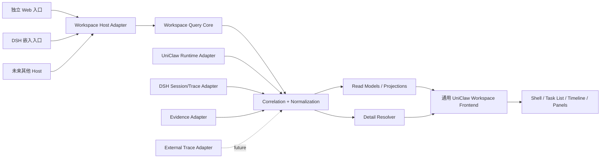

# UniClaw Workspace 架构方案 v0.1（Pre-Grill Draft）

> Status: DRAFT / REVIEW_REQUIRED（设计草案，等待一轮决策型 Grill；裁决接受后按 docs/README.md §3 迁入对应权威目录，修订经 change）
> Authority: NONE

> 状态：设计草案，等待一轮决策型 Grill。本文定义目标、边界、分层、数据形状和前端组织；不授权产品实现，也不改变 Product Runtime 的权威边界。
> （AGT-009 基线卫生修复：按 ARCH-DOC-015 分类学从 architecture/ 迁回 design/——判据是文档状态，不是作者意图。）

## 1. 目标

UniClaw Workspace 是一个可从 DSH 进入、也可以独立运行的任务观测工作区。它面向 Uni-Agent 的执行过程，提供一条可回溯的主线：

```text
项目 → 任务实例（一个任务实例对应一个 Product Session）
     → 请求 → 决策 → 结果
     → 对话、Trace、元数据、证据和详情
```

用户应能在一个完整的产品级界面中：

1. 按项目浏览任务实例，并看到运行状态、最近活动和结果摘要。
2. 打开任务后聚焦 Uni-Agent 的对话和执行过程，而不是被底层日志淹没。
3. 分开查看 UniClaw Trace、DSH Trace、元数据和证据；各类信息保留来源和权威归属。
4. 对摘要中的 Trace span、证据、文件或结构化对象按需打开数据明细。
5. 在 DSH 内嵌入口和独立 Web 入口之间切换，而不改变核心界面和语义。

## 2. 需求边界

### 2.1 本轮包含

- Workspace Shell：项目/任务列表、任务详情、页签和详情抽屉。
- Task Instance Read Model：任务实例与 session 的关联、状态、时间和摘要。
- Uni-Agent 主时间线：以“请求 → 决策 → 结果”为主分组，可展开对话和关键执行步骤。
- 四类信息面板：Conversation、Trace、Metadata、Evidence。
- Trace 分类：UniClaw Trace、DSH Trace，以及为后续外部 Trace 保留来源维度。
- Evidence/Trace/文件详情的延迟加载和来源标识。
- 可替换的数据适配器：独立 Web 适配器、DSH 适配器、UniClaw Runtime 适配器。
- 通用前端包：不依赖 DSH API、全局变量、slot、Typert 或 DSH 目录结构。

### 2.2 本轮不包含

- 修改 UniClaw Product Runtime 的执行权威、任务调度或 Agent 行为。
- 在 Workspace 中编辑、重试、停止或批准任务。
- 把 Workspace 做成通用文件浏览器或任意路径访问器。
- 本轮建立完整 OTel 采集平台；只定义可接入的 Trace 形状和适配缝。
- 为每种潜在来源预建插件市场、动态脚本系统或大而全的统一接口。
- 把 DSH 的 session、transcript 或 transport 语义写入共享产品模型。

## 3. 术语、归属和权威

| 概念 | 含义 | 权威归属 |
|---|---|---|
| Project | 用户可浏览的一组任务实例 | Workspace 查询投影；项目业务定义由上游提供 |
| TaskInstance | 一次可识别、可回溯的任务执行 | UniClaw/任务来源；Workspace 只读投影 |
| SessionRef | TaskInstance 到 Product Session 及其 Host 承载的稳定引用 | Product Session 是 canonical identity；Host session 由来源适配器显式关联 |
| AuxiliaryExecutionRef | Product Session 下的辅助能力执行引用 | 可来自 DSH 或外部能力；不创建 TaskInstance，不取得 Product Authority |
| ConversationItem | 面向用户的请求、Agent 决策、结果和必要执行摘要 | Uni-Agent 语义投影 |
| TraceItem | 带来源和关联信息的诊断 span/event | UniClaw Runtime、DSH 或外部 Trace 来源 |
| EvidenceRef | 支撑某个结果或决策的证据引用 | 证据来源；Workspace 负责展示和解析 |
| DetailRef | 延迟加载数据的稳定引用 | 对应来源适配器；客户端不直接拼路径 |
| Metadata | 状态、时间、模型、版本、关联 ID 等描述信息 | 各字段声明自己的来源和权限 |
| Authority | 某条事实可被谁确认或改变 | Runtime、DSH Host、外部系统等，不能由展示层升级 |

Workspace 是只读观察面。它可以组合事实、做语义投影和排序，但不能把 DSH 展示数据提升为 Product Runtime 事实。

首版 session 规则是：一个 `TaskInstance` 对应一个 `Product Session`，并映射一个
primary DSH Host Session。辅助能力不强行归类为 DSH session：它可以是 DSH 子 session，
也可以是外部工具、文件解析、Trace 查询或其他 capability execution。它们通过
`AuxiliaryExecutionRef` 和 `correlationId` 挂在同一 Product Session 下，不能产生第二个
TaskInstance、第二个 Product Session 或第二条主时间线。

## 4. 总体架构



数据流固定为：

```text
source → discovery → correlation → normalization → projection → query → render
```

每层只能依赖下一层的显式契约。数据源不直接驱动 UI，UI 不直接读取 session、文件或 Trace 存储。

## 5. 分层和责任

### 5.1 通用前端层

负责布局、交互、状态、可视化和详情呈现。它只认识通用的 Workspace Query Contract 与 UniClaw 视觉 token，不认识 DSH。

### 5.2 Query Core

负责查询入口、分页、关联、统一 envelope、读模型和详情引用。它不负责传输、Host 生命周期或 DOM 挂载。

### 5.3 Source Adapter

每个适配器只负责一种来源的发现、读取和来源标注：

- `UniClawRuntimeAdapter`：任务实例、Agent 语义、UniClaw Trace、结果和证据关系。
- `DshSessionAdapter`：DSH 展示所需的 session/transcript/DSH Trace 映射。
- `EvidenceAdapter`：结构化证据、文本、图片或文件详情的安全读取。
- `ExternalTraceAdapter`：未来接入 OTel 或其他 Trace 系统。

适配器输出统一记录，不把来源特有对象泄漏给前端。

### 5.4 Host Adapter

负责入口生命周期和能力注入：独立 Web 入口使用 HTTP/本地服务；DSH 入口使用 DSH 的静态 bundle、挂载和 RPC 能力。Host Adapter 可以替换，但通用前端不应感知替换。

## 6. 前端代码组织

建议把“产品前端”和“Host 适配器”分开管理：

```text
web/
└── uniclaw-workspace/
    ├── src/
    │   ├── app/                 # 应用装配、路由、查询注入
    │   ├── contracts/           # Workspace Query Contract、Record、DetailRef
    │   ├── features/
    │   │   ├── task-navigation/ # 项目与任务实例列表
    │   │   ├── conversation/    # 请求→决策→结果时间线
    │   │   ├── trace/           # UniClaw/DSH/外部 Trace 面板
    │   │   ├── evidence/        # 证据列表、来源和详情
    │   │   ├── metadata/        # 元数据面板
    │   │   └── detail/           # 详情抽屉、结构化/文本/二进制预览
    │   ├── ui/                  # 通用布局、卡片、状态、表格、时间线
    │   └── styles/              # UniClaw token 和响应式主题
    └── tests/                   # 纯前端契约与交互测试

dsh/
└── uniclaw-task-workbench/
    ├── frontend/
    │   ├── entry.*              # DSH bundle 入口
    │   ├── dsh-workspace-client.*
    │   ├── dsh-mount.*
    │   └── dsh-theme.*
    └── dist/client.*            # 仅作为 DSH 静态发布物
```

依赖规则：

1. `web/uniclaw-workspace` 不得导入 DSH 包、DSH global、slot、Typert 或 DSH 路径。
2. `dsh/uniclaw-task-workbench/frontend` 可以依赖通用前端，但只能实现 Host Adapter 和主题映射。
3. 通用前端可以独立启动，使用 mock、HTTP 或本地 adapter；DSH 不是它的运行前提。
4. DSH 的静态 bundle 是发布产物，不是产品前端的 canonical source。
5. UI feature 以业务能力分组，不建立一个承载所有逻辑的 `components/` 巨型目录。
6. Feature 负责交互行为和视图组合；`ui/` 提供无来源语义的基础组件；`styles/` 独立维护 token、布局和主题映射，功能代码不直接依赖 DSH 样式或 Host CSS。

## 7. 统一记录形状

所有来源先投影为统一记录 envelope，再进入读模型：

```text
RecordEnvelope {
  recordId
  kind                 # conversation | trace | evidence | metadata | outcome
  source               # uniclaw | dsh | otel | filesystem | ...
  authority            # 哪个系统对该事实负责
  taskInstanceId
  productSessionId
  hostSessionRef?       # primary Host Session 的显式关联
  auxiliaryExecutionRef? # DSH 或外部辅助能力执行
  correlationId        # request / decision / result / span / evidence
  occurredAt
  summary
  detailRef?           # 延迟读取的详情引用
  rawRef?              # 原始记录引用，按权限暴露
  schemaVersion
}
```

前端只消费读模型，不消费原始记录：

- `TaskInstanceListModel`：项目、任务、状态、摘要、最近活动。
- `SessionDetailModel`：任务头部、参与来源、时间范围、结果状态。
- `ConversationTimelineModel`：请求 → 决策 → 结果及其关键关联。
- `TracePaneModel`：按来源和层级展示 Trace，支持分页和详情。
- `EvidencePaneModel`：证据卡片、关系、来源、详情动作。
- `MetadataPaneModel`：可解释的字段、来源和复制动作。

`DetailRef` 必须是可校验的引用，不允许把绝对路径、任意 URL 或未声明的本地文件能力直接交给浏览器。

## 8. 异构数据的分类方式

分类是多个独立维度，不用目录名称把不同概念揉成一个层级：

| 维度 | 示例 |
|---|---|
| 语义域 | conversation / trace / evidence / metadata / outcome |
| 来源 | uniclaw / dsh / otel / filesystem |
| 权威 | uniclaw-runtime / dsh-host / external-system |
| 生命周期 | live / completed / archived |
| 详情类型 | structured / text / image / binary |
| 关联类型 | session / request / decision / result / span / evidence |

因此，“UniClaw Trace”和“DSH Trace”是同一个 Trace 面板下的 source 分组；“证据”和“文件”是语义域与详情类型的组合，不建立两套独立数据模型。

## 9. 关键接口缝（概念层）

第一版只冻结足以支撑主流程的窄接口：

```text
WorkspaceQueries
  listProjects(cursor, filter) -> ProjectPage
  listTaskInstances(projectId, cursor, filter) -> TaskInstancePage
  getSession(productSessionId) -> SessionDetailModel
  getTimeline(productSessionId, cursor) -> ConversationTimelinePage
  getTraces(productSessionId, source, cursor) -> TracePage
  getEvidence(productSessionId, cursor) -> EvidencePage
  resolveDetail(detailRef) -> DetailPayload
```

这些方法表达“查询什么”，不表达“从哪里取”。来源、协议和 Host 生命周期留在 adapter 内。

需要独立验证的缝：

- `SourceAdapter`：发现并输出带来源/权威的记录。
- `CorrelationResolver`：把 session、request、decision、result、span、evidence 建立可解释关联；关联失败必须显式显示，不能静默拼接。
- `Projection`：把记录转换为稳定读模型，不承担来源访问。
- `DetailResolver`：按 `DetailRef` 读取详情、做权限和大小检查。
- `RecordRenderer`：按 `kind` 和 `detailType` 选择展示器；只有在第二种真实变体出现后再引入 registry。

不采用 `getEverything()` 之类的巨型接口，也不让 UI 直接持有多个来源客户端。

## 10. 主界面设计

```text
┌ 项目/任务列表 ┐ ┌──────── Uni-Agent 主线 ────────┐ ┌ 信息面板 ┐
│ 项目          │ │ 请求                         │ │ Trace    │
│  └ 任务实例   │ │   ↓                          │ │ Evidence │
│  └ 任务实例   │ │ 决策                         │ │ Metadata │
│ 项目          │ │   ↓                          │ │ Details  │
│               │ │ 结果                         │ │          │
└───────────────┘ └──────────────────────────────┘ └──────────┘
```

- 左侧保持任务浏览稳定，支持项目筛选、状态筛选和最近活动排序。
- 中间默认聚焦 Uni-Agent；底层 Trace 只在关联节点或右侧页签中展开。
- 右侧使用卡片和详情动作：摘要先读，明细后取；每张卡片显示来源、时间、关联 ID。
- Trace 采用 source 分组，默认突出 UniClaw Trace；DSH Trace 作为 Host 诊断分组保留。
- 当数据关联不完整时，界面显示“未关联/来源缺失/详情不可用”及原因，不伪造完整链路。

## 11. 运行、性能和安全约束

- 首屏只加载任务列表、会话头部和时间线摘要；Trace、证据详情和大对象延迟加载。
- 所有长列表使用游标或时间窗口；单次详情有大小上限和可取消读取。
- 记录必须带 `schemaVersion`、`source`、`authority` 和 `occurredAt`，避免跨来源字段碰撞。
- 客户端不直接访问文件系统；文件详情由受控 adapter 解析并返回内容或受限预览。
- Host 认证、权限和生命周期由 Host Adapter 执行；通用前端只消费能力和错误状态。
- 读模型可以缓存，但必须标明快照时间；实时更新作为后续能力，不改变首版查询契约。

## 12. 验收标准

设计进入实现前，至少应能判定以下结果：

1. 独立 Web 和 DSH 两个入口使用同一套通用前端，任务列表、时间线、Trace、Evidence、Metadata 的语义和交互一致。
2. 替换数据来源适配器不需要修改 `features/`；新增来源只实现既有来源缝。
3. 任务实例、session、Trace、证据之间的关联可以追溯到明确的 `correlationId`，关联失败可见。
4. Uni-Agent 主线默认展示请求 → 决策 → 结果；底层日志不会取代主线。
5. Trace 和 Evidence 的详情通过 `DetailRef` 延迟读取，UI 不拼接路径或任意 URL。
6. `web/uniclaw-workspace` 在静态检查中没有 DSH 专有依赖。
7. 新增一种详情类型或 Trace 来源时，核心查询契约和既有 feature 不需要改写。

## 13. 方案取舍

### 13.1 DSH-first 前端

不选。它能快速展示现有数据，但会把 DSH 的 Host、session 和静态 bundle 约束带进产品前端，独立 Web 和未来 Host 会变成二次重写。

### 13.2 每个来源一套页签和数据模型

不选。用户关心的是一次任务的执行事实，来源是事实的属性；来源优先的页面会放大认知成本，也会阻止跨来源关联。

### 13.3 一个“万能数据服务”统一所有来源

不选。它隐藏权威和失败边界，新增来源会迫使核心接口不断膨胀。窄的 source/correlation/detail 缝更容易验证和替换。

### 13.4 第一版就做开放式 Registry/插件市场

不选。只有在出现第二种真实渲染变体后，才引入 renderer/detail resolver registry；先用显式的少量投影保证可读性。

## 14. 第一轮 Grill 已裁决

以下决策由第一轮确认，后续实现必须以此为约束：

1. Workspace v0.1 是只读观察产品，不包含停止、重试、批准或任务编辑。
2. `web/uniclaw-workspace` 是通用前端的 canonical source；DSH 只提供 Host Adapter 和静态发布物。
3. `TaskInstance` 的身份是 `ProductSessionId`；DSH `sessionId` 只作为 primary Host 关联；DSH 或外部辅助能力统一用 `AuxiliaryExecutionRef` 关联。
4. UniClaw、DSH、Evidence 的事实按来源和权威分开保留；冲突和缺失可见，不做静默覆盖。
5. v0.1 采用带快照时间的查询、显式刷新或有界轮询；实时事件另立协议。
6. 新来源必须通过 Adapter → Normalization → Projection → Query 接入，不能直接从来源进入 UI。
7. “复用 metadata 值”只表示复用既有 `ProductSessionId` 等 canonical metadata，不把 DSH `sessionId` 偷换成 Product identity。

## 15. 第二轮 Grill 已裁决

以下决策由第二轮确认：

1. `AuxiliaryExecutionRef` 不成为新的一级用户语义域；辅助结果按 Conversation、Trace、Evidence、Metadata 的实际语义进入既有面板。
2. Product Runtime 生成产品语义 ID；Adapter 为辅助能力生成本地引用并保留原始 source ID；无显式 correlation 时显示未关联，禁止静默推断。
3. 详情统一经 `DetailResolver` 读取，只允许受控的结构化、文本、图片和限大小预览；客户端不直接访问文件系统或任意外部 URL。
4. 独立 Web 与 DSH 共享同一套 TS/React 前端源码；两者只替换 Host Adapter、查询客户端、挂载方式和主题映射。
5. v0.1 只读取已有 UniClaw/DSH Trace 和来源详情；OTel 采集、存储、采样和查询另立 Change。

## 16. 第三轮 Grill 已裁决

1. 一次任务详情使用可识别的 snapshot/revision；面板可延迟加载，但必须标明快照时间与 stale 状态。跨来源是否能读取同一历史切点仍须按来源能力明确，snapshotId 本身不构成原子一致性证明。
2. 来源和面板局部失败，保留可用数据；显式区分 unavailable、uncorrelated、stale、permission-denied，不能用空数组表达来源失败，也不能用另一来源代替。
3. Host/Source Adapter 执行身份、范围和来源权限；Query Core 消费受限能力和结构化拒绝，不能绕过来源检查；前端只展示允许的动作，展示 capability 不等于授权。
4. RecordEnvelope、Read Model、DetailPayload 与 Adapter capability 带版本；新增非关键字段向后兼容，未知关键字段和不兼容能力明确拒绝，不静默降级。
5. 验证包括前端契约、Query Core/Adapter 确定性测试、独立 Web/DSH 场景和失败路径证据；截图证明视觉体验，不替代契约与故障验证。

## 17. 第四轮 Grill 已裁决

1. 独立 Workspace Query Core 是共享的 Host-neutral 核心；DSH 和独立 Web 只装配不同的来源、权限、传输和挂载适配器。
2. 快照记录各来源的版本或读取时间；不支持历史读取的来源不能宣称严格快照一致。懒加载发现来源已变化时，显示数据已更新并要求刷新，旧响应不能覆盖新快照。
3. Workspace v0.1 不建立来源数据的长期副本，不接管归档、缓存和保留策略。Host/Source 自己管理缓存、归档、删除和保留；DSH 若要提供这些能力，必须通过显式 Host capability/interface 暴露，Workspace 不直接访问 DSH 存储。
4. 第一条工程化切片是：项目列表 → 任务实例 → Uni-Agent 时间线 → Trace/Evidence 详情；同一前端在 DSH 与独立 Web 各跑通，并覆盖来源超时、未关联、详情失效和权限拒绝。

## 18. 第五轮 Grill 已裁决

1. Product Runtime/Task Repository 是 `TaskInstance` 的权威；没有 `ProductSessionId` 映射的 Host 观察只显示为未关联观察，不自动升级为正式任务实例。
2. `Workspace Query Core` 的 canonical 实现放在通用 Web workspace 的独立 core package；语言无关契约放在 `schemas/workspace/`，不能让前端类型文件或 DSH API 成为协议真相。
3. 通用 capability 采用窄接口：`TaskQuery`、`SessionQuery`、`TraceQuery`、`EvidenceQuery`、`DetailQuery`；现有 DSH `workspace/session/trace/evidence/artifact` API 退到 DSH adapter 内部兼容层。
4. v0.1 reliability contract 冻结：请求和详情有界超时、读取可取消、重复刷新幂等、旧快照响应不能覆盖新快照、错误状态分型、Host 重启不创建第二个 Product Task。

## 19. Grill 结束后的技术验证前沿

### 当前实现事实（2026-10-02，只读核查）

- `dsh/uniclaw-task-workbench/src/index.js` 的 `workspaceCore`、`sessionDetailCore` 组合 repository、DSH events 和运行产物；纯投影与 Host/RPC 装配尚在同一文件。
- `src/repository.js` 读取单份任务 JSON；`src/artifacts.js` 扫描当前文件并按 metadata 中的 DSH session 关联。当前 workbench 不暴露历史 revision/as-of 读取；DSH 底层是否有其他历史接口本轮未证明。
- workbench 创建的实例记录当前只有 `instanceId/sessionId` 等字段；decision-channel attachment 则显式区分 `productSessionId/productRunId/dshSessionId`。不能把前者直接宣称为具有已验证 Product Session identity 的任务实例；缺少 mapping 的记录须依已决定规则标为未关联。

### 后续 PLAN/VERIFY 事项（不是新的 Human Gate）

1. 把 `schemas/workspace/` 的 RecordEnvelope、Read Model、DetailPayload、capability 和错误状态写成可校验契约。
2. 从现有 DSH API 实现 adapter，验证 ProductSession mapping、未关联观察和 Host 重启复用。
3. 验证来源版本/读取时间、懒加载 stale、局部失败和详情权限拒绝。
4. 用第一条完整切片证明 DSH 与独立 Web 复用同一前端，并接入第二种真实来源。

## 20. 下一步

Grill 的设计决策前沿已清空，当前共同理解是：Workspace 是只读、Host-neutral、来源权威分离的产品观察面；Host/Source 拥有缓存和归档，Workspace 只消费显式 capability。后续进入 PERSIST/PLAN，技术可行性未验证前不宣称实现就绪：

1. 把已裁决内容提升为架构/协议基线或 ADR。
2. 更新本 Change State 的 Decisions、Acceptance 和 Residual Risks。
3. 再拆分实现计划，先做通用查询契约和独立前端骨架，再接 DSH adapter。
