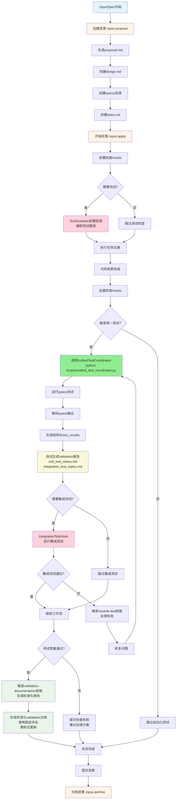
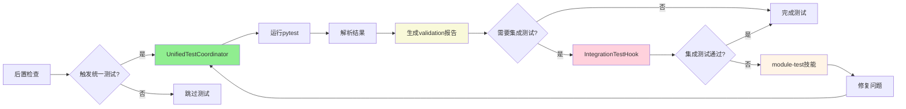
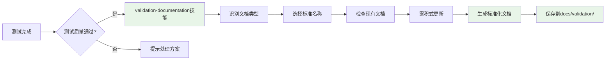
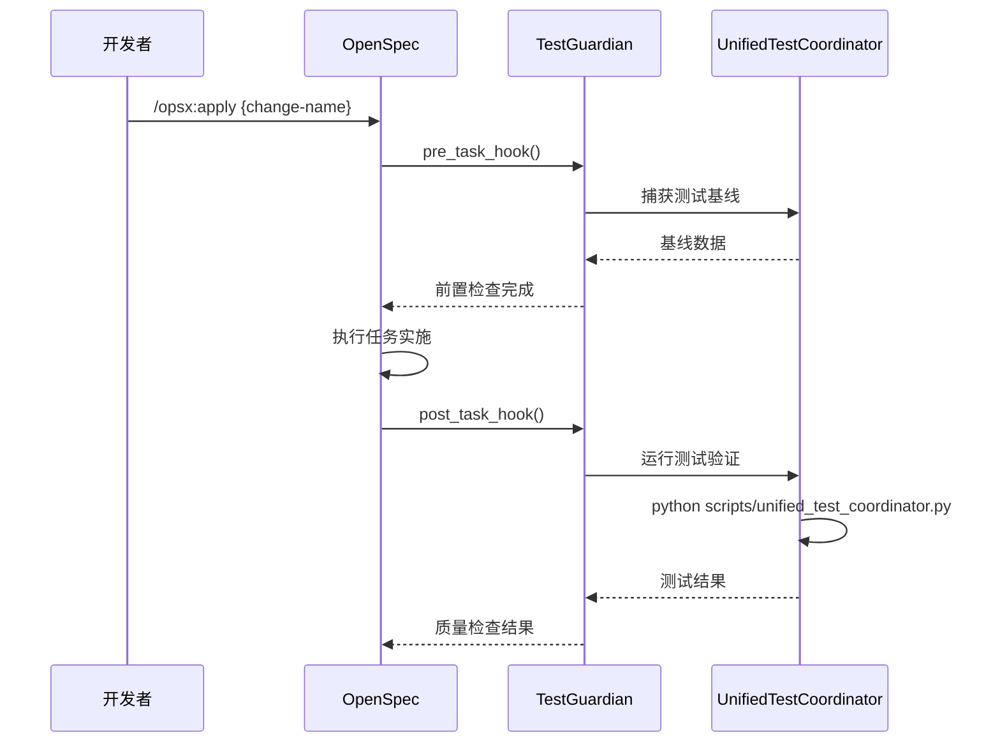
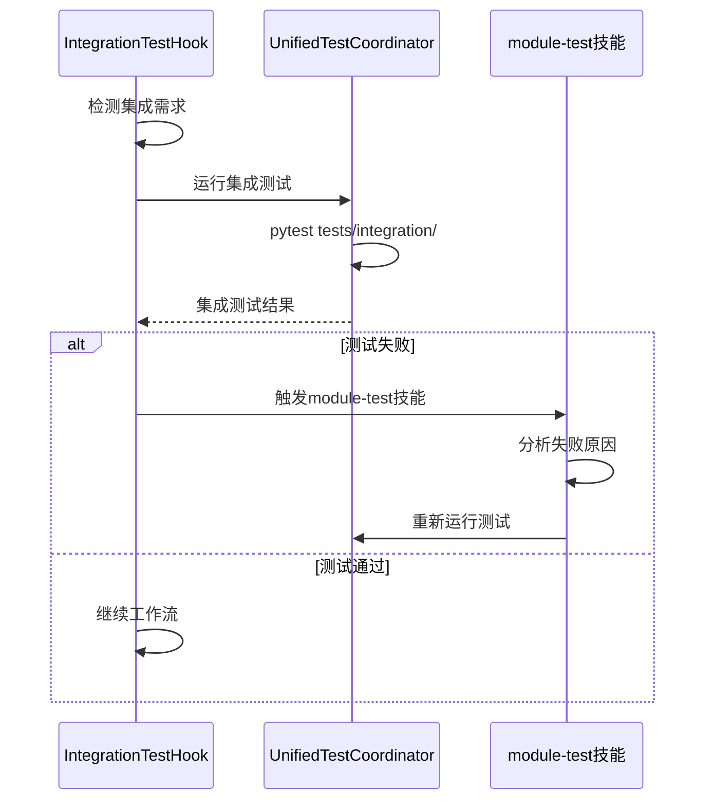
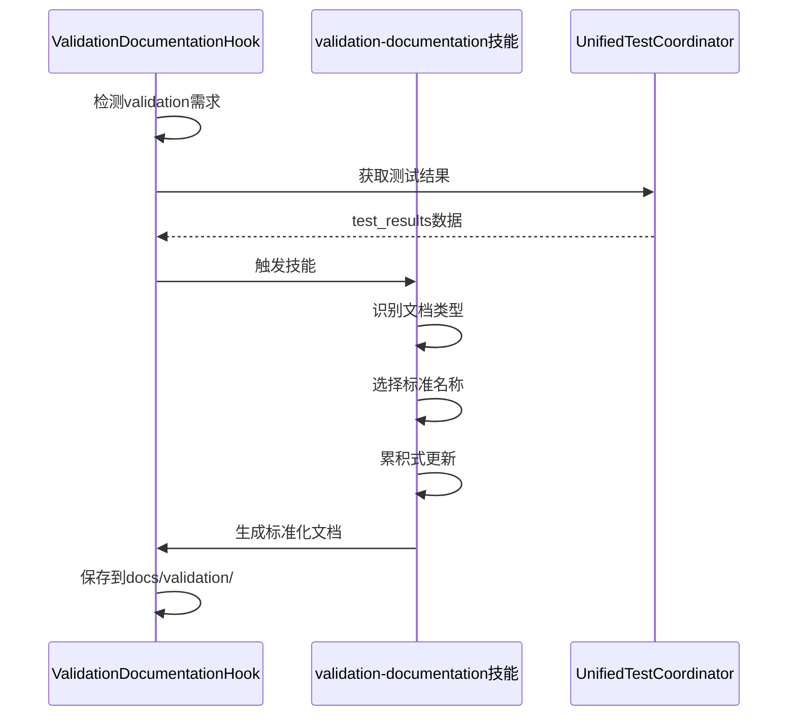
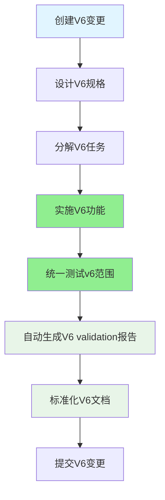
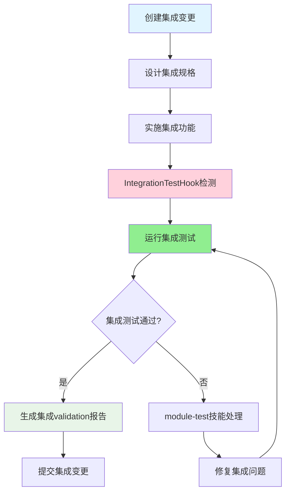
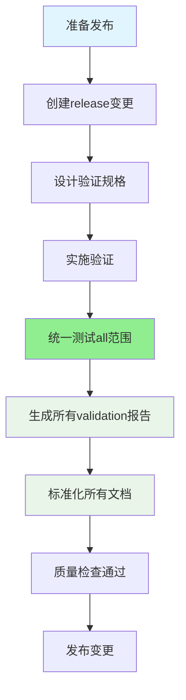
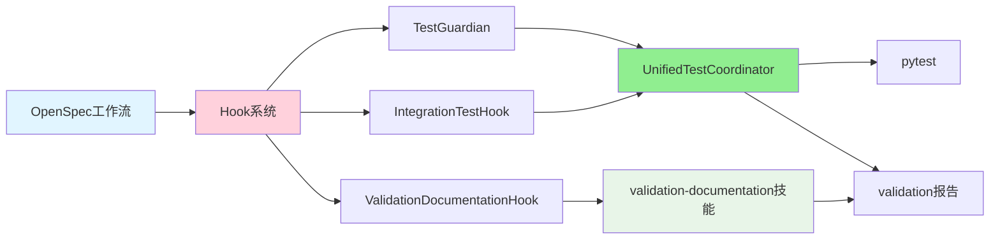

# OpenSpec + 统一测试协调器集成流程图

**版本**: 1.0  
**创建**: 2026-06-05  
**目的**: 展示OpenSpec工作流与统一测试协调器的完整集成

---

## 🎯 核心集成流程图



---

## 🔄 OpenSpec工作流分解

### 阶段1: 创建变更 (Planning Phase)

```mermaid
graph LR
    A[开发者] --> B[/opsx:propose]
    B --> C[OpenSpec创建变更]
    C --> D[生成目录结构]
    
    D --> E[proposal.md]
    D --> F[design.md]
    D --> G[specs/*.md]
    D --> H[tasks.md]
    
    style A fill:#e1f5ff
    style B fill:#ffd1dc
    style C fill:#ffd1dc
```

**关键文件**：
```
openspec/changes/{change-name}/
├── proposal.md          # 变更提案
├── design.md            # 设计文档
├── specs/               # 规格说明
│   ├── spec1.md
│   └── spec2.md
└── tasks.md             # 任务分解
```

### 阶段2: 实施变更 (Implementation Phase)

```mermaid
graph LR
    A[开始实施] --> B[/opsx:apply]
    B --> C[读取tasks.md]
    C --> D[前置检查Hooks]
    
    D --> E{需要测试?}
    E -->|是| F[TestGuardian前置检查]
    E -->|否| G[跳过测试]
    
    F --> H[执行任务]
    G --> H
    
    H --> I[代码变更]
    I --> J[后置检查Hooks]
    
    style A fill:#fff4e6
    style B fill:#ffd1dc
    style F fill:#ffd1dc
    style H fill:#90ee90
```

### 阶段3: 测试验证 (Testing Phase)



### 阶段4: 文档生成 (Documentation Phase)



---

## 🔗 关键集成点

### 1. TestGuardian集成点

**位置**: `openspec/hooks/test_guardian_integration.py`

**触发时机**: `/opsx:apply` 命令执行时

**功能**:
- **前置检查**: 捕获测试基线，确保测试环境稳定
- **后置检查**: 验证代码变更后的测试质量



### 2. IntegrationTestHook集成点

**位置**: `openspec/hooks/integration_test_hook.py`

**触发时机**: 代码变更后，检测到集成需求

**功能**:
- 自动检测需要集成测试的任务
- 运行集成测试
- 失败时触发module-test技能



### 3. ValidationDocumentationHook集成点

**位置**: `openspec/hooks/validation_documentation_hook.py`

**触发时机**: 测试完成后，检测到validation需求

**功能**:
- 自动检测需要validation文档的任务
- 触发validation-documentation技能
- 确保文档命名标准化



---

## 📊 数据流向图

### 完整数据流

```
OpenSpec变更创建
    ↓
tasks.md任务分解
    ↓
/opsx:apply执行
    ↓
前置Hooks检查
    ↓
UnifiedTestCoordinator.run_all_tests()
    ↓
pytest tests/v6/, tests/integration/
    ↓
pytest原始输出
    ↓
parse_pytest_output()解析
    ↓
test_results结构化数据
    ↓
_generate_validation_reports()
    ↓
docs/validation/unit_test_status.md
docs/validation/integration_test_status.md
    ↓
validation-documentation技能标准化
    ↓
最终validation文档（Git追踪）
    ↓
提交变更并归档
```

### 集成测试数据流

```
IntegrationTestHook检测集成需求
    ↓
判断_should_run_integration_tests()
    ↓
运行pytest tests/integration/
    ↓
_parse_integration_result()
    ↓
{status, summary, output}
    ↓
失败判断
    ↓
触发module-test技能
    ↓
修复问题
    ↓
重新测试
```

---

## 🎯 不同场景的流程

### 场景1: V6功能开发



**命令流程**:
```bash
/opsx:propose v6-feature-update
# 编辑 proposal.md, design.md, tasks.md
/opsx:apply v6-feature-update
# 自动触发: python scripts/unified_test_coordinator.py v6
# 自动生成: docs/validation/unit_test_status.md
```

### 场景2: 集成测试验证



**自动触发**:
- IntegrationTestHook检测到integration关键词
- 自动运行 `pytest tests/integration/`
- 失败时自动触发module-test技能

### 场景3: 完整验证发布



**命令流程**:
```bash
/opsx:propose release-validation
# 编辑验证规格
/opsx:apply release-validation
# 自动触发: python scripts/unified_test_coordinator.py all
# 生成所有validation报告并标准化
```

---

## 🔧 技术实现细节

### Hook系统架构



### Hook触发条件

**TestGuardian**:
- 自动在所有 `/opsx:apply` 执行时触发
- 前置检查：捕获测试基线
- 后置检查：验证测试质量

**IntegrationTestHook**:
- 任务描述包含 'integration', 'system', 'e2e' 等关键词
- 有代码变更（modified_files 或 new_files）
- 任务类型为 'integration', 'system', 'e2e'

**ValidationDocumentationHook**:
- 任务描述包含 'validation', 'test', 'verify' 等关键词
- 有代码变更或文档需求
- 测试完成后自动触发

### 自动化决策树

```
任务开始
    ↓
检查任务类型和关键词
    ↓
├─ 包含"integration"关键词?
│  ├─ 是 → 触发IntegrationTestHook
│  └─ 否 → 继续
    ↓
├─ 包含"validation/test"关键词?
│  ├─ 是 → 触发ValidationDocumentationHook
│  └─ 否 → 继续
    ↓
├─ 任何任务都触发TestGuardian?
│  └─ 是 → 前置+后置检查
    ↓
执行UnifiedTestCoordinator
    ↓
生成validation报告
    ↓
检查文档标准符合性
    ↓
任务完成
```

---

## 📋 文件依赖关系

### 核心文件

```
openspec/
├── hooks/
│   ├── test_guardian_integration.py       # TestGuardian Hook
│   ├── integration_test_hook.py           # 集成测试Hook
│   ├── validation_documentation_hook.py   # Validation文档Hook
│   └── openspec_apply_wrapper.py           # Apply包装器
├── changes/
│   └── {change-name}/
│       ├── proposal.md
│       ├── design.md
│       ├── specs/
│       │   └── *.md
│       └── tasks.md
└── specs/
    └── *.md

scripts/
└── unified_test_coordinator.py             # 统一测试协调器

docs/
└── validation/
    ├── unit_test_status.md                  # 单元测试状态
    ├── integration_test_status.md           # 集成测试状态
    ├── system_infrastructure_analysis.md    # 系统基础设施分析
    ├── test_data_quality.md                 # 测试数据质量
    ├── progress_report.md                   # 进度报告
    ├── planned_features.md                  # 计划功能
    └── final_report.md                      # 最终报告

.claude/
└── skills/
    ├── module-test/                         # module-test技能
    └── validation-documentation/            # validation-documentation技能
```

### 调用链

```
/opsx:apply
    ↓
openspec_apply_wrapper.py
    ↓
test_guardian_integration.py::pre_task_hook()
    ↓
执行任务实施
    ↓
test_guardian_integration.py::post_task_hook()
    ↓
scripts/unified_test_coordinator.py
    ↓
pytest tests/v6/, tests/integration/
    ↓
integration_test_hook.py::post_task_hook()
    ↓
validation_documentation_hook.py::post_task_hook()
    ↓
.claude/skills/validation-documentation/
    ↓
docs/validation/*.md
```

---

## 🎯 成功路径示例

### 完整成功路径

```
1. /opsx:propose v6-simulation-enhancement
   ↓
2. 编辑 openspec/changes/v6-simulation-enhancement/proposal.md
   ↓
3. 编辑 openspec/changes/v6-simulation-enhancement/design.md
   ↓
4. 编辑 openspec/changes/v6-simulation-enhancement/specs/*.md
   ↓
5. 编辑 openspec/changes/v6-simulation-enhancement/tasks.md
   ↓
6. /opsx:apply v6-simulation-enhancement
   ↓
7. TestGuardian前置检查（捕获基线）
   ↓
8. 执行任务实施
   ↓
9. TestGuardian后置检查
   ↓
10. UnifiedTestCoordinator运行测试
    ↓
11. pytest tests/v6/ -v
    ↓
12. 生成test_results结构化数据
    ↓
13. 自动生成validation报告
    ↓
14. IntegrationTestHook检查（如需要）
    ↓
15. ValidationDocumentationHook标准化
    ↓
16. 生成标准化validation文档
    ↓
17. 提交变更
    ↓
18. /opsx:archive v6-simulation-enhancement
```

---

## 🔍 故障排除路径

### 测试失败处理

```
UnifiedTestCoordinator测试失败
    ↓
检查失败类型
    ↓
├─ 环境问题?
│  └─ Level 0: 解决依赖 → 重试
├─ 实现问题?
│  └─ Level 1: 分析代码 → 修复 → 重试
├─ 设计问题?
│  └─ Level 2: 查阅文档 → 理解设计 → 重试
└─ 不确定?
   └─ Level 3: 咨询用户 → 决策 → 执行
```

### 集成测试失败处理

```
IntegrationTestHook检测失败
    ↓
触发module-test技能
    ↓
分析失败原因
    ↓
├─ Mock问题?
│  └─ 修复Mock数据 → 重试
├─ 集成问题?
│  └─ 修复集成代码 → 重试
└─ API问题?
   └─ 修复API调用 → 重试
```

### 文档标准化问题

```
ValidationDocumentationHook检测问题
    ↓
检查文档命名
    ↓
├─ 包含版本号?
│  └─ 重命名为标准名称
├─ 包含日期?
│  └─ 重命名为固定名称
└─ 格式问题?
   └─ 使用标准模板重新生成
```

---

## 📊 监控和指标

### 自动化程度指标

```
测试自动化率: 100% (UnifiedTestCoordinator)
文档生成自动化率: 95% (validation-documentation技能)
集成测试自动化率: 90% (IntegrationTestHook)
标准化检查自动化率: 100% (ValidationDocumentationHook)
```

### 质量指标

```
测试覆盖率: >90%
测试通过率: >95%
文档标准化率: 100%
自动化流程成功率: >90%
```

---

## 🎯 最佳实践

### 1. 变更创建最佳实践

```bash
# 使用描述性的变更名称
/opsx:propose v6-simulation-enhancement

# 完整填写proposal.md
# 清晰描述设计思路到design.md
# 详细分解任务到tasks.md
```

### 2. 实施阶段最佳实践

```bash
# 使用统一的测试范围
/opsx:apply v6-simulation-enhancement
# 自动触发: python scripts/unified_test_coordinator.py v6

# 检查自动生成的validation报告
# 确认标准化文档质量
```

### 3. 文档管理最佳实践

```bash
# 使用固定命名（覆盖模式）
docs/validation/unit_test_status.md
docs/validation/integration_test_status.md

# 避免使用
docs/validation/unit_test_status_2026-06-05.md  # ❌
docs/validation/V6_unit_test_status.md          # ❌
```

---

## 🔄 持续改进

### 当前自动化覆盖

- ✅ **测试执行**: 100%自动化
- ✅ **validation报告生成**: 95%自动化
- ✅ **文档标准化**: 100%自动化
- ✅ **集成测试触发**: 90%自动化

### 未来改进方向

- 🎯 **测试结果分析**: AI驱动的问题分析
- 🎯 **自动修复**: 基于历史数据的自动修复建议
- 🎯 **性能回归检测**: 自动化的性能基准测试
- 🎯 **文档质量评估**: AI驱动的文档质量评分

---

**版本**: 1.0  
**最后更新**: 2026-06-05  
**状态**: ✅ OpenSpec + 统一测试协调器完整集成方案确定

**总结**: 这个集成方案确保了从变更创建到validation报告生成的**端到端自动化**，实现了OpenSpec工作流与统一测试协调器的无缝集成。