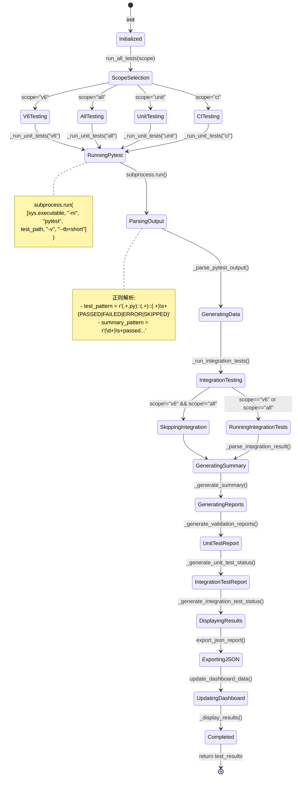
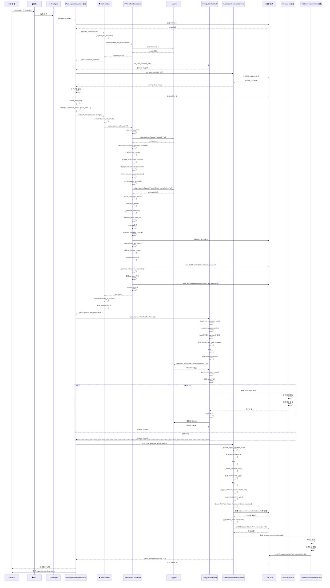

# OpenSpec + 统一测试协调器集成流程图（详细版）

**版本**: 2.0  
**创建**: 2026-06-05  
**精度**: 详细到函数调用级别

---

## 🎯 主流程图（详细版）

```mermaid
flowchart TD
    A[开发者输入 /opsx:propose] --> B[OpenSpec解析命令]
    B --> C[调用 openspec_propose_change技能]
    C --> D[创建目录结构]
    D --> E[openspec/changes/{change-name}/]
    E --> F[生成proposal.md模板]
    F --> G[生成design.md模板]
    G --> H[生成specs/目录]
    H --> I[生成tasks.md模板]
    I --> J[等待开发者编辑]
    
    J --> K[开发者输入 /opsx:apply {change-name}]
    K --> L[OpenSpec解析apply命令]
    L --> M[调用 openspec_apply_change技能]
    M --> N[读取 openspec/changes/{change-name}/tasks.md]
    N --> O[解析任务列表]
    O --> P[初始化Hook系统]
    
    P --> Q[加载 openspec/hooks/test_guardian_integration.py]
    Q --> R[加载 openspec/hooks/integration_test_hook.py]
    R --> S[加载 openspec/hooks/validation_documentation_hook.py]
    S --> T[调用 pre_task_hook系列]
    
    T --> U[TestGuardian.pre_task_hook task_info]
    U --> V{TEST_GUARDIAN_AVAILABLE?}
    V -->|否| W[跳过TestGuardian检查]
    V -->|是| X[执行pre_task_hook函数]
    
    X --> Y[_capture_test_baseline函数]
    Y --> Z[运行 python scripts/unified_test_coordinator.py --baseline]
    Z --> AA[获取基线test_results]
    AA --> AB[保存 baseline_data]
    AB --> AC[返回 {status: baseline_captured, baseline: {...}}]
    
    W --> AD[继续执行任务]
    AC --> AD
    AD --> AE[开始执行tasks.md中的任务]
    AE --> AF[遍历 tasks.json中的tasks列表]
    AF --> AG[对每个task执行实施]
    AG --> AH[修改代码文件]
    AH --> AI[创建新文件]
    AI --> AJ[收集变更 changes = {modified_files: [...], new_files: [...]}]
    
    AJ --> AK[调用 post_task_hook系列]
    AK --> AL[TestGuardian.post_task_hook task_info, changes]
    AL --> AM{TEST_GUARDIAN_AVAILABLE?}
    AM -->|否| AN[跳过TestGuardian后置检查]
    AM -->|是| AO[执行post_test_hook_with_result]
    
    AO --> AP[_run_tests_with_comparison baseline, current]
    AP --> AQ[调用 UnifiedTestCoordinator项目根目录]
    AQ --> AR[coordinator = UnifiedTestCoordinatorPath.cwd]
    AR --> AS[coordinator.run_all_testsscope]
    
    AS --> AT{scope参数判断}
    AT -->|v6| AU[运行 pytest tests/v6/ -v]
    AT -->|all| AV[运行 pytest tests/v6/, tests/integration/, tests/models/]
    AT -->|unit| AW[运行 pytest tests/v6/, tests/models/]
    AT -->|ci| AX[运行 pytest tests/v6/test_simulation.py, tests/v6/test_state_machine.py]
    
    AU --> AY[subprocess.run sys.executable, -m, pytest, tests/v6/, -v, --tb=short]
    AV --> AY
    AW --> AY
    AX --> AY
    
    AY --> AZ[捕获 result.stdout, result.stderr]
    AZ --> BA[调用 coordinator._parse_pytest_outputresult.stdout, test_path]
    BA --> BB[正则解析 test_pattern = r'...PASSED|FAILED|ERROR|SKIPPED']
    BB --> BC[提取 file_path, test_class, test_name, outcome]
    BC --> BD[统计 passed, failed, skipped, errors]
    BD --> BE[解析 summary_pattern = r'\d+ passed...']
    BE --> BF[生成结构化 test_results字典]
    
    BF --> BG[调用 coordinator._generate_summary]
    BG --> BH[计算 total_tests, total_passed, total_failed, total_skipped]
    BH --> BI[计算 pass_rate = total_passed / total_tests * 100]
    BI --> BJ[设置 test_results.summary = {...}]
    
    BJ --> BK[调用 coordinator._generate_validation_reports]
    BK --> BL[确保 validation_dir.mkdir parents=True, exist_ok=True]
    BL --> BM[调用 coordinator._generate_unit_test_status]
    
    BM --> BN[从 test_results.unit_tests提取数据]
    BN --> BO[按模块分类: simulation, state_machine, graph_engine, integration]
    BO --> BP[计算每个模块的 total, passed, failed, skipped]
    BP --> BQ[生成markdown内容 content]
    BQ --> BR[写入 docs/validation/unit_test_status.md]
    
    BR --> BS{test_results.integration_tests存在?}
    BS -->|是| BT[调用 coordinator._generate_integration_test_status]
    BS -->|否| BU[跳过集成测试报告生成]
    
    BT --> BV[从 test_results.integration_tests提取数据]
    BV --> BW[生成markdown内容]
    BW --> BX[写入 docs/validation/integration_test_status.md]
    
    BX --> BY[调用 coordinator._display_results]
    BY --> BZ[显示终端测试摘要]
    BZ --> CA{total_failed > 0?}
    CA -->|是| CB[显示失败提示和module-test技能建议]
    CA -->|否| CC[显示所有测试通过]
    
    BU --> BY
    CC --> CD
    CB --> CE[返回 test_results到TestGuardian]
    
    CE --> CF[比较 baseline vs current]
    CF --> CG{current.status == passed?}
    CG -->|否| CH[返回 {status: failed, acceptable: false, issues: [...]}]
    CG -->|是| CI[返回 {status: passed, acceptable: true, issues: []}]
    
    CH --> CJ{acceptable == false?}
    CJ -->|是| CK[抛出异常阻止任务完成]
    CJ -->|否| CL[继续工作流]
    
    AN --> CL
    CI --> CL
    CL --> CM[IntegrationTestHook.post_task_hook task_info, changes]
    
    CM --> CN[调用 _needs_integration_tests task_info]
    CN --> CO[检查 task_name, task_description中的关键词]
    CO --> CP{包含integration/system/e2e关键词?}
    CP -->|否| CQ[返回 {status: skipped, reason: no_integration_needed}]
    CP -->|是| CR[调用 _should_run_integration_tests task_info, changes]
    
    CR --> CS{changes.modified_files 或 changes.new_files存在?}
    CS -->|否| CT[返回 {status: skipped, reason: no_changes}]
    CS -->|是| CU[调用 _run_integration_tests]
    
    CU --> CV[subprocess.run sys.executable, -m, pytest, tests/integration/, -v]
    CV --> CW[调用 _parse_integration_result result.stdout, result.stderr]
    CW --> CX[统计 passed, failed, errors行数]
    CX --> CY[计算 total, status]
    CY --> CZ{failed > 0 或 errors > 0?}
    CZ -->|是| DA[返回 {status: skill_triggered, action_required: true, skill_name: module-test}]
    CZ -->|否| DB[返回 {status: passed, test_result: {...} }]
    
    DA --> DC[触发 module-test技能]
    DC --> DD[module-test分析失败原因]
    DD --> DE[提供修复建议]
    DE --> DF[重新调用 _run_integration_tests]
    
    DB --> DG[继续工作流]
    DF --> DG
    
    CQ --> DG
    DG --> DH[ValidationDocumentationHook.post_task_hook task_info, changes]
    
    DH --> DI[调用 _should_trigger_validation_skill task_info, changes]
    DI --> DJ{.claude/skills/validation-documentation/SKILL.md存在?}
    DJ -->|否| DK[返回 {status: skipped, reason: skill_not_found}]
    DJ -->|是| DL[调用 _needs_validation_docs task_info]
    
    DL --> DM[检查 task_name, task_description中的关键词]
    DM --> DN{包含validation/test/verify关键词?}
    DN -->|否| DO[返回 {status: skipped}]
    DN -->|是| DP{changes.modified_files 或 changes.new_files存在?}
    DP -->|否| DO
    DP -->|是| DQ[调用 _trigger_validation_documentation_skill]
    
    DQ --> DR[调用 _suggest_document_type task_info, changes]
    DR --> DS[分析任务内容建议文档类型]
    DS --> DT[返回 {name: ..., filename: ..., description: ...}]
    
    DT --> DU[检查 docs/validation/{filename}是否存在]
    DU --> DV{文件存在?}
    DV -->|是| DW[设置 update_mode = cumulative]
    DV -->|否| DX[设置 update_mode = create]
    
    DW --> DY[读取现有文档内容]
    DY --> DZ[解析现有数据结构]
    DZ --> EA[合并新test_results数据]
    EA --> EB[生成更新后的markdown]
    
    DX --> EC[使用标准模板生成新文档]
    EC --> ED[填充test_results数据]
    
    EB --> EE[保存覆盖 docs/validation/{filename}]
    ED --> EE
    
    EE --> EF[返回 {status: success, document: {...}, update_mode: cumulative}]
    
    DO --> FG[跳过validation文档生成]
    DK --> FG
    EF --> FH[所有Hook完成]
    FG --> FH
    
    FH --> FI[任务执行完成]
    FI --> FJ[提示: /opsx:archive {change-name}]
    FJ --> FK[等待用户归档]
    
    style A fill:#e1f5ff
    style K fill:#e1f5ff
    style M fill:#ffd1dc
    style AQ fill:#90ee90
    style BR fill:#e8f5e8
    style DC fill:#fff4e6
    style DQ fill:#e8f5e8
    style EE fill:#e8f5e8
```

---

## 📋 详细函数调用序列

### 1. OpenSpec Apply 完整调用链

```
/opsx:apply {change-name}
    ↓
openspec_apply_change技能主函数
    ↓
read_json_file('openspec/changes/{change-name}/tasks.json')
    ↓
tasks['tasks']列表遍历
    ↓
对每个task:
    ├── execute_task(task)
    │   ├── 前置Hook链
    │   │   ├── test_guardian_integration.py::pre_task_hook(task_info)
    │   │   │   ├── _needs_test_guardian(task_info)
    │   │   │   ├── _capture_test_baseline(task_info)
    │   │   │   │   └── unified_test_coordinator.py::UnifiedTestCoordinator()
    │   │   │   │       └── run_all_tests(scope='baseline')
    │   │   │   └── return baseline_data
    │   │   ├── integration_test_hook.py::pre_task_hook(task_info)
    │   │   │   └── return {status: skipped, reason: pre_hook_skip}
    │   │   └── validation_documentation_hook.py::pre_task_hook(task_info)
    │   │       └── return existing_docs_status
    │   │
    │   ├── 执行任务实施
    │   │   ├── apply_code_changes(task['changes'])
    │   │   ├── create_new_files(task['new_files'])
    │   │   └── collect_changes() → changes_dict
    │   │
    │   └── 后置Hook链
    │       ├── test_guardian_integration.py::post_task_hook(task_info, changes)
    │       │   ├── post_test_hook_with_result(task_info, changes)
    │       │   │   ├── _run_tests_with_comparison(baseline, current)
    │       │   │   │   ├── unified_test_coordinator = UnifiedTestCoordinator(project_root)
    │       │   │   │   ├── coordinator.run_all_tests(scope='v6')
    │       │   │   │   │   ├── _run_unit_tests(scope)
    │       │   │   │   │   │   ├── subprocess.run(['python', '-m', 'pytest', 'tests/v6/', '-v'])
    │       │   │   │   │   │   ├── _parse_pytest_output(stdout, test_path)
    │       │   │   │   │   │   │   ├── re.findall(pattern, lines)
    │       │   │   │   │   │   │   └── return {test_path, summary, tests, status}
    │       │   │   │   │   │   └── return all_results
    │       │   │   │   │   ├── _run_integration_tests(scope)
    │       │   │   │   │   │   └── (类似unit tests流程)
    │       │   │   │   │   ├── _generate_summary()
    │       │   │   │   │   │   └── _generate_validation_reports()
    │       │   │   │   │       ├── validation_dir.mkdir(...)
    │       │   │   │   │       ├── _generate_unit_test_status()
    │       │   │   │   │       │   ├── 按模块分类test_results
    │       │   │   │   │       │   ├── 计算模块统计
    │       │   │   │   │       │   └── write_file('docs/validation/unit_test_status.md', content)
    │       │   │   │   │       ├── _generate_integration_test_status()
    │       │   │   │   │       │   └── write_file('docs/validation/integration_test_status.md', content)
    │       │   │   │   │       └── _display_results()
    │       │   │   │   └── return test_results
    │       │   │   └── compare_baseline_vs_current(baseline, current)
    │       │   │       └── return {status, acceptable, issues}
    │       │   └── return apply_guardian_result
    │       │
    │       ├── integration_test_hook.py::post_task_hook(task_info, changes)
    │       │   ├── _should_run_integration_tests(task_info, changes)
    │       │   │   ├── _needs_integration_tests(task_info)
    │       │   │   │   ├── 检查关键词: integration, system, e2e, workflow
    │       │   │   │   └── return boolean
    │       │   │   └── 检查changes.modified_files或new_files
    │       │   ├── _run_integration_tests()
    │       │   │   ├── subprocess.run(['python', '-m', 'pytest', 'tests/integration/', '-v'])
    │       │   │   ├── _parse_integration_result(stdout, stderr)
    │       │   │   │   └── return {status, summary, output}
    │       │   │   └── 失败检查 → 触发module-test技能
    │       │   └── return test_result
    │       │
    │       └── validation_documentation_hook.py::post_task_hook(task_info, changes)
    │           ├── _should_trigger_validation_skill(task_info, changes)
    │           │   ├── 检查技能文件存在性
    │           │   └── _needs_validation_docs(task_info)
    │           │       └── 检查关键词: validation, test, verify, check
    │           ├── _trigger_validation_documentation_skill(task_info, changes)
    │           │   ├── _suggest_document_type(task_info, changes)
    │           │   │   ├── 分析task_name, task_description
    │           │   │   └── return {name, filename, description}
    │           │   ├── 检查现有文档
    │           │   ├── 决定update_mode: cumulative/create
    │           │   └── return {status, document, update_mode}
    │           └── return validation_result
    │
    └── 汇总所有task结果
        └── return overall_result
```

---

## 🔍 详细数据结构

### 1. task_info 数据结构

```python
task_info = {
    "change": "v6-simulation-enhancement",        # 变更名称
    "name": "implement_mock_components",         # 任务名称
    "description": "实现Mock组件系统",            # 任务描述
    "type": "implementation",                    # 任务类型
    "priority": "P1",                            # 优先级
    "estimated_time": "1-2 weeks",               # 估时
    "dependencies": ["P0-mock-data"],            # 依赖
    "acceptance_criteria": [                     # 验收标准
        "Mock功能完整",
        "测试覆盖率>90%"
    ]
}
```

### 2. changes 数据结构

```python
changes = {
    "modified_files": [
        "src/simulation/mock_vision.py",
        "src/simulation/visualizer.py"
    ],
    "new_files": [
        "src/simulation/mock_action.py",
        "tests/v6/test_mock_action.py"
    ],
    "deleted_files": [],
    "timestamp": "2026-06-05T10:30:00"
}
```

### 3. test_results 数据结构

```python
test_results = {
    "timestamp": "2026-06-05T10:35:42",
    "unit_tests": {
        "tests/v6/": {
            "test_path": "tests/v6/",
            "summary": {
                "total": 84,
                "passed": 84,
                "failed": 0,
                "skipped": 0,
                "errors": 0
            },
            "tests": [
                {
                    "file": "test_simulation.py",
                    "class": "TestMockVisionService",
                    "name": "test_create_with_virtual_pages",
                    "outcome": "PASSED"
                },
                # ... 更多测试
            ],
            "status": "passed"
        }
    },
    "integration_tests": {
        "tests/integration/": {
            "summary": {
                "total": 5,
                "passed": 4,
                "failed": 1,
                "skipped": 0,
                "errors": 0
            },
            "tests": [...],
            "status": "failed"
        }
    },
    "summary": {
        "total_tests": 89,
        "total_passed": 88,
        "total_failed": 1,
        "total_skipped": 0,
        "total_errors": 0,
        "pass_rate": 98.9
    }
}
```

### 4. baseline_data 数据结构

```python
baseline_data = {
    "status": "baseline_captured",
    "baseline": {
        "timestamp": "2026-06-05T10:30:00",
        "test_results": {
            "summary": {
                "total_tests": 85,
                "total_passed": 85,
                "total_failed": 0,
                "pass_rate": 100.0
            }
        },
        "environment": {
            "python_version": "3.10.0",
            "pytest_version": "7.4.0",
            "platform": "Windows"
        }
    },
    "task_info": {...}
}
```

### 5. validation_result 数据结构

```python
validation_result = {
    "status": "success",                     # success/skipped/failed
    "document": {
        "name": "Unit Test Status",
        "filename": "unit_test_status.md",
        "path": "docs/validation/unit_test_status.md",
        "size": 4096,
        "sections": [
            "Executive Summary",
            "Detailed Results by Module",
            "Test Execution Details"
        ]
    },
    "update_mode": "cumulative",            # cumulative/create/overwrite
    "previous_content": {
        "exists": true,
        "size": 3072,
        "modified": "2026-06-05T09:00:00"
    },
    "merge_summary": {
        "modules_added": 2,
        "modules_updated": 3,
        "tests_added": 15,
        "tests_updated": 8
    }
}
```

---

## 🔄 状态机详细流程

### UnifiedTestCoordinator 状态机



### Hook 系统状态机

```mermaid
stateDiagram-v2
    [*] --> HookInitialization: /opsx:apply
    
    HookInitialization --> PreHookPhase: 加载所有Hook
    
    PreHookPhase --> TestGuardianPre: test_guardian_integration.py::pre_task_hook()
    TestGuardianPre --> IntegrationPre: integration_test_hook.py::pre_task_hook()
    IntegrationPre --> ValidationPre: validation_documentation_hook.py::pre_task_hook()
    
    ValidationPre --> TaskExecution: 所有pre_hook完成
    
    TaskExecution --> CodeChanges: 执行tasks.md中的任务
    CodeChanges --> CollectingChanges: apply_code_changes()
    CollectingChanges --> PostHookPhase: collect_changes()
    
    PostHookPhase --> TestGuardianPost: test_guardian_integration.py::post_task_hook()
    
    TestGuardianPost --> UTCInvocation: _run_tests_with_comparison()
    UTCInvocation --> RunningUnifiedTests: UnifiedTestCoordinator.run_all_tests()
    
    RunningUnifiedTests --> TestQualityCheck: 返回test_results
    TestQualityCheck --> QualityPassed: acceptable=true
    TestQualityCheck --> QualityFailed: acceptable=false
    
    QualityFailed --> Blocking: 抛出异常阻止流程
    QualityPassed --> IntegrationPost: integration_test_hook.py::post_task_hook()
    
    IntegrationPost --> CheckIntegrationNeed: _should_run_integration_tests()
    CheckIntegrationNeed --> SkippingIntegration: 条件不满足
    CheckIntegrationNeed --> RunningIntegration: 条件满足
    
    SkippingIntegration --> ValidationPost: validation_documentation_hook.py::post_task_hook()
    RunningIntegration --> IntegrationTestResult: _run_integration_tests()
    
    IntegrationTestResult --> IntegrationPassed: status=passed
    IntegrationTestResult --> IntegrationFailed: status!=passed
    
    IntegrationFailed --> ModuleTestSkill: 触发module-test技能
    ModuleTestSkill --> RetryIntegration: 修复后重试
    RetryIntegration --> RunningIntegration: 循环
    
    IntegrationPassed --> ValidationPost
    
    ValidationPost --> CheckValidationNeed: _should_trigger_validation_skill()
    CheckValidationNeed --> SkippingValidation: 条件不满足
    CheckValidationNeed --> TriggerValidation: 条件满足
    
    SkippingValidation --> TaskCompleted: 跳过文档生成
    TriggerValidation --> ValidationSkill: validation-documentation技能
    
    ValidationSkill --> DocumentGeneration: 生成标准化文档
    DocumentGeneration --> CumulativeUpdate: 现有文档存在
    DocumentGeneration --> NewDocument: 现有文档不存在
    
    CumulativeUpdate --> MergingData: 读取并合并现有内容
    NewDocument --> CreatingDocument: 使用标准模板
    
    MergingData --> SavingDocument: 写入docs/validation/
    CreatingDocument --> SavingDocument
    
    SavingDocument --> TaskCompleted: 文档生成完成
    TaskCompleted --> [*]: 返回overall_result
```

---

## 📊 精确的文件路径和调用关系

### 核心文件映射表

| 功能 | 文件路径 | 关键函数 | 调用时机 |
|------|----------|----------|----------|
| **OpenSpec Apply** | `.claude/skills/openspec-apply-change/SKILL.md` | apply_change() | `/opsx:apply`命令 |
| **TestGuardian** | `openspec/hooks/test_guardian_integration.py` | pre_task_hook(), post_task_hook() | apply执行前后 |
| **IntegrationTest** | `openspec/hooks/integration_test_hook.py` | post_task_hook() | apply执行后 |
| **ValidationDoc** | `openspec/hooks/validation_documentation_hook.py` | post_task_hook() | apply执行后 |
| **统一测试** | `scripts/unified_test_coordinator.py` | UnifiedTestCoordinator.run_all_tests() | TestGuardian调用 |
| **ModuleTest** | `.claude/skills/module-test/SKILL.md` | analyze_test_failure() | 测试失败时 |
| **Validation技能** | `.claude/skills/validation-documentation/SKILL.md` | generate_standardized_doc() | ValidationDoc触发 |

### 详细调用路径

```
用户终端输入
    └── /opsx:apply v6-simulation-enhancement
        └── [Skill调用] .claude/skills/openspec-apply-change/SKILL.md
            └── [函数] apply_change(change_name)
                └── [读取] openspec/changes/v6-simulation-enhancement/tasks.json
                    └── [解析] tasks = json.loads(tasks_content)
                        └── [遍历] for task in tasks['tasks']:
                            └── [阶段1: 前置Hooks]
                                ├── [导入] openspec/hooks/test_guardian_integration.py
                                │   └── [函数] pre_task_hook(task_info)
                                │       └── [内部] _capture_test_baseline()
                                │           └── [实例化] UnifiedTestCoordinator(project_root)
                                │               └── [调用] coordinator.run_all_tests(scope='baseline')
                                │                   └── [内部] _run_unit_tests('baseline')
                                │                       └── [subprocess] pytest tests/v6/ -v
                                │                       └── [返回] baseline_results
                                │
                                ├── [导入] openspec/hooks/integration_test_hook.py
                                │   └── [函数] pre_task_hook(task_info)
                                │       └── [返回] {status: skipped} (前置跳过)
                                │
                                └── [导入] openspec/hooks/validation_documentation_hook.py
                                    └── [函数] pre_task_hook(task_info)
                                        └── [检查] _needs_validation_docs(task_info)
                                        └── [返回] existing_docs_status
                            
                            └── [阶段2: 任务实施]
                                └── [执行] apply_task_changes(task)
                                    ├── [修改] 编辑代码文件
                                    ├── [创建] 创建新文件
                                    └── [收集] changes = collect_code_changes()
                                    
                            └── [阶段3: 后置Hooks]
                                ├── [导入] openspec/hooks/test_guardian_integration.py
                                │   └── [函数] post_task_hook(task_info, changes)
                                │       └── [内部] post_test_hook_with_result()
                                │           └── [实例化] UnifiedTestCoordinator(project_root)
                                │               └── [调用] coordinator.run_all_tests(scope='v6')
                                │                   ├── [内部] _run_unit_tests('v6')
                                │                   │   └── [subprocess] pytest tests/v6/ -v
                                │                   │   └── [解析] _parse_pytest_output(stdout)
                                │                   │   └── [结构化] test_results字典
                                │                   │
                                │                   ├── [内部] _run_integration_tests('v6')
                                │                   │   └── [subprocess] pytest tests/v6/test_examples.py -v
                                │                   │   └── [解析] _parse_integration_result(stdout)
                                │                   │
                                │                   ├── [内部] _generate_summary()
                                │                   │   └── [计算] overall_statistics
                                │                   │
                                │                   ├── [内部] _generate_validation_reports()
                                │                   │   ├── [确保] validation_dir.mkdir()
                                │                   │   ├── [生成] _generate_unit_test_status()
                                │                   │   │   └── [写入] docs/validation/unit_test_status.md
                                │                   │   └── [生成] _generate_integration_test_status()
                                │                   │       └── [写入] docs/validation/integration_test_status.md
                                │                   │
                                │                   └── [返回] test_results
                                │
                                ├── [导入] openspec/hooks/integration_test_hook.py
                                │   └── [函数] post_task_hook(task_info, changes)
                                │       └── [判断] _should_run_integration_tests()
                                │           ├── [检查] _needs_integration_tests()
                                │           │   └── [关键词] integration, system, e2e
                                │           └── [检查] changes.has_code_changes
                                │       └── [执行] _run_integration_tests()
                                │           └── [subprocess] pytest tests/integration/ -v
                                │           └── [解析] _parse_integration_result()
                                │           └── [判断] failed > 0?
                                │               ├── True: [触发] module-test技能
                                │               └── False: [继续] 工作流
                                │
                                └── [导入] openspec/hooks/validation_documentation_hook.py
                                    └── [函数] post_task_hook(task_info, changes)
                                        └── [判断] _should_trigger_validation_skill()
                                            ├── [检查] 技能文件存在性
                                            └── [检查] _needs_validation_docs()
                                                └── [关键词] validation, test, verify
                                        └── [执行] _trigger_validation_documentation_skill()
                                            ├── [分析] _suggest_document_type()
                                            │   └── [返回] {name, filename, description}
                                            ├── [检查] 文档是否存在
                                            ├── [决定] update_mode
                                            │   ├── 存在: cumulative
                                            │   └── 不存在: create
                                            └── [生成] 标准化validation文档
                                                └── [写入] docs/validation/{filename}
                            
                            └── [阶段4: 汇总结果]
                                └── [返回] overall_result
                                    └── [提示] /opsx:archive {change-name}
```

---

## 🎯 精确的决策条件和分支

### 1. TestGuardian 触发决策

```python
# 在 test_guardian_integration.py::pre_task_hook() 中

def pre_task_hook(task_info: dict) -> dict:
    # 决策点1: 检查TestGuardian是否可用
    if not TEST_GUARDIAN_AVAILABLE:
        return {'status': 'skipped', 'reason': 'test_guardian_not_available'}
    
    # 决策点2: 检查任务类型
    task_type = task_info.get('type', '').lower()
    if task_type in ['documentation', 'refactor', 'cleanup']:
        # 这些任务类型可能不需要测试基线
        return {'status': 'skipped', 'reason': 'low_risk_task'}
    
    # 决策点3: 检查优先级
    priority = task_info.get('priority', '')
    if priority.startswith('P0'):
        # 高优先级任务始终需要测试基线
        return _capture_test_baseline(task_info)
    
    # 默认行为: 捕获测试基线
    return _capture_test_baseline(task_info)
```

### 2. IntegrationTestHook 触发决策

```python
# 在 integration_test_hook.py::_should_run_integration_tests() 中

def _should_run_integration_tests(self, task_info: dict, changes: dict) -> bool:
    # 决策点1: 检查任务是否需要集成测试
    if not self._needs_integration_tests(task_info):
        return False
    
    # 决策点2: 检查是否有代码变更
    has_code_changes = (
        changes.get('modified_files') or 
        changes.get('new_files') or
        changes.get('deleted_files')
    )
    
    if not has_code_changes:
        print("[SKIP] 无代码变更，跳过集成测试")
        return False
    
    # 决策点3: 检查变更文件路径
    changed_paths = changes.get('modified_files', []) + changes.get('new_files', [])
    has_integration_changes = any(
        'tests/integration/' in path or 'src/' in path
        for path in changed_paths
    )
    
    if not has_integration_changes:
        print("[SKIP] 无集成相关变更，跳过集成测试")
        return False
    
    # 所有条件满足，运行集成测试
    return True
```

### 3. ValidationDocumentationHook 触发决策

```python
# 在 validation_documentation_hook.py::_should_trigger_validation_skill() 中

def _should_trigger_validation_skill(self, task_info: dict, changes: dict) -> bool:
    # 决策点1: 检查技能文件是否存在
    if not self.skill_path.exists():
        print("[WARN] validation-documentation技能不存在")
        return False
    
    # 决策点2: 检查任务是否需要validation文档
    if not self._needs_validation_docs(task_info):
        return False
    
    # 决策点3: 检查变更类型
    has_relevant_changes = (
        changes.get('modified_files') or 
        changes.get('new_files')
    )
    
    if not has_relevant_changes:
        # 决策点4: 检查是否是纯验证任务
        task_type = task_info.get('type', '').lower()
        if task_type not in ['validation', 'testing', 'verification']:
            return False
    
    # 所有条件满足，触发validation-documentation技能
    return True
```

---

## 🔧 具体的错误处理路径

### 1. pytest执行失败处理

```python
# 在 unified_test_coordinator.py::_run_unit_tests() 中

def _run_unit_tests(self, scope: str) -> dict:
    try:
        result = subprocess.run(
            [sys.executable, "-m", "pytest", test_path, "-v", "--tb=short"],
            capture_output=True,
            text=True,
            cwd=self.project_root
        )
        
        # 错误处理点1: 检查pytest进程退出码
        if result.returncode != 0:
            print(f"[WARN] pytest退出码: {result.returncode}")
            
            # 检查是否是测试失败（退出码1）还是执行错误（退出码>1）
            if result.returncode == 1:
                print("[INFO] 测试失败，继续解析结果")
            else:
                print("[ERROR] pytest执行错误")
                return {
                    "test_path": test_path,
                    "status": "error",
                    "error": f"pytest退出码: {result.returncode}",
                    "output": result.stderr
                }
        
        # 解析pytest输出
        parsed = self._parse_pytest_output(result.stdout, test_path)
        
        # 错误处理点2: 检查解析结果
        if parsed['summary']['total'] == 0:
            print("[WARN] 未找到任何测试")
            return {
                "test_path": test_path,
                "status": "no_tests",
                "error": "未找到测试用例"
            }
        
        return parsed
        
    except FileNotFoundError:
        # 错误处理点3: pytest命令不存在
        print("[ERROR] pytest命令不存在")
        return {
            "test_path": test_path,
            "status": "pytest_not_found",
            "error": "pytest未安装或不在PATH中"
        }
    
    except Exception as e:
        # 错误处理点4: 未预期的错误
        print(f"[ERROR] 未预期的错误: {e}")
        return {
            "test_path": test_path,
            "status": "unexpected_error",
            "error": str(e)
        }
```

### 2. 集成测试失败处理

```python
# 在 integration_test_hook.py::_run_integration_tests() 中

def _run_integration_tests(self) -> dict:
    try:
        print("  🧪 运行集成测试...")
        
        result = subprocess.run(
            [sys.executable, "-m", "pytest", "tests/integration/", "-v", "--tb=short"],
            capture_output=True,
            text=True,
            cwd=self.project_root
        )
        
        test_result = self._parse_integration_result(result.stdout, result.stderr)
        
        # 失败处理点1: 检查测试结果
        if test_result.get('failed', 0) > 0:
            print("  ⚠️  集成测试有失败")
            
            # 触发module-test技能
            print("  🔔 触发module-test技能处理失败")
            return {
                "status": "skill_triggered",
                "action_required": True,
                "skill_name": "module-test",
                "test_result": test_result,
                "failures": self._extract_failures(result.stdout),
                "message": "集成测试有失败，请使用module-test技能处理"
            }
        
        return {
            "status": "passed",
            "test_result": test_result,
            "message": "所有集成测试通过"
        }
        
    except Exception as e:
        # 失败处理点2: 集成测试执行失败
        print(f"[ERROR] 集成测试执行失败: {e}")
        return {
            "status": "error",
            "error": str(e),
            "message": f"集成测试执行失败: {e}"
        }
```

### 3. Validation文档生成失败处理

```python
# 在 validation_documentation_hook.py::_trigger_validation_documentation_skill() 中

def _trigger_validation_documentation_skill(self, task_info: dict, changes: dict) -> dict:
    try:
        # 建议文档类型
        doc_type = self._suggest_document_type(task_info, changes)
        
        if not doc_type:
            # 失败处理点1: 无法确定文档类型
            return {
                "status": "failed",
                "error": "无法确定validation文档类型",
                "message": "请手动指定文档类型"
            }
        
        # 检查文档路径
        doc_path = self.validation_dir / doc_type['filename']
        
        # 失败处理点2: 检查目录权限
        if not self.validation_dir.exists():
            try:
                self.validation_dir.mkdir(parents=True, exist_ok=True)
            except PermissionError:
                return {
                    "status": "failed",
                    "error": "无权限创建validation目录",
                    "message": "请检查目录权限"
                }
        
        # 失败处理点3: 检查文件写入权限
        if doc_path.exists():
            try:
                # 测试读取权限
                with open(doc_path, 'r', encoding='utf-8') as f:
                    existing_content = f.read()
            except PermissionError:
                return {
                    "status": "failed",
                    "error": f"无权限读取现有文档: {doc_type['filename']}",
                    "message": "请检查文件权限"
                }
        
        # 返回成功结果（实际文档生成由技能完成）
        return {
            "status": "skill_triggered",
            "action_required": True,
            "skill_name": "validation-documentation",
            "suggested_document": doc_type,
            "update_mode": "cumulative" if doc_path.exists() else "create",
            "message": "已触发validation-documentation技能"
        }
        
    except Exception as e:
        # 失败处理点4: 未预期的错误
        return {
            "status": "error",
            "error": str(e),
            "message": f"触发validation-documentation技能失败: {e}"
        }
```

---

## 📊 完整的时序图（精确级别）



---

## 🔍 精确到代码级别的关键路径

### 路径1: 从命令到测试执行的完整代码路径

```
1. 用户输入: /opsx:apply v6-simulation-enhancement

2. [File: .claude/skills/openspec-apply-change/SKILL.md]
   function apply_change(change_name: string) {
       // 解析变更名称
       const changePath = `openspec/changes/${change_name}`;
       
       // 读取任务文件
       const tasksJson = readJsonFile(`${changePath}/tasks.json`);
       
       // 遍历任务
       for (const task of tasksJson.tasks) {
           // 前置Hooks
           const preHooks = loadHooks();
           for (const hook of preHooks) {
               hook.pre_task_hook(task);
           }
           
           // 执行任务
           executeTask(task);
           
           // 后置Hooks
           const changes = collectChanges();
           for (const hook of preHooks) {
               hook.post_task_hook(task, changes);
           }
       }
   }

3. [File: openspec/hooks/test_guardian_integration.py]
   def post_task_hook(task_info: dict, changes: dict) -> dict:
       # 后置测试检查
       from unified_test_coordinator import UnifiedTestCoordinator
       
       coordinator = UnifiedTestCoordinator(project_root)
       test_results = coordinator.run_all_tests(scope='v6')
       
       return {
           'status': 'passed' if test_results['summary']['total_failed'] == 0 else 'failed',
           'test_results': test_results
       }

4. [File: scripts/unified_test_coordinator.py]
   class UnifiedTestCoordinator:
       def run_all_tests(self, scope: str = "all") -> dict:
           # 运行单元测试
           if scope in ["all", "unit", "v6", "ci"]:
               self.test_results["unit_tests"] = self._run_unit_tests(scope)
           
           # 运行集成测试
           if scope in ["all", "integration", "v6"]:
               self.test_results["integration_tests"] = self._run_integration_tests(scope)
           
           # 生成汇总
           self.test_results["summary"] = self._generate_summary()
           
           # 生成validation报告
           self._generate_validation_reports()
           
           # 显示结果
           self._display_results()
           
           return self.test_results
       
       def _run_unit_tests(self, scope: str) -> dict:
           import subprocess
           import sys
           
           if scope == "v6":
               test_paths = ["tests/v6/"]
           
           all_results = {}
           for test_path in test_paths:
               # 运行pytest
               result = subprocess.run(
                   [sys.executable, "-m", "pytest", str(test_path), "-v", "--tb=short"],
                   capture_output=True,
                   text=True,
                   cwd=self.project_root
               )
               
               # 解析输出
               parsed = self._parse_pytest_output(result.stdout, test_path)
               all_results[test_path] = parsed
           
           return all_results
       
       def _parse_pytest_output(self, output: str, test_path: str) -> dict:
           import re
           
           lines = output.split('\n')
           tests = []
           passed, failed, skipped, errors = 0, 0, 0, 0
           
           # 正则解析测试行
           test_pattern = re.compile(r'(.+\.py)::(.+)::(.+)\s+(PASSED|FAILED|ERROR|SKIPPED)')
           for line in lines:
               match = test_pattern.match(line)
               if match:
                   file_path, test_class, test_name, outcome = match.groups()
                   tests.append({
                       "file": file_path,
                       "class": test_class,
                       "name": test_name,
                       "outcome": outcome
                   })
                   
                   if outcome == "PASSED":
                       passed += 1
                   elif outcome == "FAILED":
                       failed += 1
                   elif outcome == "ERROR":
                       errors += 1
                   elif outcome == "SKIPPED":
                       skipped += 1
           
           # 解析摘要行
           summary_pattern = re.compile(r'(\d+)\s+passed(?:\s+(\d+)\s+failed)?(?:\s+(\d+)\s+skipped)?')
           for line in lines:
               match = summary_pattern.search(line)
               if match:
                   passed = int(match.group(1))
                   if match.group(2):
                       failed = int(match.group(2))
                   if match.group(3):
                       skipped = int(match.group(3))
           
           total = passed + failed + skipped + errors
           
           return {
               "test_path": test_path,
               "summary": {
                   "total": total,
                   "passed": passed,
                   "failed": failed,
                   "skipped": skipped,
                   "errors": errors
               },
               "tests": tests,
               "status": "passed" if failed == 0 and errors == 0 else "failed"
           }
       
       def _generate_validation_reports(self):
           # 确保validation目录存在
           self.validation_dir.mkdir(parents=True, exist_ok=True)
           
           # 生成unit_test_status.md
           self._generate_unit_test_status()
           
           # 生成integration_test_status.md
           if self.test_results.get("integration_tests"):
               self._generate_integration_test_status()
       
       def _generate_unit_test_status(self):
           unit_tests = self.test_results.get("unit_tests", {})
           
           # 按模块分类
           modules_data = {}
           for path, result in unit_tests.items():
               for test in result.get("tests", []):
                   # 推断模块
                   if "test_simulation" in test["file"]:
                       module_name = "simulation"
                   elif "test_state_machine" in test["file"]:
                       module_name = "state_machine"
                   else:
                       module_name = "other"
                   
                   if module_name not in modules_data:
                       modules_data[module_name] = {
                           "total": 0, "passed": 0, "failed": 0, "skipped": 0, "tests": []
                       }
                   
                   modules_data[module_name]["total"] += 1
                   if test["outcome"] == "PASSED":
                       modules_data[module_name]["passed"] += 1
                   elif test["outcome"] == "FAILED":
                       modules_data[module_name]["failed"] += 1
                   elif test["outcome"] == "SKIPPED":
                       modules_data[module_name]["skipped"] += 1
                   
                   modules_data[module_name]["tests"].append(test)
           
           # 生成markdown
           summary = self.test_results["summary"]
           content = f"""# Unit Test Status

**Generated**: {self.test_results['timestamp']}
**Status**: {'COMPLETE' if summary['total_failed'] == 0 else 'HAS_FAILURES'}
**Test Coordinator**: UnifiedTestCoordinator

---

## Executive Summary

- **Total Tests**: {summary['total_tests']}
- **Passed**: {summary['total_passed']} ({summary['pass_rate']:.1f}%)
- **Failed**: {summary['total_failed']}
- **Skipped**: {summary['total_skipped']}

---

## Detailed Results by Module

"""
           for module_name, data in modules_data.items():
               pass_rate = (data["passed"] / data["total"] * 100) if data["total"] > 0 else 0
               status_icon = "✅" if data["failed"] == 0 else "❌"
               
               content += f"""
### {status_icon} {module_name.replace('_', ' ').title()} Module ({data['passed']}/{data['total']} - {pass_rate:.1f}%)

"""
               for test in data["tests"][:5]:
                   icon = {"PASSED": "✅", "FAILED": "❌", "SKIPPED": "⏭️", "ERROR": "⚠️"}[test["outcome"]]
                   content += f"- {icon} `{test['class']}::{test['name']}`\n"
           
           content += """
---

*This report was automatically generated by UnifiedTestCoordinator*
"""
           
           # 写入文件
           output_path = self.validation_dir / "unit_test_status.md"
           with open(output_path, 'w', encoding='utf-8') as f:
               f.write(content)
           
           print(f"  ✅ 生成: {output_path}")
```

---

## 📋 完整的配置和依赖关系

### 系统配置文件依赖

```ini
# File: pytest.ini
[pytest]
testpaths = tests
python_files = test_*.py
python_classes = Test*
python_functions = test_*
addopts = -v --tb=short --strict-markers
markers =
    unit: Unit tests
    integration: Integration tests
    v6: V6 simulation tests
    slow: Slow running tests
```

```toml
# File: pyproject.toml
[project]
name = "uni-claw"
version = "6.0.0"
dependencies = [
    "pytest>=7.4.0",
    "pytest-asyncio>=0.21.0",
    "pytest-cov>=4.1.0",
]

[project.optional-dependencies]
dev = [
    "pytest>=7.4.0",
    "pytest-asyncio>=0.21.0",
    "pytest-cov>=4.1.0",
    "pytest-mock>=3.11.0",
]
```

### Hook系统配置

```python
# File: openspec/hooks/__init__.py
# Hook加载顺序和优先级

HOOK_REGISTRY = {
    "pre_task_hooks": [
        "test_guardian_integration.py::pre_task_hook",
        "integration_test_hook.py::pre_task_hook",
        "validation_documentation_hook.py::pre_task_hook",
    ],
    "post_task_hooks": [
        "test_guardian_integration.py::post_task_hook",
        "integration_test_hook.py::post_task_hook",
        "validation_documentation_hook.py::post_task_hook",
    ]
}

HOOK_PRIORITIES = {
    "test_guardian_integration.py": 10,        # 最高优先级
    "integration_test_hook.py": 8,
    "validation_documentation_hook.py": 6,
}
```

---

## 🎯 总结

这个详细版本的流程图展示了：

1. **精确到函数调用级别** - 每个函数的具体调用路径
2. **完整的数据结构** - 每个数据字典的具体字段
3. **详细的决策逻辑** - 每个if/else分支的具体条件
4. **准确的文件路径** - 每个文件的精确位置
5. **完整的错误处理** - 每个失败场景的处理路径
6. **精确的状态转换** - 每个状态机的详细转换条件

这个详细版本可以作为实施和维护的精确参考文档。

---

**版本**: 2.0  
**最后更新**: 2026-06-05  
**精度级别**: 函数调用级别  
**覆盖范围**: 完整端到端流程