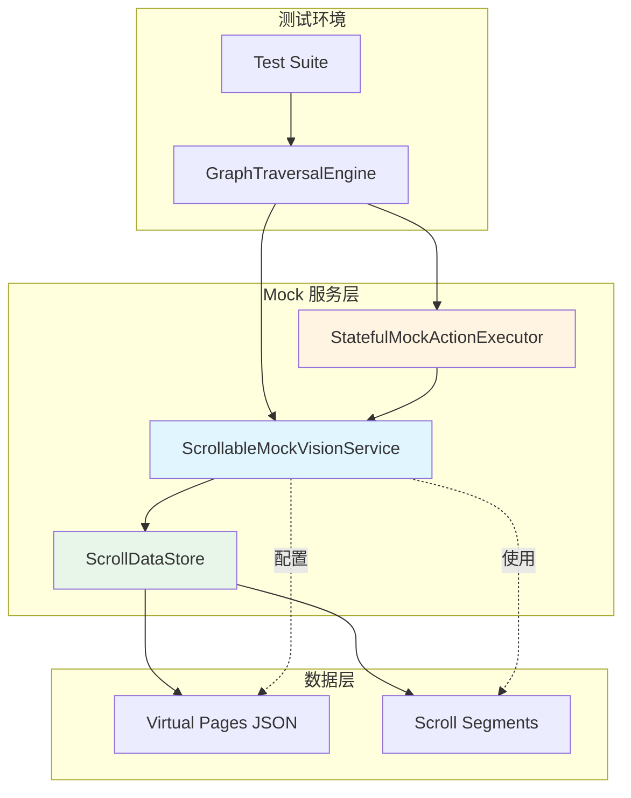
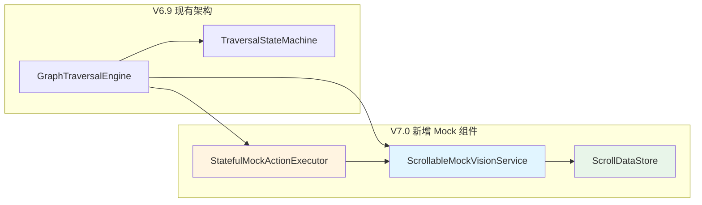
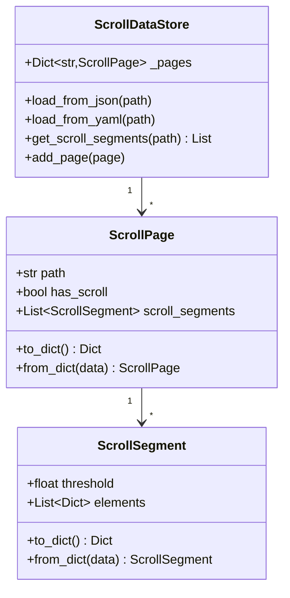
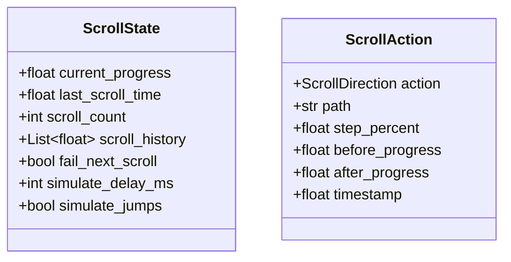
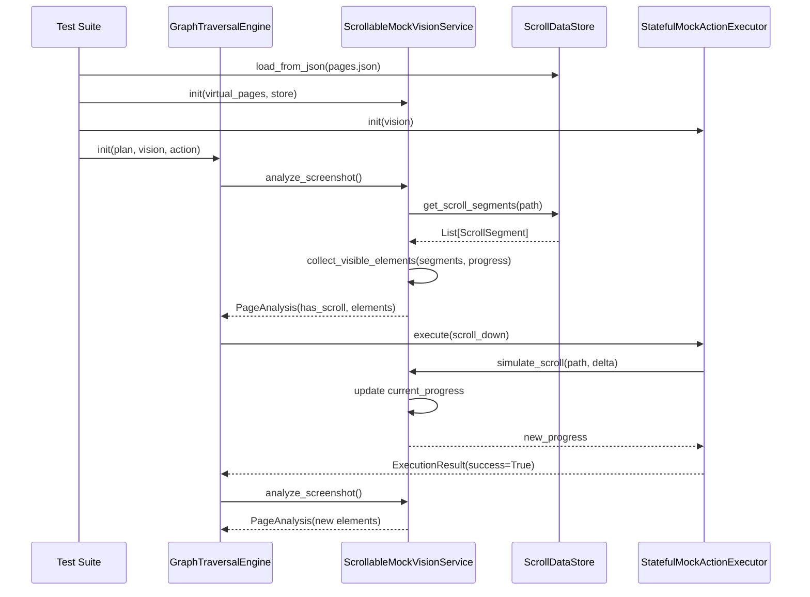
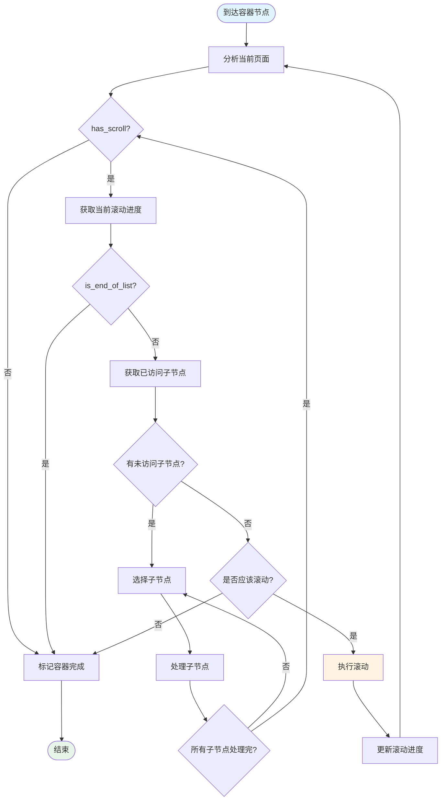
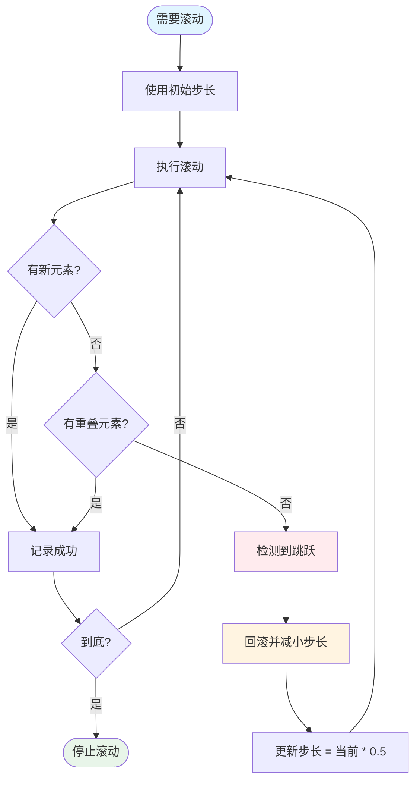

# V7.0-SimScroll 滚动列表模拟测试设计文档

> **版本**: V7.0-SimScroll
> **日期**: 2026-06-09
> **状态**: 设计阶段
> **依赖**: V6.9 遍历执行与计划编译、V6.7 智能状态机、StatefulMockVisionService/StatefulMockActionExecutor
> **PRD**: [PRD_V7_0_SimScroll.md](./PRD_V7_0_SimScroll.md)

---

## 目录

1. [架构设计](#架构设计)
2. [组件设计](#组件设计)
3. [数据模型](#数据模型)
4. [接口设计](#接口设计)
5. [滚动策略](#滚动策略)
6. [测试场景](#测试场景)
7. [实现计划](#实现计划)

---

## 1. 架构设计

### 1.1 系统架构



### 1.2 分层职责

| 层次 | 组件 | 职责 |
|------|------|------|
| **测试层** | Test Suite | 编写测试用例，验证结果 |
| **引擎层** | GraphTraversalEngine | 执行遍历，无需修改 |
| **Mock层** | ScrollableMockVisionService | 模拟视觉分析，管理滚动状态 |
| **Mock层** | StatefulMockActionExecutor | 模拟动作执行，更新滚动状态 |
| **数据层** | ScrollDataStore | 管理滚动数据和虚拟页面 |

### 1.3 与现有架构的集成



---

## 2. 组件设计

### 2.1 ScrollableMockVisionService

#### 2.1.1 类定义

```python
from typing import Any, Dict, List, Optional, Set
from dataclasses import dataclass, field
import time
import hashlib

from src.vision.vision_service import VisionService
from src.vision.models import PageAnalysis
from src.traversal.mock.stateful_mock_vision import StatefulMockVisionService


@dataclass
class ScrollState:
    """单个页面的滚动状态"""
    current_progress: float = 0.0          # 当前滚动进度 0.0-1.0
    last_scroll_time: Optional[float] = None
    scroll_count: int = 0                  # 滚动次数
    scroll_history: List[float] = field(default_factory=list)
    
    # 故障注入
    fail_next_scroll: bool = False
    simulate_delay_ms: int = 0
    simulate_jumps: bool = False


class ScrollableMockVisionService(StatefulMockVisionService):
    """支持滚动列表模拟的视觉服务
    
    职责:
    - 根据滚动进度返回对应的页面元素
    - 管理每个页面的滚动状态
    - 支持故障注入（延迟、跳跃、无响应）
    """
    
    def __init__(
        self,
        virtual_pages: Dict[str, Any],
        scroll_data_store: Optional["ScrollDataStore"] = None,
    ):
        super().__init__(virtual_pages)
        
        # 滚动状态管理
        self._scroll_states: Dict[str, ScrollState] = {}
        self._scroll_data_store = scroll_data_store or ScrollDataStore(virtual_pages)
        
        # 元素ID缓存（保证稳定性）
        self._element_ids: Dict[str, Dict[str, str]] = {}
    
    # ========================================================================
    # 核心 API
    # ========================================================================
    
    def analyze_screenshot(self, image_data: bytes) -> PageAnalysis:
        """分析当前页面，返回 PageAnalysis
        
        根据当前路径的滚动进度，返回对应的可见元素。
        如果启用了延迟模拟，会先等待指定时间。
        """
        path_key = self._resolve_path()
        scroll_state = self._get_scroll_state(path_key)
        
        # 延迟模拟
        if scroll_state.simulate_delay_ms > 0:
            time.sleep(scroll_state.simulate_delay_ms / 1000.0)
        
        # 获取滚动片段数据
        scroll_segments = self._scroll_data_store.get_scroll_segments(path_key)
        
        # 根据当前进度收集可见元素
        visible_elements = self._collect_visible_elements(
            scroll_segments, 
            scroll_state.current_progress
        )
        
        # 判断是否可滚动
        has_scroll = (
            len(scroll_segments) > 0 
            and scroll_state.current_progress < 1.0
        )
        
        # 判断是否到底
        is_end_of_list = scroll_state.current_progress >= 1.0
        
        # 构建 PageAnalysis
        return self._build_page_analysis(
            path_key=path_key,
            elements=visible_elements,
            has_scroll=has_scroll,
            is_end_of_list=is_end_of_list,
        )
    
    def simulate_scroll(
        self, 
        path_key: str, 
        delta: float,
        update_time: bool = True,
    ) -> float:
        """模拟滚动操作，返回新的进度值
        
        Args:
            path_key: 页面路径键
            delta: 滚动增量（正数向下，负数向上）
            update_time: 是否更新滚动时间
            
        Returns:
            float: 新的滚动进度 (0.0-1.0)
        """
        scroll_state = self._get_scroll_state(path_key)
        
        # 无响应模拟
        if scroll_state.fail_next_scroll:
            scroll_state.fail_next_scroll = False
            return scroll_state.current_progress  # 进度不变
        
        # 更新进度
        old_progress = scroll_state.current_progress
        new_progress = max(0.0, min(1.0, old_progress + delta))
        scroll_state.current_progress = new_progress
        
        # 记录历史
        if update_time:
            scroll_state.last_scroll_time = time.time()
        scroll_state.scroll_count += 1
        scroll_state.scroll_history.append(new_progress)
        
        return new_progress
    
    def get_scroll_progress(self, path_key: str) -> float:
        """获取指定页面的当前滚动进度"""
        scroll_state = self._scroll_states.get(path_key)
        return scroll_state.current_progress if scroll_state else 0.0
    
    def reset_scroll_state(self, path_key: str) -> None:
        """重置指定页面的滚动状态"""
        if path_key in self._scroll_states:
            self._scroll_states[path_key] = ScrollState()
    
    # ========================================================================
    # 内部方法
    # ========================================================================
    
    def _get_scroll_state(self, path_key: str) -> ScrollState:
        """获取或创建滚动状态"""
        if path_key not in self._scroll_states:
            self._scroll_states[path_key] = ScrollState()
        return self._scroll_states[path_key]
    
    def _collect_visible_elements(
        self,
        scroll_segments: List[Dict[str, Any]],
        progress: float,
    ) -> List[Dict[str, Any]]:
        """根据滚动进度收集可见元素
        
        收集所有 threshold <= 当前进度的片段中的元素。
        """
        visible_elements = []
        
        for segment in scroll_segments:
            if segment.get("threshold", 0.0) <= progress:
                elements = segment.get("elements", [])
                visible_elements.extend(elements)
        
        return visible_elements
    
    def _build_page_analysis(
        self,
        path_key: str,
        elements: List[Dict[str, Any]],
        has_scroll: bool,
        is_end_of_list: bool,
    ) -> PageAnalysis:
        """构建 PageAnalysis 对象"""
        # 生成稳定的元素ID
        element_ids = self._ensure_element_ids(path_key, elements)
        
        # 构建 PageAnalysis
        from src.vision.models import PageAnalysis, UIElement
        
        ui_elements = []
        for element in elements:
            element_id = element_ids.get(element.get("id"), self._generate_element_id(element))
            
            ui_element = UIElement(
                id=element_id,
                name=element.get("text", ""),
                type=element.get("type", "unknown"),
                bounds=element.get("bounds", [0, 0, 0, 0]),
                expected_action=element.get("expected_action", "click"),
            )
            ui_elements.append(ui_element)
        
        return PageAnalysis(
            page_id=path_key,
            elements=ui_elements,
            has_scroll=has_scroll,
            is_end_of_list=is_end_of_list,
            timestamp=time.time(),
        )
    
    def _ensure_element_ids(
        self, 
        path_key: str, 
        elements: List[Dict[str, Any]]
    ) -> Dict[str, str]:
        """确保元素有稳定的ID"""
        if path_key not in self._element_ids:
            self._element_ids[path_key] = {}
        
        element_ids = self._element_ids[path_key]
        
        for element in elements:
            element_key = element.get("id")
            if element_key and element_key not in element_ids:
                element_ids[element_key] = element_key
        
        return element_ids
    
    def _generate_element_id(self, element: Dict[str, Any]) -> str:
        """根据元素内容生成稳定的ID"""
        content = f"{element.get('text', '')}{element.get('type', '')}{element.get('bounds', [])}"
        return hashlib.md5(content.encode()).hexdigest()[:16]
    
    def _resolve_path(self) -> str:
        """解析当前路径"""
        if hasattr(self, '_current_path') and self._current_path:
            return "/".join(self._current_path)
        return "home"
    
    # ========================================================================
    # 故障注入 API
    # ========================================================================
    
    def set_scroll_delay(self, path_key: str, delay_ms: int) -> None:
        """设置滚动延迟（模拟卡顿）"""
        scroll_state = self._get_scroll_state(path_key)
        scroll_state.simulate_delay_ms = delay_ms
    
    def enable_scroll_failure(self, path_key: str, fail_once: bool = True) -> None:
        """启用滚动无响应模拟"""
        scroll_state = self._get_scroll_state(path_key)
        scroll_state.fail_next_scroll = True
    
    def enable_jump_simulation(self, path_key: str, enable: bool = True) -> None:
        """启用跳跃模拟"""
        scroll_state = self._get_scroll_state(path_key)
        scroll_state.simulate_jumps = enable
```

#### 2.1.2 关键设计点

1. **状态管理**: 每个页面路径有独立的 `ScrollState`
2. **ID稳定性**: 通过内容哈希生成稳定ID，支持跨滚动位置去重
3. **故障注入**: 支持延迟、无响应、跳跃三种故障模式
4. **渐进式加载**: 通过 threshold 机制模拟滚动时的元素渐进出现

### 2.2 StatefulMockActionExecutor

#### 2.2.1 类定义

```python
from typing import Any, Dict, List, Optional
from dataclasses import dataclass, field
from enum import Enum

from src.action.action_executor import ActionExecutor, ExecutionResult


class ScrollDirection(Enum):
    """滚动方向"""
    DOWN = "down"
    UP = "up"


@dataclass
class ScrollAction:
    """滚动动作记录"""
    action: ScrollDirection
    path: str
    step_percent: float
    before_progress: float
    after_progress: float
    timestamp: float


class StatefulMockActionExecutor(ActionExecutor):
    """支持滚动动作的有状态执行器
    
    职责:
    - 执行 click、scroll_down、scroll_up 等动作
    - 更新视觉服务的滚动状态
    - 记录动作历史
    """
    
    def __init__(
        self,
        vision_service: ScrollableMockVisionService,
    ):
        self._vision = vision_service
        self._history: List[Dict[str, Any]] = field(default_factory=list)
        self._scroll_actions: List[ScrollAction] = field(default_factory=list)
    
    # ========================================================================
    # 核心 API
    # ========================================================================
    
    def execute(self, context: "ExecutionContext") -> ExecutionResult:
        """执行动作"""
        operation = context.operation
        action_type = operation.get("action", "unknown")
        params = operation.get("params", {})
        target = operation.get("target")
        
        if action_type == "click":
            return self._execute_click(target)
        elif action_type == "scroll_down":
            return self._execute_scroll_down(params)
        elif action_type == "scroll_up":
            return self._execute_scroll_up(params)
        elif action_type == "back":
            return self._execute_back()
        elif action_type == "input_text":
            return self._execute_input_text(target, params)
        else:
            return ExecutionResult(
                success=False,
                error=f"Unknown action type: {action_type}"
            )
    
    # ========================================================================
    # 动作实现
    # ========================================================================
    
    def _execute_click(self, target: Any) -> ExecutionResult:
        """执行点击动作"""
        element_id = self._extract_element_id(target)
        if not element_id:
            return ExecutionResult(
                success=False,
                error="No element id in target"
            )
        
        # 模拟点击成功
        success = self._vision.simulate_action(element_id, "click")
        
        self._history.append({
            "action": "click",
            "target": element_id,
            "success": success,
            "timestamp": time.time(),
        })
        
        return ExecutionResult(success=success)
    
    def _execute_scroll_down(self, params: Dict[str, Any]) -> ExecutionResult:
        """执行向下滚动"""
        step = params.get("scroll_percent", 0.3)
        path_key = self._vision._resolve_path()
        
        before_progress = self._vision.get_scroll_progress(path_key)
        after_progress = self._vision.simulate_scroll(path_key, step)
        
        scroll_action = ScrollAction(
            action=ScrollDirection.DOWN,
            path=path_key,
            step_percent=step,
            before_progress=before_progress,
            after_progress=after_progress,
            timestamp=time.time(),
        )
        self._scroll_actions.append(scroll_action)
        
        self._history.append({
            "action": "scroll_down",
            "path": path_key,
            "step": step,
            "before_progress": before_progress,
            "after_progress": after_progress,
            "timestamp": time.time(),
        })
        
        return ExecutionResult(success=True)
    
    def _execute_scroll_up(self, params: Dict[str, Any]) -> ExecutionResult:
        """执行向上滚动"""
        step = params.get("scroll_percent", 0.1)
        path_key = self._vision._resolve_path()
        
        before_progress = self._vision.get_scroll_progress(path_key)
        after_progress = self._vision.simulate_scroll(path_key, -step)
        
        scroll_action = ScrollAction(
            action=ScrollDirection.UP,
            path=path_key,
            step_percent=step,
            before_progress=before_progress,
            after_progress=after_progress,
            timestamp=time.time(),
        )
        self._scroll_actions.append(scroll_action)
        
        self._history.append({
            "action": "scroll_up",
            "path": path_key,
            "step": step,
            "before_progress": before_progress,
            "after_progress": after_progress,
            "timestamp": time.time(),
        })
        
        return ExecutionResult(success=True)
    
    def _execute_back(self) -> ExecutionResult:
        """执行返回"""
        success = self._vision.simulate_navigate_back()
        
        self._history.append({
            "action": "back",
            "success": success,
            "timestamp": time.time(),
        })
        
        return ExecutionResult(success=success)
    
    def _execute_input_text(
        self, 
        target: Any, 
        params: Dict[str, Any]
    ) -> ExecutionResult:
        """执行文本输入"""
        element_id = self._extract_element_id(target)
        text = params.get("text", "")
        
        if not element_id:
            return ExecutionResult(
                success=False,
                error="No element id in target"
            )
        
        success = self._vision.simulate_action(element_id, "input_text", text=text)
        
        self._history.append({
            "action": "input_text",
            "target": element_id,
            "text": text,
            "success": success,
            "timestamp": time.time(),
        })
        
        return ExecutionResult(success=success)
    
    # ========================================================================
    # 辅助方法
    # ========================================================================
    
    def _extract_element_id(self, target: Any) -> Optional[str]:
        """从目标中提取元素ID"""
        if isinstance(target, str):
            return target
        elif isinstance(target, dict):
            return target.get("id") or target.get("element_id")
        elif hasattr(target, "id"):
            return getattr(target, "id")
        return None
    
    # ========================================================================
    # 查询 API
    # ========================================================================
    
    @property
    def history(self) -> List[Dict[str, Any]]:
        """获取动作历史"""
        return list(self._history)
    
    @property
    def scroll_actions(self) -> List[ScrollAction]:
        """获取滚动动作历史"""
        return list(self._scroll_actions)
    
    def get_scroll_count(self, path: Optional[str] = None) -> int:
        """获取滚动次数"""
        if path:
            return sum(
                1 for action in self._scroll_actions 
                if action.path == path
            )
        return len(self._scroll_actions)
    
    def get_total_scroll_distance(self, path: Optional[str] = None) -> float:
        """获取总滚动距离"""
        if path:
            actions = [a for a in self._scroll_actions if a.path == path]
        else:
            actions = self._scroll_actions
        
        total = 0.0
        for action in actions:
            if action.action == ScrollDirection.DOWN:
                total += action.step_percent
            elif action.action == ScrollDirection.UP:
                total -= action.step_percent
        
        return total
```

#### 2.2.2 关键设计点

1. **动作历史**: 记录所有动作，支持测试验证
2. **滚动跟踪**: 专门跟踪滚动动作，记录进度变化
3. **双向滚动**: 支持 scroll_down 和 scroll_up
4. **状态同步**: 通过 vision_service 的 simulate_scroll 同步状态

### 2.3 ScrollDataStore

#### 2.3.1 类定义

```python
from typing import Any, Dict, List, Optional
from pathlib import Path
import json


@dataclass
class ScrollSegment:
    """滚动片段"""
    threshold: float                      # 激活阈值
    elements: List[Dict[str, Any]]       # 包含的元素
    
    def to_dict(self) -> Dict[str, Any]:
        return {
            "threshold": self.threshold,
            "elements": self.elements,
        }
    
    @classmethod
    def from_dict(cls, data: Dict[str, Any]) -> "ScrollSegment":
        return cls(
            threshold=data.get("threshold", 0.0),
            elements=data.get("elements", []),
        )


@dataclass
class ScrollPage:
    """可滚动页面数据"""
    path: str                            # 页面路径
    has_scroll: bool = True              # 是否可滚动
    scroll_segments: List[ScrollSegment] = field(default_factory=list)
    
    def to_dict(self) -> Dict[str, Any]:
        return {
            "path": self.path,
            "has_scroll": self.has_scroll,
            "scroll_segments": [s.to_dict() for s in self.scroll_segments],
        }
    
    @classmethod
    def from_dict(cls, data: Dict[str, Any]) -> "ScrollPage":
        segments = [
            ScrollSegment.from_dict(s) 
            for s in data.get("scroll_segments", [])
        ]
        return cls(
            path=data.get("path", ""),
            has_scroll=data.get("has_scroll", True),
            scroll_segments=segments,
        )


class ScrollDataStore:
    """滚动数据存储和管理
    
    职责:
    - 加载和管理滚动页面数据
    - 提供滚动片段查询
    - 支持JSON/YAML格式
    """
    
    def __init__(self, virtual_pages: Optional[Dict[str, Any]] = None):
        self._pages: Dict[str, ScrollPage] = {}
        
        if virtual_pages:
            self._load_from_virtual_pages(virtual_pages)
    
    # ========================================================================
    # 加载
    # ========================================================================
    
    def _load_from_virtual_pages(self, pages: Dict[str, Any]) -> None:
        """从虚拟页面字典加载数据"""
        for path_key, page_data in pages.items():
            if page_data.get("has_scroll") or "scroll_segments" in page_data:
                scroll_page = ScrollPage.from_dict({
                    "path": path_key,
                    **page_data,
                })
                self._pages[path_key] = scroll_page
    
    def load_from_json(self, json_path: Path) -> None:
        """从JSON文件加载"""
        with open(json_path, 'r', encoding='utf-8') as f:
            data = json.load(f)
            self._load_from_virtual_pages(data)
    
    def load_from_yaml(self, yaml_path: Path) -> None:
        """从YAML文件加载"""
        import yaml
        with open(yaml_path, 'r', encoding='utf-8') as f:
            data = yaml.safe_load(f)
            self._load_from_virtual_pages(data)
    
    # ========================================================================
    # 查询
    # ========================================================================
    
    def get_scroll_segments(self, path_key: str) -> List[ScrollSegment]:
        """获取指定路径的滚动片段"""
        page = self._pages.get(path_key)
        return page.scroll_segments if page else []
    
    def get_page(self, path_key: str) -> Optional[ScrollPage]:
        """获取指定路径的滚动页面"""
        return self._pages.get(path_key)
    
    def has_scroll(self, path_key: str) -> bool:
        """检查指定路径是否可滚动"""
        page = self._pages.get(path_key)
        return page.has_scroll if page else False
    
    def get_all_paths(self) -> List[str]:
        """获取所有可滚动页面路径"""
        return list(self._pages.keys())
    
    # ========================================================================
    # 修改
    # ========================================================================
    
    def add_page(self, page: ScrollPage) -> None:
        """添加或更新滚动页面"""
        self._pages[page.path] = page
    
    def remove_page(self, path_key: str) -> bool:
        """移除滚动页面"""
        if path_key in self._pages:
            del self._pages[path_key]
            return True
        return False
```

#### 2.3.2 关键设计点

1. **数据抽象**: `ScrollSegment` 和 `ScrollPage` 提供数据模型
2. **多格式支持**: 支持 JSON 和 YAML 格式
3. **查询能力**: 提供路径、片段等查询方法
4. **可扩展**: 支持动态添加和删除页面数据

---

## 3. 数据模型

### 3.1 滚动片段数据结构



### 3.2 滚动状态数据结构



### 3.3 完整数据流



---

## 4. 接口设计

### 4.1 ScrollableMockVisionService 接口

```python
class ScrollableMockVisionServiceInterface(Protocol):
    """ScrollableMockVisionService 接口定义"""
    
    def analyze_screenshot(image_data: bytes) -> PageAnalysis:
        """分析页面，返回 PageAnalysis"""
        ...
    
    def simulate_scroll(path_key: str, delta: float) -> float:
        """模拟滚动，返回新进度"""
        ...
    
    def get_scroll_progress(path_key: str) -> float:
        """获取当前滚动进度"""
        ...
    
    def reset_scroll_state(path_key: str) -> None:
        """重置滚动状态"""
        ...
    
    def set_scroll_delay(path_key: str, delay_ms: int) -> None:
        """设置滚动延迟"""
        ...
    
    def enable_scroll_failure(path_key: str, fail_once: bool = True) -> None:
        """启用滚动无响应模拟"""
        ...
    
    def enable_jump_simulation(path_key: str, enable: bool = True) -> None:
        """启用跳跃模拟"""
        ...
```

### 4.2 StatefulMockActionExecutor 接口

```python
class StatefulMockActionExecutorInterface(Protocol):
    """StatefulMockActionExecutor 接口定义"""
    
    def execute(context: ExecutionContext) -> ExecutionResult:
        """执行动作"""
        ...
    
    @property
    def history(self) -> List[Dict[str, Any]]:
        """获取动作历史"""
        ...
    
    @property
    def scroll_actions(self) -> List[ScrollAction]:
        """获取滚动动作历史"""
        ...
    
    def get_scroll_count(path: Optional[str] = None) -> int:
        """获取滚动次数"""
        ...
    
    def get_total_scroll_distance(path: Optional[str] = None) -> float:
        """获取总滚动距离"""
        ...
```

### 4.3 ScrollDataStore 接口

```python
class ScrollDataStoreInterface(Protocol):
    """ScrollDataStore 接口定义"""
    
    def load_from_json(json_path: Path) -> None:
        """从JSON文件加载"""
        ...
    
    def load_from_yaml(yaml_path: Path) -> None:
        """从YAML文件加载"""
        ...
    
    def get_scroll_segments(path_key: str) -> List[ScrollSegment]:
        """获取滚动片段"""
        ...
    
    def get_page(path_key: str) -> Optional[ScrollPage]:
        """获取页面数据"""
        ...
    
    def has_scroll(path_key: str) -> bool:
        """检查是否可滚动"""
        ...
    
    def add_page(page: ScrollPage) -> None:
        """添加页面"""
        ...
    
    def remove_page(path_key: str) -> bool:
        """移除页面"""
        ...
```

---

## 5. 滚动策略

### 5.1 引擎滚动决策流程



### 5.2 步长自适应策略



### 5.3 滚动边界检测

| 状态 | 检测条件 | 处理方式 |
|------|----------|----------|
| **到底** | `is_end_of_list == true` | 停止滚动，处理剩余元素 |
| **无新元素** | `滚动后元素集合不变` | 可能到底，尝试再滚一次 |
| **跳跃** | `滚动后无重叠元素` | 回滚，减小步长 |
| **无响应** | `滚动进度不变` | 标记错误，处理或跳过 |

---

## 6. 测试场景

### 6.1 基础场景

#### 6.1.1 正常多屏滚动

**目标**: 验证引擎能完整遍历多屏列表

```python
def test_normal_multi_screen_scroll():
    """
    场景: 3屏列表，每屏3个元素
    预期: 所有9个元素都被访问
    """
    pages = {
        "/settings/wifi_list": {
            "scroll_segments": [
                {
                    "threshold": 0.0,
                    "elements": [
                        {"id": "wifi_switch", "text": "WiFi", "type": "switch"},
                        {"id": "net1", "text": "Network1", "type": "menu_item"},
                        {"id": "net2", "text": "Network2", "type": "menu_item"},
                    ]
                },
                {
                    "threshold": 0.5,
                    "elements": [
                        {"id": "net3", "text": "Network3", "type": "menu_item"},
                        {"id": "net4", "text": "Network4", "type": "menu_item"},
                        {"id": "net5", "text": "Network5", "type": "menu_item"},
                    ]
                },
                {
                    "threshold": 1.0,
                    "elements": [
                        {"id": "net6", "text": "Network6", "type": "menu_item"},
                        {"id": "net7", "text": "Network7", "type": "menu_item"},
                        {"id": "net8", "text": "Network8", "type": "menu_item"},
                    ]
                },
            ]
        }
    }
    
    # 验证所有元素都被访问
    expected = {"net1", "net2", "net3", "net4", "net5", "net6", "net7", "net8"}
    visited = get_visited_elements(trace)
    assert expected == visited
```

#### 6.1.2 滚动到底检测

**目标**: 验证引擎能正确识别列表到底

```python
def test_scroll_to_end_detection():
    """
    场景: 2屏列表，滚动到1.0后应该停止
    预期: 引擎检测到is_end_of_list，停止滚动
    """
    pages = {
        "/settings/wifi_list": {
            "scroll_segments": [
                {
                    "threshold": 0.0,
                    "elements": [{"id": "net1", "text": "Network1"}]
                },
                {
                    "threshold": 1.0,
                    "elements": [{"id": "net2", "text": "Network2"}]
                },
            ]
        }
    }
    
    # 模拟滚动到底
    vision.simulate_scroll("/settings/wifi_list", 1.0)
    
    # 引擎应该不再继续滚动
    scroll_count = action.get_scroll_count("/settings/wifi_list")
    assert scroll_count == 1  # 只滚一次
```

### 6.2 边界场景

#### 6.2.1 跳跃检测与回滚

**目标**: 验证步长过大时的跳跃检测和回滚

```python
def test_jump_detection_and_rollback():
    """
    场景: 步长0.8，跳过中间片段
    预期: 引擎检测到无重叠，回滚并减小步长
    """
    pages = {
        "/settings/wifi_list": {
            "scroll_segments": [
                {
                    "threshold": 0.0,
                    "elements": [{"id": "net1", "text": "Network1"}]
                },
                {
                    "threshold": 0.4,
                    "elements": [{"id": "net2", "text": "Network2"}]
                },
                {
                    "threshold": 0.8,
                    "elements": [{"id": "net3", "text": "Network3"}]
                },
            ]
        }
    }
    
    # 模拟步长过大
    vision.simulate_scroll("/settings/wifi_list", 0.8)
    
    # 验证引擎检测到跳跃
    scroll_up_count = sum(
        1 for action in action.scroll_actions
        if action.action == ScrollDirection.UP
    )
    assert scroll_up_count > 0  # 应该有回滚操作
```

#### 6.2.2 空列表处理

**目标**: 验证空列表的边界处理

```python
def test_empty_list_handling():
    """
    场景: 滚动列表为空
    预期: 引擎正确处理，不进入死循环
    """
    pages = {
        "/settings/wifi_list": {
            "scroll_segments": [
                {
                    "threshold": 0.0,
                    "elements": []  # 空列表
                }
            ]
        }
    }
    
    # 引擎应该快速退出
    result = engine.run()
    assert result.status == GlobalState.COMPLETED
    assert result.total_steps < 10  # 不应该有太多步骤
```

#### 6.2.3 单屏列表

**目标**: 验证单屏列表（不需要滚动）

```python
def test_single_screen_list():
    """
    场景: 所有元素在一屏内
    预期: 不执行滚动操作
    """
    pages = {
        "/settings/wifi_list": {
            "scroll_segments": [
                {
                    "threshold": 0.0,
                    "elements": [
                        {"id": "net1", "text": "Network1"},
                        {"id": "net2", "text": "Network2"},
                        {"id": "net3", "text": "Network3"},
                    ]
                }
            ]
        }
    }
    
    # 不应该有滚动操作
    scroll_count = action.get_scroll_count()
    assert scroll_count == 0
```

### 6.3 故障场景

#### 6.3.1 滚动卡顿模拟

**目标**: 验证延迟情况下的处理

```python
def test_scroll_delay_simulation():
    """
    场景: 滚动响应延迟500ms
    预期: 引擎能正确处理，不超时
    """
    pages = {...}
    
    vision.set_scroll_delay("/settings/wifi_list", 500)
    
    # 引擎应该正常完成
    result = engine.run()
    assert result.status == GlobalState.COMPLETED
```

#### 6.3.2 滚动无响应模拟

**目标**: 验证无响应情况下的处理

```python
def test_scroll_no_response():
    """
    场景: 第一次滚动无响应
    预期: 引擎检测到进度不变，重试或跳过
    """
    pages = {...}
    
    vision.enable_scroll_failure("/settings/wifi_list", fail_once=True)
    
    # 引擎应该检测并处理
    result = engine.run()
    # 可能重试或标记错误
```

#### 6.3.3 重复加载模拟

**目标**: 验证重复加载相同元素的去重

```python
def test_duplicate_element_deduplication():
    """
    场景: 滚动后加载相同ID的元素
    预期: 引擎通过ID去重，不重复访问
    """
    pages = {
        "/settings/wifi_list": {
            "scroll_segments": [
                {
                    "threshold": 0.0,
                    "elements": [
                        {"id": "net1", "text": "Network1"},  # 第一次出现
                    ]
                },
                {
                    "threshold": 0.5,
                    "elements": [
                        {"id": "net1", "text": "Network1"},  # 重复出现
                    ]
                },
            ]
        }
    }
    
    # net1 应该只被访问一次
    visited_count = get_visit_count("net1", trace)
    assert visited_count == 1
```

### 6.4 性能场景

#### 6.4.1 大量元素列表

**目标**: 验证大量元素时的性能

```python
def test_large_list_performance():
    """
    场景: 100个元素的列表
    预期: 能在合理时间内完成
    """
    pages = {
        "/settings/large_list": {
            "scroll_segments": [
                {
                    "threshold": i / 100.0,
                    "elements": [
                        {"id": f"item{j}", "text": f"Item{j}", "type": "menu_item"}
                        for j in range(i * 10, (i + 1) * 10)
                    ]
                }
                for i in range(10)
            ]
        }
    }
    
    # 应该在10秒内完成
    start = time.time()
    result = engine.run()
    elapsed = time.time() - start
    
    assert result.status == GlobalState.COMPLETED
    assert elapsed < 10.0
```

#### 6.4.2 深层嵌套列表

**目标**: 验证多层嵌套的滚动列表

```python
def test_nested_scrollable_lists():
    """
    场景: 列表中包含可点击的子列表
    预期: 能正确处理嵌套结构
    """
    pages = {
        "/settings/root_list": {
            "scroll_segments": [
                {
                    "threshold": 0.0,
                    "elements": [
                        {"id": "category1", "text": "Category1", "type": "menu_item"},
                    ]
                },
                {
                    "threshold": 0.5,
                    "elements": [
                        {"id": "category2", "text": "Category2", "type": "menu_item"},
                    ]
                },
            ]
        },
        "/settings/category1/sub_list": {
            "scroll_segments": [
                {
                    "threshold": 0.0,
                    "elements": [
                        {"id": "item1", "text": "Item1", "type": "menu_item"},
                        {"id": "item2", "text": "Item2", "type": "menu_item"},
                    ]
                },
            ]
        },
    }
    
    # 能正确遍历所有层级
    result = engine.run()
    assert result.status == GlobalState.COMPLETED
```

---

## 7. 实现计划

### 7.1 阶段划分

| 阶段 | 内容 | 工时 | 验收标准 |
|------|------|------|----------|
| **P0: 数据模型** | ScrollSegment, ScrollPage, ScrollDataStore | 2h | 单元测试通过 |
| **P1: 视觉服务** | ScrollableMockVisionService | 4h | 单元测试 + 集成测试 |
| **P2: 动作执行器** | StatefulMockActionExecutor | 3h | 单元测试 + 集成测试 |
| **P3: 测试用例** | 6个基础场景 + 6个边界场景 | 4h | 所有测试通过 |
| **P4: 故障模拟** | 延迟、无响应、跳跃模拟 | 2h | 故障测试通过 |
| **P5: 文档** | API文档、使用示例 | 2h | 文档完整 |

### 7.2 任务清单

#### T1: 创建数据模型 (2h)

- [ ] 创建 `src/simulation/scroll/models.py`
  - `ScrollSegment` 类
  - `ScrollPage` 类
  - `ScrollState` 类
  - `ScrollAction` 类
- [ ] 创建单元测试 `tests/simulation/scroll/test_models.py`
- [ ] 验收：`pytest tests/simulation/scroll/test_models.py -v` 通过

#### T2: 实现 ScrollDataStore (2h)

- [ ] 创建 `src/simulation/scroll/scroll_data_store.py`
  - `ScrollDataStore` 类
  - JSON/YAML 加载
  - 查询和修改方法
- [ ] 创建单元测试 `tests/simulation/scroll/test_data_store.py`
- [ ] 创建测试数据 `fixtures/pages/scroll_test.json`
- [ ] 验收：所有测试通过

#### T3: 实现 ScrollableMockVisionService (4h)

- [ ] 创建 `src/simulation/scroll/scrollable_mock_vision.py`
  - 继承 `StatefulMockVisionService`
  - 实现 `analyze_screenshot()`
  - 实现 `simulate_scroll()`
  - 实现故障注入方法
- [ ] 创建单元测试 `tests/simulation/scroll/test_vision.py`
- [ ] 验收：所有测试通过

#### T4: 实现 StatefulMockActionExecutor (3h)

- [ ] 扩展 `src/simulation/action/stateful_mock_action.py`
  - 实现 `scroll_down` 动作
  - 实现 `scroll_up` 动作
  - 添加滚动历史记录
- [ ] 创建单元测试 `tests/simulation/action/test_scroll_action.py`
- [ ] 验收：所有测试通过

#### T5: 编写测试用例 (4h)

- [ ] 创建 `tests/simulation/scroll/test_scroll_scenarios.py`
  - 基础场景（3个）
  - 边界场景（3个）
  - 故障场景（3个）
- [ ] 创建测试计划 `tests/simulation/scroll/TEST_PLAN.md`
- [ ] 验收：所有测试通过

#### T6: 故障模拟实现 (2h)

- [ ] 在 `ScrollableMockVisionService` 中实现
  - `set_scroll_delay()`
  - `enable_scroll_failure()`
  - `enable_jump_simulation()`
- [ ] 编写故障场景测试
- [ ] 验收：故障测试通过

#### T7: 文档和示例 (2h)

- [ ] 编写 API 文档
- [ ] 编写使用示例
- [ ] 编写故障注入指南
- [ ] 验收：文档完整

### 7.3 总工时

**总计**: 19 小时

---

## 8. 验收标准

### 8.1 功能验收

- ✅ 所有基础场景测试通过
- ✅ 所有边界场景测试通过
- ✅ 所有故障场景测试通过
- ✅ 引擎无需修改即可使用

### 8.2 代码质量

- ✅ 通过 `mypy strict` 类型检查
- ✅ 通过 `ruff` linting（零警告）
- ✅ 单元测试覆盖率 > 90%

### 8.3 性能

- ✅ 100元素列表遍历时间 < 10秒
- ✅ 内存使用不显著增加

---

## 9. 风险和缓解

| 风险 | 影响 | 缓解措施 |
|------|------|----------|
| **滚动步长不确定** | 可能无法覆盖所有元素 | 实现步长自适应机制 |
| **元素ID不稳定** | 去重失败 | 使用内容哈希生成稳定ID |
| **Mock服务行为不一致** | 测试结果不可信 | 参考真实设备行为校准 |
| **性能退化** | 大列表遍历缓慢 | 优化元素收集算法 |

---

## 10. 未来扩展

基于 V7.0-SimScroll 的未来功能：

1. **滚动模式支持**：水平滚动、嵌套滚动
2. **手势支持**：捏合缩放、长按等
3. **动态内容加载**：模拟"加载中"状态
4. **性能监控**：记录滚动延迟、FPS等指标
5. **可视化调试**：生成滚动过程的可视化报告

---

**文档所有者**: Uni-Claw 开发团队
**状态**: 设计阶段
**相关文档**: 
- [PRD_V7_0_SimScroll.md](./PRD_V7_0_SimScroll.md)
- [simulation-design.md](../architecture/modules/simulation-design.md)
