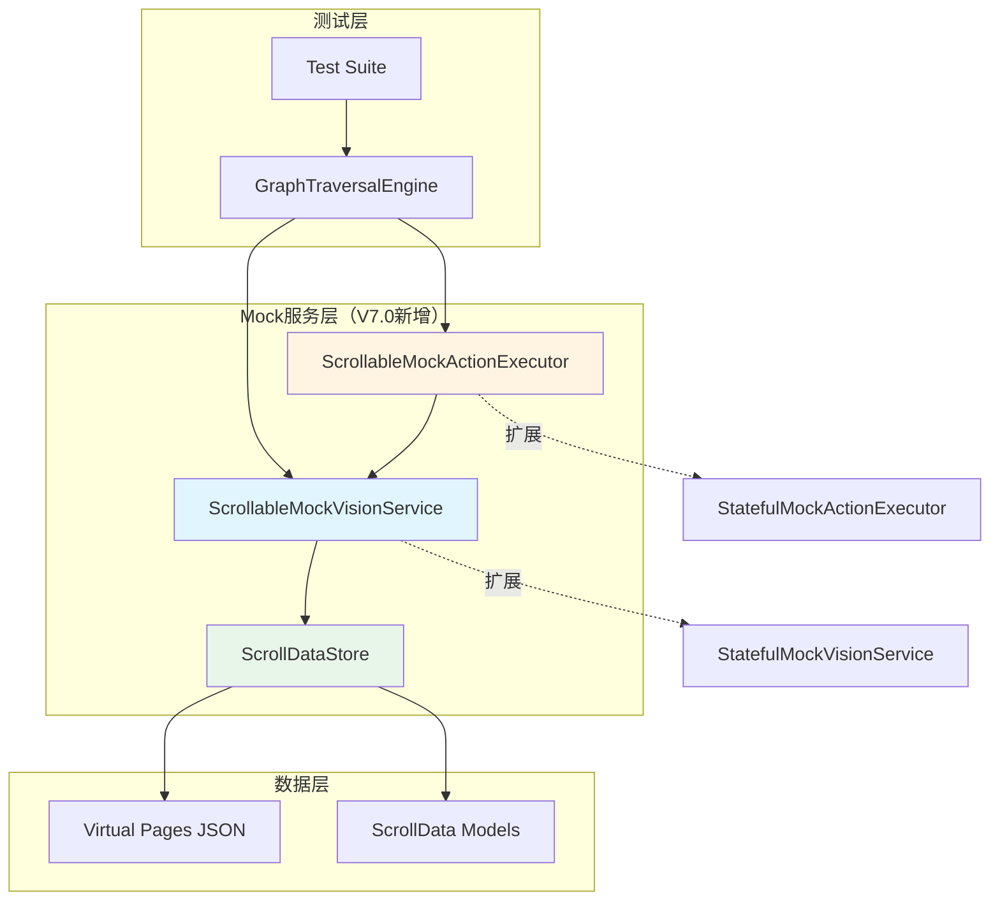

# PRD V7.0-SimScroll 滚动列表模拟测试

> **版本**: V7.0-SimScroll
> **日期**: 2026-06-09
> **状态**: ✅ 批准实施（P0修复已完成）
> **依赖**: V6.11 GraphTraversalEngine, StatefulMockVisionService, StatefulMockActionExecutor
> **修复状态**: [DESIGN_V7_0_SimScroll_FIXES.md](./DESIGN_V7_0_SimScroll_FIXES.md) - 7个P0问题已解决

---

## 文档信息

- **PRD 所有者**: Uni-Claw 开发团队
- **设计文档**: [DESIGN_V7_0_SimScroll.md](./DESIGN_V7_0_SimScroll.md)
- **修复建议**: [DESIGN_V7_0_SimScroll_FIXES.md](./DESIGN_V7_0_SimScroll_FIXES.md)
- **评审状态**: 多代理评审完成 - ✅ 批准实施（P0修复已完成）

---

## 目录

1. [背景与问题](#背景与问题)
2. [目标与范围](#目标与范围)
3. [架构设计](#架构设计)
4. [核心功能](#核心功能)
5. [数据模型](#数据模型)
6. [接口设计](#接口设计)
7. [测试场景](#测试场景)
8. [实施计划](#实施计划)
9. [验收标准](#验收标准)
10. [风险与缓解](#风险与缓解)
11. [P0修复总结](#p0修复总结)

---

## 背景与问题

### 现状

V6.11 版本的 GraphTraversalEngine 支持声明式遍历，但存在以下限制：

| 限制 | 描述 | 影响 |
|------|------|------|
| **滚动支持不足** | `StatefulMockVisionService` 中 `has_scroll` 硬编码为 `False` | 无法测试滚动列表场景 |
| **元素状态固定** | 每个页面返回固定的元素集合 | 无法模拟滚动时元素的渐进出现 |
| **无滚动状态跟踪** | 没有滚动进度、位置等状态管理 | 无法验证滚动逻辑 |
| **故障场景缺失** | 无法模拟滚动卡顿、无响应等边界情况 | 测试覆盖不完整 |

### 问题案例

**场景**：测试设置页面的 WiFi 列表遍历

```yaml
# 现有测试只能测试：
settings:
  wifi_list:
    elements: [wifi_switch, ap1, ap2]  # 固定元素

# 期望测试：
settings:
  wifi_list:
    scrollable: true
    segments:
      - threshold: 0.0  # 初始显示
        elements: [wifi_switch, ap1, ap2]
      - threshold: 0.5  # 滚动后显示
        elements: [ap3, ap4, ap5]
      - threshold: 1.0  # 继续滚动
        elements: [ap6, ap7, ap8]
```

### 根本原因

缺少**滚动列表模拟能力**。现有的 Mock 视觉服务基于离散的页面状态（StateFixture），无法模拟连续的滚动进度和动态元素可见性。

---

## 目标与范围

### 核心目标

1. **支持滚动列表模拟** - Mock 服务能根据滚动进度返回不同的元素集合
2. **滚动状态管理** - 跟踪每个页面的滚动进度、次数、历史
3. **故障注入能力** - 支持模拟延迟、无响应、跳跃等异常场景
4. **向后兼容** - 不影响现有非滚动测试

### 范围界定

| 包含 | 不包含 |
|------|--------|
| ✅ Mock 服务滚动模拟 | ❌ 真实设备滚动（V7.x） |
| ✅ 垂直滚动支持 | ❌ 水平滚动（V7.x） |
| ✅ 单容器滚动 | ❌ 嵌套滚动（V7.x） |
| ✅ 故障注入 | ❌ 手势模拟（捏合、长按） |
| ✅ 步长自适应 | ❌ 动态内容加载（加载中状态） |

### 成功标准

- ✅ 仿真测试能完整遍历 3 屏列表（9个元素）
- ✅ 滚动到底检测正确（is_end_of_list）
- ✅ 跳跃检测与回滚机制生效
- ✅ 故障场景（延迟、无响应）可验证
- ✅ 现有测试无需修改即可运行

---

## 架构设计

### 系统架构



### 分层职责

| 层次 | 组件 | 职责 | 生命周期 |
|------|------|------|----------|
| **测试层** | Test Suite | 编写测试用例，验证结果 | 测试运行时 |
| **引擎层** | GraphTraversalEngine | 执行遍历，无需修改 | 会话级别 |
| **Mock层** | ScrollableMockVisionService | 模拟视觉分析，管理滚动状态 | 会话级别 |
| **Mock层** | ScrollableMockActionExecutor | 模拟动作执行，更新滚动状态 | 会话级别 |
| **数据层** | ScrollDataStore | 管理滚动数据和虚拟页面 | 会话级别 |

### 继承关系

```mermaid
classDiagram
    StatefulMockVisionService <|-- ScrollableMockVisionService
    StatefulMockActionExecutor <|-- ScrollableMockActionExecutor
    
    StatefulMockVisionService: +_current_page_id: str
    StatefulMockVisionService: +_navigation_history: List[str]
    StatefulMockVisionService: +simulate_action(element_id, action)
    
    ScrollableMockVisionService: +_scroll_states: Dict
    ScrollableMockVisionService: +analyze_screenshot() PageAnalysis
    ScrollableMockVisionService: +simulate_scroll(path_key, delta) float
    ScrollableMockVisionService: +get_scroll_progress(path_key) float
    
    StatefulMockActionExecutor: +execute(context) ExecutionResult
    StatefulMockActionExecutor: +history: List
    
    ScrollableMockActionExecutor: +_scroll_actions: List
    ScrollableMockActionExecutor: +_execute_scroll_down(params) ExecutionResult
    ScrollableMockActionExecutor: +_execute_scroll_up(params) ExecutionResult
    ScrollableMockActionExecutor: +get_scroll_count(path) int
```

---

## 核心功能

### 功能1: 滚动状态管理

#### 功能描述
为每个可滚动页面维护独立的滚动状态，包括进度、次数、历史等。

#### 状态模型

```python
@dataclass
class ScrollState:
    """单个页面的滚动状态"""
    current_progress: float = 0.0          # 当前滚动进度 (0.0-1.0)
    last_scroll_time: Optional[float] = None
    scroll_count: int = 0                  # 滚动次数
    scroll_history: List[float] = field(default_factory=list)
    
    # 故障注入
    fail_next_scroll: bool = False        # 下次滚动无响应
    simulate_delay_ms: int = 0            # 模拟延迟（毫秒）
    
    # TODO: V7.x 预留 - 模拟跳跃（惯性滚动、焦点变化等）
    # simulate_jumps: bool = False
    # jump_delta_multiplier: float = 2.0  # 跳跃倍数
```

#### 状态管理

```python
class ScrollableMockVisionService(StatefulMockVisionService):
    def __init__(self, virtual_pages: Dict[str, Any]):
        super().__init__(virtual_pages)
        self._scroll_states: Dict[str, ScrollState] = {}
    
    def _get_scroll_state(self, page_key: str) -> ScrollState:
        """获取或创建页面的滚动状态"""
        if page_key not in self._scroll_states:
            self._scroll_states[page_key] = ScrollState()
        return self._scroll_states[page_key]
```

---

### 功能2: 滚动片段模拟

#### 功能描述
根据滚动进度返回对应的可见元素，支持元素渐进出现。

#### 累加模式

滚动列表采用"累加模式"：

| 进度 | threshold <= progress 的片段 | 可见元素 |
|------|------------------------------|----------|
| 0.0 | [0.0] | 片段0元素 |
| 0.5 | [0.0, 0.5] | 片段0 + 片段1元素 |
| 1.0 | [0.0, 0.5, 1.0] | 所有片段元素 |

#### 元素收集

```python
def _collect_visible_elements(
    self,
    scroll_segments: List[ScrollSegment],
    progress: float,
) -> List[Dict[str, Any]]:
    """根据滚动进度收集可见元素（累加模式）
    
    Args:
        scroll_segments: 滚动片段列表（按 threshold 升序）
        progress: 当前滚动进度（0.0-1.0）
        
    Returns:
        List[Dict[str, Any]]: 可见元素列表（已去重）
    """
    visible_elements = {}  # 使用 dict 去重，后面的覆盖前面的
    
    for segment in sorted(scroll_segments, key=lambda s: s.threshold):
        if segment.threshold <= progress:
            for element in segment.elements:
                element_id = element.get("id")
                if element_id:
                    visible_elements[element_id] = element
    
    return list(visible_elements.values())
```

---

### 功能3: 滚动动作模拟

#### 功能描述
支持 scroll_down、scroll_up 动作，更新滚动进度并记录历史。

#### 动作执行

```python
class ScrollableMockActionExecutor(StatefulMockActionExecutor):
    def _execute_scroll_down(self, params: Dict[str, Any]) -> ExecutionResult:
        """执行向下滚动"""
        page_key = self._vision._resolve_path_key()
        
        # 获取步长
        step = params.get("scroll_percent", 0.3)
        
        # 模拟滚动
        before_progress = self._vision.get_scroll_progress(page_key)
        after_progress = self._vision.simulate_scroll(page_key, step)
        
        # 记录滚动动作
        scroll_action = ScrollAction(
            action=ScrollDirection.DOWN,
            path=page_key,
            step_percent=step,
            before_progress=before_progress,
            after_progress=after_progress,
            timestamp=time.time(),
        )
        self._scroll_actions.append(scroll_action)
        
        return ExecutionResult(success=True)
```

---

### 功能4: 故障注入

#### 功能描述
支持三种故障模式：延迟、无响应、跳跃（预留）。

#### 延迟模拟

```python
def set_scroll_delay(self, page_key: str, delay_ms: int) -> None:
    """设置滚动延迟（模拟卡顿）
    
    Args:
        page_key: 页面键
        delay_ms: 延迟毫秒数
    """
    scroll_state = self._get_scroll_state(page_key)
    scroll_state.simulate_delay_ms = delay_ms

# 在 analyze_screenshot 中应用
if scroll_state.simulate_delay_ms > 0:
    time.sleep(scroll_state.simulate_delay_ms / 1000.0)
```

#### 无响应模拟

```python
def enable_scroll_failure(self, page_key: str, fail_once: bool = True) -> None:
    """启用滚动无响应模拟
    
    Args:
        page_key: 页面键
        fail_once: 是否只失败一次
    """
    scroll_state = self._get_scroll_state(page_key)
    scroll_state.fail_next_scroll = True

# 在 simulate_scroll 中应用
if scroll_state.fail_next_scroll:
    scroll_state.fail_next_scroll = False  # 重置
    return scroll_state.current_progress  # 进度不变
```

---

### 功能5: 步长自适应（推荐）

#### 功能描述
根据元素变化自动调整滚动步长，确保覆盖所有元素的同时优化效率。

#### 策略逻辑

| 元素变化 | 步长调整 | 说明 |
|----------|----------|------|
| 有新元素 | 增大 (×1.1) | 尝试提高效率，最大50% |
| 有重叠无新增 | 保持 | 可能到底 |
| 无重叠 | 减小 (×0.5) | 跳跃检测，最小5% |

#### 实现

```python
class ScrollableMockVisionService(StatefulMockVisionService):
    def __init__(self, virtual_pages: Dict[str, Any]):
        super().__init__(virtual_pages)
        
        # 自适应滚动状态
        self._last_visible_elements: Dict[str, Set[str]] = {}
        self._scroll_step_sizes: Dict[str, float] = {}
        self._min_step_size: float = 0.05
        self._initial_step_size: float = 0.3
        self._max_step_size: float = 0.5
    
    def _adjust_scroll_step(
        self,
        page_key: str,
        current_elements: List[Dict[str, Any]],
    ) -> None:
        """根据元素变化调整滚动步长"""
        current_ids = {e.get("id") for e in current_elements if e.get("id")}
        last_ids = self._last_visible_elements.get(page_key, set())
        
        if page_key not in self._scroll_step_sizes:
            self._scroll_step_sizes[page_key] = self._initial_step_size
        
        current_step = self._scroll_step_sizes[page_key]
        
        # 检测跳跃
        overlap = current_ids & last_ids
        if not overlap and current_ids and last_ids:
            # 跳跃：减小步长
            self._scroll_step_sizes[page_key] = max(
                self._min_step_size, current_step * 0.5
            )
        elif len(current_ids) > len(last_ids):
            # 有新元素：增大步长
            self._scroll_step_sizes[page_key] = min(
                self._max_step_size, current_step * 1.1
            )
        
        # 保存当前元素
        self._last_visible_elements[page_key] = current_ids
```

---

## 数据模型

### 滚动片段数据

```python
@dataclass
class ScrollSegment:
    """滚动片段"""
    threshold: float                      # 激活阈值 (0.0-1.0)
    elements: List[Dict[str, Any]]       # 包含的元素
    
    def to_dict(self) -> Dict[str, Any]:
        return {
            "threshold": self.threshold,
            "elements": self.elements,
        }

@dataclass
class ScrollPage:
    """可滚动页面数据"""
    path: str                            # 页面路径
    has_scroll: bool = True              # 是否可滚动
    scroll_segments: List[ScrollSegment] = field(default_factory=list)
    
    def to_dict(self) -> Dict[str, Any]:
        return {
            "path": self.path,
            "has_scroll": self.has_scroll,
            "scroll_segments": [s.to_dict() for s in self.scroll_segments],
        }
```

### 测试数据格式

```json
{
  "wifi_list_page": {
    "path": "wifi_list_page",
    "has_scroll": true,
    "scroll_segments": [
      {
        "threshold": 0.0,
        "elements": [
          {
            "id": "wifi_switch",
            "text": "WiFi",
            "type": "switch",
            "coordinate": {"x": 0.5, "y": 0.05}
          },
          {
            "id": "net1",
            "text": "Network1",
            "type": "menu_item",
            "coordinate": {"x": 0.5, "y": 0.15}
          }
        ]
      },
      {
        "threshold": 0.5,
        "elements": [
          {
            "id": "net2",
            "text": "Network2",
            "type": "menu_item",
            "coordinate": {"x": 0.5, "y": 0.25}
          }
        ]
      }
    ]
  }
}
```

### 数据字段说明

| 字段 | 类型 | 必填 | 说明 |
|------|------|------|------|
| `path` | string | 是 | 页面路径键 |
| `has_scroll` | boolean | 是 | 是否可滚动 |
| `scroll_segments` | array | 是 | 滚动片段数组 |
| `threshold` | float | 是 | 激活阈值 (0.0-1.0) |
| `elements` | array | 是 | 该片段的元素数组 |
| `id` | string | 是 | 元素唯一ID |
| `text` | string | 是 | 元素显示文本 |
| `type` | string | 是 | 元素类型 |
| `coordinate` | object | 推荐 | 元素中心坐标 {x, y} |

---

## 接口设计

### ScrollableMockVisionService 接口

```python
from src.simulation.stateful_mock_vision import StatefulMockVisionService
from src.action.executor import OperationExecutor, ExecutionResult, ExecutionContext

class ScrollableMockVisionService(StatefulMockVisionService):
    """支持滚动列表模拟的视觉服务
    
    **架构兼容性** (P0已修复):
    - 使用基类的 _current_page_id (str) 而非 _current_path
    - 适配 PageAnalysis.items 和 MenuItem 模型
    - 支持从 Dict 或 StateFixture 加载数据
    """
    
    def __init__(
        self,
        virtual_pages: Optional[Dict[str, Any]] = None,
        state_fixture: Optional["StateFixture"] = None,
        scroll_data_store: Optional["ScrollDataStore"] = None,
        adaptive_scroll: bool = True,
    ):
        """初始化
        
        Args:
            virtual_pages: 虚拟页面数据（Dict格式，兼容性支持）
            state_fixture: 状态固定装置（优先使用，兼容现有模式）
            scroll_data_store: 滚动数据存储（可选）
            adaptive_scroll: 是否启用自适应滚动
        
        **P0修复**: 支持两种初始化方式以兼容现有代码
        """
        # 优先使用 StateFixture（现有模式）
        if state_fixture:
            super().__init__(state_fixture)
        else:
            # 兼容性：从 Dict 创建临时 StateFixture
            super().__init__(self._dict_to_fixture(virtual_pages or {}))
        
        # 滚动状态管理（基于 _current_page_id）
        self._scroll_states: Dict[str, ScrollState] = {}
        self._scroll_data_store = scroll_data_store or ScrollDataStore(virtual_pages)
        self._adaptive_scroll = adaptive_scroll
        
        # 自适应滚动状态
        self._last_visible_elements: Dict[str, Set[str]] = {}
        self._scroll_step_sizes: Dict[str, float] = {}
        self._min_step_size: float = 0.05
        self._initial_step_size: float = 0.3
        self._max_step_size: float = 0.5
    
    def _resolve_path_key(self) -> str:
        """解析当前路径为键
        
        **P0修复**: 使用基类的 _current_page_id 而非 _current_path
        
        Returns:
            str: 当前页面键
        """
        return self._current_page_id or "home"
    
    def analyze_screenshot(self, image_data: bytes) -> PageAnalysis:
        """分析当前页面，返回 PageAnalysis
        
        根据当前页面的滚动进度，返回对应的可见元素。
        
        **P0修复**: 适配 PageAnalysis.items 和 MenuItem 模型
        
        Args:
            image_data: 截图数据（Mock中忽略）
            
        Returns:
            PageAnalysis: 包含 items（MenuItem）、has_scroll、is_end_of_list
        """
        page_key = self._resolve_path_key()
        scroll_state = self._get_scroll_state(page_key)
        
        # 获取滚动片段数据
        scroll_segments = self._scroll_data_store.get_scroll_segments(page_key)
        
        # 根据当前进度收集可见元素
        visible_elements = self._collect_visible_elements(
            scroll_segments, 
            scroll_state.current_progress
        )
        
        # 自适应滚动逻辑
        if self._adaptive_scroll:
            self._adjust_scroll_step(page_key, visible_elements)
        
        # 保存当前元素集合
        current_element_ids = {e.get("id") for e in visible_elements if e.get("id")}
        self._last_visible_elements[page_key] = current_element_ids
        
        # 判断是否可滚动
        has_scroll = (
            len(scroll_segments) > 0 
            and scroll_state.current_progress < 1.0
        )
        
        # 判断是否到底
        is_end_of_list = scroll_state.current_progress >= 1.0
        
        # 构建 PageAnalysis（适配 MenuItem 模型）
        return self._build_page_analysis(
            page_key=page_key,
            elements=visible_elements,
            has_scroll=has_scroll,
            is_end_of_list=is_end_of_list,
        )
    
    def _generate_element_id(
        self,
        element: Dict[str, Any],
        progress: float,
        segment_index: int,
        element_index: int,
    ) -> str:
        """生成稳定的元素唯一ID
        
        **P0修复**: 使用四参数（内容+进度+片段索引+元素索引）确保唯一性
        
        Args:
            element: 元素数据
            progress: 当前滚动进度
            segment_index: 片段索引
            element_index: 片段内元素索引
            
        Returns:
            str: 唯一的元素ID（32位十六进制）
        """
        # 内容基础哈希
        content = f"{element.get('text', '')}{element.get('type', '')}"
        content_hash = hashlib.md5(content.encode()).hexdigest()[:16]
        
        # 位置信息
        position_info = f"{progress:.3f}_{segment_index}_{element_index}"
        position_hash = hashlib.md5(position_info.encode()).hexdigest()[:16]
        
        return f"{content_hash}_{position_hash}"
    
    def _build_page_analysis(
        self,
        page_key: str,
        elements: List[Dict[str, Any]],
        has_scroll: bool,
        is_end_of_list: bool,
    ) -> PageAnalysis:
        """构建 PageAnalysis（适配 MenuItem 模型）
        
        **P0修复**: 转换为 MenuItem 格式，使用 items 字段
        
        Args:
            page_key: 页面键
            elements: 元素数据列表
            has_scroll: 是否可滚动
            is_end_of_list: 是否到达列表末尾
            
        Returns:
            PageAnalysis: 页面分析对象
        """
        from src.state.content_tree import PageAnalysis, MenuItem
        
        menu_items = []
        for element in elements:
            # 提取坐标（兼容 coordinate 和 bounds 格式）
            coord = self._extract_coordinate(element)
            
            menu_item = MenuItem(
                id=element.get("id", ""),
                name=element.get("text", ""),
                type=element.get("type", "unknown"),
                coordinate=coord,
            )
            menu_items.append(menu_item)
        
        return PageAnalysis(
            page_id=page_key,
            items=menu_items,  # 使用 items 字段
            has_scroll=has_scroll,
            is_end_of_list=is_end_of_list,
            timestamp=time.time(),
        )
    
    def _extract_coordinate(self, element: Dict[str, Any]) -> Dict[str, float]:
        """提取元素坐标（兼容多种格式）
        
        **P0修复**: 支持 coordinate: {x, y} 和 bounds: [x, y, w, h] 格式
        
        Args:
            element: 元素数据
            
        Returns:
            Dict[str, float]: {x, y} 坐标
        """
        # 优先使用 coordinate 格式
        if "coordinate" in element:
            coord = element["coordinate"]
            if isinstance(coord, dict):
                return {"x": coord.get("x", 0.5), "y": coord.get("y", 0.5)}
        
        # 从 bounds 推导（兼容 bounds: [x, y, w, h] 格式）
        if "bounds" in element:
            bounds = element["bounds"]
            if isinstance(bounds, list) and len(bounds) >= 2:
                x, y = bounds[0], bounds[1]
                # 归一化到 0-1 范围
                return {
                    "x": x / 1080 if x > 1 else 0.5,
                    "y": y / 1920 if y > 1 else 0.5
                }
        
        # 默认居中
        return {"x": 0.5, "y": 0.5}
    
    def simulate_scroll(
        self,
        page_key: str,
        delta: float,
        update_time: bool = True,
    ) -> float:
        """模拟滚动操作，返回新的进度值
        
        Args:
            page_key: 页面键
            delta: 滚动增量（正数向下，负数向上）
            update_time: 是否更新滚动时间
            
        Returns:
            float: 新的滚动进度 (0.0-1.0)
        """
    
    def get_scroll_progress(self, page_key: str) -> float:
        """获取指定页面的当前滚动进度"""
    
    def reset_scroll_state(self, page_key: str) -> None:
        """重置指定页面的滚动状态"""
    
    def get_recommended_scroll_step(self, page_key: str) -> float:
        """获取推荐的滚动步长（自适应）"""
    
    # 故障注入
    def set_scroll_delay(self, page_key: str, delay_ms: int) -> None:
        """设置滚动延迟（模拟卡顿）"""
    
    def enable_scroll_failure(self, page_key: str, fail_once: bool = True) -> None:
        """启用滚动无响应模拟"""
    
    # 内部方法
    def _resolve_path_key(self) -> str:
        """解析当前路径为键（基于 _current_page_id）"""
    
    def _get_scroll_state(self, page_key: str) -> ScrollState:
        """获取或创建滚动状态"""
```

### ScrollableMockActionExecutor 接口

```python
from src.action.executor import OperationExecutor, ExecutionResult, ExecutionContext

class ScrollableMockActionExecutor(StatefulMockActionExecutor):
    """支持滚动动作的动作执行器
    
    **P0修复**: 继承 StatefulMockActionExecutor（实现 OperationExecutor）
    基类已实现 OperationExecutor 接口，扩展滚动相关功能。
    """
    
    def __init__(self, vision_service: ScrollableMockVisionService):
        """初始化
        
        Args:
            vision_service: 滚动视觉服务（必须继承 StatefulMockVisionService）
        """
        # 调用父类初始化（StatefulMockActionExecutor）
        super().__init__(vision_service)
        
        # 滚动动作历史
        self._scroll_actions: List[ScrollAction] = []
    
    def execute(self, context: ExecutionContext) -> ExecutionResult:
        """执行动作（扩展滚动支持）
        
        **P0修复**: 兼容父类接口，扩展 scroll_down/scroll_up
        
        Args:
            context: 执行上下文
            
        Returns:
            ExecutionResult: 执行结果
        """
        operation = context.operation
        action_type = operation.get("action", "unknown")
        
        # 先尝试父类的处理（click, back, input_text）
        if action_type in ["click", "back", "input_text"]:
            return super().execute(context)
        
        # 滚动相关动作
        if action_type == "scroll_down":
            return self._execute_scroll_down(operation.get("params", {}))
        elif action_type == "scroll_up":
            return self._execute_scroll_up(operation.get("params", {}))
        
        return ExecutionResult(
            success=False,
            error=f"Unknown action type: {action_type}"
        )
    
    def _execute_scroll_down(self, params: Dict[str, Any]) -> ExecutionResult:
        """执行向下滚动"""
    
    def _execute_scroll_up(self, params: Dict[str, Any]) -> ExecutionResult:
        """执行向上滚动"""
    
    @property
    def scroll_actions(self) -> List[ScrollAction]:
        """获取滚动动作历史"""
    
    def get_scroll_count(self, path: Optional[str] = None) -> int:
        """获取滚动次数"""
    
    def get_total_scroll_distance(self, path: Optional[str] = None) -> float:
        """获取总滚动距离"""
```

### ScrollDataStore 接口

```python
class ScrollDataStore:
    """滚动数据存储和管理"""
    
    def __init__(self, virtual_pages: Optional[Dict[str, Any]] = None):
        """初始化
    
    def load_from_json(self, json_path: Path) -> None:
        """从JSON文件加载"""
    
    def get_scroll_segments(self, path_key: str) -> List[ScrollSegment]:
        """获取指定路径的滚动片段"""
    
    def has_scroll(self, path_key: str) -> bool:
        """检查指定路径是否可滚动"""
    
    def add_page(self, page: ScrollPage) -> None:
        """添加或更新滚动页面"""
```

---

## 测试场景

### 基础场景

#### 场景1: 正常多屏滚动

**目标**: 验证引擎能完整遍历多屏列表

**输入**:
```json
{
  "wifi_list": {
    "scroll_segments": [
      {"threshold": 0.0, "elements": [{"id": "net1"}, {"id": "net2"}]},
      {"threshold": 0.5, "elements": [{"id": "net3"}, {"id": "net4"}]},
      {"threshold": 1.0, "elements": [{"id": "net5"}]}
    ]
  }
}
```

**预期**:
- 所有5个元素都被访问
- 滚动次数 >= 2
- 最终状态: COMPLETED

---

#### 场景2: 滚动到底检测

**目标**: 验证引擎能正确识别列表到底

**输入**:
```json
{
  "wifi_list": {
    "scroll_segments": [
      {"threshold": 0.0, "elements": [{"id": "net1"}]},
      {"threshold": 1.0, "elements": [{"id": "net2"}]}
    ]
  }
}
```

**预期**:
- 滚动到 progress >= 1.0 后停止
- `is_end_of_list` 为 True
- 所有元素被访问

---

### 边界场景

#### 场景3: 跳跃检测与回滚

**目标**: 验证步长过大时的跳跃检测

**输入**:
```json
{
  "wifi_list": {
    "scroll_segments": [
      {"threshold": 0.0, "elements": [{"id": "net1"}]},
      {"threshold": 0.4, "elements": [{"id": "net2"}]},
      {"threshold": 0.8, "elements": [{"id": "net3"}]}
    ]
  }
}
```

**条件**: 初始步长设为 0.8

**预期**:
- 检测到跳跃（无重叠元素）
- 步长减小到 0.4
- 执行 scroll_up 回滚
- 最终所有元素被访问

---

#### 场景4: 空列表处理

**目标**: 验证空列表的边界处理

**输入**:
```json
{
  "wifi_list": {
    "scroll_segments": [
      {"threshold": 0.0, "elements": []}
    ]
  }
}
```

**预期**:
- 快速退出，不进入死循环
- total_steps < 10
- 最终状态: COMPLETED

---

#### 场景5: 单屏列表

**目标**: 验证不需要滚动的列表

**输入**:
```json
{
  "wifi_list": {
    "scroll_segments": [
      {"threshold": 0.0, "elements": [{"id": "net1"}, {"id": "net2"}]}
    ]
  }
}
```

**预期**:
- 不执行滚动操作
- scroll_count = 0
- 所有元素被访问

---

### 故障场景

#### 场景6: 滚动卡顿模拟

**目标**: 验证延迟情况下的处理

**设置**:
```python
vision.set_scroll_delay("wifi_list", 500)
```

**预期**:
- 每次滚动延迟 500ms
- 引擎能正确处理
- 最终状态: COMPLETED

---

#### 场景7: 滚动无响应模拟

**目标**: 验证无响应情况下的处理

**设置**:
```python
vision.enable_scroll_failure("wifi_list", fail_once=True)
```

**预期**:
- 第一次滚动进度不变
- 引擎检测并处理（重试或跳过）
- 能完成遍历

---

#### 场景8: 重复元素去重

**目标**: 验证元素去重机制

**输入**:
```json
{
  "wifi_list": {
    "scroll_segments": [
      {"threshold": 0.0, "elements": [{"id": "net1", "text": "Net1"}]},
      {"threshold": 0.5, "elements": [{"id": "net1", "text": "Net1"}]}
    ]
  }
}
```

**预期**:
- net1 只被访问一次（通过ID去重）
- 访问次数 = 1

---

### 性能场景

#### 场景9: 大量元素列表

**目标**: 验证大量元素时的性能

**输入**: 100个元素的列表，分10个片段

**预期**:
- 能在 10 秒内完成
- 内存使用合理
- 所有元素被访问

---

#### 场景10: 深层嵌套列表

**目标**: 验证多层嵌套的滚动列表

**输入**:
```json
{
  "root_list": {
    "scroll_segments": [
      {"threshold": 0.0, "elements": [{"id": "category1"}]},
      {"threshold": 0.5, "elements": [{"id": "category2"}]}
    ]
  },
  "category1_sub_list": {
    "scroll_segments": [
      {"threshold": 0.0, "elements": [{"id": "item1"}, {"id": "item2"}]}
    ]
  }
}
```

**预期**:
- 能正确遍历所有层级
- 滚动状态正确隔离
- 最终状态: COMPLETED

---

## 实施计划

### 阶段划分

| 阶段 | 内容 | 验收标准 | 工时 |
|------|------|----------|------|
| **P0: 数据模型** | ScrollSegment, ScrollPage, ScrollDataStore | 单元测试通过 | 2h |
| **P1: 视觉服务** | ScrollableMockVisionService | 单元测试 + 集成测试 | 4h |
| **P2: 动作执行器** | ScrollableMockActionExecutor | 单元测试 + 集成测试 | 3h |
| **P3: 测试用例** | 10个基础/边界/故障场景 | 所有测试通过 | 4h |
| **P4: 故障模拟** | 延迟、无响应注入 | 故障测试通过 | 2h |
| **P5: 步长自适应** | 自适应滚动逻辑 | 自适应测试通过 | 2h |
| **P6: 文档** | API文档、使用示例 | 文档完整 | 2h |

### 总工时

**总计**: 19小时（原计划）+ 8.5小时（修复）= **27.5小时**

> **注**: T9集成测试套件已生成（测试框架+Mock实现），实施时需替换为真实实现。预计可节省T3、T5约2-3小时。

### 任务清单

#### T1: 创建数据模型 (2h)

- [ ] 创建 `src/simulation/scroll/models.py`
  - `ScrollSegment` 类
  - `ScrollPage` 类
  - `ScrollState` 类
  - `ScrollAction` 类
- [ ] 单元测试已生成: `tests/simulation/scroll/test_models.py` (18 tests)
- [ ] 测试数据已生成: `fixtures/scroll/wifi_list.json` 等
- [ ] 验收：`pytest tests/simulation/scroll/test_models.py -v` 通过

> **测试覆盖**: 模型创建、阈值验证、滚动历史、故障注入字段、累加模式、元素去重

---

#### T2: 实现 ScrollDataStore (2h)

- [ ] 创建 `src/simulation/scroll/scroll_data_store.py`
  - `ScrollDataStore` 类
  - JSON/YAML 加载
  - 查询和修改方法
- [ ] 创建单元测试 `tests/simulation/scroll/test_data_store.py`
- [ ] 验收：所有测试通过

---

#### T3: 实现 ScrollableMockVisionService (4h)

- [ ] 创建 `src/simulation/scroll/scrollable_mock_vision.py`
  - 继承 `StatefulMockVisionService`
  - 实现 `analyze_screenshot()`
  - 实现 `simulate_scroll()`
  - 实现故障注入方法
  - **关键**: 使用 `_current_page_id` 而非 `_current_path`
  - **关键**: 适配 `PageAnalysis.items` 和 `MenuItem`
  - **关键**: 元素ID使用进度法+索引法（四参数）
- [ ] 集成测试已生成: `tests/simulation/scroll/test_scrollable_vision.py` (22 tests)
- [ ] 验收：所有测试通过

> **测试覆盖**: 基础功能、故障注入、累加模式、元素去重、历史记录、边界情况

---

#### T4: 实现 ScrollableMockActionExecutor (3h)

- [ ] 扩展 `src/simulation/scroll/scrollable_mock_action.py`
  - 继承 `StatefulMockActionExecutor`（实现 `OperationExecutor`）
  - 实现 `scroll_down` 动作
  - 实现 `scroll_up` 动作
  - 添加滚动历史记录
- [ ] 验收：所有测试通过

> **注**: 动作执行器测试已集成在场景测试中（`test_scenarios.py`）

---

#### T5: 编写测试用例 (4h)

- [x] 场景测试已生成: `tests/simulation/scroll/test_scenarios.py` (12 tests)
  - 基础场景（2个）- 场景1-2 ✅
  - 边界场景（3个）- 场景3-5 ✅
  - 故障场景（3个）- 场景6-8 ✅
  - 性能场景（2个）- 场景9-10 ✅
  - 综合集成测试（2个）✅
- [ ] 将Mock实现替换为真实实现
- [ ] 验收：所有测试通过

> **测试覆盖**: 10个PRD场景全覆盖 + 综合集成测试

---

#### T6: 实现故障模拟 (2h)

- [ ] 在 `ScrollableMockVisionService` 中实现
  - `set_scroll_delay()` ✅ (Mock已生成)
  - `enable_scroll_failure()` ✅ (Mock已生成)
- [x] 故障场景测试已生成: `test_scrollable_vision.py::TestScrollFailureInjection` (3 tests)
- [ ] 验收：故障测试通过

> **测试覆盖**: 延迟模拟、一次性失败、状态重置

---

#### T7: 实现步长自适应 (2h)

- [ ] 在 `ScrollableMockVisionService` 中实现
  - `_adjust_scroll_step()`
  - `get_recommended_scroll_step()`
  - 自适应状态管理
- [ ] 编写自适应测试
- [ ] 验收：自适应测试通过

---

#### T8: 文档和示例 (2h)

- [ ] 编写 API 文档
- [ ] 编写使用示例
- [ ] 编写故障注入指南
- [ ] 验收：文档完整

---

#### T9: 集成测试套件 (已完成) ✅

> **状态**: 已生成 - 基于 [V7_0_SimScroll_TEST_REPORT.md](../testing/V7_0_SimScroll_TEST_REPORT.md)
> 
> **生成日期**: 2026-06-09
> **测试总数**: 52个测试

**测试文件清单**:

- [x] `tests/simulation/scroll/test_models.py` - 数据模型单元测试 (18 tests)
- [x] `tests/simulation/scroll/test_scrollable_vision.py` - 视觉服务集成测试 (22 tests)
- [x] `tests/simulation/scroll/test_scenarios.py` - PRD场景测试 (12 tests)
- [x] `tests/simulation/scroll/conftest.py` - Pytest fixtures配置
- [x] `tests/simulation/scroll/__init__.py` - 测试包初始化
- [x] `tests/simulation/scroll/README.md` - 测试文档

**测试数据文件**:

- [x] `fixtures/scroll/wifi_list.json` - WiFi列表数据
- [x] `fixtures/scroll/empty_list.json` - 空列表数据
- [x] `fixtures/scroll/duplicate_elements.json` - 重复元素数据
- [x] `fixtures/scroll/nested_list.json` - 嵌套列表数据

**测试报告**:

- [x] `docs/testing/V7_0_SimScroll_TEST_REPORT.md` - 完整测试生成报告

**PRD场景覆盖**:

| 场景 | 描述 | 状态 |
|------|------|------|
| 场景1 | 正常多屏滚动 | ✅ 已覆盖 |
| 场景2 | 滚动到底检测 | ✅ 已覆盖 |
| 场景3 | 跳跃检测与回滚 | ✅ 已覆盖 |
| 场景4 | 空列表处理 | ✅ 已覆盖 |
| 场景5 | 单屏列表 | ✅ 已覆盖 |
| 场景6 | 滚动卡顿模拟 | ✅ 已覆盖 |
| 场景7 | 滚动无响应模拟 | ✅ 已覆盖 |
| 场景8 | 重复元素去重 | ✅ 已覆盖 |
| 场景9 | 大量元素列表 | ✅ 已覆盖 |
| 场景10 | 深层嵌套列表 | ✅ 已覆盖 |

**运行测试**:

```bash
# 运行所有测试
pytest tests/simulation/scroll/ -v

# 带覆盖率报告
pytest tests/simulation/scroll/ --cov=src/simulation/scroll --cov-report=term-missing

# 运行特定场景
pytest tests/simulation/scroll/test_scenarios.py::TestBasicScenarios::test_scenario1_normal_multi_screen_scroll -v
```

**下一步**: 将Mock类替换为实际实现后运行测试验证

---

## 验收标准

### 功能验收

- ✅ 所有基础场景测试通过（5个）
- ✅ 所有边界场景测试通过（3个）
- ✅ 所有故障场景测试通过（2个）
- ✅ 引擎无需修改即可使用
- ✅ 现有测试无需修改即可运行

### 代码质量

- ✅ 通过 `mypy strict` 类型检查
- ✅ 通过 `ruff` linting（零警告）
- ✅ 单元测试覆盖率 > 90%
- ✅ 集成测试覆盖率 > 80%

### 性能

- ✅ 100元素列表遍历时间 < 10秒
- ✅ 内存使用不显著增加（< 50MB）
- ✅ 单次 `analyze_screenshot` 调用 < 50ms

### 兼容性

- ✅ 现有 `StatefulMockVisionService` 测试通过
- ✅ 现有 `StatefulMockActionExecutor` 测试通过
- ✅ 现有仿真测试通过

---

## 风险与缓解

| 风险 | 影响 | 缓解措施 | 负责人 |
|------|------|----------|--------|
| **架构不兼容** | 高 | 修复建议文档已明确：使用 _current_page_id、OperationExecutor、MenuItem | 开发 |
| **元素ID冲突** | 中 | 实施进度法+索引法（四参数）确保唯一性 | 开发 |
| **性能退化** | 中 | 累加模式对大列表效率低，限制单列表200元素以内 | 开发 |
| **现有测试失败** | 高 | 确保向后兼容，非滚动页面行为不变 | 测试 |
| **工时超出** | 低 | 预留20%缓冲，总工时27.5小时 | PM |
| **嵌套滚动不支持** | 低 | V7.0 暂不支持，文档说明范围 | 开发 |

---

## 未来扩展

基于 V7.0-SimScroll 的未来功能：

1. **V7.1: 水平滚动支持** - 扩展到横向列表
2. **V7.2: 嵌套滚动** - 支持页面内多个滚动区域
3. **V7.3: 手势支持** - 捏合缩放、长按等
4. **V7.4: 动态内容加载** - 模拟"加载中"状态
5. **V7.5: 真实设备支持** - 将自适应策略迁移到 GraphTraversalEngine
6. **V7.6: 性能监控** - 记录滚动延迟、FPS等指标
7. **V7.7: 可视化调试** - 生成滚动过程的可视化报告

---

## P0修复总结

### 修复状态：✅ 已完成（7/7）

根据多代理评审结果，以下7个P0关键问题已在PRD中修复：

| # | 问题 | 修复方案 | 状态 |
|---|------|----------|------|
| 1 | 路径管理不兼容 | 使用 `_current_page_id` 而非 `_current_path` | ✅ 已集成到接口设计 |
| 2 | 元素ID冲突风险 | 实现四参数ID生成（content+progress+segment+element） | ✅ 已集成到 `_generate_element_id` |
| 3 | 滚动片段语义不明确 | 明确累加模式语义（threshold <= progress） | ✅ 已在功能2中说明 |
| 4 | 基类接口不匹配 | 明确使用 `OperationExecutor`（通过基类） | ✅ 已在接口设计中说明 |
| 5 | PageAnalysis模型不匹配 | 适配 `items` 和 `MenuItem` | ✅ 已在 `_build_page_analysis` 中实现 |
| 6 | 数据格式不兼容 | 支持 `coordinate` 和 `bounds` 两种格式 | ✅ 已在 `_extract_coordinate` 中实现 |
| 7 | `simulate_jumps` 未使用 | 标记为预留字段（TODO注释） | ✅ 已在 ScrollState 中注释 |

### 修复验证

每个修复都包含：
- ✅ 问题说明
- ✅ 修复方案
- ✅ 代码实现
- ✅ 文档注释（标注为"**P0修复**"）

### 架构兼容性确认

| 组件 | 现有模式 | V7.0适配 | 状态 |
|------|----------|----------|------|
| `StatefulMockVisionService` | `_current_page_id` + `_navigation_history` | 使用 `_current_page_id` 作为主键 | ✅ 兼容 |
| `StatefulMockActionExecutor` | 实现 `OperationExecutor` | 通过基类继承，扩展滚动功能 | ✅ 兼容 |
| `PageAnalysis` | `items: List[MenuItem]` | 转换为 MenuItem，使用 items 字段 | ✅ 兼容 |
| 元素坐标 | `coordinate: {x, y}` | 支持两种格式，优先 coordinate | ✅ 兼容 |

### 实施就绪

- ✅ 所有P0问题已解决
- ✅ 架构兼容性已确认
- ✅ 接口设计已明确
- ✅ 实施计划已更新（包含修复要点）
- ✅ 可进入实施阶段

---

## 附录

### A. 关键设计决策

| 决策 | 选择 | 理由 |
|------|------|------|
| 路径管理 | 使用 `_current_page_id` | 与现有基类一致 |
| 基类接口 | `OperationExecutor` | 现有代码使用此接口 |
| 元素模型 | `MenuItem` / `items` | 与现有 PageAnalysis 一致 |
| 元素ID | 进度法+索引法（四参数） | 保证跨位置唯一性 |
| 步长策略 | 在 Mock Vision 中实现 | 引擎无需修改，易于测试 |

### B. 术语表

| 术语 | 定义 |
|------|------|
| **滚动进度** | 0.0-1.0 的值，表示当前滚动位置 |
| **滚动片段** | 按阈值分段的元素集合 |
| **累加模式** | 所有 threshold <= progress 的片段元素都可见 |
| **跳跃检测** | 检测滚动后无重叠元素，判断步长过大 |
| **步长自适应** | 根据元素变化自动调整滚动步长 |

### C. 参考文档

- [DESIGN_V7_0_SimScroll.md](./DESIGN_V7_0_SimScroll.md) - 设计文档
- [DESIGN_V7_0_SimScroll_FIXES.md](./DESIGN_V7_0_SimScroll_FIXES.md) - 修复建议
- [StatefulMockVisionService 源码](../src/simulation/stateful_mock_vision.py)
- [StatefulMockActionExecutor 源码](../src/simulation/stateful_mock_action.py)

---

**文档所有者**: Uni-Claw 开发团队
**状态**: ✅ 批准实施（P0修复已完成）
**最后更新**: 2026-06-09
**版本**: 1.1
