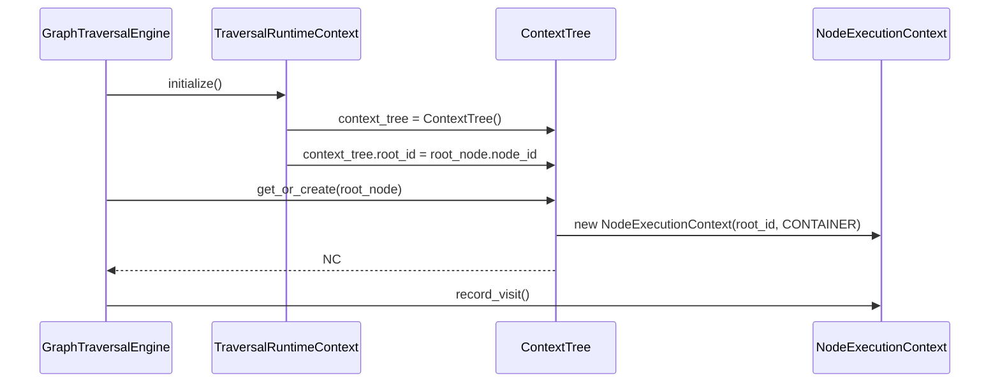

# V6.12.0 NodeExecutionContext 架构设计

> **⚠️ ARCHIVED - 2026-06-10**
>
> **归档原因**: 此文档已被 [PRD_V6_12_0_Layered_Context_Design.md](../PRD_V6_12_0_Layered_Context_Design.md) 替代
>
> **归档原因说明**:
> - 原设计采用单一 NodeExecutionContext 类（25+ 字段），存在职责分离不清的问题
> - 分层设计采用三层架构（Session/Page/Node），解决了原设计的架构问题：
>   - DYNAMIC 去重级别：原设计节点级 vs 分层设计页面级（正确语义）
>   - 滚动状态：原设计节点级独立 vs 分层设计页面级共享（正确语义）
>   - 失效元素：原设计节点级 vs 分层设计页面级（避免重复标记）
>   - 内存管理：原设计无清理 vs 分层设计 TTL 自动清理
>
> **替代方案**: 请参考 [PRD_V6_12_0_Layered_Context_Design.md](../PRD_V6_12_0_Layered_Context_Design.md)

---

> **版本**: V6.12.0
> **日期**: 2026-06-09
> **依赖**: V6.11.0
> **状态**: 已归档

---

## 1. 背景

### 1.1 当前问题

V6.11 架构重构后，GraphTraversalEngine 的组件职责更加清晰，但仍存在以下问题：

| 问题 | 描述 | 影响 |
|------|------|------|
| **节点状态分散** | 节点级别的状态（`visited_children`、滚动状态、重试次数）存储在全局的 `TraversalRuntimeContext` 中 | 封装性差，难以扩展 |
| **职责归属不清** | `_has_unvisited_children` 的判断逻辑在 `DynamicChildManager` 中，但数据在 `context.visited_children` 中 | 状态和行为分离 |
| **缺乏节点级持久化** | 无法为单个节点持久化复杂的执行状态（如滚动位置、元素失效状态） | 限制了高级功能 |
| **DYNAMIC 节点级别混淆** | DYNAMIC_MATCH 子节点生成是**页面级别**的去重（`_generated_pairs`），但访问跟踪是**节点级别**的 | 架构不一致 |

### 1.2 根本原因

**缺少节点级别的上下文抽象**。当前只有：
- 全局级别：`TraversalRuntimeContext` (Session 生命周期)
- 瞬时级别：`TraversalContext` (AI 调用时快照)

但没有**节点级别**的上下文来管理单个节点的执行生命周期。

---

## 2. 解决方案概述

### 2.1 核心方案

引入两个新的抽象：

1. **`NodeExecutionContext`** - 绑定到单个 TraversalNode，管理该节点的执行状态
2. **`ContextTree`** - 管理所有 NodeExecutionContext 的树形结构

### 2.2 架构对比

**当前架构 (V6.11)**:

```
TraversalRuntimeContext (全局)
├── visited_children: Dict[str, Set[str]]  # 所有节点的访问状态
├── page_cache: Dict[str, PageCacheInfo]
└── ... 其他全局状态

DynamicChildManager
└── has_unvisited(node, context)  # 逻辑和数据分离
```

**提案架构 (V6.12)**:

```
TraversalRuntimeContext (全局 - Session 状态)
├── context_tree: ContextTree  # 所有节点的上下文树
├── current_path: List[str]
└── ... 其他全局状态

ContextTree (新增)
└── nodes: Dict[str, NodeExecutionContext]

NodeExecutionContext (新增 - 节点级别)
├── node_id: str
├── child_queue: List[str]
├── visited_child_ids: Set[str]
├── scroll_handler: Optional[Any]
├── has_unvisited_children()  # 封装方法
└── ... 其他节点状态
```

### 2.3 预期收益

| 维度 | 当前状态 | 目标状态 |
|------|----------|----------|
| **封装性** | 节点状态散落在全局 Context 中 | 节点状态和行为封装在 NodeExecutionContext 中 |
| **职责清晰** | `_has_unvisited_children` 在 Manager 中 | `has_unvisited_children()` 是 NodeExecutionContext 的方法 |
| **可扩展性** | 难以添加节点级状态 | 每个节点可以有独立的滚动、重试、失效状态 |
| **架构一致性** | DYNAMIC 去重是页面级，访问跟踪是节点级 | 统一的节点级别管理 |

---

## 3. 架构设计

### 3.1 Context 组件层次

| 组件 | 生命周期 | 职责 | 核心字段 |
|------|----------|------|----------|
| `TraversalRuntimeContext` | 一次遍历任务 (Session) | 存储全局运行时状态，作为引擎主上下文 | `current_path`, `page_tree`, `visited_pages`, `context_tree_root` |
| `NodeExecutionContext` | 绑定到 TraversalNode，持久化在 ContextTree 中 | 管理单个节点的执行进度、子节点队列、滚动状态。提供 `has_unvisited_children()` 等决策方法。 | `child_queue`, `current_child_idx`, `visited_child_ids`, `scroll_handler` |
| `ContextTree` | 一次遍历任务 (与 Session 同生命周期) | 存储所有 NodeExecutionContext 的树形结构，提供跨节点查询。 | `nodes: Dict[str, NodeExecutionContext]` |
| `TraversalContext` | 瞬时（AI 调用时创建） | TraversalRuntimeContext 的只读快照，传递给 AI 防止修改。 | 从 TraversalRuntimeContext 拷贝的必要字段 |
| `StackFrame` | 随节点入栈/出栈 | 轻量级结构，持有当前 TraversalNode 和对应的 NodeExecutionContext 引用 | `node_id`, `span_id`, `node_context` |

### 3.2 NodeExecutionContext 设计

```python
from dataclasses import dataclass, field
from typing import Any, Dict, List, Optional, Set
from enum import Enum
import time

from src.graph.node import NodeType


class ScrollState(Enum):
    """滚动状态"""
    IDLE = "idle"           # 未滚动
    SCROLLING = "scrolling" # 正在滚动
    END_REACHED = "end_reached"  # 到达末尾
    ERROR = "error"        # 滚动出错


@dataclass
class NodeExecutionContext:
    """单个节点的执行上下文，持久化在 ContextTree 中
    
    职责:
    - 管理子节点队列和访问状态
    - 滚动状态管理
    - 节点级错误和重试跟踪
    - 提供决策方法 (has_unvisited_children 等)
    """

    # === 节点标识 ===
    node_id: str
    node_type: NodeType

    # === 子节点管理 ===
    child_queue: List[str] = field(default_factory=list)
    """待访问子节点队列（STATIC）或已生成子节点（DYNAMIC）"""
    
    visited_child_ids: Set[str] = field(default_factory=set)
    """已访问的子节点 ID 集合"""
    
    current_child_idx: int = 0
    """当前子队列索引（用于 STATIC 顺序遍历）"""

    # === 滚动状态 (DYNAMIC 节点) ===
    scroll_state: ScrollState = ScrollState.IDLE
    """当前滚动状态"""
    
    scroll_position: float = 0.0
    """当前滚动位置（0-1）"""
    
    scroll_attempts: int = 0
    """滚动尝试次数"""
    
    max_scroll_attempts: int = 5
    """最大滚动次数限制"""

    # === 页面级别元素跟踪 (DYNAMIC 节点) ===
    page_fingerprint: Optional[str] = None
    """最后一次访问的页面指纹"""
    
    page_element_cache: Dict[str, Any] = field(default_factory=dict)
    """页面元素缓存 {element_name: element_data}"""

    # === 失效元素跟踪 ===
    invalid_elements: Set[str] = field(default_factory=set)
    """已标记为无效的元素名称（点击无反应）"""

    # === 执行统计 ===
    visit_count: int = 0
    """该节点被访问的次数"""
    
    last_visit_time: Optional[float] = None
    """最后一次访问时间戳"""
    
    first_visit_time: Optional[float] = None
    """第一次访问时间戳"""

    # === 错误和重试 ===
    consecutive_errors: int = 0
    """连续错误次数"""
    
    total_errors: int = 0
    """总错误次数"""
    
    last_error: Optional[Exception] = None
    """最后一次错误"""
    
    retry_count: int = 0
    """重试次数"""

    # === 动态生成缓存 ===
    dynamic_children_generated: bool = False
    """是否已生成动态子节点"""
    
    dynamic_generation_timestamp: Optional[float] = None
    """动态子节点生成时间戳"""

    # === 元数据 ===
    meta: Dict[str, Any] = field(default_factory=dict)
    """其他节点特定的元数据"""

    # ========================================================================
    # 决策方法
    # ========================================================================

    def has_unvisited_children(self) -> bool:
        """是否有未访问的子节点
        
        Returns:
            bool: True 如果有未访问的子节点
        """
        return len(self.visited_child_ids) < len(self.child_queue)

    def get_next_unvisited_child(self) -> Optional[str]:
        """获取下一个未访问的子节点
        
        Returns:
            Optional[str]: 下一个未访问的子节点 ID，如果没有则返回 None
        """
        for child_id in self.child_queue:
            if child_id not in self.visited_child_ids:
                return child_id
        return None

    def mark_child_visited(self, child_id: str) -> None:
        """标记子节点已访问
        
        Args:
            child_id: 子节点 ID
        """
        self.visited_child_ids.add(child_id)
        self.visit_count += 1
        self.last_visit_time = time.time()
        if self.first_visit_time is None:
            self.first_visit_time = self.last_visit_time

    def is_scroll_exhausted(self) -> bool:
        """是否已滚动到末尾
        
        Returns:
            bool: True 如果已到达末尾或超过最大滚动次数
        """
        return (
            self.scroll_state == ScrollState.END_REACHED
            or self.scroll_attempts >= self.max_scroll_attempts
        )

    def should_scroll(self) -> bool:
        """是否应该继续滚动（查找更多 DYNAMIC 子节点）
        
        Returns:
            bool: True 如果应该继续滚动
        """
        return (
            self.node_type == NodeType.CONTAINER
            and not self.is_scroll_exhausted()
            and self.scroll_state != ScrollState.ERROR
        )

    def record_visit(self) -> None:
        """记录一次节点访问"""
        self.visit_count += 1
        self.last_visit_time = time.time()
        if self.first_visit_time is None:
            self.first_visit_time = self.last_visit_time

    def record_error(self, error: Exception) -> None:
        """记录一次错误
        
        Args:
            error: 错误对象
        """
        self.last_error = error
        self.consecutive_errors += 1
        self.total_errors += 1

    def clear_errors(self) -> None:
        """清除错误计数（成功后调用）"""
        self.consecutive_errors = 0
        self.last_error = None

    def mark_element_invalid(self, element_name: str) -> None:
        """标记元素为无效（点击无反应）
        
        Args:
            element_name: 元素名称
        """
        self.invalid_elements.add(element_name)

    def is_element_invalid(self, element_name: str) -> bool:
        """检查元素是否已标记为无效
        
        Args:
            element_name: 元素名称
            
        Returns:
            bool: True 如果元素已标记为无效
        """
        return element_name in self.invalid_elements

    def get_completion_rate(self) -> float:
        """获取子节点完成率
        
        Returns:
            float: 完成率 (0-1)
        """
        if not self.child_queue:
            return 1.0
        return len(self.visited_child_ids) / len(self.child_queue)

    def get_summary(self) -> Dict[str, Any]:
        """获取节点执行摘要
        
        Returns:
            Dict[str, Any]: 节点执行统计
        """
        return {
            "node_id": self.node_id,
            "node_type": self.node_type.value,
            "visit_count": self.visit_count,
            "completion_rate": self.get_completion_rate(),
            "total_children": len(self.child_queue),
            "visited_children": len(self.visited_child_ids),
            "scroll_state": self.scroll_state.value,
            "total_errors": self.total_errors,
            "consecutive_errors": self.consecutive_errors,
            "first_visit": self.first_visit_time,
            "last_visit": self.last_visit_time,
        }
```

### 3.3 ContextTree 设计

```python
from dataclasses import dataclass, field
from typing import Any, Dict, List, Optional, Set
from src.graph.node import NodeType, TraversalNode


@dataclass
class ContextTree:
    """存储所有 NodeExecutionContext 的树形结构
    
    职责:
    - 管理所有节点的执行上下文
    - 提供节点上下文的创建和获取
    - 支持树形查询（父节点、子节点、路径）
    - 序列化和反序列化（用于恢复）
    """

    nodes: Dict[str, NodeExecutionContext] = field(default_factory=dict)
    """所有节点的上下文，key 为 node_id"""
    
    root_id: Optional[str] = None
    """根节点 ID"""

    # ========================================================================
    # 节点上下文管理
    # ========================================================================

    def get_or_create(
        self, node_id: str, node_type: NodeType
    ) -> NodeExecutionContext:
        """获取或创建节点上下文
        
        Args:
            node_id: 节点 ID
            node_type: 节点类型
            
        Returns:
            NodeExecutionContext: 节点上下文
        """
        if node_id not in self.nodes:
            self.nodes[node_id] = NodeExecutionContext(
                node_id=node_id,
                node_type=node_type,
            )
        return self.nodes[node_id]

    def get(self, node_id: str) -> Optional[NodeExecutionContext]:
        """获取节点上下文（不创建）
        
        Args:
            node_id: 节点 ID
            
        Returns:
            Optional[NodeExecutionContext]: 节点上下文，不存在则返回 None
        """
        return self.nodes.get(node_id)

    def has_node(self, node_id: str) -> bool:
        """检查节点上下文是否存在
        
        Args:
            node_id: 节点 ID
            
        Returns:
            bool: True 如果存在
        """
        return node_id in self.nodes

    # ========================================================================
    # 树形查询
    # ========================================================================

    def get_children_contexts(
        self, parent_id: str
    ) -> List[NodeExecutionContext]:
        """获取子节点的所有上下文
        
        Args:
            parent_id: 父节点 ID
            
        Returns:
            List[NodeExecutionContext]: 子节点上下文列表
        """
        parent = self.nodes.get(parent_id)
        if not parent or not parent.child_queue:
            return []
        return [
            self.nodes.get(cid)
            for cid in parent.child_queue
            if cid in self.nodes
        ]

    def get_parent_context(
        self, child_id: str, node_registry: Dict[str, TraversalNode]
    ) -> Optional[NodeExecutionContext]:
        """获取父节点的上下文
        
        Args:
            child_id: 子节点 ID
            node_registry: 节点注册表
            
        Returns:
            Optional[NodeExecutionContext]: 父节点上下文
        """
        child_node = node_registry.get(child_id)
        if not child_node:
            return None
        
        # 从 node_registry 反向查找父节点
        for node in node_registry.values():
            if node.children_strategy and child_id in node.children_strategy.static_children:
                return self.nodes.get(node.node_id)
        
        return None

    def get_depth(self, node_id: str) -> int:
        """获取节点在树中的深度
        
        Args:
            node_id: 节点 ID
            
        Returns:
            int: 深度（根节点为 0）
        """
        depth = 0
        current = self.nodes.get(node_id)
        while current and current.parent_id:  # 假设 NodeExecutionContext 有 parent_id
            depth += 1
            current = self.nodes.get(current.parent_id)
        return depth

    # ========================================================================
    # 统计和查询
    # ========================================================================

    def get_total_nodes(self) -> int:
        """获取总节点数"""
        return len(self.nodes)

    def get_visited_nodes_count(self) -> int:
        """获取已访问节点数"""
        return sum(1 for ctx in self.nodes.values() if ctx.visit_count > 0)

    def get_completion_rate(self) -> float:
        """获取整体完成率
        
        Returns:
            float: 所有已访问子节点 / 所有子节点
        """
        total_children = sum(len(ctx.child_queue) for ctx in self.nodes.values())
        visited_children = sum(len(ctx.visited_child_ids) for ctx in self.nodes.values())
        
        if total_children == 0:
            return 1.0
        return visited_children / total_children

    def get_error_nodes(self) -> List[str]:
        """获取有错误的节点 ID 列表
        
        Returns:
            List[str]: 有错误的节点 ID
        """
        return [
            node_id
            for node_id, ctx in self.nodes.items()
            if ctx.consecutive_errors > 0
        ]

    def get_summary(self) -> Dict[str, Any]:
        """获取上下文树摘要
        
        Returns:
            Dict[str, Any]: 树形统计
        """
        return {
            "total_nodes": len(self.nodes),
            "visited_nodes": self.get_visited_nodes_count(),
            "completion_rate": self.get_completion_rate(),
            "error_nodes": len(self.get_error_nodes()),
            "root_id": self.root_id,
        }

    # ========================================================================
    # 序列化
    # ========================================================================

    def to_dict(self) -> Dict[str, Any]:
        """序列化为字典
        
        Returns:
            Dict[str, Any]: 可序列化的字典
        """
        return {
            "root_id": self.root_id,
            "nodes": {
                node_id: ctx.get_summary()
                for node_id, ctx in self.nodes.items()
            },
            "summary": self.get_summary(),
        }

    @classmethod
    def from_dict(
        cls, data: Dict[str, Any], node_types: Dict[str, NodeType]
    ) -> "ContextTree":
        """从字典反序列化
        
        Args:
            data: 序列化的字典数据
            node_types: 节点类型映射
            
        Returns:
            ContextTree: 反序列化的上下文树
        """
        tree = cls(root_id=data.get("root_id"))
        
        for node_id, summary in data.get("nodes", {}).items():
            node_type = node_types.get(node_id, NodeType.SCREEN)
            ctx = tree.get_or_create(node_id, node_type)
            # 恢复基本字段
            ctx.visit_count = summary.get("visit_count", 0)
            ctx.total_errors = summary.get("total_errors", 0)
            # ... 其他字段
        
        return tree
```

### 3.4 StackFrame 扩展

```python
@dataclass
class StackFrame:
    """栈帧 - 持有节点和上下文引用"""

    node_id: str
    span_id: str = ""
    node_type: str = ""

    # V6.12 新增：持有 NodeExecutionContext 引用
    node_context: Optional[NodeExecutionContext] = None

    def __eq__(self, other: object) -> bool:
        if isinstance(other, str):
            return self.node_id == other
        if isinstance(other, StackFrame):
            return self.node_id == other.node_id
        return False

    def __hash__(self) -> int:
        return hash(self.node_id)
```

### 3.5 TraversalRuntimeContext 修改

```python
@dataclass
class TraversalRuntimeContext:
    """Mutable runtime context used by the traversal engine."""

    # 现有字段保持不变...

    # V6.12 新增
    context_tree: ContextTree = field(default_factory=ContextTree)
    """所有节点的执行上下文树"""

    # === 兼容性方法（逐步废弃） ===

    @property
    def visited_children(self) -> Dict[str, Set[str]]:
        """兼容性属性：从 context_tree 提取 visited_children
        
        警告：此方法仅为向后兼容，建议直接使用 context_tree
        """
        return {
            node_id: ctx.visited_child_ids
            for node_id, ctx in self.context_tree.nodes.items()
        }
```

---

## 4. 组件交互

### 4.1 初始化流程



### 4.2 子节点访问流程

```mermaid
sequenceDiagram
    participant Orchestrator as StepOrchestrator
    participant CT as ContextTree
    parentNC as 父节点 NodeExecutionContext
    participant childNC as 子节点 NodeExecutionContext

    Orchestrator->>CT: get(current_node_id)
    CT-->>Orchestrator: parentNC
    
    Orchestrator->>parentNC: has_unvisited_children()
    parentNC-->>Orchestrator: True/False
    
    alt has unvisited
        Orchestrator->>parentNC: get_next_unvisited_child()
        parentNC-->>Orchestrator: child_id
        
        Orchestrator->>CT: get_or_create(child_id, node_type)
        CT->>childNC: new NodeExecutionContext(child_id)
        CT-->>Orchestrator: childNC
        
        Orchestrator->>parentNC: mark_child_visited(child_id)
        Orchestrator->>childNC: record_visit()
        Orchestrator->>StackFrame: push(node_id, node_context)
    end
```

### 4.3 与现有组件的集成

| 组件 | V6.11 当前 | V6.12 变化 |
|------|-----------|-----------|
| `DynamicChildManager` | `has_unvisited(node, context)` | 改为 `node_context.has_unvisited_children()` |
| `StepOrchestrator` | 从 `context.visited_children` 读取 | 从 `node_context.visited_child_ids` 读取 |
| `TraversalStateMachine` | 不涉及 | 不涉及 |
| `TraceCoordinator` | 不涉及 | 可选：记录节点级别统计 |

---

## 5. 实施计划

### 5.1 阶段划分

| 阶段 | 内容 | 验收标准 |
|------|------|----------|
| **P0: 基础结构** | 创建 `NodeExecutionContext` 和 `ContextTree` 类 | 单元测试通过 |
| **P1: RuntimeContext 集成** | 在 `TraversalRuntimeContext` 中添加 `context_tree` 字段 | 仿真测试通过 |
| **P2: DynamicChildManager 重构** | 修改使用 `node_context` 而不是 `visited_children` | 仿真测试通过 |
| **P3: StepOrchestrator 重构** | 修改使用 `node_context` 进行子节点管理 | 仿真测试通过 |
| **P4: 兼容性清理** | 移除 `visited_children` 兼容层 | 全量测试通过 |

### 5.2 任务清单

#### T1: 创建基础类 (2h)

- [ ] 创建 `src/traversal/node_execution_context.py`
  - `NodeExecutionContext` 类
  - `ScrollState` 枚举
- [ ] 创建单元测试 `tests/traversal/test_node_execution_context.py`
- [ ] 验收：`pytest tests/traversal/test_node_execution_context.py -v` 通过

#### T2: 创建 ContextTree (1.5h)

- [ ] 在 `node_execution_context.py` 中添加 `ContextTree` 类
- [ ] 创建单元测试 `tests/traversal/test_context_tree.py`
- [ ] 验收：`pytest tests/traversal/test_context_tree.py -v` 通过

#### T3: 集成到 TraversalRuntimeContext (1h)

- [ ] 在 `TraversalRuntimeContext` 中添加 `context_tree` 字段
- [ ] 添加 `visited_children` 兼容性属性
- [ ] 在 `GraphTraversalEngine.initialize()` 中初始化 root context
- [ ] 验收：仿真测试通过（89 步 COMPLETED）

#### T4: 重构 DynamicChildManager (2h)

- [ ] 修改 `has_unvisited()` 使用 `node_context`
- [ ] 修改 `get_next_unvisited_child()` 使用 `node_context`
- [ ] 移除对 `context.visited_children` 的直接访问
- [ ] 验收：仿真测试通过

#### T5: 重构 StepOrchestrator (1.5h)

- [ ] 修改子节点推入逻辑使用 `node_context`
- [ ] 修改访问跟踪使用 `node_context.mark_child_visited()`
- [ ] 添加 `node_context` 到 `StackFrame`
- [ ] 验收：仿真测试通过

#### T6: Trace 集成 (可选, 1h)

- [ ] 在 `TraceCoordinator` 中添加节点级别统计记录
- [ ] 在 `NodeExecutionContext.get_summary()` 中输出 trace
- [ ] 验收：trace 中包含节点级别数据

#### T7: 清理兼容层 (0.5h)

- [ ] 移除 `visited_children` 兼容性属性
- [ ] 更新文档
- [ ] 验收：全量测试通过

### 5.3 总工时

**总计**: 9.5 小时

---

## 6. 成功标准

### 6.1 功能验收

- ✅ 仿真测试通过（89 步 COMPLETED，19 节点，6 菜单 + 二级）
- ✅ `NodeExecutionContext` 正确管理节点状态
- ✅ `ContextTree` 正确维护树形结构
- ✅ 所有现有功能不退化

### 6.2 代码质量

- ✅ 通过 `mypy strict` 类型检查
- ✅ 通过 `ruff` linting（零警告）
- ✅ `NodeExecutionContext` 单元测试覆盖率 > 90%
- ✅ `ContextTree` 单元测试覆盖率 > 90%

### 6.3 性能

- ✅ 仿真测试执行时间不增加（±5%）
- ✅ 内存使用不显著增加

---

## 7. 风险和缓解

| 风险 | 影响 | 缓解措施 |
|------|------|----------|
| **架构复杂度增加** | 新增两个类可能增加理解成本 | 文档完善，逐步迁移 |
| **仿真测试失败** | 重构可能破坏现有行为 | 每个阶段后运行仿真测试 |
| **性能退化** | 额外的对象创建可能影响性能 | 使用对象池，避免重复创建 |
| **向后兼容性** | 其他模块可能依赖 `visited_children` | 保留兼容层，逐步清理 |

---

## 8. 未来扩展

基于 `NodeExecutionContext` 的未来功能：

1. **智能滚动策略**：根据 `scroll_state` 和错误率调整滚动行为
2. **节点级重试策略**：每个节点可以有独立的重试配置
3. **节点级超时**：不同节点类型使用不同超时
4. **节点优先级**：根据完成率和错误率动态调整遍历顺序
5. **节点状态恢复**：序列化 `ContextTree` 支持断点恢复

---

## 9. 修订记录

| 日期 | 版本 | 内容 |
|------|------|------|
| 2026-06-09 | 1.0 | 初始设计 |

---

**文档所有者**: Uni-Claw 开发团队
**状态**: 设计阶段
**相关文档**: 
- [graph-engine-design.md](../architecture/modules/graph-engine-design.md)
- [traversal-design.md](../architecture/modules/traversal-design.md)
