# Module-Test 和 Validation-Documentation 技能修改方案

**版本**: 1.0  
**创建**: 2026-06-05  
**核心**: 修改两个技能使用统一的数据格式和工作流

---

## 🎯 核心修改策略

### 当前问题
- **module-test**: 直接运行pytest，结果不标准化
- **validation-documentation**: 需要重新运行测试或手动输入数据

### 修改目标  
- **module-test**: 运行测试 → 输出统一JSON → 保存到 `test_results/`
- **validation-documentation**: 读取 `test_results/*.json` → 生成validation报告

---

## 📋 修改方案

### 1. Module-Test 技能修改

#### 新增能力

```python
# .claude/skills/module-test/SKILL.md (修改后)

当用户要求运行测试时，使用此技能。

## 核心原则

1. **运行测试** - 使用TestResultExporter运行pytest
2. **输出标准化** - 生成统一的JSON格式
3. **保存到统一路径** - 保存到 test_results/{module}_module.json
4. **提供分析** - 分析测试失败并提供建议

## 标准工作流程

1. **识别测试范围**
   - 用户指定模块名称
   - 自动检测测试路径
   - 分析模块依赖关系

2. **运行测试**
   - 使用 scripts/test_result_exporter.py
   - 运行 pytest tests/{module}/
   - 解析输出为统一格式

3. **保存结果**
   - 生成标准化JSON
   - 保存到 test_results/{module}_module.json
   - 显示结果摘要

4. **分析失败**
   - 如有失败，分析失败原因
   - 提供修复建议
   - 可触发重新测试

## 输出格式

生成的JSON文件必须遵循统一格式：

```json
{
  "module": "simulation",
  "timestamp": "2026-06-05T10:30:42Z",
  "format_version": "1.0",
  "summary": {
    "total": 33,
    "passed": 33,
    "failed": 0,
    "pass_rate": 100.0
  },
  "tests": [...]
}
```

## 命令示例

用户输入：
```
运行 simulation 模块的测试
```

技能执行：
1. 调用：python scripts/test_result_exporter.py simulation tests/v6/test_simulation.py
2. 输出：test_results/simulation_module.json
3. 显示：通过率统计和失败分析
```

#### 技能实现逻辑

```python
# module-test 技能的核心逻辑

def run_module_test(module_name: str):
    """运行模块测试并生成统一JSON"""
    
    # 1. 导入统一的测试导出器
    from scripts.test_result_exporter import TestResultExporter
    
    # 2. 创建导出器
    exporter = TestResultExporter(module_name)
    
    # 3. 检测测试路径
    test_paths = detect_test_paths(module_name)
    
    # 4. 运行测试并导出
    result = exporter.run_and_export(test_paths)
    
    # 5. 分析结果
    if result['summary']['failed'] > 0:
        analyze_failures(result)
        provide_fix_suggestions(result)
    
    # 6. 显示摘要
    display_summary(result)
    
    return result

def detect_test_paths(module_name: str) -> List[str]:
    """检测模块的测试路径"""
    possible_paths = [
        f"tests/{module_name}/",
        f"tests/v6/test_{module_name}.py",
        f"src/{module_name}/test/",
        f"tests/integration/test_{module_name}_*.py"
    ]
    
    found_paths = []
    for path_pattern in possible_paths:
        matching_files = glob.glob(path_pattern)
        found_paths.extend(matching_files)
    
    return found_paths if found_paths else [f"tests/{module_name}/"]

def analyze_failures(result: Dict) -> List[str]:
    """分析测试失败原因"""
    failures = [
        test for test in result['tests'] 
        if test['outcome'] in ['FAILED', 'ERROR']
    ]
    
    analysis = []
    for failure in failures:
        cause = diagnose_failure_cause(failure)
        solution = suggest_solution(cause)
        analysis.append({
            'test': failure['test'],
            'cause': cause,
            'solution': solution
        })
    
    return analysis
```

---

### 2. Validation-Documentation 技能修改

#### 新增能力

```markdown
# .claude/skills/validation-documentation/SKILL.md (修改后)

当用户需要生成validation报告时，使用此技能。

## 核心原则

1. **读取统一数据** - 从 test_results/ 目录读取标准JSON
2. **汇总分析** - 合并所有模块的测试结果
3. **生成标准化报告** - 使用统一模板生成markdown
4. **保存到validation** - 输出到 docs/validation/

## 标准工作流程

1. **检查数据源**
   - 扫描 test_results/ 目录
   - 验证JSON格式正确性
   - 收集所有模块结果

2. **数据汇总**
   - 计算整体统计
   - 按模块分类结果
   - 识别失败和问题

3. **报告生成**
   - 生成 unit_test_status.md
   - 生成 integration_test_status.md (如有)
   - 生成 comprehensive_status.md

4. **质量检查**
   - 验证报告格式
   - 检查命名标准
   - 确保Git追踪

## 数据源格式

从 test_results/ 读取统一格式的JSON：

```
test_results/
├── ai_module.json          # AI模块结果
├── simulation_module.json   # 仿真模块结果
├── state_machine_module.json # 状态机结果
└── integration.json        # 集成测试结果
```

## 输出报告

生成标准化的validation文档：

- docs/validation/unit_test_status.md
- docs/validation/integration_test_status.md  
- docs/validation/comprehensive_status.md

## 命令示例

用户输入：
```
生成validation报告
```

技能执行：
1. 读取：test_results/*.json
2. 汇总：计算整体统计
3. 生成：docs/validation/unit_test_status.md
4. 显示：报告摘要和路径
```

#### 技能实现逻辑

```python
# validation-documentation 技能的核心逻辑

def generate_validation_reports():
    """从统一数据源生成validation报告"""
    
    # 1. 导入收集器
    from scripts.collect_test_results import ValidationResultCollector
    
    # 2. 创建收集器
    collector = ValidationResultCollector()
    
    # 3. 收集所有模块结果
    collection_result = collector.collect_all_results()
    
    # 4. 检查数据完整性
    if collection_result['summary']['modules_tested'] == 0:
        print("⚠️  未找到测试结果，请先运行模块测试")
        return
    
    # 5. 显示收集摘要
    display_collection_summary(collection_result)
    
    # 6. 验证报告质量
    validate_report_quality(collection_result)
    
    # 7. 返回报告路径
    report_paths = [
        "docs/validation/unit_test_status.md",
        "docs/validation/integration_test_status.md",
        "docs/validation/comprehensive_status.md"
    ]
    
    return report_paths

def display_collection_summary(collection_result: Dict):
    """显示收集结果摘要"""
    summary = collection_result['summary']
    
    print("📊 测试结果收集汇总")
    print("=" * 70)
    print(f"模块测试: {summary['modules_passed']}/{summary['modules_tested']} 通过")
    print(f"测试用例: {summary['total_passed']}/{summary['total_tests']} 通过")
    print(f"整体通过率: {summary['overall_pass_rate']:.1f}%")
    
    if summary['total_failed'] > 0:
        print(f"\n⚠️  发现 {summary['total_failed']} 个失败测试")
        print("详情请查看 validation 报告")

def validate_report_quality(collection_result: Dict):
    """验证报告质量"""
    # 检查是否有充分的数据
    if collection_result['summary']['modules_tested'] < 3:
        print("⚠️  测试模块较少，建议运行更多模块测试")
    
    # 检查是否有失败需要关注
    if collection_result['summary']['total_failed'] > 0:
        failed_modules = [
            name for name, data in collection_result['modules'].items()
            if data['summary']['failed'] > 0
        ]
        print(f"⚠️  以下模块有失败: {', '.join(failed_modules)}")
    
    # 检查数据新鲜度
    from datetime import datetime, timedelta
    cutoff_time = datetime.now() - timedelta(hours=24)
    
    stale_modules = []
    for name, data in collection_result['modules'].items():
        test_time = datetime.fromisoformat(data['timestamp'])
        if test_time < cutoff_time:
            stale_modules.append(name)
    
    if stale_modules:
        print(f"⚠️  以下模块测试结果超过24小时: {', '.join(stale_modules)}")
```

---

## 🔄 完整工作流程

### 用户场景1: 运行模块测试

```
用户: 运行 simulation 模块的测试

Claude: [使用 module-test 技能]
1. 调用 scripts/test_result_exporter.py simulation
2. 运行 pytest tests/v6/test_simulation.py
3. 生成 test_results/simulation_module.json
4. 分析结果并显示摘要

输出:
✅ 测试结果已保存: test_results/simulation_module.json
📊 通过率: 100.0% (33/33)
```

### 用户场景2: 生成validation报告

```
用户: 生成validation报告

Claude: [使用 validation-documentation 技能]
1. 读取 test_results/*.json
2. 汇总所有模块结果
3. 生成 docs/validation/unit_test_status.md
4. 生成 docs/validation/integration_test_status.md

输出:
📋 找到 5 个模块结果文件
  ✅ ai: 45/45 通过
  ✅ simulation: 33/33 通过
  ✅ state_machine: 20/20 通过
✅ Validation报告生成完成
  📄 docs/validation/unit_test_status.md
  📄 docs/validation/integration_test_status.md
```

### 用户场景3: OpenSpec集成

```bash
# 在OpenSpec工作流中
/opsx:apply v6-enhancement

# 自动执行：
1. TestGuardian检测变更模块
2. 调用 module-test 技能运行相关模块测试
3. 生成 test_results/{module}_module.json
4. 调用 validation-documentation 技能生成报告
5. 自动更新 docs/validation/ 目录
```

---

## 🔧 具体文件修改

### 1. 创建统一脚本

```bash
# 创建统一测试导出器
scripts/test_result_exporter.py

# 创建统一结果收集器  
scripts/collect_test_results.py

# 创建结果目录
mkdir test_results/
echo "# Test Results Directory" > test_results/README.md
touch test_results/.gitkeep
```

### 2. 修改技能文件

```bash
# 修改 module-test 技能
.claude/skills/module-test/SKILL.md

# 修改 validation-documentation 技能
.claude/skills/validation-documentation/SKILL.md
```

### 3. 更新Git配置

```bash
# .gitignore
test_results/*.json
!test_results/.gitkeep
!test_results/README.md
```

---

## 📊 数据流向

```mermaid
graph LR
    A[用户: 运行测试] --> B[module-test技能]
    B --> C[test_result_exporter.py]
    C --> D[pytest执行]
    D --> E[统一JSON格式]
    E --> F[test_results/xxx_module.json]
    
    F --> G[用户: 生成validation]
    G --> H[validation-documentation技能]
    H --> I[collect_test_results.py]
    I --> F
    I --> J[汇总分析]
    J --> K[markdown报告]
    K --> L[docs/validation/xxx.md]
    
    style A fill:#e1f5ff
    style B fill:#90ee90
    style C fill:#90ee90
    style F fill:#ffd1dc
    style H fill:#e8f5e8
    style I fill:#e8f5e8
    style L fill:#e8f5e8
```



---

## 🎯 实施优先级

### 阶段1: 核心脚本（高优先级）
1. ✅ 创建 `scripts/test_result_exporter.py`
2. ✅ 创建 `scripts/collect_test_results.py`
3. ✅ 定义统一JSON格式

### 阶段2: 技能修改（高优先级）
4. ✅ 修改 `module-test` 技能使用统一导出器
5. ✅ 修改 `validation-documentation` 技能使用统一收集器

### 阶段3: 集成测试（中优先级）
6. 🔧 测试完整工作流程
7. 🔧 OpenSpec工作流集成
8. 🔧 验证报告质量

### 阶段4: 优化和文档（低优先级）
9. 📝 更新技能文档
10. 📝 创建使用指南
11. 📝 添加故障排除指南

---

## 🔍 关键优势

### 1. 数据标准化
- 所有测试结果使用统一JSON格式
- 便于程序处理和分析
- 支持历史数据比较

### 2. 职责分离
- **module-test**: 专注于测试执行和失败分析
- **validation-documentation**: 专注于报告生成和文档标准化

### 3. 可扩展性
- 新模块只需遵循输出格式
- 支持多种测试框架
- 便于添加新的分析维度

### 4. 可维护性
- 统一的数据格式减少维护成本
- 清晰的职责边界
- 便于调试和问题定位

---

## 📋 质量保证

### JSON格式验证

```python
def validate_json_format(json_file: Path) -> bool:
    """验证JSON格式符合标准"""
    with open(json_file) as f:
        data = json.load(f)
    
    # 检查必需字段
    required_fields = ['module', 'timestamp', 'format_version', 'summary', 'tests']
    for field in required_fields:
        if field not in data:
            return False
    
    # 检查summary结构
    summary = data['summary']
    required_summary_fields = ['total', 'passed', 'failed', 'skipped']
    for field in required_summary_fields:
        if field not in summary:
            return False
    
    # 检查格式版本
    if data['format_version'] != '1.0':
        return False
    
    return True
```

### 报告质量检查

```python
def validate_report_quality(report_path: Path) -> List[str]:
    """验证生成的报告质量"""
    issues = []
    
    content = report_path.read_text()
    
    # 检查必需章节
    required_sections = ['# Executive Summary', '## Detailed Results', '## Module List']
    for section in required_sections:
        if section not in content:
            issues.append(f"缺少章节: {section}")
    
    # 检查数据一致性
    if 'Total Tests:' not in content:
        issues.append("缺少测试总数统计")
    
    # 检查格式标准
    if '**Generated**:' not in content:
        issues.append("缺少生成时间戳")
    
    return issues
```

---

**版本**: 1.0  
**最后更新**: 2026-06-05  
**状态**: 🎯 技能修改方案确定