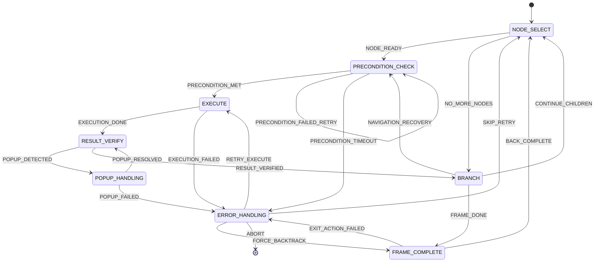
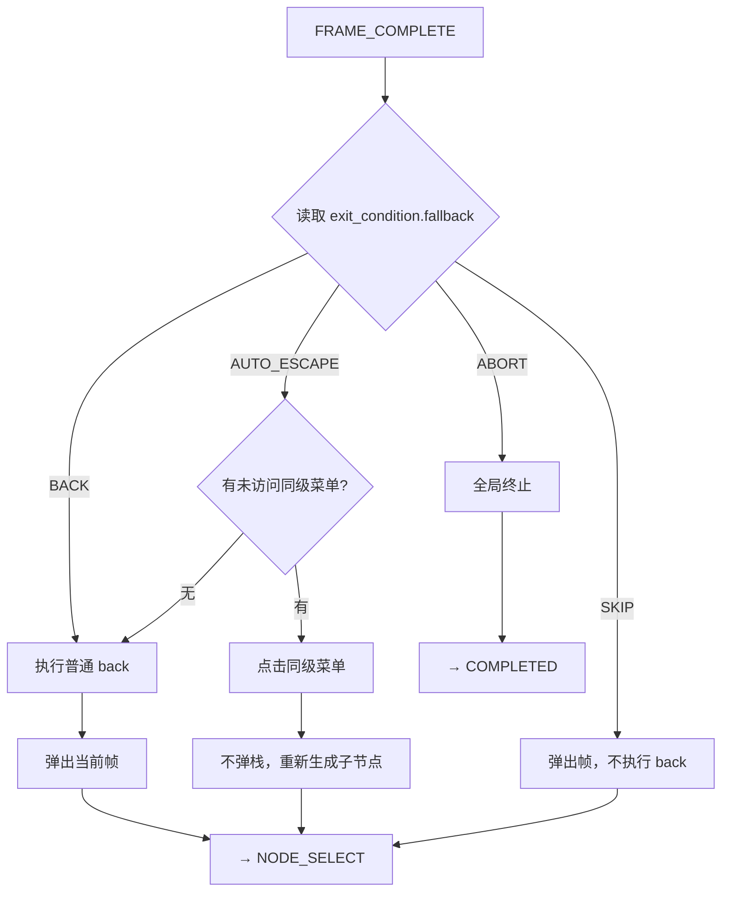
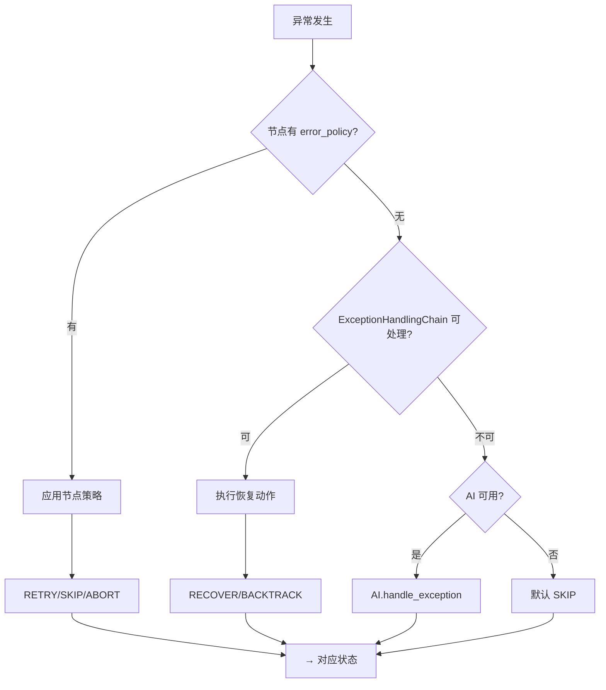
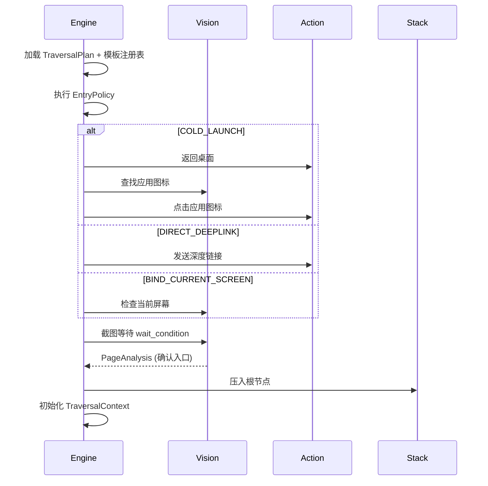
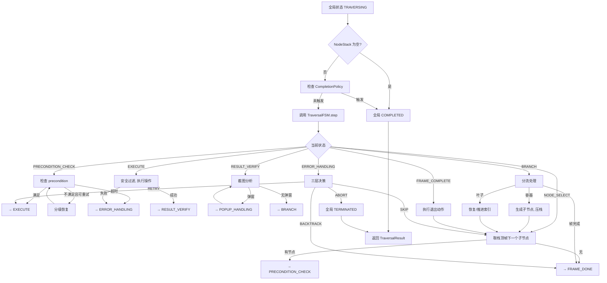
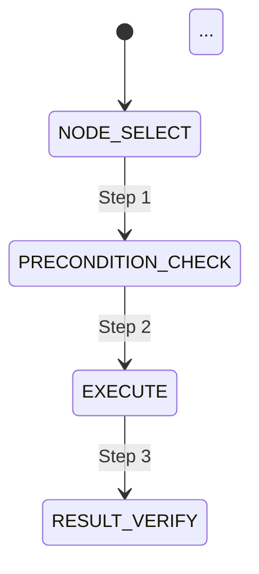

# V6: Executor, State Machine & Simulator PRD

> **文档版本**: V6.0
> **基于版本**: V4.0 PRD (执行器与状态机补全 + 仿真模拟器)
> **创建日期**: 2026-06-02
> **状态**: 设计阶段
> **优先级**: 最高优先级 PRD

---

## 文档说明

本文档定义 V6 的完整设计，包括：
1. **图模型补全** - 新增退出条件、完成策略、遍历计划等模型
2. **状态机扩展** - 新增帧完成、异常处理、弹窗处理状态
3. **执行器设计** - 完整的图遍历执行引擎
4. **仿真模拟器** - 无需真实设备的测试与验证工具
5. **可验证示例** - 三个端到端验证场景

---

# 1. 产品概述

## 1.1 背景与动机

V5.x 系列专注于 AI 集成和视觉管道优化，但核心遍历控制逻辑仍然依赖传统状态机。V6 的目标是：

| 问题 | 描述 | 解决方案 |
|------|------|----------|
| **控制逻辑分散** | 状态机、执行引擎、异常处理耦合紧密 | 统一的状态机 + 清晰的执行器 |
| **测试困难** | 必须连接真实设备才能测试遍历逻辑 | 仿真模拟器支持离线测试 |
| **可视化缺失** | 遍历过程不透明，难以调试 | 多格式可视化输出 + 详细 Trace |
| **计划不完整** | 缺少完成策略、退出条件等高级控制 | TraversalPlan 模型 |

## 1.2 设计目标

1. **完整的图模型** - 支持声明式遍历计划定义
2. **清晰的状态机** - 所有执行状态和转换路径明确
3. **强大的执行器** - 集成缓存、安全过滤、Trace 记录
4. **仿真测试** - Mock 组件支持完整的离线验证
5. **可视化友好** - ASCII、文件、实时、HTML 多种输出格式

## 1.3 预期收益

| 指标 | 当前 | 目标 | 改善 |
|------|------|------|------|
| 代码可测试性 | 30% | 90% | +200% |
| 调试效率 | 1x | 3x | +200% |
| 遍历可观测性 | 基础 | 详细 Trace | 全覆盖 |
| 离线测试覆盖率 | 0% | 80%+ | 新能力 |

---

# 2. 整体架构

## 2.1 架构图

```
┌─────────────────────────────────────────────────────────────┐
│                    V6 Architecture                          │
├─────────────────────────────────────────────────────────────┤
│                                                               │
│  ┌─────────────────┐      ┌─────────────────┐              │
│  │  GraphTraversal  │      │  SimulationRunner│              │
│  │     Engine       │◄────►│    (Testing)     │              │
│  └────────┬─────────┘      └─────────────────┘              │
│           │                                                      │
│           ▼                                                      │
│  ┌─────────────────────────────────────────┐                   │
│  │     TraversalStateMachine               │                   │
│  │  (NODE_SELECT → EXECUTE → BRANCH)      │                   │
│  │  + FRAME_COMPLETE + ERROR_HANDLING     │                   │
│  └─────────────────────────────────────────┘                   │
│           │                                                      │
│           ▼                                                      │
│  ┌─────────────────────────────────────────┐                   │
│  │     NodeStack + TraversalContext         │                   │
│  └─────────────────────────────────────────┘                   │
│           │                                                      │
│           ▼                                                      │
│  ┌─────────────────────────────────────────┐                   │
│  │     Graph Models (TraversalPlan)         │                   │
│  └─────────────────────────────────────────┘                   │
│           │                                                      │
│           ▼                                                      │
│  ┌─────────────────┐      ┌─────────────────┐                   │
│  │  VisionService  │      │ ActionExecutor  │                   │
│  │  (Real/Mock)    │      │  (Real/Mock)     │                   │
│  └─────────────────┘      └─────────────────┘                   │
│                                                               │
└─────────────────────────────────────────────────────────────┘
```

## 2.2 组件职责

| 组件 | 职责 | 接口 |
|------|------|------|
| **GraphTraversalEngine** | 执行遍历计划 | `run(plan) -> TraversalResult` |
| **TraversalStateMachine** | 管理执行状态 | `step() -> StateTransition` |
| **SimulationRunner** | 仿真测试 | `run() -> SimulationResult` |
| **MockVisionService** | 虚拟视觉分析 | `analyze() -> PageAnalysis` |
| **MockActionExecutor** | 虚拟操作执行 | `execute() -> ActionResult` |

## 2.3 文件组织

```
src/
├── graph/
│   ├── node.py          # 图模型 (扩展)
│   ├── plan.py          # TraversalPlan (新增)
│   ├── template.py      # 模板注册表 (现有)
│   └── matcher.py       # 动态匹配器 (现有)
├── state_machine/
│   ├── traversal_fsm.py # 遍历状态机 (扩展)
│   ├── global_fsm.py    # 全局状态机 (现有)
│   ├── node_stack.py    # 节点栈 (现有)
│   └── interaction.py   # 交互 (现有)
├── traversal/
│   ├── traversal_engine.py    # 现有引擎 (保留)
│   └── graph_engine.py        # 图遍历引擎 (新增)
├── simulation/
│   ├── runner.py        # SimulationRunner (新增)
│   ├── mock_vision.py   # MockVisionService (新增)
│   ├── mock_action.py   # MockActionExecutor (新增)
│   └── visualizer.py    # 可视化输出 (新增)
└── trace/
    ├── recorder.py      # Trace 记录器 (扩展)
    └── exporter.py      # 导出格式 (新增)
```

---

# 3. 图模型设计

## 3.1 新增枚举类型

### 3.1.1 ExitConditionType

容器节点退出触发条件。

```python
class ExitConditionType(str, Enum):
    """容器节点退出条件类型。"""
    ALL_CHILDREN_VISITED = "all_children_visited"  # 等待所有子节点处理完成
    DEPTH_LIMITED = "depth_limited"                # 达到最大深度时退出
    SINGLE_LEVEL = "single_level"                  # 仅处理直接子节点，不递归
```

### 3.1.2 FallbackAction

退出容器时执行的动作。

```python
class FallbackAction(str, Enum):
    """退出容器的回退动作。"""
    BACK = "back"                  # 按 Back 键，弹出当前帧
    AUTO_ESCAPE = "auto_escape"    # 尝试点击同级菜单，无同级则 Back
    SKIP = "skip"                  # 跳过，不执行 Back，直接弹栈
    ABORT = "abort"                # 终止整个遍历
```

### 3.1.3 CompletionPolicyType

全局遍历终止条件。

```python
class CompletionPolicyType(str, Enum):
    """全局完成策略类型。"""
    NONE = "none"                  # 运行到自然完成
    TARGET_FOUND = "target_found"  # 找到目标后终止
    TIMEOUT = "timeout"            # 超时后终止
    MAX_STEPS = "max_steps"        # 达到最大步数后终止
```

### 3.1.4 TargetFoundAction

找到目标后的行为。

```python
class TargetFoundAction(str, Enum):
    """找到目标后的动作。"""
    MARK_AND_STOP = "mark_and_stop"        # 标记目标，立即终止
    EXECUTE_THEN_STOP = "execute_then_stop"  # 执行操作后终止
```

### 3.1.5 MatchMode

目标文本匹配模式。

```python
class MatchMode(str, Enum):
    """文本匹配模式。"""
    EXACT = "exact"          # 精确匹配
    CONTAINS = "contains"    # 包含匹配
```

### 3.1.6 EntryStrategy

进入应用的方式。

```python
class EntryStrategy(str, Enum):
    """应用入口策略。"""
    COLD_LAUNCH = "cold_launch"              # 从桌面找到并点击应用图标
    DIRECT_DEEPLINK = "direct_deeplink"      # 使用 adb/am start 通过 Intent 启动
    BIND_CURRENT_SCREEN = "bind_current_screen"  # 假设已在目标屏幕
```

### 3.1.7 TraversalMode

遍历执行模式。

```python
class TraversalMode(str, Enum):
    """遍历模式。"""
    HYBRID = "hybrid"      # 混合模式：静态 + 动态
    CONCRETE = "concrete"  # 具体模式：仅预定义静态路径
    ABSTRACT = "abstract"  # 抽象模式：完全动态生成
```

## 3.2 新增数据类

### 3.2.1 ExitCondition

定义容器节点如何退出。

```python
@dataclass
class ExitCondition:
    """容器节点的退出条件。"""
    type: ExitConditionType
    fallback: FallbackAction = FallbackAction.BACK
    max_depth: Optional[int] = None  # DEPTH_LIMITED 时的深度限制
```

### 3.2.2 CompletionPolicy

全局遍历终止策略。

```python
@dataclass
class CompletionPolicy:
    """全局完成策略。"""
    type: CompletionPolicyType = CompletionPolicyType.NONE
    target_name: Optional[str] = None        # TARGET_FOUND 时的目标名称
    match_mode: MatchMode = MatchMode.CONTAINS
    action_on_found: TargetFoundAction = TargetFoundAction.MARK_AND_STOP
    timeout_seconds: Optional[float] = None  # TIMEOUT 时的超时时间
    max_steps: Optional[int] = None            # MAX_STEPS 时的最大步数
```

### 3.2.3 EntryPolicy

如何进入目标应用。

```python
@dataclass
class EntryPolicy:
    """应用入口策略。"""
    strategy: EntryStrategy = EntryStrategy.COLD_LAUNCH
    fallback: Optional[str] = None                      # 失败时的回退入口
    wait_condition: Optional[Dict[str, Any]] = None     # 进入后期望的屏幕状态
    timeout_seconds: float = 10.0
```

### 3.2.4 IntentSlots

AI 从自然语言提取的意图槽位。

```python
@dataclass
class IntentSlots:
    """AI 提取的意图槽位。"""
    target_app: Optional[str] = None    # 目标应用名称
    scope: Optional[str] = None         # "full", "partial", "target_only"
    target: Optional[str] = None       # 具体目标（如"版本号"）
    depth: Optional[int] = None         # 最大遍历深度
    element_handling: Optional[str] = None  # 元素处理策略
    navigation: Optional[str] = None    # 导航策略
    restore: Optional[bool] = None      # 是否恢复状态
    completion: Optional[str] = None   # 完成标准
```

### 3.2.5 TraversalPlan

顶层遍历计划容器。

```python
@dataclass
class TraversalPlan:
    """遍历计划顶层容器。"""
    entry_app: str                              # 目标应用名称
    entry_policy: EntryPolicy = field(default_factory=EntryPolicy)
    root_node: Optional[TraversalNode] = None   # 根遍历节点
    static_nodes: Dict[str, TraversalNode] = field(default_factory=dict)  # 静态节点注册表
    template_registry: Optional[str] = None     # 模板注册表 JSON 路径
    mode: TraversalMode = TraversalMode.HYBRID
    completion_policy: CompletionPolicy = field(default_factory=CompletionPolicy)
    intent_slots: Optional[IntentSlots] = None  # AI 提取的意图
    meta: Dict[str, Any] = field(default_factory=dict)  # 元数据
```

## 3.3 现有模型扩展

### 3.3.1 TraversalNode 扩展

为现有 `TraversalNode` 添加 `exit_condition` 字段：

```python
@dataclass
class TraversalNode:
    """扩展后的遍历节点。"""
    # ... 现有字段 ...
    exit_condition: Optional[ExitCondition] = None  # 容器退出行为
```

### 3.3.2 ErrorPolicy 对齐

现有 `ErrorPolicy.on_error` 值与 PRD `ErrorFallbackAction` 对齐：

```python
# 现有: "retry", "skip", "abort", "fallback"
# PRD: RETRY, SKIP, BACKTRACK, ABORT
# 新增 BACKTRACK 作为 on_error 的有效值
```

---

# 4. 状态机设计

## 4.1 状态定义

扩展 `TraversalState` 枚举：

```python
class TraversalState(str, Enum):
    """V6 遍历状态。"""
    # 现有状态
    NODE_SELECT = "node_select"                # 选择下一个节点
    PRECONDITION_CHECK = "precondition_check"  # 验证前置条件
    EXECUTE = "execute"                       # 执行节点操作
    RESULT_VERIFY = "result_verify"           # 验证执行结果
    BRANCH = "branch"                         # 决策下一步

    # V6 新增状态
    FRAME_COMPLETE = "frame_complete"        # 容器退出处理
    ERROR_HANDLING = "error_handling"        # 统一异常处理
    POPUP_HANDLING = "popup_handling"        # 弹窗处理子状态
```

## 4.2 状态转移图



## 4.3 状态转移表

| 当前状态 | 事件/条件 | 目标状态 |
|---------|-----------|---------|
| NODE_SELECT | 节点就绪 | PRECONDITION_CHECK |
| NODE_SELECT | 无更多节点 | BRANCH |
| PRECONDITION_CHECK | 条件满足 | EXECUTE |
| PRECONDITION_CHECK | 条件不满足（可重试） | PRECONDITION_CHECK |
| PRECONDITION_CHECK | 条件超时 | ERROR_HANDLING |
| EXECUTE | 执行完成 | RESULT_VERIFY |
| EXECUTE | 执行失败 | ERROR_HANDLING |
| RESULT_VERIFY | 检测到弹窗 | POPUP_HANDLING |
| RESULT_VERIFY | 验证通过 | BRANCH |
| POPUP_HANDLING | 弹窗已解决 | RESULT_VERIFY |
| POPUP_HANDLING | 弹窗处理失败 | ERROR_HANDLING |
| BRANCH | 继续处理子节点 | NODE_SELECT |
| BRANCH | 当前帧完成 | FRAME_COMPLETE |
| BRANCH | 需要导航恢复 | PRECONDITION_CHECK |
| FRAME_COMPLETE | 返回成功 | NODE_SELECT |
| FRAME_COMPLETE | 返回失败 | ERROR_HANDLING |
| ERROR_HANDLING | 跳过/重试 | NODE_SELECT |
| ERROR_HANDLING | 强制回溯 | FRAME_COMPLETE |
| ERROR_HANDLING | 重试执行 | EXECUTE |
| ERROR_HANDLING | 终止 | [*] |

## 4.4 FRAME_COMPLETE 详细逻辑



### FRAME_COMPLETE 实现

```python
def handle_frame_complete(self) -> TraversalState:
    """处理容器帧完成。"""
    exit_condition = self.current_node.exit_condition
    if not exit_condition:
        # 默认行为：BACK
        return self._execute_back_and_pop()

    fallback = exit_condition.fallback

    if fallback == FallbackAction.BACK:
        return self._execute_back_and_pop()

    elif fallback == FallbackAction.AUTO_ESCAPE:
        # 尝试点击同级菜单
        if sibling := self._find_unvisited_sibling():
            self._tap_and_wait(sibling.coordinate)
            # 不弹栈，重新生成子节点
            return TraversalState.NODE_SELECT
        else:
            return self._execute_back_and_pop()

    elif fallback == FallbackAction.SKIP:
        # 直接弹栈，不执行 back
        self.node_stack.pop()
        return TraversalState.NODE_SELECT

    elif fallback == FallbackAction.ABORT:
        # 全局终止
        return TraversalState.COMPLETED

    return TraversalState.ERROR_HANDLING
```

## 4.5 ERROR_HANDLING 三层兜底



### ERROR_HANDLING 实现

```python
def handle_error(self, error: Exception) -> TraversalState:
    """三层兜底异常处理。"""
    # 第一层：节点 error_policy
    if self.current_node.error_policy:
        result = self._apply_node_error_policy(error)
        return self._map_policy_result_to_state(result)

    # 第二层：ExceptionHandlingChain
    if self.exception_chain:
        exc_context = ExceptionContext(
            exception=error,
            state=self.context,
            node=self.current_node,
        )
        result = self.exception_chain.handle(exc_context)
        return self._map_chain_result_to_state(result)

    # 第三层：AIProvider.handle_exception (未来)
    if self.ai_provider:
        decision = self.ai_provider.handle_exception(error, self.context)
        return self._map_ai_result_to_state(decision)

    # 默认：SKIP → NODE_SELECT
    logger.warning(f"No error handler, skipping: {error}")
    return TraversalState.NODE_SELECT
```

## 4.6 POPUP_HANDLING 子状态

```mermaid
flowchart TD
    A[POPUP_HANDLING] --> B{找到"取消"/"关闭"?}
    B -->|有| C[点击按钮]
    B -->|无| D[尝试 back]

    C --> E[等待 0.5s]
    D --> E

    E --> F{弹窗仍存在?}
    F -->|是| G[调用 AI 决策]
    F -->|否| H[→ RESULT_VERIFY]

    G --> I{AI 有方案?}
    I -->|有| C
    I -->|无| J[→ ERROR_HANDLING]
```

### POPUP_HANDLING 实现

```python
def handle_popup(self) -> TraversalState:
    """处理检测到的弹窗。"""
    # 优先级 1：查找"取消"/"关闭"按钮
    if cancel_btn := self._find_cancel_button():
        self._tap_and_wait(cancel_btn.coordinate)
        return TraversalState.RESULT_VERIFY  # 重新验证

    # 优先级 2：尝试 back 按钮
    self.adb.press_back()
    self._wait()

    # 重新截图验证
    if self._is_popup_present():
        # 优先级 3：AI 决策
        if self.ai_provider:
            action = self.ai_provider.resolve_popup(self.current_screen)
            if action:
                return self._execute_ai_action(action)
        return TraversalState.ERROR_HANDLING

    return TraversalState.RESULT_VERIFY
```

---

# 5. 执行器设计

## 5.1 初始化流程



### GraphTraversalEngine 初始化

```python
class GraphTraversalEngine:
    """图遍历执行引擎。"""

    def __init__(
        self,
        plan: TraversalPlan,
        vision_service: VisionService,
        action_executor: ActionExecutor,
        exception_chain: Optional[ExceptionHandlingChain] = None,
        trace_recorder: Optional[TraceRecorder] = None,
    ):
        """初始化执行引擎。"""
        self.plan = plan
        self.vision = vision_service
        self.action = action_executor
        self.exception_chain = exception_chain
        self.trace_recorder = trace_recorder

        # 初始化组件
        self.state_machine = TraversalStateMachine()
        self.node_stack = NodeStack(max_depth=plan.meta.get("max_depth", 10))
        self.context = TraversalContext()

        # 加载模板
        if plan.template_registry:
            self.template_registry = TemplateRegistry.load(plan.template_registry)
            self.matcher = DynamicMatcher(self.template_registry)

    def initialize(self) -> bool:
        """执行初始化流程。"""
        # 1. 执行入口策略
        if not self._execute_entry_policy():
            return False

        # 2. 等待入口条件
        if not self._wait_for_entry_condition():
            return False

        # 3. 压入根节点
        if self.plan.root_node:
            self.node_stack.push(self.plan.root_node)

        # 4. 初始化 Trace
        if self.trace_recorder:
            self.trace_recorder.start_traversal(self.plan)

        return True
```

## 5.2 主循环流程



### 主循环实现

```python
def run(self) -> TraversalResult:
    """执行完整遍历。"""
    # 初始化
    if not self.initialize():
        return TraversalResult(status="failed", reason="initialization_failed")

    self.context.global_state = GlobalState.TRAVERSING
    start_time = time.time()

    # 主循环
    while self.context.global_state == GlobalState.TRAVERSING:
        # 检查栈
        if self.node_stack.is_empty():
            self.context.global_state = GlobalState.COMPLETED
            break

        # 检查完成策略
        if self._check_completion_policy():
            self.context.global_state = GlobalState.COMPLETED
            break

        # 执行状态机一步
        transition = self.state_machine.step(
            stack=self.node_stack,
            context=self.context,
            vision=self.vision,
            action=self.action,
        )

        # 记录 Trace
        if self.trace_recorder:
            self.trace_recorder.record_transition(transition)

    # 完成
    elapsed = time.time() - start_time
    return TraversalResult(
        status=self.context.global_state.value,
        elapsed_seconds=elapsed,
        total_steps=self.context.step_count,
        visited_nodes=list(self.context.visited_nodes),
        trace=self.trace_recorder.get_trace() if self.trace_recorder else None,
    )
```

## 5.3 深度限制与缓存管理

### 深度限制

```python
def generate_children(self, node: TraversalNode) -> List[TraversalNode]:
    """生成子节点（带深度限制）。"""
    max_depth = self.plan.meta.get("max_depth", 10)

    # 检查深度限制
    if self.node_stack.depth >= max_depth:
        logger.info(f"Max depth {max_depth} reached, not generating menu_item children")
        # 仅为叶子类型生成子节点
        return [child for child in self._match_children(node)
                if child.node_type != NodeType.CONTAINER]

    return self._match_children(node)
```

### 缓存管理

```python
def update_page_cache(self, analysis: PageAnalysis) -> None:
    """更新页面缓存。"""
    cache_key = self.context.get_cache_key(analysis.current_path)
    self.context.page_cache[cache_key] = {
        "items": analysis.items,
        "timestamp": time.time(),
    }

def restore_from_cache(self, path: List[str]) -> Optional[PageAnalysis]:
    """从缓存恢复页面信息。"""
    cache_key = self.context.get_cache_key(path)
    cached = self.context.page_cache.get(cache_key)
    if cached:
        logger.info(f"Restored from cache: {cache_key}")
        return PageAnalysis(
            current_path=path,
            items=cached["items"],
        )
    return None
```

## 5.4 Trace 记录

每个状态转换触发 Trace 记录：

```python
@dataclass
class TraceStep:
    """Trace 步骤记录。"""
    step_number: int
    timestamp: float
    from_state: TraversalState
    to_state: TraversalState
    node_id: Optional[str]
    action: Optional[str]
    screen_info: Dict[str, Any]
    metadata: Dict[str, Any]
```

---

# 6. 仿真模拟器设计

## 6.1 核心组件

### 6.1.1 SimulationRunner

```python
class SimulationRunner:
    """仿真模拟器：加载虚拟页面和计划，运行遍历，输出结果。"""

    def __init__(
        self,
        virtual_pages: Dict[str, PageAnalysis],
        plan: TraversalPlan,
    ):
        """初始化仿真模拟器。"""
        self.pages = virtual_pages  # 页面名 → PageAnalysis
        self.plan = plan
        self.vision = MockVisionService(virtual_pages)
        self.action = MockActionExecutor()
        self.tracer = InMemoryTracer()
        self.engine = GraphTraversalEngine(
            plan=plan,
            vision_service=self.vision,
            action_executor=self.action,
            trace_recorder=self.tracer,
        )

    def run(self) -> SimulationResult:
        """执行遍历，返回结果。"""
        result = self.engine.run()
        return SimulationResult(
            engine_result=result,
            trace=self.tracer.get_trace(),
            executed_actions=self.action.get_history(),
        )

    def render_tree(self) -> str:
        """将遍历树可视化为缩进文本。"""
        return self.tracer.render_tree()

    def render_mermaid(self) -> str:
        """生成 Mermaid 流程图。"""
        return self.tracer.render_mermaid()

    def export_trace(self, format: str = "jsonl") -> str:
        """导出 Trace 序列。"""
        if format == "jsonl":
            return "\n".join(json.dumps(step.to_dict()) for step in self.tracer.steps)
        elif format == "html":
            return self.tracer.render_html()
        else:
            raise ValueError(f"Unsupported format: {format}")
```

### 6.1.2 MockVisionService

```python
class MockVisionService:
    """虚拟视觉服务：根据当前路径返回预定义的 PageAnalysis。"""

    def __init__(self, virtual_pages: Dict[str, PageAnalysis]):
        """初始化虚拟页面库。"""
        self.pages = virtual_pages
        self.call_count = 0

    def analyze_screenshot(self, screenshot: bytes) -> PageAnalysis:
        """返回虚拟页面分析（基于当前路径）。"""
        self.call_count += 1

        # 从 context 获取当前路径
        current_path = self._get_current_path()
        page_name = current_path[-1] if current_path else None

        # 查找虚拟页面
        if page_name and page_name in self.pages:
            return self.pages[page_name]

        # 未找到，返回空页面
        logger.warning(f"No virtual page for: {page_name}")
        return PageAnalysis(
            current_path=current_path,
            items=[],
        )

    def _get_current_path(self) -> List[str]:
        """获取当前路径（从全局 context 或注入）。"""
        # 实现取决于如何传递 context
        # 可以通过线程局部变量、依赖注入等方式
        return []
```

### 6.1.3 MockActionExecutor

```python
class MockActionExecutor:
    """虚拟操作执行器：记录所有操作，不实际执行。"""

    def __init__(self):
        """初始化。"""
        self.history: List[Dict[str, Any]] = []

    def tap(self, x: float, y: float) -> bool:
        """记录点击操作。"""
        self.history.append({
            "action": "tap",
            "x": x,
            "y": y,
            "timestamp": time.time(),
        })
        return True

    def swipe(self, start: Tuple[float, float], end: Tuple[float, float]) -> bool:
        """记录滑动操作。"""
        self.history.append({
            "action": "swipe",
            "start": start,
            "end": end,
            "timestamp": time.time(),
        })
        return True

    def press_back(self) -> bool:
        """记录返回操作。"""
        self.history.append({
            "action": "back",
            "timestamp": time.time(),
        })
        return True

    def get_history(self) -> List[Dict[str, Any]]:
        """获取操作历史。"""
        return self.history.copy()
```

### 6.1.4 InMemoryTracer

```python
class InMemoryTracer:
    """内存 Trace 记录器，支持多种可视化输出。"""

    def __init__(self):
        """初始化。"""
        self.steps: List[TraceStep] = []
        self.visited_tree: Dict[str, Any] = {}

    def record_transition(self, transition: StateTransition) -> None:
        """记录状态转换。"""
        self.steps.append(TraceStep(
            step_number=len(self.steps) + 1,
            timestamp=time.time(),
            from_state=transition.from_state,
            to_state=transition.to_state,
            node_id=transition.node_id,
            action=transition.metadata.get("action"),
            screen_info=transition.metadata.get("screen_info", {}),
            metadata=transition.metadata,
        ))

        # 更新访问树
        if transition.node_id:
            self._update_visited_tree(transition)

    def render_tree(self) -> str:
        """渲染遍历树为 ASCII 文本。"""
        lines = []
        self._render_node(self.visited_tree, "", lines)
        return "\n".join(lines)

    def _render_node(self, node: Dict[str, Any], prefix: str, lines: List[str]) -> None:
        """递归渲染节点。"""
        name = node.get("name", "?")
        node_type = node.get("type", "?")
        status = "✓" if node.get("visited") else "✗"
        restored = " (已恢复)" if node.get("restored") else ""

        lines.append(f"{prefix}{name} [{node_type}] {status}{restored}")

        children = node.get("children", [])
        for i, child in enumerate(children):
            is_last = i == len(children) - 1
            child_prefix = prefix + ("    " if is_last else "│   ")
            connector = "└── " if is_last else "├── "
            self._render_node(child, child_prefix + connector, lines)

    def render_mermaid(self) -> str:
        """渲染为 Mermaid 状态图。"""
        lines = ["stateDiagram-v2"]
        lines.append("    [*] --> NODE_SELECT")

        for i, step in enumerate(self.steps):
            lines.append(f"    {step.from_state} --> {step.to_state} : Step {i + 1}")

        lines.append("    COMPLETED --> [*]")
        return "\n".join(lines)

    def render_html(self) -> str:
        """渲染为 HTML 报告。"""
        # 简化的 HTML 模板
        return f"""
        <html>
        <head><title>Traversal Trace</title></head>
        <body>
            <h1>遍历 Trace</h1>
            <pre>{self.render_tree()}</pre>
            <h2>状态转换</h2>
            <table>
                {''.join(f'<tr><td>{s.step_number}</td><td>{s.from_state}</td><td>{s.to_state}</td></tr>' for s in self.steps)}
            </table>
        </body>
        </html>
        """
```

## 6.2 可视化输出格式

### 6.2.1 遍历树 (ASCII)

```
设置 [container] ✓
├── 显示 [container] ✓
│   ├── 亮度 [slider] ✓ (已恢复)
│   ├── 自动亮度 [switch] ✓ (已恢复)
│   └── 字体 [container] ✓
│       └── 字号 [container] ✓
│           └── 小 [button] ✓
└── 声音 [container] ✓
    └── 音量 [slider] ✓ (已恢复)
```

### 6.2.2 Trace 日志

```
Step 1 | NODE_SELECT → PRECONDITION_CHECK | 页面:设置 | 元素:5个
Step 2 | EXECUTE → RESULT_VERIFY | 👆点击'显示' | 📄进入'显示'页
Step 3 | BRANCH → NODE_SELECT | ➡️生成3个子节点 | 压栈，深度=2
Step 4 | EXECUTE → RESULT_VERIFY | 🎚滑动'亮度' | 🔄执行恢复
...
Step N | FRAME_COMPLETE | ↩️返回'设置'页 | 弹栈
```

### 6.2.3 Mermaid 状态图



## 6.3 计划调试工具

```python
class PlanDebugger:
    """计划调试工具。"""

    def remove_rule(self, plan: TraversalPlan, rule_name: str) -> TraversalPlan:
        """删除某条动态规则，测试行为变化。"""
        # 返回修改后的 plan
        pass

    def set_target(self, plan: TraversalPlan, target_name: str) -> TraversalPlan:
        """动态设置目标搜索。"""
        plan.completion_policy = CompletionPolicy(
            type=CompletionPolicyType.TARGET_FOUND,
            target_name=target_name,
        )
        return plan

    def reset_visited(self, context: TraversalContext) -> None:
        """清空已访问记录，模拟重新遍历。"""
        context.visited_nodes.clear()
        context.node_stack.clear()
```

## 6.4 使用示例

```python
# 1. 加载虚拟页面和计划
pages = load_json("virtual_pages.json")
plan = load_json("plan_all.json")

# 2. 创建仿真模拟器并运行
sim = SimulationRunner(pages, plan)
result = sim.run()

# 3. 输出可视化结果
print(sim.render_tree())
print(sim.render_mermaid())

# 4. 导出 Trace
with open("simulation_trace.jsonl", "w") as f:
    f.write(sim.export_trace("jsonl"))

# 5. 导出 HTML 报告
with open("simulation_report.html", "w") as f:
    f.write(sim.export_trace("html"))
```

---

# 7. 可验证示例

## 7.1 示例 1: 全菜单遍历

### 计划 (plan_all.json)

```json
{
  "entry_app": "设置",
  "root_node": {
    "node_id": "root",
    "name": "设置主页",
    "node_type": "container",
    "operation": {"action": "no_action"},
    "precondition": {"page_name": "设置"},
    "children_strategy": {
      "type": "dynamic_match",
      "dynamic_rules": {
        "menu_rule": {
          "match_condition": {"type": "menu_item", "expected_action": "navigate"},
          "child_template": "menu_container",
          "action": "generate_child"
        },
        "switch_rule": {
          "match_condition": {"type": "switch"},
          "child_template": "switch_leaf",
          "action": "generate_child"
        },
        "slider_rule": {
          "match_condition": {"type": "slider"},
          "child_template": "slider_leaf",
          "action": "generate_child"
        }
      }
    },
    "exit_condition": {
      "type": "all_children_visited",
      "fallback": {"action": "auto_escape"}
    },
    "meta": {"max_depth": 10}
  },
  "mode": "hybrid",
  "completion_policy": {"type": "none"}
}
```

### 虚拟页面 (pages_all.json)

```json
{
  "设置": {
    "current_path": ["设置"],
    "items": [
      {"name": "显示", "type": "menu_item", "expected_action": "navigate", "coordinate": {"x": 0.5, "y": 0.2}},
      {"name": "声音", "type": "menu_item", "expected_action": "navigate", "coordinate": {"x": 0.5, "y": 0.3}}
    ]
  },
  "显示": {
    "current_path": ["设置", "显示"],
    "items": [
      {"name": "亮度", "type": "slider", "expected_action": "toggle", "coordinate": {"x": 0.5, "y": 0.2}},
      {"name": "自动亮度", "type": "switch", "expected_action": "toggle", "coordinate": {"x": 0.5, "y": 0.3}},
      {"name": "字体", "type": "menu_item", "expected_action": "navigate", "coordinate": {"x": 0.5, "y": 0.4}}
    ]
  },
  "字体": {
    "current_path": ["设置", "显示", "字体"],
    "items": [
      {"name": "字号", "type": "menu_item", "expected_action": "navigate", "coordinate": {"x": 0.5, "y": 0.2}}
    ]
  },
  "字号": {
    "current_path": ["设置", "显示", "字体", "字号"],
    "items": [
      {"name": "小", "type": "button", "expected_action": "action", "coordinate": {"x": 0.5, "y": 0.2}}
    ]
  },
  "声音": {
    "current_path": ["设置", "声音"],
    "items": [
      {"name": "音量", "type": "slider", "expected_action": "toggle", "coordinate": {"x": 0.5, "y": 0.2}}
    ]
  }
}
```

### 预期行为

1. 进入"设置" → 生成子节点【显示, 声音】
2. 点击"显示" → 扫描元素 → 生成子节点【亮度, 自动亮度, 字体】
3. 处理"亮度"：滑动并恢复
4. 处理"自动亮度"：点击切换并恢复
5. 点击"字体" → 点击"字号" → 点击"小"按钮
6. 逐层 back 返回"设置"
7. 继续处理"声音" → "音量"滑动并恢复
8. 全部完成，栈空

### 验证

Trace 序列匹配预期顺序，恢复操作正确标记。

## 7.2 示例 2: 目标搜索

### 计划 (plan_find_version.json)

```json
{
  "entry_app": "设置",
  "root_node": {
    "node_id": "root",
    "node_type": "container",
    "operation": {"action": "no_action"},
    "precondition": {"page_name": "设置"},
    "children_strategy": {
      "type": "dynamic_match",
      "dynamic_rules": {
        "menu_rule": {
          "match_condition": {"type": "menu_item"},
          "child_template": "menu_container",
          "action": "generate_child"
        },
        "info_rule": {
          "match_condition": {"type": "text"},
          "child_template": "leaf_info",
          "action": "generate_child"
        }
      }
    },
    "exit_condition": {
      "type": "all_children_visited",
      "fallback": {"action": "back"}
    }
  },
  "completion_policy": {
    "type": "target_found",
    "target_name": "版本号",
    "action_on_found": "mark_and_stop"
  }
}
```

### 虚拟页面 (pages_find.json)

```json
{
  "设置": {
    "current_path": ["设置"],
    "items": [
      {"name": "关于手机", "type": "menu_item", "expected_action": "navigate", "coordinate": {"x": 0.5, "y": 0.2}}
    ]
  },
  "关于手机": {
    "current_path": ["设置", "关于手机"],
    "items": [
      {"name": "版本号", "type": "text", "coordinate": {"x": 0.5, "y": 0.2}},
      {"name": "内核版本", "type": "text", "coordinate": {"x": 0.5, "y": 0.3}}
    ]
  }
}
```

### 预期行为

遍历到"版本号"节点时触发 `completion_policy`，立即终止，不处理"内核版本"。

## 7.3 示例 3: 静态精确路径

### 计划 (plan_static.json)

```json
{
  "mode": "concrete",
  "root_node": {
    "node_id": "root",
    "operation": {"action": "click", "target": {"by": "text", "value": "设置"}},
    "precondition": {"page_name": "桌面"},
    "children_strategy": {"type": "static", "static_children": ["display"]},
    "exit_condition": {
      "type": "all_children_visited",
      "fallback": {"action": "back"}
    }
  },
  "static_nodes": {
    "display": {
      "node_id": "display",
      "operation": {"action": "click", "target": {"by": "text", "value": "显示"}},
      "precondition": {"page_name": "设置"},
      "children_strategy": {"type": "static", "static_children": ["brightness"]}
    },
    "brightness": {
      "node_id": "brightness",
      "node_type": "leaf_slider",
      "operation": {
        "action": "swipe",
        "target": {"by": "text", "value": "亮度"},
        "params": {"target_fraction": 1.0},
        "restore": {"needed": false}
      },
      "children_strategy": {"type": "none"}
    }
  }
}
```

### 预期行为

桌面 → 点击"设置" → 点击"显示" → 滑动"亮度"到最大值，不恢复。

---

# 8. 测试用例

## 8.1 单元测试

| 编号 | 测试项 | 预期结果 |
|------|--------|----------|
| UT-1 | ExitCondition 序列化/反序列化 | 正确 |
| UT-2 | FRAME_COMPLETE + BACK | 执行 back，弹栈 |
| UT-3 | FRAME_COMPLETE + AUTO_ESCAPE (有同级) | 点击同级，不弹栈 |
| UT-4 | FRAME_COMPLETE + AUTO_ESCAPE (无同级) | 执行 back，弹栈 |
| UT-5 | CompletionPolicy 命中 | 提前终止 |
| UT-6 | CompletionPolicy 未命中 | 正常完成 |
| UT-7 | ERROR_HANDLING 重试耗尽 | 标记失败，推进索引 |
| UT-8 | generate_children 达到 max_depth | 不生成 menu_item 子节点 |
| UT-9 | TraversalPlan JSON 导入导出 | 保持一致性 |
| UT-10 | MockVisionService 路径匹配 | 返回正确虚拟页面 |

## 8.2 端到端测试

| 编号 | 测试项 | 预期结果 |
|------|--------|----------|
| E2E-1 | 示例 1 全遍历 | Trace 序列一致 |
| E2E-2 | 示例 2 目标搜索 | 提前终止 |
| E2E-3 | 示例 3 静态路径 | 路径和操作正确 |
| E2E-4 | 深度限制生效 | 超过 max_depth 不递归 |
| E2E-5 | 弹窗处理 | 正确关闭弹窗 |
| E2E-6 | 异常恢复 |三层兜底生效 |

## 8.3 可视化测试

| 编号 | 测试项 | 预期结果 |
|------|--------|----------|
| VIS-1 | render_tree 输出 | 正确的缩进树 |
| VIS-2 | render_mermaid 输出 | 有效的 Mermaid 图 |
| VIS-3 | export_trace(jsonl) | 可解析的 JSONL |
| VIS-4 | export_trace(html) | 可渲染的 HTML |

---

# 9. 实施步骤

## 9.1 阶段 1: 图模型补全

1. 在 `src/graph/node.py` 添加新枚举：
   - ExitConditionType
   - FallbackAction
   - CompletionPolicyType
   - TargetFoundAction
   - MatchMode
   - EntryStrategy
   - TraversalMode

2. 在 `src/graph/node.py` 添加新数据类：
   - ExitCondition
   - CompletionPolicy
   - EntryPolicy
   - IntentSlots

3. 创建 `src/graph/plan.py`：
   - TraversalPlan 类
   - 计划序列化/反序列化

4. 扩展 TraversalNode：
   - 添加 exit_condition 字段

## 9.2 阶段 2: 状态机扩展

1. 在 `src/state_machine/traversal_fsm.py` 添加新状态：
   - FRAME_COMPLETE
   - ERROR_HANDLING
   - POPUP_HANDLING

2. 更新 VALID_TRANSITIONS

3. 实现状态处理方法：
   - handle_frame_complete()
   - handle_error()
   - handle_popup()

4. 添加状态转换历史记录

## 9.3 阶段 3: 执行器实现

1. 创建 `src/traversal/graph_engine.py`：
   - GraphTraversalEngine 类
   - 初始化流程
   - 主循环
   - 深度限制
   - 缓存管理

2. 集成 Trace 记录：
   - 扩展 TraceRecorder
   - 记录状态转换
   - 导出多种格式

## 9.4 阶段 4: 仿真模拟器

1. 创建 `src/simulation/` 目录

2. 实现 Mock 组件：
   - MockVisionService
   - MockActionExecutor
   - InMemoryTracer

3. 实现 SimulationRunner

4. 实现可视化输出：
   - ASCII 树渲染
   - Mermaid 图生成
   - HTML 报告

5. 实现 PlanDebugger

## 9.5 阶段 5: 测试

1. 编写单元测试

2. 编写端到端仿真测试

3. 验证示例场景

## 9.6 阶段 6: 集成与验证

1. 集成到现有代码

2. 回归测试

3. 性能验证

4. 文档更新

---

# 10. 附录

## 10.1 文件清单

```
新增文件：
├── src/graph/plan.py
├── src/traversal/graph_engine.py
├── src/simulation/
│   ├── __init__.py
│   ├── runner.py
│   ├── mock_vision.py
│   ├── mock_action.py
│   └── visualizer.py
└── tests/v6/
    ├── test_graph_models.py
    ├── test_state_machine.py
    ├── test_executor.py
    ├── test_simulation.py
    └── test_examples.py

修改文件：
├── src/graph/node.py          # 添加枚举、数据类、扩展 TraversalNode
├── src/state_machine/traversal_fsm.py  # 添加新状态、转移
└── src/trace/recorder.py      # 扩展 Trace 格式
```

## 10.2 依赖关系

```
TraversalPlan (plan.py)
    ├── 依赖: node.py 中的所有模型
    └── 被依赖: graph_engine.py

GraphTraversalEngine (graph_engine.py)
    ├── 依赖: TraversalPlan, TraversalStateMachine
    └── 被依赖: SimulationRunner

SimulationRunner (simulation/runner.py)
    ├── 依赖: GraphTraversalEngine, Mock 组件
    └── 被依赖: 测试
```

## 10.3 配置示例

### TraversalConfig 扩展

```python
@dataclass
class TraversalConfig:
    """遍历配置。"""
    # 现有配置...
    max_steps: int = 200
    wait_time: float = 0.5

    # V6 新增配置
    enable_graph_mode: bool = True          # 启用图模式
    template_registry_path: Optional[str] = None
    max_stack_depth: int = 10
    trace_enabled: bool = True
    trace_output_path: Optional[str] = None
    trace_format: str = "jsonl"             # jsonl, html
    visualization_enabled: bool = True
```

---

**文档结束**

---

**下一步**: 经过用户审核批准后，创建实现计划。
