# Uni-Claw 统一测试流程图

**版本**: 1.0  
**创建**: 2026-06-05  
**目的**: 可视化统一测试方案的完整流程

---

## 🎯 核心流程图

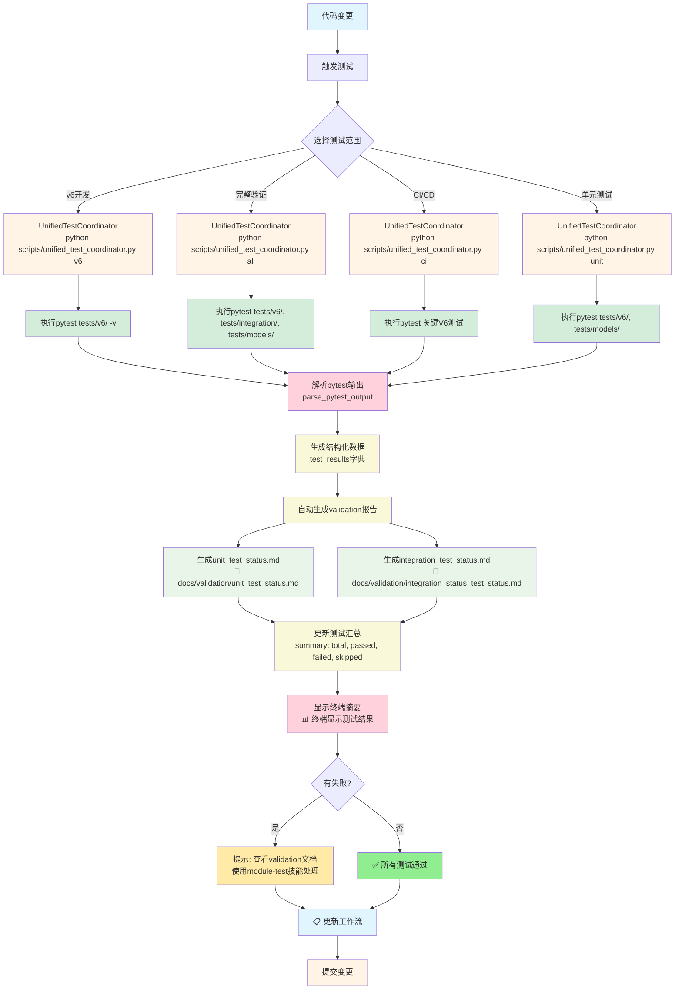

---

## 🔄 详细阶段分解

### 阶段1: 测试触发阶段

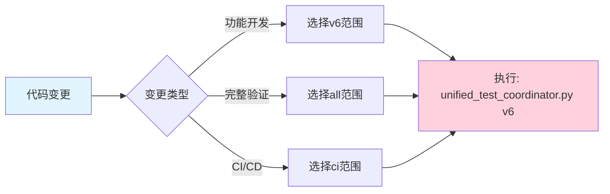

### 阶段2: 测试执行阶段

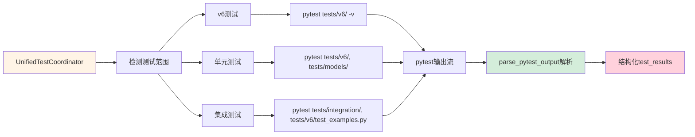

### 阶段3: 数据处理阶段

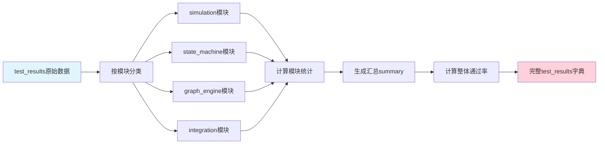

### 阶段4: Validation报告生成阶段

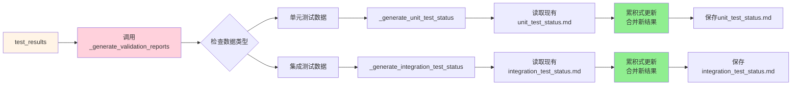

### 阶段5: 结果展示阶段

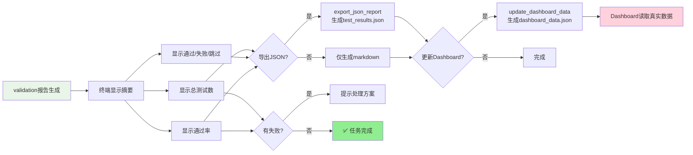

---

## 📋 不同使用场景的流程

### 场景1: V6功能开发

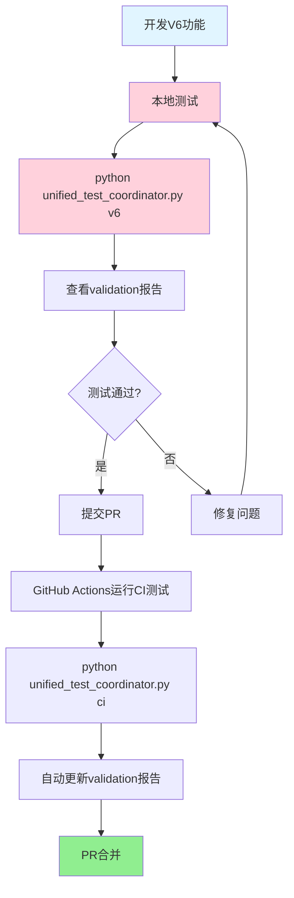

### 场景2: CI/CD自动化

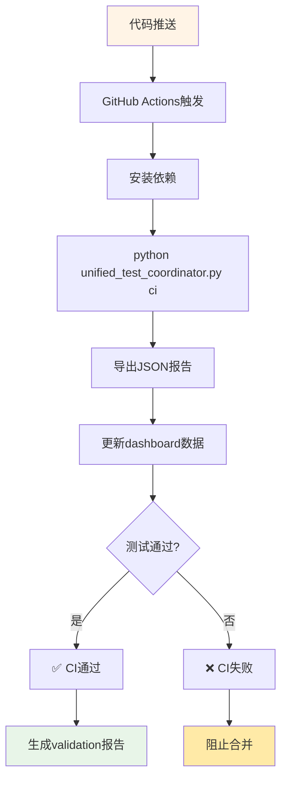

### 场景3: 完整验证

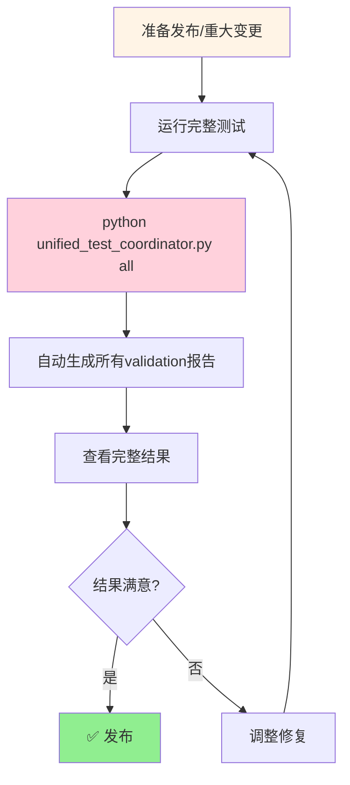

---

## 🔍 数据转换流程图

### pytest原始输出 → 结构化数据

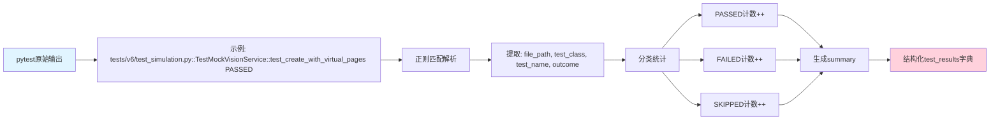

### 结构化数据 → Validation报告

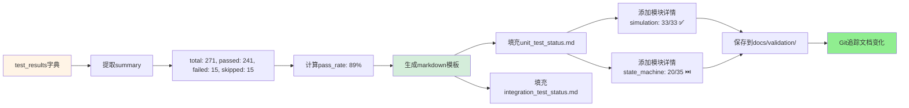

---

## 🎯 决策点流程图

### 何时运行测试？

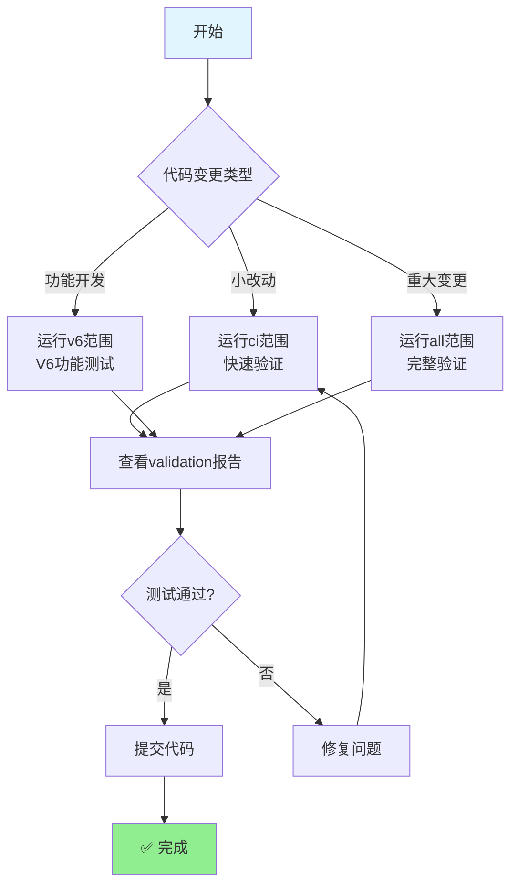

### 测试失败处理流程

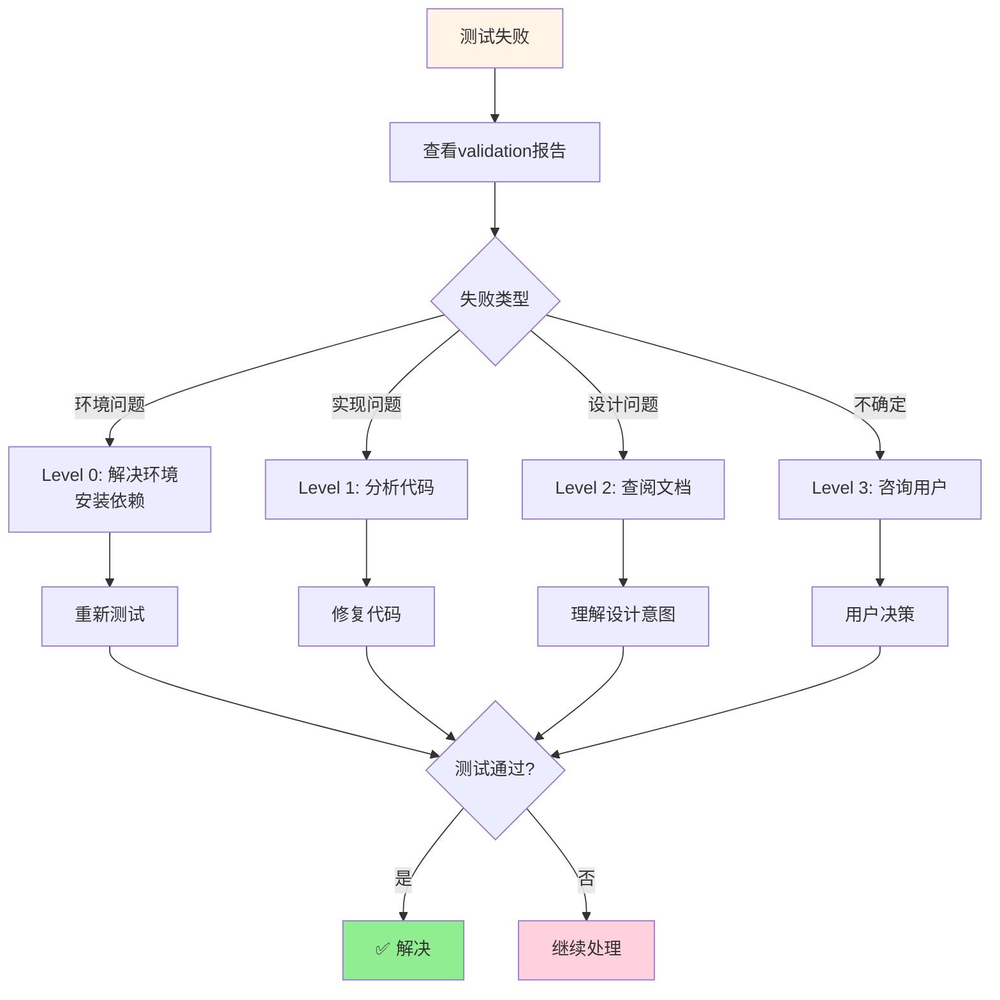

---

## 📊 Dashboard数据流程

### 真实数据流向

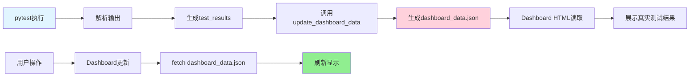

---

## 🔄 完整端到端流程

### 从代码变更到Validation报告

```mermaid
sequenceDiagram
    participant Dev as 开发者
    participant UTC as UnifiedTestCoordinator
    participant Pytest as pytest测试框架
    participant FS as 文件系统
    participant Git as Git版本控制
    
    Dev->>UTC: python unified_test_coordinator.py v6
    UTC->>UTC: 解析参数，准备测试环境
    UTC->>Pytest: pytest tests/v6/ -v
    Pytest-->>UTC: 原始测试输出
    
    UTC->>UTC: parse_pytest_output()
    UTC->>UTC: 生成结构化test_results
    
    UTC->>FS: _generate_unit_test_status()
    UTC->>FS: 写入 docs/validation/unit_test_status.md
    
    UTC->>Dev: 终端显示测试摘要
    UTC->>Git: git add docs/validation/
    UTC->>Git: git commit "自动生成validation报告"
    
    Dev->>Dev: 查看validation报告确认结果
    Dev->>Git: git push
    
    Note over $Dev:
        统一入口 → 自动报告 → 确认质量 → 提交代码
```

---

## 🎯 关键路径

### 核心数据路径

```
代码变更 → unified_test_coordinator.py → pytest
     ↓
     pytest输出 → 结构化数据 → validation报告
     ↓
     终端显示 → 开发者确认 → Git提交
     ↓
     GitHub Actions → CI验证 → PR合并
```

### 成功路径

```
python scripts/unified_test_coordinator.py v6
    ↓
pytest 271 tests: 241 passed, 15 failed, 15 skipped in 5.23s
    ↓
📊 测试执行汇总
📋 总测试数: 271
✅ 通过: 241 (89%)
❌ 失败: 15
⏭️  跳过: 15
    ↓
✅ Validation报告生成完成
  ✅ 生成: docs/validation/unit_test_status.md
  ✅ 生成: docs/validation/integration_test_status.md
    ↓
✅ 所有测试通过！
```

---

## 📋 流程检查点

### 必须通过的检查点

1. **✅ 测试执行** - pytest无错误退出
2. **✅ 结果解析** - 成功解析pytest输出
3. **✅ 报告生成** - validation文档成功创建
4. **✅ 数据完整** - summary包含所有必要字段
5. **✅ 用户确认** - 开发者确认结果满意

### 失败路径

```
pytest失败 → Level 0环境问题 → 修复依赖 → 重试
  ↓
解析失败 → 检查pytest输出格式 → 更新解析逻辑 → 重试
  ↓
报告生成失败 → 检查文件权限 → 修复权限问题 → 重试
  ↓
数据不完整 → 补充缺失字段 → 验证数据结构 → 重试
```

---

**总结**: 这个统一流程确保了从代码变更到validation报告的**端到端自动化**，解决了之前手动编写报告、数据断开、流程混乱的问题。

**核心优势**: 
- 🎯 **唯一入口** - 不再有分散的测试脚本
- 🤖 **全自动化** - 测试到报告无需手动干预  
- 📊 **真实数据** - Dashboard显示实际测试结果
- 🔄 **完整追踪** - Git追踪所有validation变化