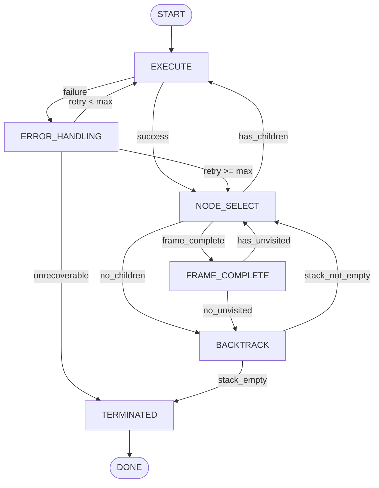

# Design: V6.15.0 State Machine Test Migration

## Architecture Context

### Current State (Post-V6.11.0)

```
┌─────────────────────────────────────────────────────────┐
│                   StepOrchestrator                       │
│  (New orchestration layer - coordinates execution)       │
└─────────────────────────────────────────────────────────┘
                          │
                          ▼
┌─────────────────────────────────────────────────────────┐
│              TraversalStateMachine                        │
│  (Still exists - handles core state transitions)         │
│  - _handle_frame_complete_state()                        │
│  - _handle_error_state()                                 │
│  - _handle_backtrack_state()                             │
│  - _handle_terminated_state()                           │
└─────────────────────────────────────────────────────────┘
                          │
                          ▼
┌─────────────────────────────────────────────────────────┐
│             TraversalRuntimeContext                      │
│  (20+ fields vs. previous 7-field fixture)              │
└─────────────────────────────────────────────────────────┘
```

### Key Insight

**StepOrchestrator is NOT replacing TraversalStateMachine**. The state machine still exists and handles state transitions. The test failures are due to incomplete test mocks, not product logic changes.

## Technical Approach

### Phase 0: Data Collection (Critical Foundation)

Before any fixes, establish baseline:

1. **Code Static Analysis**
   - Verify state transition logic via `rg "def _handle_.*_state" src/state_machine/traversal_fsm.py`
   - Document exception handling mechanisms
   - Validate TraversalStateMachine class structure

2. **Fixture Structure Analysis**
   - Identify all 20+ TraversalRuntimeContext fields
   - Compare against current fixture (only ~7 fields)
   - Create "complete context mock" standard

3. **Baseline Collection**
   - Coverage: `pytest --cov=src/state_machine --cov-report=term-missing`
   - Duration: `pytest --durations=0`
   - Full test logs with `--tb=long`

4. **Failure Mode Classification**
   - Categorize each of 8 failures into: mock_setup | test_design | product_logic | coverage_gap | timing | state_management
   - This guides the appropriate fix strategy

### Test Fix Strategies by Category

#### 1. PreconditionHandler (1 test - Simple Fix)

```python
# test_deeper_executes_back - Line 229
# Before:
result = handler.execute(action, context)  # ❌ NameError

# After:
result = handler.execute(mock_action, context)  # ✅
```

#### 2. FrameCompleteHandler (2 tests - Mock Setup)

```python
# Current fixture (incomplete):
context = Mock()
context.node_stack = []

# Enhanced fixture:
context = Mock(spec=TraversalRuntimeContext)
context.current_page_analysis = Mock()
context.node_stack = []
context.failed_nodes = {}
context.current_path = Mock()
# ... all 20+ fields
```

**Root Cause**: `_handle_frame_complete_state()` accesses attributes that aren't mocked, triggering exception → returns ERROR_HANDLING instead of NODE_SELECT.

#### 3. ErrorHandler (3 tests - Context Setup)

```python
# test_retry_with_remaining_retries
# Issue: retry_count not set in failed_nodes

# Before:
context.failed_nodes = {'test_node': {'last_error': ...}}

# After:
context.failed_nodes = {
    'test_node': {
        'retry_count': 0,  # Must be < max_retries (default 3)
        'last_error': ...
    }
}
```

#### 4. StepExceptionHandling (2 tests - Timing Analysis)

**test_preserves_error_type_in_metadata**:
- Need to verify TraversalStateTransition dataclass definition
- Check if `metadata` uses `field(default_factory=dict)` or plain dict
- Verify `transition_to()` call pattern - does it copy or reference?
- Determine if mutation affects original object or snapshot

**test_catches_handler_exception**:
- Verify exception is actually triggered in test scenario
- Check `_last_error` recording location in code
- May need to adjust exception trigger mechanism

## State Transition Documentation

### State Transition Map (to be verified in Phase 0)



### Coverage Verification

Each state transition path must have at least one test:
- EXECUTE → NODE_SELECT (success path)
- EXECUTE → ERROR_HANDLING (failure path)
- ERROR_HANDLING → EXECUTE (retry path)
- ERROR_HANDLING → NODE_SELECT (no retry path)
- FRAME_COMPLETE → NODE_SELECT (unvisited exists)
- FRAME_COMPLETE → BACKTRACK (no unvisited)
- BACKTRACK → NODE_SELECT (stack not empty)
- BACKTRACK → TERMINATED (stack empty)

## Fixture Enhancement Strategy

### Current Fixture Structure (tests/v6/test_state_machine_intelligence.py:92-162)

```python
@pytest.fixture
def sample_context():
    context = Mock(spec=TraversalRuntimeContext)
    # Only ~7 fields set - incomplete!
    return context
```

### Proposed Enhancement

```python
@pytest.fixture
def complete_context():
    """Complete mock matching TraversalRuntimeContext structure."""
    context = Mock(spec=TraversalRuntimeContext)
    # Required fields for state machine
    context.current_path = Mock()
    context.context_tree = Mock()
    context.node_stack = []
    context.failed_nodes = {}
    # All 20+ fields...
    return context

# Test-specific fixture override
@pytest.fixture
def frame_complete_context(complete_context):
    """Context configured for FRAME_COMPLETE state testing."""
    complete_context.current_page_analysis = Mock()
    complete_context.visited_children = set()
    return complete_context
```

## Implementation Phases

### Phase Sequence

| Phase | Focus | Risk | Dependencies |
|-------|-------|------|--------------|
| 0 | Data collection & analysis | None | None (start here) |
| 1 | Simple typo fix | Low | Phase 0 |
| 2 | FrameCompleteHandler fixes | Medium | Phase 0, 1 |
| 3 | ErrorHandler fixes | Medium | Phase 0, 1, 2 |
| 4 | StepExceptionHandling fixes | Medium | Phase 0, 1, 2, 3 |
| 5 | Coverage verification | Low | All previous |
| 6 | Helper layer (future) | Low | All previous |

### Success Criteria per Phase

- **Phase 0**: Baseline data collected, failure modes classified
- **Phase 1-4**: All targeted tests pass or properly marked (xfail for product bugs)
- **Phase 5**: Coverage ≥ baseline, all transition paths covered
- **Phase 6**: Helper functions documented and in use

## Risk Mitigation

| Risk | Mitigation |
|------|------------|
| Coverage regression | Compare against Phase 0 baseline after each fix |
| Product bug misclassification | Verify root cause via code analysis before marking xfail |
| Incomplete fixture | Use "complete context mock" standard from Phase 0.2.b |
| Metadata mutation confusion | Phase 0 dataclass behavior verification experiment |

## Testing Strategy

1. **Run single test with full verbosity**:
   ```bash
   pytest tests/v6/test_state_machine_intelligence.py::test_name -vv --tb=long
   ```

2. **Verify fixture completeness** before running test:
   - Check all accessed attributes are mocked
   - Verify nested structures (dicts, lists) are properly initialized

3. **Coverage check after each phase**:
   ```bash
   pytest tests/v6/test_state_machine_intelligence.py --cov=src/state_machine --cov-report=term-missing
   ```

4. **State transition path verification**:
   - Map each test to specific transition path
   - Ensure all paths in state diagram have coverage
