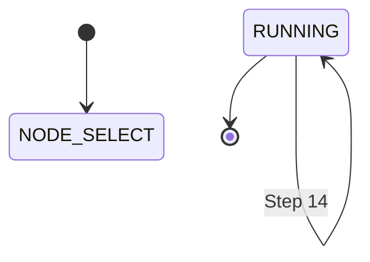

# Traversal State Diagram (Mermaid)

```mermaid
stateDiagram-v2
    [*] --> NODE_SELECT
    RUNNING --> RUNNING : Step 1
    RUNNING --> RUNNING : Step 2
    RUNNING --> RUNNING : Step 3
    RUNNING --> RUNNING : Step 4
    RUNNING --> RUNNING : Step 5
    RUNNING --> RUNNING : Step 6
    RUNNING --> RUNNING : Step 7
    RUNNING --> RUNNING : Step 8
    RUNNING --> RUNNING : Step 9
    RUNNING --> RUNNING : Step 10
    RUNNING --> RUNNING : Step 11
    RUNNING --> RUNNING : Step 12
    RUNNING --> RUNNING : Step 13
    RUNNING --> RUNNING : Step 14
    RUNNING --> [*]
```
